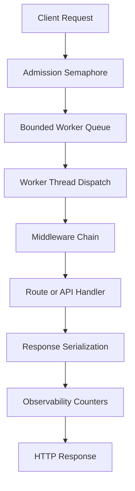
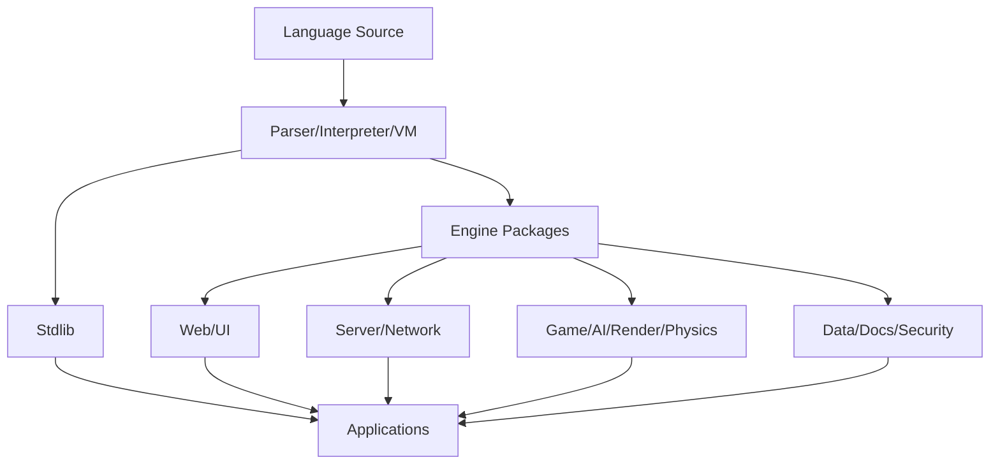
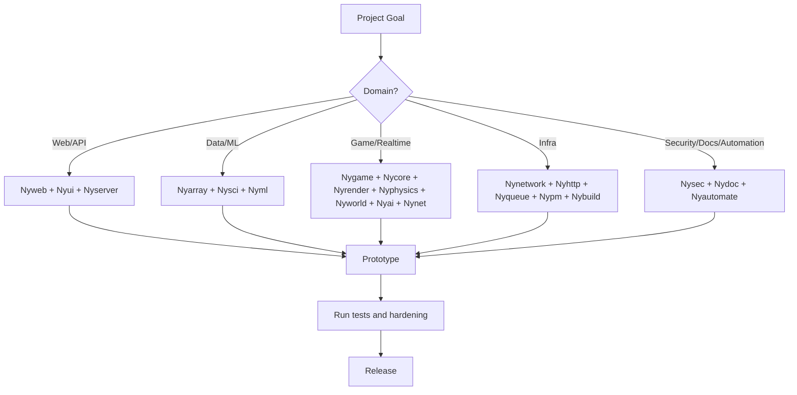
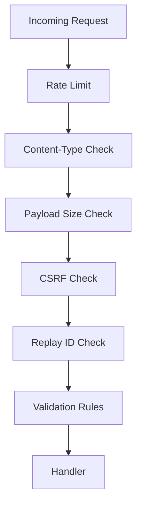
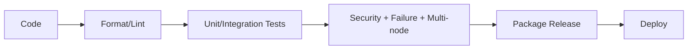

# BREAFING OF NYX

> Document name requested: **BREAFING OF NYX**
> Scope: complete practical reference for NYX language/runtime/ecosystem in this repository.
> Audience: learners, builders, maintainers, sponsors, and production evaluators.

## 1. What Is NYX

NYX in this repo is a multi-layer language + runtime + tooling stack with:

- Native runtime binary (`nyx` / `nyx.exe`) with parser, VM mode, debugger, strict VM mode, limits.
- Python runtime (`nyx_runtime.py`) for `.ny` execution and web-native runtime features.
- Engine ecosystem under `engines/` (web, UI, server, networking, game, AI, render, physics, docs, security, automation, etc.).
- Standard library under `stdlib/`.
- Toolchain scripts (`nypm`, `nyfmt`, `nylint`, `nydbg`, test runners, installers, release scripts).
- Architecture and production docs under `docs/`.

## 2. High-Level Capabilities

- Language authoring and script execution.
- Web app and API delivery (Nyweb + Nyui stack).
- Desktop/UI style abstractions.
- Scientific/math/string/algorithm heavy stdlib.
- Systems-level features (FFI, memory primitives, concurrency model docs).
- Package and dependency workflows.
- Security and observability endpoints.
- Production test and validation harnesses.

## 3. Quick Start Commands

### 3.1 Run NYX file (native)

```bash
nyx hello.ny
```

### 3.2 Run in VM mode

```bash
nyx --vm hello.ny
```

### 3.3 Parse/lint check only

```bash
nyx --parse-only hello.ny
nyx --lint hello.ny
```

### 3.4 Debug run

```bash
nyx --debug hello.ny
nyx --break 10,20 --step-count 5 hello.ny
```

### 3.5 Python runtime path

```bash
python3 nyx_runtime.py tests/nyui/test_web_host.ny
```

### 3.6 Use wrappers

```bash
./cy examples/comprehensive.ny
./cyber examples/comprehensive.ny
./scripts/nydbg.sh examples/comprehensive.ny
./scripts/nyfmt.sh .
./scripts/nylint.sh .
```

## 4. Native CLI Reference (`nyx`)

Usage string found in native runtime:

```text
Usage: nyx [--trace] [--parse-only|--lint] [--vm|--vm-strict] [--max-alloc N] [--max-steps N] [--max-call-depth N] [--debug] [--break lines] [--step] [--step-count N] [--debug-no-prompt] [--version] <file.nx> [args...]
```

Supported options surfaced by runtime:

- `--trace`
- `--parse-only`
- `--lint`
- `--vm`
- `--vm-strict`
- `--version`
- `--max-alloc N`
- `--max-steps N`
- `--max-call-depth N`
- `--debug`
- `--debug-no-prompt`
- `--step`
- `--step-count N`
- `--break line1,line2,...`

## 5. Builtin Function Surface (native runtime)

Detected builtin/runtime functions include:

- `print`
- `len`
- `abs`
- `min`
- `max`
- `clamp`
- `sum`
- `all`
- `any`
- `read`
- `write`
- `type`
- `type_of`
- `is_int`
- `is_bool`
- `is_string`
- `is_array`
- `is_function`
- `is_null`
- `str`
- `int`
- `push`
- `pop`
- `argc`
- `argv`
- `object_new`
- `object_set`
- `object_get`
- `keys`
- `values`
- `items`
- `has`
- `class_new`
- `class_with_ctor`
- `class_set_method`
- `class_name`
- `class_instantiate0`
- `class_instantiate1`
- `class_instantiate2`
- `class_call0`
- `class_call1`
- `class_call2`
- `lang_version`
- `require_version`

## 6. Runtime + Request Flow (Flowchart)



## 7. Development Flow (Flowchart)


## 8. Architecture Stack (Flowchart)



## 9. Command Surfaces In This Repo

### 9.1 Build and release (`Makefile`)

- `make` or `make all`
- `make clean`
- `make native-hooks`
- `make aaa-readiness`
- `make aaa-readiness-deep`
- `make feature-contract`
- `make engine-gates`
- `make platform-online-suite`
- `make content-pipeline`
- `make hardware-validation`
- `make scale-optimization`
- `make production-plan`
- `make content-backlog`
- `make gta-scale`
- `make cook`
- `make release`

### 9.2 Wrapper commands

- `cy <file.cy>`
- `cyber --vm <file.cy>`
- `nyx <file.ny>`
- Windows `.bat` wrappers: `cy.bat`, `cyber.bat`, `nyx.bat`

### 9.3 Tool scripts

- `scripts/nypm.sh`
- `scripts/nypm.ps1`
- `scripts/nyfmt.sh`
- `scripts/nyfmt.ps1`
- `scripts/nylint.sh`
- `scripts/nylint.ps1`
- `scripts/nydbg.sh`
- `scripts/nydbg.ps1`

### 9.4 Test suites

- `scripts/test_full_suite.sh`
- `scripts/test_production.sh`
- `scripts/test_runtime_hardening.sh`
- `scripts/test_ecosystem.sh`
- `scripts/test_registry.sh`
- plus additional versioned and platform scripts under `scripts/`

## 10. Pros, Cons, and Why NYX Can Be Better (Contextual)

### 10.1 Pros

- Broad integrated ecosystem in one repository.
- Native runtime with debug + VM + hardening limits.
- Strong package of engines spanning web to game-scale concepts.
- Rich stdlib with high function density (math/string/algorithms/time/config/ffi/etc.).
- Clear production docs for observability/security/concurrency.

### 10.2 Cons

- Syntax and style variants coexist in repo examples (legacy and evolving forms).
- Some packages are conceptual/world-class profile heavy; practical maturity differs by module.
- Multiple toolchain paths (native runtime, Python runtime, shell/PowerShell scripts) require disciplined conventions.

### 10.3 Better than others? Why/when

NYX is stronger when you need one stack combining language + runtime + engines + tooling in a single workspace. Compared to stitching many external frameworks manually, this repo provides a centralized ecosystem map and integrated scripts. Against mature single-domain platforms, NYX wins on breadth and cohesion but may require validation per engine for production-specific guarantees.

## 11. Engine Selection Workflow (Flowchart)



## 12. Complete Engine Briefing

### Engine: Nyai

- Engine folder: `engines/nyai`
- Manifest: `engines/nyai/ny.pkg`
- Version: `1.0.0`
- Description: Nyx NPC Intelligence Engine - BT+GOAP, crowd, combat, police, social simulation

#### What It Is For

- Primary use case: Nyx NPC Intelligence Engine - BT+GOAP, crowd, combat, police, social simulation
- Typical pairing: this engine is usually combined with domain-adjacent engines from the NYX stack.
- Practical recommendation: validate features against your target environment with repo tests.

#### Install/Usage Commands

```bash
# Package manager style
nypm install Nyai

# Runtime style (example)
nyx your_app.ny
```

#### Manifest Modules

- `hybrid`: Behavior tree + GOAP hybrid brain
- `path`: Hierarchical A* and rerouting
- `crowd`: Crowd behavior and panic models
- `police`: Heat escalation and pursuit logic
- `combat`: Cover/flank/squad combat logic
- `social`: Memory/relationship/economy/rumor simulation
- `perception`: Vision/hearing/threat perception stack
- `utility`: Utility-based decision scoring
- `knowledge`: Blackboard and shared knowledge systems
- `narrative`: Dialogue and mission direction
- `training`: Behavior telemetry and adaptation hooks
- `debugging`: AI explainability and budget controls
- `persistence`: Long-term persistent NPC memory DB
- `budget`: Per-frame AI budget governor
- `production`: AI production health and SLO model
- `ProductionAIProfile`: Production-ready AI profile
- `WorldClassAISuite`: High-end AI orchestration suite
- `AIEngine`: Main AI orchestrator
- `intent_authoring`: Intent-based behavior authoring
- `memory_graph`: Data-defined memory and relationship graph
- `sandbox`: Offline AI sandbox simulation runtime
- `NoCodeAIRuntime`: No-code AI orchestration runtime

#### Capabilities / Features

- Capability `bt_goap_hybrid`: Reactive + long-horizon planning
- Capability `hierarchical_pathfinding`: Hierarchical A*
- Capability `crowd_simulation`: Local avoidance and density control
- Capability `police_system`: Heat levels, roadblocks, helicopter tracking
- Capability `combat_ai`: Cover, flanking, squad coordination
- Capability `social_simulation`: NPC memory, relationships, rumor propagation
- Capability `perception_stack`: Vision and hearing based sensing
- Capability `utility_ai`: Continuous utility scoring for decisions
- Capability `blackboard`: Per-agent and shared knowledge boards
- Capability `dialogue_mission`: Narrative direction runtime
- Capability `ai_observability`: Decision explainability and AI budgets
- Capability `persistent_memory`: Cross-session NPC world memory
- Capability `ai_budget_governor`: Dynamic per-frame AI budget control
- Capability `production_health`: AI health telemetry and readiness
- Capability `intent_behavior_authoring`: Author behavior by intent instead of tree coding
- Capability `data_defined_memory_graph`: Event/trust/fear memory graph model
- Capability `ai_sandbox_simulation`: Offline scenario simulation with slider tuning
- Capability `no_behavior_tree_scripting`: No manual BT/GOAP graph coding path
- Capability `cover_system`: AAA contract: cover system
- Capability `density_control`: AAA contract: density control
- Capability `dynamic_obstacle_avoidance`: AAA contract: dynamic obstacle avoidance
- Capability `economy_interaction`: AAA contract: economy interaction
- Capability `heat_escalation`: AAA contract: heat escalation
- Capability `helicopter_tracking`: AAA contract: helicopter tracking
- Capability `local_avoidance`: AAA contract: local avoidance
- Capability `memory_model_per_npc`: AAA contract: memory model per npc
- Capability `panic_models`: AAA contract: panic models
- Capability `realtime_rerouting`: AAA contract: realtime rerouting
- Capability `relationship_graphs`: AAA contract: relationship graphs
- Capability `rumor_propagation`: AAA contract: rumor propagation
- Capability `squad_communication`: AAA contract: squad communication
- Capability `strategic_roadblocks`: AAA contract: strategic roadblocks
- Capability `tactical_flanking`: AAA contract: tactical flanking

#### Engine Pros

- Aligned with NYX ecosystem conventions.
- Package metadata includes domain decomposition.
- Can be composed with sibling engines for wider stacks.

#### Engine Cons / Risks

- API maturity must be validated by real project tests.
- May include conceptual/aspirational capabilities in metadata.
- Integration cost grows when many engines are coupled simultaneously.

#### Minimal Usage Example

```ny
# Engine import style may vary by runtime implementation.
# Example skeleton for Nyai:
use Nyai;

fn main() {
    print("Using Nyai engine");
}
```

#### Practical Build Ideas With This Engine

- Starter service using Nyai
- Internal tool prototype with Nyai
- Production experiment behind feature flags
- Domain benchmark script for Nyai
- Integration test matrix involving Nyai and related engines

---

### Engine: Nyanim

- Engine folder: `engines/nyanim`
- Manifest: `engines/nyanim/ny.pkg`
- Version: `1.0.0`
- Description: Nyx Animation Engine - IK, motion matching, facial simulation, blend trees

#### What It Is For

- Primary use case: Nyx Animation Engine - IK, motion matching, facial simulation, blend trees
- Typical pairing: this engine is usually combined with domain-adjacent engines from the NYX stack.
- Practical recommendation: validate features against your target environment with repo tests.

#### Install/Usage Commands

```bash
# Package manager style
nypm install Nyanim

# Runtime style (example)
nyx your_app.ny
```

#### Manifest Modules

- `ik`: Full-body IK and skeleton structures
- `motion`: Motion matching database and query
- `face`: Facial muscle simulation
- `blend`: Blend trees and procedural blending
- `locomotion`: AI locomotion synthesis
- `state_machine`: Animation state machine graph
- `retarget`: Cross-rig retargeting runtime
- `warping`: Motion warping and foot lock tools
- `compression`: Clip compression and streaming
- `events`: Animation notify/event tracks
- `network`: Animation snapshot sync primitives
- `crowds`: Crowd animation instancing
- `learned`: Learned locomotion synthesis runtime
- `physics_coupling`: Physics-aware animation blending
- `production`: Animation production health and SLO model
- `ProductionAnimProfile`: Production-ready animation profile
- `WorldClassAnimSuite`: High-end animation orchestration suite
- `AnimEngine`: Main animation orchestrator
- `intent_motion`: Intent-based motion synthesis authoring
- `physics_aware_motion`: Automatic physics-aware motion adaptation
- `NoCodeAnimRuntime`: No-code animation orchestration runtime

#### Capabilities / Features

- Capability `full_body_ik`: IK solve for complete rigs
- Capability `motion_matching`: Runtime pose search
- Capability `facial_muscles`: Muscle-based facial control
- Capability `blend_trees`: Hierarchical animation blending
- Capability `procedural_blend`: Additive procedural overlays
- Capability `ai_locomotion`: Locomotion synthesis hooks
- Capability `state_graph`: Advanced animation state graphing
- Capability `retargeting`: Cross-skeleton motion transfer
- Capability `motion_warping`: Target-aware root motion warping
- Capability `clip_streaming`: Compressed animation streaming
- Capability `anim_events`: Timed animation notifications
- Capability `animation_network_sync`: Networked animation state sync
- Capability `learned_locomotion`: Model-based locomotion synthesis
- Capability `physics_animation_coupling`: Physics-state driven animation correction
- Capability `production_health`: Animation health telemetry and readiness
- Capability `intent_motion_synthesis`: Generate motion from intent descriptors
- Capability `physics_aware_adaptation`: Auto adapt animation to slope/impact/ragdoll
- Capability `no_manual_state_machine`: No imperative animation state machine coding path

#### Engine Pros

- Aligned with NYX ecosystem conventions.
- Package metadata includes domain decomposition.
- Can be composed with sibling engines for wider stacks.

#### Engine Cons / Risks

- API maturity must be validated by real project tests.
- May include conceptual/aspirational capabilities in metadata.
- Integration cost grows when many engines are coupled simultaneously.

#### Minimal Usage Example

```ny
# Engine import style may vary by runtime implementation.
# Example skeleton for Nyanim:
use Nyanim;

fn main() {
    print("Using Nyanim engine");
}
```

#### Practical Build Ideas With This Engine

- Starter service using Nyanim
- Internal tool prototype with Nyanim
- Production experiment behind feature flags
- Domain benchmark script for Nyanim
- Integration test matrix involving Nyanim and related engines

---

### Engine: Nyarray

- Engine folder: `engines/nyarray`
- Manifest: `engines/nyarray/ny.pkg`
- Version: `2.0.0`
- Description: Nyx Scientific Computing Engine - Arrays, Linear Algebra, Signal Processing

#### What It Is For

- Primary use case: Nyx Scientific Computing Engine - Arrays, Linear Algebra, Signal Processing
- Typical pairing: this engine is usually combined with domain-adjacent engines from the NYX stack.
- Practical recommendation: validate features against your target environment with repo tests.

#### Install/Usage Commands

```bash
# Package manager style
nypm install Nyarray

# Runtime style (example)
nyx your_app.ny
```

#### Manifest Modules

- `Nyarray`: Core multi-dimensional arrays
- `nylinalg`: Linear algebra
- `nysignal`: Signal processing
- `nyoptimize`: Optimization
- `nystats`: Statistics
- `nysympy`: Symbolic mathematics
- `nybigmath`: Arbitrary precision math

#### Capabilities / Features

- No explicit [capabilities]/[features] block declared.

#### Engine Pros

- Aligned with NYX ecosystem conventions.
- Package metadata includes domain decomposition.
- Can be composed with sibling engines for wider stacks.

#### Engine Cons / Risks

- API maturity must be validated by real project tests.
- May include conceptual/aspirational capabilities in metadata.
- Integration cost grows when many engines are coupled simultaneously.

#### Minimal Usage Example

```ny
# Engine import style may vary by runtime implementation.
# Example skeleton for Nyarray:
use Nyarray;

fn main() {
    print("Using Nyarray engine");
}
```

#### Practical Build Ideas With This Engine

- Starter service using Nyarray
- Internal tool prototype with Nyarray
- Production experiment behind feature flags
- Domain benchmark script for Nyarray
- Integration test matrix involving Nyarray and related engines

---

### Engine: Nyaudio

- Engine folder: `engines/nyaudio`
- Manifest: `engines/nyaudio/ny.pkg`
- Version: `1.0.0`
- Description: Nyx 3D Audio Engine - HRTF, occlusion, Doppler, convolution reverb, dynamic score

#### What It Is For

- Primary use case: Nyx 3D Audio Engine - HRTF, occlusion, Doppler, convolution reverb, dynamic score
- Typical pairing: this engine is usually combined with domain-adjacent engines from the NYX stack.
- Practical recommendation: validate features against your target environment with repo tests.

#### Install/Usage Commands

```bash
# Package manager style
nypm install Nyaudio

# Runtime style (example)
nyx your_app.ny
```

#### Manifest Modules

- `spatial`: HRTF spatial audio
- `acoustics`: Occlusion and Doppler processing
- `reverb`: Convolution reverb pipeline
- `music`: Dynamic soundtrack layering
- `ambience`: AI procedural ambience
- `mixer`: Bus and submix graph
- `effects`: EQ, compression, limiting, sidechain
- `streaming`: Audio streaming decode/cache
- `voice`: Voice chat processing and routing
- `loudness`: Loudness meter and normalization
- `environment`: Audio zones and environment routing
- `diagnostics`: Audio metrics and debug panel
- `propagation`: Geometry-aware acoustic propagation model
- `failover`: Audio backend/device failover control
- `production`: Audio production health and SLO model
- `ProductionAudioProfile`: Production-ready audio profile
- `WorldClassAudioSuite`: High-end audio orchestration suite
- `AudioEngine`: Main audio orchestrator
- `acoustic_zone_graph`: Visual acoustic zone graph authoring
- `emotional_music`: Emotional state driven music layering
- `NoCodeAudioRuntime`: No-code audio orchestration runtime

#### Capabilities / Features

- Capability `hrtf`: Binaural spatial audio
- Capability `occlusion`: Real-time obstruction attenuation
- Capability `doppler`: Velocity-based pitch shift
- Capability `convolution_reverb`: Environment impulse response reverb
- Capability `dynamic_music`: Adaptive music layering
- Capability `ai_ambience`: Procedural ambient generation
- Capability `mix_buses`: Flexible bus/submix routing
- Capability `dsp_chain`: EQ/compressor/limiter processing
- Capability `voice_chat`: Realtime voice chat pipeline
- Capability `loudness_management`: Broadcast-safe loudness control
- Capability `audio_zones`: Zone-aware environment acoustics
- Capability `audio_observability`: Runtime audio diagnostics
- Capability `acoustic_propagation`: Geometry-aware reflection/occlusion acoustics
- Capability `backend_failover`: Runtime backend/device failover
- Capability `production_health`: Audio health telemetry and readiness
- Capability `visual_acoustic_graph`: Visual reverb/occlusion/reflection zone authoring
- Capability `emotional_music_director`: Calm/tension/chaos/combat state music logic
- Capability `no_manual_dsp_graph`: No imperative DSP scripting path
- Capability `emotional_music_state_machine`: AAA contract: emotional music state machine

#### Engine Pros

- Aligned with NYX ecosystem conventions.
- Package metadata includes domain decomposition.
- Can be composed with sibling engines for wider stacks.

#### Engine Cons / Risks

- API maturity must be validated by real project tests.
- May include conceptual/aspirational capabilities in metadata.
- Integration cost grows when many engines are coupled simultaneously.

#### Minimal Usage Example

```ny
# Engine import style may vary by runtime implementation.
# Example skeleton for Nyaudio:
use Nyaudio;

fn main() {
    print("Using Nyaudio engine");
}
```

#### Practical Build Ideas With This Engine

- Starter service using Nyaudio
- Internal tool prototype with Nyaudio
- Production experiment behind feature flags
- Domain benchmark script for Nyaudio
- Integration test matrix involving Nyaudio and related engines

---

### Engine: Nyautomate

- Engine folder: `engines/nyautomate`
- Manifest: `engines/nyautomate/ny.pkg`
- Version: `2.0.0`
- Description: Nyx Automation Engine - RPA, Scripting, System Tasks

#### What It Is For

- Primary use case: Nyx Automation Engine - RPA, Scripting, System Tasks
- Typical pairing: this engine is usually combined with domain-adjacent engines from the NYX stack.
- Practical recommendation: validate features against your target environment with repo tests.

#### Install/Usage Commands

```bash
# Package manager style
nypm install Nyautomate

# Runtime style (example)
nyx your_app.ny
```

#### Manifest Modules

- `Nyautomate`: Main automation engine
- `rpa`: Robotic Process Automation
- `scheduler`: Task scheduling
- `workflow`: Workflow management
- `gui`: GUI automation
- `desktop`: Desktop integration
- `webauto`: Browser automation
- `excel`: Excel automation
- `pdf`: PDF processing
- `email`: Email automation

#### Capabilities / Features

- No explicit [capabilities]/[features] block declared.

#### Engine Pros

- Aligned with NYX ecosystem conventions.
- Package metadata includes domain decomposition.
- Can be composed with sibling engines for wider stacks.

#### Engine Cons / Risks

- API maturity must be validated by real project tests.
- May include conceptual/aspirational capabilities in metadata.
- Integration cost grows when many engines are coupled simultaneously.

#### Minimal Usage Example

```ny
# Engine import style may vary by runtime implementation.
# Example skeleton for Nyautomate:
use Nyautomate;

fn main() {
    print("Using Nyautomate engine");
}
```

#### Practical Build Ideas With This Engine

- Starter service using Nyautomate
- Internal tool prototype with Nyautomate
- Production experiment behind feature flags
- Domain benchmark script for Nyautomate
- Integration test matrix involving Nyautomate and related engines

---

### Engine: NyBuild

- Engine folder: `engines/nybuild`
- Manifest: `engines/nybuild/ny.pkg`
- Version: `3.0.0`
- Description: Nyx Build System - Deterministic builds, incremental compilation, testing, release automation

#### What It Is For

- Primary use case: Nyx Build System - Deterministic builds, incremental compilation, testing, release automation
- Typical pairing: this engine is usually combined with domain-adjacent engines from the NYX stack.
- Practical recommendation: validate features against your target environment with repo tests.

#### Install/Usage Commands

```bash
# Package manager style
nypm install NyBuild

# Runtime style (example)
nyx your_app.ny
```

#### Manifest Modules

- `Main`: Main build engine
- `graph`: Dependency graph & DAG
- `cache`: Build cache
- `compiler`: Compilation
- `tester`: Testing system
- `formatter`: Code formatter
- `linter`: Linter
- `packager`: Release packaging
- `workspace`: Workspace support
- `analyzer`: Build analyzer

#### Capabilities / Features

- No explicit [capabilities]/[features] block declared.

#### Engine Pros

- Aligned with NYX ecosystem conventions.
- Package metadata includes domain decomposition.
- Can be composed with sibling engines for wider stacks.

#### Engine Cons / Risks

- API maturity must be validated by real project tests.
- May include conceptual/aspirational capabilities in metadata.
- Integration cost grows when many engines are coupled simultaneously.

#### Minimal Usage Example

```ny
# Engine import style may vary by runtime implementation.
# Example skeleton for NyBuild:
use NyBuild;

fn main() {
    print("Using NyBuild engine");
}
```

#### Practical Build Ideas With This Engine

- Starter service using NyBuild
- Internal tool prototype with NyBuild
- Production experiment behind feature flags
- Domain benchmark script for NyBuild
- Integration test matrix involving NyBuild and related engines

---

### Engine: Nycore

- Engine folder: `engines/nycore`
- Manifest: `engines/nycore/ny.pkg`
- Version: `1.0.0`
- Description: Nyx Foundation Engine - memory, scheduler, task graph, ECS, platform abstraction

#### What It Is For

- Primary use case: Nyx Foundation Engine - memory, scheduler, task graph, ECS, platform abstraction
- Typical pairing: this engine is usually combined with domain-adjacent engines from the NYX stack.
- Practical recommendation: validate features against your target environment with repo tests.

#### Install/Usage Commands

```bash
# Package manager style
nypm install Nycore

# Runtime style (example)
nyx your_app.ny
```

#### Manifest Modules

- `memory`: Arena, pool, and frame allocators
- `scheduler`: Job system and work stealing
- `taskgraph`: Dependency-aware task graph
- `ecs`: Data-oriented archetype ECS
- `platform`: Cross-platform runtime abstraction
- `lockfree`: Lock-free queue/ring primitives
- `fibers`: Fiber scheduler runtime
- `runtime_config`: Runtime config and hot reload
- `resources`: Resource registry and eviction policy
- `observability`: Tracing, metrics, structured logs
- `resilience`: Crash handling and watchdog runtime
- `serialization`: Schema-based serialization surface
- `deterministic_scheduler`: Frame-stable deterministic task scheduling
- `memory_telemetry`: Fragmentation and allocation telemetry
- `simd`: ISA-aware SIMD dispatch layer
- `production`: Core production health and SLO model
- `ProductionCoreProfile`: Production-ready core profile
- `WorldClassCoreSuite`: High-end core orchestration suite
- `CoreEngine`: Main foundation orchestrator
- `nocode_visual`: Visual task graph designer
- `nocode_ecs`: Declarative ECS rule binding
- `nocode_schema`: Runtime schema compiler
- `nocode_optimizer`: Self-optimizing runtime layer
- `NoCodeCoreRuntime`: No-code core orchestration runtime

#### Capabilities / Features

- Capability `allocators`: Arena/pool/frame allocation
- Capability `work_stealing`: Multithreaded work stealing
- Capability `numa_aware`: NUMA-aware scheduling surface
- Capability `task_graph`: Automatic dependency tracking
- Capability `ecs`: Archetype-based cache-friendly ECS
- Capability `platform_abstraction`: Windows/Linux/console/mobile targets
- Capability `lock_free_primitives`: Low-contention lock-free structures
- Capability `fiber_runtime`: Fiber-based task scheduling
- Capability `hot_reload`: Runtime config and reload polling
- Capability `resource_lifecycle`: Resource registration and eviction
- Capability `observability`: Tracing metrics and JSON logs
- Capability `resilience`: Crash capture and watchdog monitoring
- Capability `serialization`: Typed schema serialization hooks
- Capability `deterministic_task_ordering`: Frame-level deterministic task ordering
- Capability `memory_fragmentation_metrics`: Per-frame memory fragmentation telemetry
- Capability `simd_dispatch`: AVX/NEON/Scalar runtime dispatch
- Capability `production_health`: Core health telemetry and readiness
- Capability `visual_task_graph_designer`: Visual authoring for systems, dependencies, and resource flows
- Capability `declarative_ecs_rules`: Rule-based ECS without imperative system loops
- Capability `runtime_schema_compiler`: Schema-driven layout/serialization/replication generation
- Capability `self_optimizing_runtime`: Auto parallelization, SIMD, and system merging
- Capability `self_validating_pipeline`: Runtime pipeline validation hooks
- Capability `automatic_performance_optimization`: AAA contract: automatic performance optimization
- Capability `data_driven_behavior`: AAA contract: data driven behavior
- Capability `graph_based_orchestration`: AAA contract: graph based orchestration
- Capability `runtime_system_hot_mutation`: AAA contract: runtime system hot mutation

#### Engine Pros

- Aligned with NYX ecosystem conventions.
- Package metadata includes domain decomposition.
- Can be composed with sibling engines for wider stacks.

#### Engine Cons / Risks

- API maturity must be validated by real project tests.
- May include conceptual/aspirational capabilities in metadata.
- Integration cost grows when many engines are coupled simultaneously.

#### Minimal Usage Example

```ny
# Engine import style may vary by runtime implementation.
# Example skeleton for Nycore:
use Nycore;

fn main() {
    print("Using Nycore engine");
}
```

#### Practical Build Ideas With This Engine

- Starter service using Nycore
- Internal tool prototype with Nycore
- Production experiment behind feature flags
- Domain benchmark script for Nycore
- Integration test matrix involving Nycore and related engines

---

### Engine: Nycrypto

- Engine folder: `engines/nycrypto`
- Manifest: `engines/nycrypto/ny.pkg`
- Version: `2.0.0`
- Description: Nyx Cryptography Engine - Encryption, Hashing, Signatures

#### What It Is For

- Primary use case: Nyx Cryptography Engine - Encryption, Hashing, Signatures
- Typical pairing: this engine is usually combined with domain-adjacent engines from the NYX stack.
- Practical recommendation: validate features against your target environment with repo tests.

#### Install/Usage Commands

```bash
# Package manager style
nypm install Nycrypto

# Runtime style (example)
nyx your_app.ny
```

#### Manifest Modules

- `Nycrypto`: Main crypto engine
- `ciphers`: Cipher algorithms
- `hashes`: Hash functions
- `signatures`: Digital signatures
- `key exchange`: Key exchange protocols
- `encoding`: Encoding utilities

#### Capabilities / Features

- No explicit [capabilities]/[features] block declared.

#### Engine Pros

- Aligned with NYX ecosystem conventions.
- Package metadata includes domain decomposition.
- Can be composed with sibling engines for wider stacks.

#### Engine Cons / Risks

- API maturity must be validated by real project tests.
- May include conceptual/aspirational capabilities in metadata.
- Integration cost grows when many engines are coupled simultaneously.

#### Minimal Usage Example

```ny
# Engine import style may vary by runtime implementation.
# Example skeleton for Nycrypto:
use Nycrypto;

fn main() {
    print("Using Nycrypto engine");
}
```

#### Practical Build Ideas With This Engine

- Starter service using Nycrypto
- Internal tool prototype with Nycrypto
- Production experiment behind feature flags
- Domain benchmark script for Nycrypto
- Integration test matrix involving Nycrypto and related engines

---

### Engine: Nydatabase

- Engine folder: `engines/nydatabase`
- Manifest: `engines/nydatabase/ny.pkg`
- Version: `2.0.0`
- Description: Nyx Database Engine - SQL, ORM, Transactions, Migrations

#### What It Is For

- Primary use case: Nyx Database Engine - SQL, ORM, Transactions, Migrations
- Typical pairing: this engine is usually combined with domain-adjacent engines from the NYX stack.
- Practical recommendation: validate features against your target environment with repo tests.

#### Install/Usage Commands

```bash
# Package manager style
nypm install Nydatabase

# Runtime style (example)
nyx your_app.ny
```

#### Manifest Modules

- `Main`: Main database engine module
- `types`: SQL data types and constants
- `Column`: Column definition class
- `ForeignKey`: Foreign key constraints
- `Table`: Table definition builder
- `Index`: Index creation
- `ConnectionConfig`: Database connection configuration
- `Connection`: Database connection class
- `ConnectionPool`: Connection pooling
- `Result`: Query result wrapper
- `Row`: Result row class
- `QueryBuilder`: SQL query builder
- `InsertBuilder`: Insert query builder
- `UpdateBuilder`: Update query builder
- `DeleteBuilder`: Delete query builder
- `Model`: ORM model base class
- `Repository`: Repository pattern implementation
- `Migration`: Database migration class
- `MigrationRunner`: Migration runner class
- `Database`: Database manager class

#### Capabilities / Features

- Feature `sqlite`: SQLite database support
- Feature `postgresql`: PostgreSQL database support
- Feature `mysql`: MySQL database support
- Feature `pooling`: Connection pooling
- Feature `orm`: Object-relational mapping
- Feature `migrations`: Database migrations
- Feature `transactions`: ACID transactions
- Feature `query_builder`: Chainable query builder

#### Engine Pros

- Aligned with NYX ecosystem conventions.
- Package metadata includes domain decomposition.
- Can be composed with sibling engines for wider stacks.

#### Engine Cons / Risks

- API maturity must be validated by real project tests.
- May include conceptual/aspirational capabilities in metadata.
- Integration cost grows when many engines are coupled simultaneously.

#### Minimal Usage Example

```ny
# Engine import style may vary by runtime implementation.
# Example skeleton for Nydatabase:
use Nydatabase;

fn main() {
    print("Using Nydatabase engine");
}
```

#### Practical Build Ideas With This Engine

- Starter service using Nydatabase
- Internal tool prototype with Nydatabase
- Production experiment behind feature flags
- Domain benchmark script for Nydatabase
- Integration test matrix involving Nydatabase and related engines

---

### Engine: nydb

- Engine folder: `engines/nydb`
- Manifest: `engines/nydb/ny.pkg`
- Version: `unknown`
- Description: No description declared in package metadata.

#### What It Is For

- Primary use case: No description declared in package metadata.
- Typical pairing: this engine is usually combined with domain-adjacent engines from the NYX stack.
- Practical recommendation: validate features against your target environment with repo tests.

#### Install/Usage Commands

```bash
# Package manager style
nypm install nydb

# Runtime style (example)
nyx your_app.ny
```

#### Manifest Modules

- No explicit [modules] block found.

#### Capabilities / Features

- No explicit [capabilities]/[features] block declared.

#### Engine Pros

- Aligned with NYX ecosystem conventions.
- Package metadata includes domain decomposition.
- Can be composed with sibling engines for wider stacks.

#### Engine Cons / Risks

- API maturity must be validated by real project tests.
- May include conceptual/aspirational capabilities in metadata.
- Integration cost grows when many engines are coupled simultaneously.

#### Minimal Usage Example

```ny
# Engine import style may vary by runtime implementation.
# Example skeleton for nydb:
use nydb;

fn main() {
    print("Using nydb engine");
}
```

#### Practical Build Ideas With This Engine

- Starter service using nydb
- Internal tool prototype with nydb
- Production experiment behind feature flags
- Domain benchmark script for nydb
- Integration test matrix involving nydb and related engines

---

### Engine: Nydoc

- Engine folder: `engines/nydoc`
- Manifest: `engines/nydoc/ny.pkg`
- Version: `2.0.0`
- Description: Nyx Document Engine - LaTeX, PDF, Reports, Charts, Visualization

#### What It Is For

- Primary use case: Nyx Document Engine - LaTeX, PDF, Reports, Charts, Visualization
- Typical pairing: this engine is usually combined with domain-adjacent engines from the NYX stack.
- Practical recommendation: validate features against your target environment with repo tests.

#### Install/Usage Commands

```bash
# Package manager style
nypm install Nydoc

# Runtime style (example)
nyx your_app.ny
```

#### Manifest Modules

- `Nydoc`: Core document engine
- `latex`: LaTeX generation
- `pdf`: PDF generation
- `markdown`: Markdown processing
- `html`: HTML generation
- `charts`: Chart & graph generation
- `tables`: Table generation
- `templates`: Document templates
- `report`: Report builder

#### Capabilities / Features

- No explicit [capabilities]/[features] block declared.

#### Engine Pros

- Aligned with NYX ecosystem conventions.
- Package metadata includes domain decomposition.
- Can be composed with sibling engines for wider stacks.

#### Engine Cons / Risks

- API maturity must be validated by real project tests.
- May include conceptual/aspirational capabilities in metadata.
- Integration cost grows when many engines are coupled simultaneously.

#### Minimal Usage Example

```ny
# Engine import style may vary by runtime implementation.
# Example skeleton for Nydoc:
use Nydoc;

fn main() {
    print("Using Nydoc engine");
}
```

#### Practical Build Ideas With This Engine

- Starter service using Nydoc
- Internal tool prototype with Nydoc
- Production experiment behind feature flags
- Domain benchmark script for Nydoc
- Integration test matrix involving Nydoc and related engines

---

### Engine: Nygame

- Engine folder: `engines/nygame`
- Manifest: `engines/nygame/ny.pkg`
- Version: `2.0.0`
- Description: Nyx Game Development Engine - Physics, AI, Characters, Multiplayer

#### What It Is For

- Primary use case: Nyx Game Development Engine - Physics, AI, Characters, Multiplayer
- Typical pairing: this engine is usually combined with domain-adjacent engines from the NYX stack.
- Practical recommendation: validate features against your target environment with repo tests.

#### Install/Usage Commands

```bash
# Package manager style
nypm install Nygame

# Runtime style (example)
nyx your_app.ny
```

#### Manifest Modules

- `Nygame`: Main game engine
- `physics`: Physics simulation
- `ai`: AI and pathfinding
- `characters`: Character system
- `weapons`: Weapon system
- `vehicles`: Vehicle simulation
- `multiplayer`: Multiplayer networking
- `ui`: Game UI
- `animation`: Animation system
- `native_engine_sync`: Native sync layer for nycore/nyrender/nyphysics/nyworld/nyai/nynet/nyaudio/nyanim/nylogic
- `nycore_bridge`: Foundation sync bridge
- `nyrender_bridge`: Graphics sync bridge
- `nyphysics_bridge`: Physics sync bridge
- `nyworld_bridge`: World streaming sync bridge
- `nyai_bridge`: NPC intelligence sync bridge
- `nynet_bridge`: Multiplayer sync bridge
- `nyaudio_bridge`: 3D audio sync bridge
- `nyanim_bridge`: Animation sync bridge
- `nylogic_bridge`: Declarative game-logic sync bridge
- `nocode_validation`: No-code capability validation layer

#### Capabilities / Features

- Capability `native_stack_sync`: Sync nycore/nyrender/nyphysics/nyworld/nyai/nynet/nyaudio/nyanim/nylogic
- Capability `worldclass_profile`: Profile-driven world-class engine orchestration
- Capability `capability_validation`: Strict capability checks during sync
- Capability `engine_telemetry`: Per-engine telemetry enablement
- Capability `production_health_validation`: Strict production-health capability checks during sync
- Capability `native_logic_sync`: Rule-driven nylogic runtime synchronization
- Capability `declarative_authoring_stack`: Visual/declarative no-code engine stack integration
- Capability `nocode_capability_validation`: Validation for no-code authoring capabilities

#### Engine Pros

- Aligned with NYX ecosystem conventions.
- Package metadata includes domain decomposition.
- Can be composed with sibling engines for wider stacks.

#### Engine Cons / Risks

- API maturity must be validated by real project tests.
- May include conceptual/aspirational capabilities in metadata.
- Integration cost grows when many engines are coupled simultaneously.

#### Minimal Usage Example

```ny
# Engine import style may vary by runtime implementation.
# Example skeleton for Nygame:
use Nygame;

fn main() {
    print("Using Nygame engine");
}
```

#### Practical Build Ideas With This Engine

- Starter service using Nygame
- Internal tool prototype with Nygame
- Production experiment behind feature flags
- Domain benchmark script for Nygame
- Integration test matrix involving Nygame and related engines

---

### Engine: Nygpu

- Engine folder: `engines/nygpu`
- Manifest: `engines/nygpu/ny.pkg`
- Version: `2.0.0`
- Description: Nyx GPU Compute Engine - CUDA, Vulkan, Metal, ROCm Support

#### What It Is For

- Primary use case: Nyx GPU Compute Engine - CUDA, Vulkan, Metal, ROCm Support
- Typical pairing: this engine is usually combined with domain-adjacent engines from the NYX stack.
- Practical recommendation: validate features against your target environment with repo tests.

#### Install/Usage Commands

```bash
# Package manager style
nypm install Nygpu

# Runtime style (example)
nyx your_app.ny
```

#### Manifest Modules

- `Nygpu`: Core GPU engine
- `cuda`: NVIDIA CUDA support
- `vulkan`: Vulkan compute
- `metal`: Apple Metal compute
- `roc`: AMD ROCm support
- `device`: Device management
- `memory`: GPU memory management
- `kernel`: Kernel compilation & execution
- `tensor`: GPU tensor operations

#### Capabilities / Features

- No explicit [capabilities]/[features] block declared.

#### Engine Pros

- Aligned with NYX ecosystem conventions.
- Package metadata includes domain decomposition.
- Can be composed with sibling engines for wider stacks.

#### Engine Cons / Risks

- API maturity must be validated by real project tests.
- May include conceptual/aspirational capabilities in metadata.
- Integration cost grows when many engines are coupled simultaneously.

#### Minimal Usage Example

```ny
# Engine import style may vary by runtime implementation.
# Example skeleton for Nygpu:
use Nygpu;

fn main() {
    print("Using Nygpu engine");
}
```

#### Practical Build Ideas With This Engine

- Starter service using Nygpu
- Internal tool prototype with Nygpu
- Production experiment behind feature flags
- Domain benchmark script for Nygpu
- Integration test matrix involving Nygpu and related engines

---

### Engine: Nygui

- Engine folder: `engines/nygui`
- Manifest: `engines/nygui/ny.pkg`
- Version: `2.0.0`
- Description: Nyx GUI Framework - Windows, Widgets, Layouts

#### What It Is For

- Primary use case: Nyx GUI Framework - Windows, Widgets, Layouts
- Typical pairing: this engine is usually combined with domain-adjacent engines from the NYX stack.
- Practical recommendation: validate features against your target environment with repo tests.

#### Install/Usage Commands

```bash
# Package manager style
nypm install Nygui

# Runtime style (example)
nyx your_app.ny
```

#### Manifest Modules

- `Nygui`: Main GUI framework
- `widgets`: UI widgets
- `layouts`: Layout managers
- `canvas`: Drawing canvas
- `menus`: Menu system
- `dialogs`: Dialog boxes

#### Capabilities / Features

- No explicit [capabilities]/[features] block declared.

#### Engine Pros

- Aligned with NYX ecosystem conventions.
- Package metadata includes domain decomposition.
- Can be composed with sibling engines for wider stacks.

#### Engine Cons / Risks

- API maturity must be validated by real project tests.
- May include conceptual/aspirational capabilities in metadata.
- Integration cost grows when many engines are coupled simultaneously.

#### Minimal Usage Example

```ny
# Engine import style may vary by runtime implementation.
# Example skeleton for Nygui:
use Nygui;

fn main() {
    print("Using Nygui engine");
}
```

#### Practical Build Ideas With This Engine

- Starter service using Nygui
- Internal tool prototype with Nygui
- Production experiment behind feature flags
- Domain benchmark script for Nygui
- Integration test matrix involving Nygui and related engines

---

### Engine: Nyhttp

- Engine folder: `engines/nyhttp`
- Manifest: `engines/nyhttp/ny.pkg`
- Version: `2.0.0`
- Description: Nyx HTTP Engine - Production HTTP/1.1, HTTP/2, HTTP/3 with TLS, Proxy, WebSocket

#### What It Is For

- Primary use case: Nyx HTTP Engine - Production HTTP/1.1, HTTP/2, HTTP/3 with TLS, Proxy, WebSocket
- Typical pairing: this engine is usually combined with domain-adjacent engines from the NYX stack.
- Practical recommendation: validate features against your target environment with repo tests.

#### Install/Usage Commands

```bash
# Package manager style
nypm install Nyhttp

# Runtime style (example)
nyx your_app.ny
```

#### Manifest Modules

- `protocol`: HTTP protocol constants and utilities
- `url`: RFC 3986 URL parsing and building
- `HttpClient`: Async HTTP client with connection pooling
- `HttpRequest`: HTTP request builder
- `HttpResponse`: HTTP response handler
- `Headers`: HTTP headers management
- `Cookie`: HTTP cookie handling
- `CookieOptions`: Cookie options
- `router`: Fast radix tree router
- `Router`: HTTP router with path parameters
- `middleware`: Middleware components
- `CorsMiddleware`: CORS handling
- `RateLimitMiddleware`: Rate limiting
- `LoggingMiddleware`: Request/response logging
- `StaticMiddleware`: Static file serving
- `CompressionMiddleware`: Gzip compression
- `websocket`: WebSocket support
- `WebSocket`: WebSocket connection
- `WebSocketHandler`: WebSocket event handler
- `HttpServer`: Production HTTP server
- `TlsConfig`: TLS/SSL configuration
- `Metrics`: Server metrics
- `proxy`: Reverse proxy and load balancing
- `LoadBalancer`: Load balancer with multiple strategies
- `Backend`: Backend server definition
- `ReverseProxy`: Reverse proxy implementation
- `LoadBalanceStrategy`: Load balancing strategies
- `cli`: Command-line tools
- `CLI`: CLI builder

#### Capabilities / Features

- Capability `http1`: HTTP/1.1 support
- Capability `http2`: HTTP/2 support
- Capability `http3`: HTTP/3 (QUIC) support
- Capability `tls`: TLS 1.3 support
- Capability `mtls`: mTLS/client certificate support
- Capability `server`: HTTP server
- Capability `middleware`: Middleware pipeline
- Capability `routing`: Radix tree routing
- Capability `static_files`: Static file serving
- Capability `compression`: Gzip/brotli compression
- Capability `websocket`: WebSocket support
- Capability `cors`: CORS handling
- Capability `rate_limit`: Rate limiting
- Capability `security_headers`: Security headers (HSTS, CSP, etc.)
- Capability `reverse_proxy`: Reverse proxy
- Capability `load_balancer`: Load balancing
- Capability `health_checks`: Backend health checks
- Capability `circuit_breaker`: Circuit breaker pattern
- Capability `metrics`: Prometheus metrics
- Capability `logging`: Structured logging
- Capability `cli_tools`: Command-line tools
- Capability `config_file`: nyhttp.toml support
- Feature `default`: ["server", "client", "http1", "routing", "middleware"]
- Feature `http1`: HTTP/1.1 (keep-alive, chunked)
- Feature `http2`: HTTP/2 (multiplexing, HPACK)
- Feature `http3`: HTTP/3 (QUIC)
- Feature `tls`: TLS 1.2/1.3 support
- Feature `tls13`: TLS 1.3 only
- Feature `mtls`: Mutual TLS
- Feature `server`: HTTP server
- Feature `routing`: Radix tree routing with params
- Feature `middleware`: Middleware pipeline
- Feature `static_files`: Static file serving
- Feature `compression`: Response compression
- Feature `websocket`: WebSocket support
- Feature `sse`: Server-Sent Events
- Feature `cors`: CORS middleware
- Feature `rate_limit`: Rate limiting
- Feature `security_headers`: Security headers
- Feature `csrf`: CSRF protection
- Feature `proxy`: Reverse proxy
- Feature `load_balancer`: Load balancing
- Feature `health_check`: Health checks
- Feature `circuit_breaker`: Circuit breaker
- Feature `client`: HTTP client
- Feature `connection_pool`: Connection pooling
- Feature `cookies`: Cookie jar
- Feature `follow_redirects`: Auto-follow redirects
- Feature `metrics`: Metrics collection
- Feature `logging`: Structured logging
- Feature `tracing`: OpenTelemetry tracing

#### Engine Pros

- Aligned with NYX ecosystem conventions.
- Package metadata includes domain decomposition.
- Can be composed with sibling engines for wider stacks.

#### Engine Cons / Risks

- API maturity must be validated by real project tests.
- May include conceptual/aspirational capabilities in metadata.
- Integration cost grows when many engines are coupled simultaneously.

#### Minimal Usage Example

```ny
# Engine import style may vary by runtime implementation.
# Example skeleton for Nyhttp:
use Nyhttp;

fn main() {
    print("Using Nyhttp engine");
}
```

#### Practical Build Ideas With This Engine

- Starter service using Nyhttp
- Internal tool prototype with Nyhttp
- Production experiment behind feature flags
- Domain benchmark script for Nyhttp
- Integration test matrix involving Nyhttp and related engines

---

### Engine: Nylogic

- Engine folder: `engines/nylogic`
- Manifest: `engines/nylogic/ny.pkg`
- Version: `1.0.0`
- Description: Nyx Declarative Game Logic Engine - rule DSL, graph orchestration, AI rule generation

#### What It Is For

- Primary use case: Nyx Declarative Game Logic Engine - rule DSL, graph orchestration, AI rule generation
- Typical pairing: this engine is usually combined with domain-adjacent engines from the NYX stack.
- Practical recommendation: validate features against your target environment with repo tests.

#### Install/Usage Commands

```bash
# Package manager style
nypm install Nylogic

# Runtime style (example)
nyx your_app.ny
```

#### Manifest Modules

- `dsl`: Declarative rule DSL surface
- `parser`: Rule parser and text translation
- `state`: World state fact model
- `runtime`: Rule evaluation and trigger execution
- `graph`: Graph-based rule orchestration
- `ai_assist`: AI-assisted rule generation
- `mutation`: Runtime hot mutation of rules
- `validation`: Self-validating rule pipeline
- `optimization`: Automatic runtime optimization
- `production`: Production health profile
- `WorldClassLogicSuite`: High-end logic orchestration suite
- `ProductionLogicProfile`: Production-ready logic profile
- `LogicEngine`: Main declarative logic orchestrator

#### Capabilities / Features

- Capability `rule_dsl`: Declarative rule syntax without imperative scripts
- Capability `declarative_runtime`: Rule-first gameplay execution model
- Capability `graph_orchestration`: Dependency-aware graph orchestration
- Capability `ai_rule_generation`: AI-assisted rule creation from prompts
- Capability `hot_mutation`: Runtime rule patching without restart
- Capability `self_validating_rules`: Rule and runtime validation checks
- Capability `automatic_optimization`: Automatic runtime performance optimization
- Capability `production_health`: Logic health telemetry and readiness
- Capability `determinism_rule_replay`: AAA contract: determinism rule replay
- Capability `intent_rule_generation`: AAA contract: intent rule generation
- Capability `logic_observability`: AAA contract: logic observability
- Capability `no_imperative_scripting`: AAA contract: no imperative scripting
- Capability `runtime_hot_mutation`: AAA contract: runtime hot mutation
- Capability `visual_rule_authoring`: AAA contract: visual rule authoring

#### Engine Pros

- Aligned with NYX ecosystem conventions.
- Package metadata includes domain decomposition.
- Can be composed with sibling engines for wider stacks.

#### Engine Cons / Risks

- API maturity must be validated by real project tests.
- May include conceptual/aspirational capabilities in metadata.
- Integration cost grows when many engines are coupled simultaneously.

#### Minimal Usage Example

```ny
# Engine import style may vary by runtime implementation.
# Example skeleton for Nylogic:
use Nylogic;

fn main() {
    print("Using Nylogic engine");
}
```

#### Practical Build Ideas With This Engine

- Starter service using Nylogic
- Internal tool prototype with Nylogic
- Production experiment behind feature flags
- Domain benchmark script for Nylogic
- Integration test matrix involving Nylogic and related engines

---

### Engine: Nyls

- Engine folder: `engines/nyls`
- Manifest: `engines/nyls/ny.pkg`
- Version: `2.0.0`
- Description: Nyx Language Server Protocol Engine - Production LSP with Type System

#### What It Is For

- Primary use case: Nyx Language Server Protocol Engine - Production LSP with Type System
- Typical pairing: this engine is usually combined with domain-adjacent engines from the NYX stack.
- Practical recommendation: validate features against your target environment with repo tests.

#### Install/Usage Commands

```bash
# Package manager style
nypm install Nyls

# Runtime style (example)
nyx your_app.ny
```

#### Manifest Modules

- `protocol`: LSP protocol types (Position, Range, Location, etc.)
- `LanguageServer`: Main LSP server implementation
- `TextDocument`: Text document with incremental sync
- `DocumentStore`: Document storage with indexing
- `parser`: Incremental parser and AST
- `Parser`: Main parser implementation
- `Node`: AST node
- `TypeInfo`: Type information
- `semantic`: Semantic analysis and type system
- `SemanticAnalyzer`: Semantic analysis engine
- `SymbolTable`: Global symbol table
- `Symbol`: Symbol definition
- `Scope`: Symbol scope
- `CompletionProvider`: Smart autocomplete with context
- `DiagnosticsProvider`: Real-time diagnostics
- `HoverProvider`: Hover information
- `DefinitionProvider`: Go to definition
- `ReferencesProvider`: Find all references
- `FormattingProvider`: Code formatting
- `RenameProvider`: Rename refactoring
- `SignatureHelpProvider`: Function signature help
- `CodeActionProvider`: Quick fixes and refactorings
- `SymbolProvider`: Document and workspace symbols
- `Position`: LSP Position
- `Range`: LSP Range
- `Location`: LSP Location
- `TextEdit`: Text document edit
- `Diagnostic`: Diagnostic message
- `CompletionItem`: Completion item
- `CompletionList`: Completion list
- `Hover`: Hover information
- `SignatureHelp`: Function signature help
- `SymbolInformation`: Symbol information
- `DocumentSymbol`: Document symbol tree
- `CodeAction`: Code action/quick fix
- `WorkspaceEdit`: Workspace edit

#### Capabilities / Features

- Capability `textDocumentSync`: 2  # Incremental
- Capability `completionProvider`: true
- Capability `completionSnippets`: true
- Capability `hoverProvider`: true
- Capability `definitionProvider`: true
- Capability `typeDefinitionProvider`: true
- Capability `referencesProvider`: true
- Capability `implementationProvider`: true
- Capability `documentSymbolProvider`: true
- Capability `workspaceSymbolProvider`: true
- Capability `renameProvider`: true
- Capability `codeActionProvider`: true
- Capability `documentFormattingProvider`: true
- Capability `documentRangeFormattingProvider`: true
- Capability `signatureHelpProvider`: true
- Capability `documentHighlightProvider`: true
- Feature `default`: ["completion", "hover", "definition", "diagnostics", "formatting", "semantic"]
- Feature `completion`: Code completion
- Feature `hover`: Hover information
- Feature `definition`: Go to definition
- Feature `references`: Find references
- Feature `typeDefinition`: Go to type definition
- Feature `implementation`: Go to implementation
- Feature `declaration`: Go to declaration
- Feature `documentSymbols`: Document symbols
- Feature `workspaceSymbols`: Workspace symbols
- Feature `documentHighlight`: Document highlighting
- Feature `rename`: Rename refactoring
- Feature `codeActions`: Code actions and quick fixes
- Feature `formatting`: Document formatting
- Feature `semantic`: Full semantic analysis
- Feature `typeChecking`: Type checking
- Feature `incrementalParsing`: Incremental parsing
- Feature `backgroundIndexing`: Background symbol indexing

#### Engine Pros

- Aligned with NYX ecosystem conventions.
- Package metadata includes domain decomposition.
- Can be composed with sibling engines for wider stacks.

#### Engine Cons / Risks

- API maturity must be validated by real project tests.
- May include conceptual/aspirational capabilities in metadata.
- Integration cost grows when many engines are coupled simultaneously.

#### Minimal Usage Example

```ny
# Engine import style may vary by runtime implementation.
# Example skeleton for Nyls:
use Nyls;

fn main() {
    print("Using Nyls engine");
}
```

#### Practical Build Ideas With This Engine

- Starter service using Nyls
- Internal tool prototype with Nyls
- Production experiment behind feature flags
- Domain benchmark script for Nyls
- Integration test matrix involving Nyls and related engines

---

### Engine: Nymedia

- Engine folder: `engines/nymedia`
- Manifest: `engines/nymedia/ny.pkg`
- Version: `2.0.0`
- Description: Nyx Multimedia Engine - Audio, Video, Image Processing

#### What It Is For

- Primary use case: Nyx Multimedia Engine - Audio, Video, Image Processing
- Typical pairing: this engine is usually combined with domain-adjacent engines from the NYX stack.
- Practical recommendation: validate features against your target environment with repo tests.

#### Install/Usage Commands

```bash
# Package manager style
nypm install Nymedia

# Runtime style (example)
nyx your_app.ny
```

#### Manifest Modules

- `Nymedia`: Main multimedia engine
- `audio`: Audio processing
- `video`: Video processing
- `image`: Image processing
- `graphics`: 2D/3D graphics
- `camera`: Camera access
- `capture`: Screen capture
- `effects`: Audio/Video effects
- `encode`: Encoding/Decoding
- `stream`: Streaming

#### Capabilities / Features

- No explicit [capabilities]/[features] block declared.

#### Engine Pros

- Aligned with NYX ecosystem conventions.
- Package metadata includes domain decomposition.
- Can be composed with sibling engines for wider stacks.

#### Engine Cons / Risks

- API maturity must be validated by real project tests.
- May include conceptual/aspirational capabilities in metadata.
- Integration cost grows when many engines are coupled simultaneously.

#### Minimal Usage Example

```ny
# Engine import style may vary by runtime implementation.
# Example skeleton for Nymedia:
use Nymedia;

fn main() {
    print("Using Nymedia engine");
}
```

#### Practical Build Ideas With This Engine

- Starter service using Nymedia
- Internal tool prototype with Nymedia
- Production experiment behind feature flags
- Domain benchmark script for Nymedia
- Integration test matrix involving Nymedia and related engines

---

### Engine: Nyml

- Engine folder: `engines/nyml`
- Manifest: `engines/nyml/ny.pkg`
- Version: `2.0.0`
- Description: Nyx Machine Learning Engine - Neural Networks, Models, Training

#### What It Is For

- Primary use case: Nyx Machine Learning Engine - Neural Networks, Models, Training
- Typical pairing: this engine is usually combined with domain-adjacent engines from the NYX stack.
- Practical recommendation: validate features against your target environment with repo tests.

#### Install/Usage Commands

```bash
# Package manager style
nypm install Nyml

# Runtime style (example)
nyx your_app.ny
```

#### Manifest Modules

- `Nyml`: Main ML engine
- `nn`: Neural networks
- `optimizers`: Optimization algorithms
- `datasets`: Dataset utilities
- `preprocessing`: Data preprocessing
- `training`: Training utilities
- `models`: Pre-built models

#### Capabilities / Features

- No explicit [capabilities]/[features] block declared.

#### Engine Pros

- Aligned with NYX ecosystem conventions.
- Package metadata includes domain decomposition.
- Can be composed with sibling engines for wider stacks.

#### Engine Cons / Risks

- API maturity must be validated by real project tests.
- May include conceptual/aspirational capabilities in metadata.
- Integration cost grows when many engines are coupled simultaneously.

#### Minimal Usage Example

```ny
# Engine import style may vary by runtime implementation.
# Example skeleton for Nyml:
use Nyml;

fn main() {
    print("Using Nyml engine");
}
```

#### Practical Build Ideas With This Engine

- Starter service using Nyml
- Internal tool prototype with Nyml
- Production experiment behind feature flags
- Domain benchmark script for Nyml
- Integration test matrix involving Nyml and related engines

---

### Engine: Nynet

- Engine folder: `engines/nynet`
- Manifest: `engines/nynet/ny.pkg`
- Version: `1.0.0`
- Description: Nyx Multiplayer Infrastructure - authoritative server, deterministic sync, anti-cheat, scaling

#### What It Is For

- Primary use case: Nyx Multiplayer Infrastructure - authoritative server, deterministic sync, anti-cheat, scaling
- Typical pairing: this engine is usually combined with domain-adjacent engines from the NYX stack.
- Practical recommendation: validate features against your target environment with repo tests.

#### Install/Usage Commands

```bash
# Package manager style
nypm install Nynet

# Runtime style (example)
nyx your_app.ny
```

#### Manifest Modules

- `core`: Authoritative server core
- `replication`: Snapshots, interpolation, rewind
- `anti_cheat`: Validation and anomaly detection
- `scale`: Region servers, balancer, microservices
- `transport`: Multi-channel packet transport core
- `session`: Lobby, party, and matchmaking systems
- `security`: Auth, encryption, and key rotation
- `interest`: Replication graph and interest buckets
- `qos`: Quality-of-service adaptation
- `operations`: Autoscaling, failover, observability
- `partitioning`: Server-side simulation partition manager
- `determinism_guard`: Cross-node determinism validation
- `production`: Network production health and SLO model
- `ProductionNetProfile`: Production-ready network profile
- `WorldClassNetSuite`: High-end network orchestration suite
- `NetEngine`: Main network orchestrator
- `replication_autodiscovery`: Auto-discovered replication schema
- `auto_interest_management`: Automatic relevance zone generation
- `deterministic_validator`: Deterministic desync source validator
- `NoCodeNetRuntime`: No-code networking orchestration runtime

#### Capabilities / Features

- Capability `authoritative_server`: Server-authoritative gameplay flow
- Capability `deterministic_sync`: Deterministic frame checksum sync
- Capability `snapshot_interpolation`: Remote smooth state blending
- Capability `rewind_compensation`: Lag compensation via rewind
- Capability `anti_cheat`: Kernel/anomaly/sanity validation surfaces
- Capability `regional_scaling`: Region-based balancing and service mesh
- Capability `transport_channels`: Reliable/unreliable channel model
- Capability `matchmaking`: Playlist queues and lobby formation
- Capability `secure_networking`: Session auth and encryption surfaces
- Capability `interest_management`: Entity relevance replication graph
- Capability `adaptive_qos`: Dynamic snapshot and rate adaptation
- Capability `failover_ops`: Region failover and autoscaling controls
- Capability `server_partitioning`: Simulation shard partitioning
- Capability `determinism_validation`: Cross-node deterministic checksum guard
- Capability `production_health`: Network health telemetry and readiness
- Capability `replication_auto_discovery`: Auto-detect replicated components and packet layout
- Capability `automatic_interest_management`: Auto-built relevance graph from proximity/visibility/probability
- Capability `deterministic_desync_validation`: Automatic desync detection surface
- Capability `no_manual_network_schema`: No manual replication schema coding path
- Capability `anomaly_detection`: AAA contract: anomaly detection
- Capability `kernel_validation`: AAA contract: kernel validation
- Capability `load_balancing`: AAA contract: load balancing
- Capability `microservices_backend`: AAA contract: microservices backend
- Capability `server_sanity_checks`: AAA contract: server sanity checks

#### Engine Pros

- Aligned with NYX ecosystem conventions.
- Package metadata includes domain decomposition.
- Can be composed with sibling engines for wider stacks.

#### Engine Cons / Risks

- API maturity must be validated by real project tests.
- May include conceptual/aspirational capabilities in metadata.
- Integration cost grows when many engines are coupled simultaneously.

#### Minimal Usage Example

```ny
# Engine import style may vary by runtime implementation.
# Example skeleton for Nynet:
use Nynet;

fn main() {
    print("Using Nynet engine");
}
```

#### Practical Build Ideas With This Engine

- Starter service using Nynet
- Internal tool prototype with Nynet
- Production experiment behind feature flags
- Domain benchmark script for Nynet
- Integration test matrix involving Nynet and related engines

---

### Engine: Nynetwork

- Engine folder: `engines/nynetwork`
- Manifest: `engines/nynetwork/ny.pkg`
- Version: `2.0.0`
- Description: Nyx Networking Engine - HTTP, WebSocket, Sockets

#### What It Is For

- Primary use case: Nyx Networking Engine - HTTP, WebSocket, Sockets
- Typical pairing: this engine is usually combined with domain-adjacent engines from the NYX stack.
- Practical recommendation: validate features against your target environment with repo tests.

#### Install/Usage Commands

```bash
# Package manager style
nypm install Nynetwork

# Runtime style (example)
nyx your_app.ny
```

#### Manifest Modules

- `Nynetwork`: Main network engine
- `sockets`: Socket programming
- `http`: HTTP client/server
- `websocket`: WebSocket protocol
- `dns`: DNS utilities
- `ftp`: FTP client
- `rpc`: Remote procedure calls

#### Capabilities / Features

- No explicit [capabilities]/[features] block declared.

#### Engine Pros

- Aligned with NYX ecosystem conventions.
- Package metadata includes domain decomposition.
- Can be composed with sibling engines for wider stacks.

#### Engine Cons / Risks

- API maturity must be validated by real project tests.
- May include conceptual/aspirational capabilities in metadata.
- Integration cost grows when many engines are coupled simultaneously.

#### Minimal Usage Example

```ny
# Engine import style may vary by runtime implementation.
# Example skeleton for Nynetwork:
use Nynetwork;

fn main() {
    print("Using Nynetwork engine");
}
```

#### Practical Build Ideas With This Engine

- Starter service using Nynetwork
- Internal tool prototype with Nynetwork
- Production experiment behind feature flags
- Domain benchmark script for Nynetwork
- Integration test matrix involving Nynetwork and related engines

---

### Engine: Nyphysics

- Engine folder: `engines/nyphysics`
- Manifest: `engines/nyphysics/ny.pkg`
- Version: `1.0.0`
- Description: Nyx Native Physics Engine - rigid/soft bodies, vehicles, destruction, cloth, water

#### What It Is For

- Primary use case: Nyx Native Physics Engine - rigid/soft bodies, vehicles, destruction, cloth, water
- Typical pairing: this engine is usually combined with domain-adjacent engines from the NYX stack.
- Practical recommendation: validate features against your target environment with repo tests.

#### Install/Usage Commands

```bash
# Package manager style
nypm install Nyphysics

# Runtime style (example)
nyx your_app.ny
```

#### Manifest Modules

- `rigid`: Rigid body dynamics and constraint solvers
- `softbody`: FEM soft body simulation
- `vehicle`: AAA vehicle simulation stack
- `destruction`: Fracture and stress simulation
- `cloth`: GPU cloth simulation
- `water`: FFT ocean and buoyancy
- `collision`: Broad/narrow phase collision
- `character`: Character and crowd controllers
- `joints`: Joint graph and ragdoll runtime
- `islands`: Constraint island building and sleeping
- `queries`: Raycast/sweep/overlap query system
- `determinism`: Rollback and replay primitives
- `networking`: Physics sync packet bridge
- `tuning`: Auto tuning and metrics
- `precision`: Cross-platform deterministic floating-point modes
- `gpu_solver`: Compute-based rigidbody solve path
- `region_sleeping`: Region activation and hierarchical sleeping
- `production`: Physics production health and SLO model
- `ProductionPhysicsProfile`: Production-ready physics profile
- `WorldClassPhysicsSuite`: High-end physics orchestration suite
- `PhysicsWorld`: Main physics orchestrator
- `nocode_constraints`: Constraint graph visual authoring
- `property_templates`: Preset physical property templates
- `ai_tuning_nocode`: AI-assisted solver tuning runtime
- `destruction_rules`: Rule-based destruction authoring
- `NoCodePhysicsRuntime`: No-code physics orchestration runtime

#### Capabilities / Features

- Capability `ccd`: Continuous collision detection
- Capability `deterministic_mode`: Deterministic simulation mode
- Capability `constraint_solvers`: Gauss-Seidel and MLCP
- Capability `fem_softbody`: Finite element soft body
- Capability `vehicle_dynamics`: Tire, suspension, torque distribution
- Capability `procedural_fracture`: Structural destruction
- Capability `gpu_cloth`: Collision-aware cloth
- Capability `fft_ocean`: FFT-based ocean simulation
- Capability `gjk_epa`: Narrow phase collision detection
- Capability `character_controller`: Production character movement
- Capability `ragdoll`: Ragdoll constraint solving
- Capability `query_engine`: Fast scene queries
- Capability `rollback`: Deterministic rollback buffer
- Capability `replay`: Frame-by-frame physics replay
- Capability `adaptive_tuning`: Auto solver quality/performance tuning
- Capability `cross_platform_determinism`: Deterministic float mode control
- Capability `gpu_rigidbody_solver`: GPU accelerated rigidbody constraints
- Capability `region_activation`: Region-based physics activation/sleeping
- Capability `production_health`: Physics health telemetry and readiness
- Capability `visual_constraint_graph`: Visual authoring for suspension/joints/rigs
- Capability `physical_templates`: Arcade/realistic/simulation/experimental templates
- Capability `ai_solver_tuning`: Simulation-driven auto parameter tuning
- Capability `rule_based_destruction`: Declarative fracture and stress rules
- Capability `no_manual_physics_code`: No imperative physics authoring path
- Capability `breakable_topology`: AAA contract: breakable topology
- Capability `broadphase_bvh_spatial_hash`: AAA contract: broadphase bvh spatial hash
- Capability `buoyancy`: AAA contract: buoyancy
- Capability `cloth_collision`: AAA contract: cloth collision
- Capability `cloth_wind`: AAA contract: cloth wind
- Capability `constraint_graph_runtime`: AAA contract: constraint graph runtime
- Capability `debris_lifecycle`: AAA contract: debris lifecycle
- Capability `gpu_fracture_solver`: AAA contract: gpu fracture solver
- Capability `ml_vehicle_tuning`: AAA contract: ml vehicle tuning
- Capability `multithreaded_solver`: AAA contract: multithreaded solver
- Capability `shoreline_interaction`: AAA contract: shoreline interaction
- Capability `softbody_realtime_deformation`: AAA contract: softbody realtime deformation
- Capability `structural_stress`: AAA contract: structural stress
- Capability `surface_grip`: AAA contract: surface grip
- Capability `suspension_geometry`: AAA contract: suspension geometry
- Capability `torque_distribution`: AAA contract: torque distribution
- Capability `wake_simulation`: AAA contract: wake simulation
- Capability `weight_transfer`: AAA contract: weight transfer

#### Engine Pros

- Aligned with NYX ecosystem conventions.
- Package metadata includes domain decomposition.
- Can be composed with sibling engines for wider stacks.

#### Engine Cons / Risks

- API maturity must be validated by real project tests.
- May include conceptual/aspirational capabilities in metadata.
- Integration cost grows when many engines are coupled simultaneously.

#### Minimal Usage Example

```ny
# Engine import style may vary by runtime implementation.
# Example skeleton for Nyphysics:
use Nyphysics;

fn main() {
    print("Using Nyphysics engine");
}
```

#### Practical Build Ideas With This Engine

- Starter service using Nyphysics
- Internal tool prototype with Nyphysics
- Production experiment behind feature flags
- Domain benchmark script for Nyphysics
- Integration test matrix involving Nyphysics and related engines

---

### Engine: Nypm

- Engine folder: `engines/nypm`
- Manifest: `engines/nypm/ny.pkg`
- Version: `3.0.0`
- Description: Nyx Package Manager - Reproducible builds, secure supply chain, fast resolution

#### What It Is For

- Primary use case: Nyx Package Manager - Reproducible builds, secure supply chain, fast resolution
- Typical pairing: this engine is usually combined with domain-adjacent engines from the NYX stack.
- Practical recommendation: validate features against your target environment with repo tests.

#### Install/Usage Commands

```bash
# Package manager style
nypm install Nypm

# Runtime style (example)
nyx your_app.ny
```

#### Manifest Modules

- `Main`: Main package manager
- `types`: Core types (Manifest, Lockfile, Version)
- `semver`: Semantic versioning
- `resolver`: Dependency resolution engine
- `registry`: Package registry
- `security`: Security & supply chain
- `build`: Build system
- `workspace`: Workspace support
- `commands`: CLI commands

#### Capabilities / Features

- Feature `default`: ["cli"]

#### Engine Pros

- Aligned with NYX ecosystem conventions.
- Package metadata includes domain decomposition.
- Can be composed with sibling engines for wider stacks.

#### Engine Cons / Risks

- API maturity must be validated by real project tests.
- May include conceptual/aspirational capabilities in metadata.
- Integration cost grows when many engines are coupled simultaneously.

#### Minimal Usage Example

```ny
# Engine import style may vary by runtime implementation.
# Example skeleton for Nypm:
use Nypm;

fn main() {
    print("Using Nypm engine");
}
```

#### Practical Build Ideas With This Engine

- Starter service using Nypm
- Internal tool prototype with Nypm
- Production experiment behind feature flags
- Domain benchmark script for Nypm
- Integration test matrix involving Nypm and related engines

---

### Engine: NyQueue

- Engine folder: `engines/nyqueue`
- Manifest: `engines/nyqueue/ny.pkg`
- Version: `3.0.0`
- Description: Nyx Message Queue - Reliable job processing, event streaming, distributed messaging

#### What It Is For

- Primary use case: Nyx Message Queue - Reliable job processing, event streaming, distributed messaging
- Typical pairing: this engine is usually combined with domain-adjacent engines from the NYX stack.
- Practical recommendation: validate features against your target environment with repo tests.

#### Install/Usage Commands

```bash
# Package manager style
nypm install NyQueue

# Runtime style (example)
nyx your_app.ny
```

#### Manifest Modules

- `Main`: Main queue engine
- `types`: Core types (Message, Queue, Consumer)
- `queue`: Queue management
- `pubsub`: Publish/subscribe
- `stream`: Event streaming
- `worker`: Worker execution
- `scheduler`: Job scheduling
- `storage`: Persistence layer
- `cluster`: Distributed cluster
- `security`: Auth & permissions
- `metrics`: Observability
- `api`: HTTP API

#### Capabilities / Features

- No explicit [capabilities]/[features] block declared.

#### Engine Pros

- Aligned with NYX ecosystem conventions.
- Package metadata includes domain decomposition.
- Can be composed with sibling engines for wider stacks.

#### Engine Cons / Risks

- API maturity must be validated by real project tests.
- May include conceptual/aspirational capabilities in metadata.
- Integration cost grows when many engines are coupled simultaneously.

#### Minimal Usage Example

```ny
# Engine import style may vary by runtime implementation.
# Example skeleton for NyQueue:
use NyQueue;

fn main() {
    print("Using NyQueue engine");
}
```

#### Practical Build Ideas With This Engine

- Starter service using NyQueue
- Internal tool prototype with NyQueue
- Production experiment behind feature flags
- Domain benchmark script for NyQueue
- Integration test matrix involving NyQueue and related engines

---

### Engine: Nyrender

- Engine folder: `engines/nyrender`
- Manifest: `engines/nyrender/ny.pkg`
- Version: `1.0.0`
- Description: Nyx Native Graphics Engine - GPU-driven rendering, PBR, RT, GI, virtual geometry

#### What It Is For

- Primary use case: Nyx Native Graphics Engine - GPU-driven rendering, PBR, RT, GI, virtual geometry
- Typical pairing: this engine is usually combined with domain-adjacent engines from the NYX stack.
- Practical recommendation: validate features against your target environment with repo tests.

#### Install/Usage Commands

```bash
# Package manager style
nypm install Nyrender

# Runtime style (example)
nyx your_app.ny
```

#### Manifest Modules

- `backend`: Render backend constants
- `pbr`: Spectral + layered PBR material system
- `raytracing`: Hybrid RT + cinematic path tracing
- `gi`: Real-time GI, probes, persistent light memory
- `geometry`: Virtualized geometry and mesh streaming
- `hdr`: HDR16f + ACES + camera model
- `shader`: nyShader compiler + hot reload
- `gpu_driven`: Indirect draw + compute visibility
- `framegraph`: Frame graph pass scheduling and execution
- `denoise`: Spatiotemporal denoiser stack
- `volumetrics`: Atmosphere, fog, and clouds
- `virtual_texturing`: Sparse virtual texture residency
- `postfx`: TAA, bloom, upscaling, grading
- `diagnostics`: GPU profiler and render validation
- `tools`: PSO cache and frame capture tools
- `shader_vm`: nyShader IR virtual machine and backend lowering
- `residency`: Fine-grained VRAM residency manager
- `adaptive_scaling`: Runtime quality scaling brain
- `production`: Render production health and SLO model
- `ProductionRenderProfile`: Production-ready render profile
- `WorldClassRenderSuite`: High-end render orchestration suite
- `Renderer`: Main graphics orchestrator
- `nocode_materials`: Node-only material graph authoring
- `ai_material_designer`: Prompt-to-material graph generation
- `visual_pipeline_builder`: Visual pass graph pipeline builder
- `auto_tiering`: Automatic render complexity tiering
- `NoCodeRenderRuntime`: No-code render orchestration runtime

#### Capabilities / Features

- Capability `spectral_pbr`: Spectral rendering with energy-conserving BRDF
- Capability `layered_materials`: Layered material stack
- Capability `subsurface_scattering`: Skin-realistic scattering support
- Capability `thin_film`: Thin-film interference shading
- Capability `hybrid_rt`: Hybrid raster + ray tracing
- Capability `path_tracing`: Real-time cinematic path tracing
- Capability `realtime_gi`: Dynamic GI with probe streaming
- Capability `virtual_geometry`: Nanite-style cluster rendering
- Capability `hdr_pipeline`: 16-bit HDR + ACES tone mapping
- Capability `shader_hot_reload`: Hot reloading nyShader
- Capability `frame_graph`: Deterministic render pass graph execution
- Capability `denoising`: Realtime RT denoising
- Capability `volumetrics`: Atmosphere and volumetric media
- Capability `virtual_texturing`: Large world texture virtualization
- Capability `temporal_upscaling`: Temporal super resolution support
- Capability `gpu_diagnostics`: GPU counters and validation checks
- Capability `shader_vm_runtime`: nyShader IR execution/lowering pipeline
- Capability `gpu_residency_manager`: VRAM residency and eviction control
- Capability `adaptive_quality`: Thermal/perf-aware dynamic quality scaling
- Capability `production_health`: Render health telemetry and readiness
- Capability `node_material_graph_only`: Material authoring through nodes only
- Capability `ai_material_generation`: Prompt-driven material graph generation
- Capability `visual_pipeline_graph`: Pass graph authoring without framegraph code
- Capability `auto_performance_tiering`: Automatic cinematic/high/medium/low rewriting
- Capability `no_shader_authoring`: No manual shader coding path
- Capability `aces_tonemap`: AAA contract: aces tonemap
- Capability `ai_mesh_decimation`: AAA contract: ai mesh decimation
- Capability `ai_shader_optimization`: AAA contract: ai shader optimization
- Capability `async_compute`: AAA contract: async compute
- Capability `auto_exposure`: AAA contract: auto exposure
- Capability `automatic_lod_generation`: AAA contract: automatic lod generation
- Capability `camera_simulation`: AAA contract: camera simulation
- Capability `cluster_rendering`: AAA contract: cluster rendering
- Capability `compute_visibility`: AAA contract: compute visibility
- Capability `declarative_render_pipeline`: AAA contract: declarative render pipeline
- Capability `directx12_backend`: AAA contract: directx12 backend
- Capability `energy_conserving_brdf`: AAA contract: energy conserving brdf
- Capability `geometry_compression`: AAA contract: geometry compression
- Capability `gpu_occlusion_culling`: AAA contract: gpu occlusion culling
- Capability `hardware_rt_cores`: AAA contract: hardware rt cores
- Capability `indirect_draw`: AAA contract: indirect draw
- Capability `mesh_shader_integration`: AAA contract: mesh shader integration
- Capability `mesh_streaming`: AAA contract: mesh streaming
- Capability `metal_backend_future`: AAA contract: metal backend future
- Capability `neural_material_compression`: AAA contract: neural material compression
- Capability `neural_radiance_gi_cache`: AAA contract: neural radiance gi cache
- Capability `per_triangle_culling`: AAA contract: per triangle culling
- Capability `persistent_light_memory`: AAA contract: persistent light memory
- Capability `probe_gi_streaming`: AAA contract: probe gi streaming
- Capability `realtime_material_graph_compiler`: AAA contract: realtime material graph compiler
- Capability `rt_reflections`: AAA contract: rt reflections
- Capability `rt_transparency`: AAA contract: rt transparency
- Capability `screen_space_gi`: AAA contract: screen space gi
- Capability `shader_permutation_reduction`: AAA contract: shader permutation reduction
- Capability `soft_shadows_rt`: AAA contract: soft shadows rt
- Capability `time_of_day_relighting`: AAA contract: time of day relighting
- Capability `voxel_cone_tracing`: AAA contract: voxel cone tracing
- Capability `vulkan_backend`: AAA contract: vulkan backend
- Capability `webgpu_backend_experimental`: AAA contract: webgpu backend experimental
- Capability `world_light_propagation`: AAA contract: world light propagation

#### Engine Pros

- Aligned with NYX ecosystem conventions.
- Package metadata includes domain decomposition.
- Can be composed with sibling engines for wider stacks.

#### Engine Cons / Risks

- API maturity must be validated by real project tests.
- May include conceptual/aspirational capabilities in metadata.
- Integration cost grows when many engines are coupled simultaneously.

#### Minimal Usage Example

```ny
# Engine import style may vary by runtime implementation.
# Example skeleton for Nyrender:
use Nyrender;

fn main() {
    print("Using Nyrender engine");
}
```

#### Practical Build Ideas With This Engine

- Starter service using Nyrender
- Internal tool prototype with Nyrender
- Production experiment behind feature flags
- Domain benchmark script for Nyrender
- Integration test matrix involving Nyrender and related engines

---

### Engine: Nysci

- Engine folder: `engines/nysci`
- Manifest: `engines/nysci/ny.pkg`
- Version: `2.0.0`
- Description: Nyx Scientific Computing Engine - Tensors, ML, Linear Algebra, HPC

#### What It Is For

- Primary use case: Nyx Scientific Computing Engine - Tensors, ML, Linear Algebra, HPC
- Typical pairing: this engine is usually combined with domain-adjacent engines from the NYX stack.
- Practical recommendation: validate features against your target environment with repo tests.

#### Install/Usage Commands

```bash
# Package manager style
nypm install Nysci

# Runtime style (example)
nyx your_app.ny
```

#### Manifest Modules

- `Nysci`: Core scientific computing
- `tensor`: Multi-dimensional arrays
- `autograd`: Automatic differentiation
- `linalg`: Linear algebra operations
- `fft`: Fast Fourier transforms
- `optimize`: Optimization algorithms
- `stats`: Statistical functions
- `random`: Random number generation
- `ml`: Machine learning primitives
- `nn`: Neural network layers
- `data`: Data loading & preprocessing
- `dist`: Probability distributions

#### Capabilities / Features

- No explicit [capabilities]/[features] block declared.

#### Engine Pros

- Aligned with NYX ecosystem conventions.
- Package metadata includes domain decomposition.
- Can be composed with sibling engines for wider stacks.

#### Engine Cons / Risks

- API maturity must be validated by real project tests.
- May include conceptual/aspirational capabilities in metadata.
- Integration cost grows when many engines are coupled simultaneously.

#### Minimal Usage Example

```ny
# Engine import style may vary by runtime implementation.
# Example skeleton for Nysci:
use Nysci;

fn main() {
    print("Using Nysci engine");
}
```

#### Practical Build Ideas With This Engine

- Starter service using Nysci
- Internal tool prototype with Nysci
- Production experiment behind feature flags
- Domain benchmark script for Nysci
- Integration test matrix involving Nysci and related engines

---

### Engine: Nysec

- Engine folder: `engines/nysec`
- Manifest: `engines/nysec/ny.pkg`
- Version: `2.0.0`
- Description: Nyx Security Engine - Penetration Testing, Vulnerability Scanning, Hardening

#### What It Is For

- Primary use case: Nyx Security Engine - Penetration Testing, Vulnerability Scanning, Hardening
- Typical pairing: this engine is usually combined with domain-adjacent engines from the NYX stack.
- Practical recommendation: validate features against your target environment with repo tests.

#### Install/Usage Commands

```bash
# Package manager style
nypm install Nysec

# Runtime style (example)
nyx your_app.ny
```

#### Manifest Modules

- `Nysec`: Main security engine
- `pentest`: Penetration testing
- `scan`: Vulnerability scanning
- `audit`: Security auditing
- `harden`: System hardening
- `crypto`: Cryptographic tools
- `forensics`: Digital forensics
- ` IDS = "Intrusion detection"`: Intrusion detection
- `exploit`: Exploitation frameworks
- `report`: Security reporting

#### Capabilities / Features

- No explicit [capabilities]/[features] block declared.

#### Engine Pros

- Aligned with NYX ecosystem conventions.
- Package metadata includes domain decomposition.
- Can be composed with sibling engines for wider stacks.

#### Engine Cons / Risks

- API maturity must be validated by real project tests.
- May include conceptual/aspirational capabilities in metadata.
- Integration cost grows when many engines are coupled simultaneously.

#### Minimal Usage Example

```ny
# Engine import style may vary by runtime implementation.
# Example skeleton for Nysec:
use Nysec;

fn main() {
    print("Using Nysec engine");
}
```

#### Practical Build Ideas With This Engine

- Starter service using Nysec
- Internal tool prototype with Nysec
- Production experiment behind feature flags
- Domain benchmark script for Nysec
- Integration test matrix involving Nysec and related engines

---

### Engine: Nyserver

- Engine folder: `engines/nyserver`
- Manifest: `engines/nyserver/ny.pkg`
- Version: `2.0.0`
- Description: Nyx Server Infrastructure - Production Server with Async, Clustering, Observability

#### What It Is For

- Primary use case: Nyx Server Infrastructure - Production Server with Async, Clustering, Observability
- Typical pairing: this engine is usually combined with domain-adjacent engines from the NYX stack.
- Practical recommendation: validate features against your target environment with repo tests.

#### Install/Usage Commands

```bash
# Package manager style
nypm install Nyserver

# Runtime style (example)
nyx your_app.ny
```

#### Manifest Modules

- `async_core`: Event-driven async foundation
- `EventLoop`: Async event loop
- `Task`: Async task/future
- `Timer`: Timer utilities
- `worker_pool`: Worker pool implementation
- `WorkerPool`: Multi-worker pool
- `Worker`: Worker process
- `process`: Process management
- `Process`: Process handle
- `ProcessManager`: Process manager
- `daemon`: Daemon support
- `Daemon`: Daemon process
- `Supervisor`: Process supervisor
- `SupervisedProcess`: Supervised process
- `middleware`: Middleware pipeline
- `MiddlewareStack`: Middleware execution pipeline
- `LoggingMiddleware`: Request logging
- `RateLimitMiddleware`: Rate limiting
- `CORSMiddleware`: CORS handling
- `Context`: Request context
- `di`: Dependency injection container
- `Container`: Service container
- `cluster`: Cluster management
- `Cluster`: Cluster manager
- `ClusterNode`: Cluster node
- `ServiceRegistry`: Service discovery
- `health`: Health checks
- `HealthCheck`: Health check
- `HealthCheckRegistry`: Health check registry
- `CircuitBreaker`: Circuit breaker pattern
- `observability`: Observability components
- `Metrics`: Metrics collection (Prometheus)
- `Logger`: Structured JSON logging
- `Tracer`: Distributed tracing (OpenTelemetry)
- `AdminAPI`: Runtime admin API
- `Server`: Main server class
- `CLI`: Command-line interface

#### Capabilities / Features

- Capability `async`: Event-driven async core
- Capability `workers`: Multi-worker support
- Capability `process`: Process management
- Capability `daemon`: Daemon support
- Capability `supervisor`: Process supervision
- Capability `http`: HTTP server
- Capability `http2`: HTTP/2 support
- Capability `http3`: HTTP/3 (QUIC)
- Capability `websocket`: WebSocket support
- Capability `grpc`: gRPC support
- Capability `tls`: TLS 1.3
- Capability `middleware`: Middleware pipeline
- Capability `di`: Dependency injection
- Capability `plugins`: Plugin system
- Capability `cluster`: Cluster mode
- Capability `service_discovery`: Service discovery
- Capability `load_balancing`: Load balancing
- Capability `health_checks`: Health checks
- Capability `circuit_breaker`: Circuit breaker
- Capability `metrics`: Prometheus metrics
- Capability `logging`: Structured logging
- Capability `tracing`: OpenTelemetry tracing
- Capability `admin_api`: Runtime admin API
- Capability `tls`: TLS termination
- Capability `mTLS`: mTLS support
- Capability `rbac`: RBAC for admin
- Capability `rate_limit`: Rate limiting
- Capability `hot_reload`: Hot config reload
- Capability `graceful_shutdown`: Graceful shutdown
- Capability `monitoring`: CPU/memory monitoring
- Feature `default`: ["async", "workers", "middleware", "logging", "metrics"]
- Feature `async`: Event-driven async I/O
- Feature `workers`: Worker process pool
- Feature `process`: Process management
- Feature `daemon`: Daemon processes
- Feature `http`: HTTP/1.1 support
- Feature `http2`: HTTP/2
- Feature `http3`: HTTP/3 QUIC
- Feature `websocket`: WebSocket support
- Feature `grpc`: gRPC support
- Feature `middleware`: Middleware pipeline
- Feature `di`: Dependency injection
- Feature `plugins`: Plugin runtime
- Feature `cluster`: Cluster mode
- Feature `service_discovery`: Service registry
- Feature `health_checks`: Health check system
- Feature `circuit_breaker`: Circuit breaker
- Feature `failover`: Auto failover
- Feature `metrics`: Prometheus metrics
- Feature `logging`: Structured JSON logging
- Feature `tracing`: Distributed tracing
- Feature `admin_api`: Admin REST API
- Feature `tls`: TLS 1.3
- Feature `mTLS`: Mutual TLS
- Feature `rate_limit`: Rate limiting
- Feature `hot_reload`: Hot reload config
- Feature `graceful_shutdown`: Graceful shutdown
- Feature `monitoring`: Runtime monitoring

#### Engine Pros

- Aligned with NYX ecosystem conventions.
- Package metadata includes domain decomposition.
- Can be composed with sibling engines for wider stacks.

#### Engine Cons / Risks

- API maturity must be validated by real project tests.
- May include conceptual/aspirational capabilities in metadata.
- Integration cost grows when many engines are coupled simultaneously.

#### Minimal Usage Example

```ny
# Engine import style may vary by runtime implementation.
# Example skeleton for Nyserver:
use Nyserver;

fn main() {
    print("Using Nyserver engine");
}
```

#### Practical Build Ideas With This Engine

- Starter service using Nyserver
- Internal tool prototype with Nyserver
- Production experiment behind feature flags
- Domain benchmark script for Nyserver
- Integration test matrix involving Nyserver and related engines

---

### Engine: Nysystem

- Engine folder: `engines/nysystem`
- Manifest: `engines/nysystem/ny.pkg`
- Version: `2.0.0`
- Description: Nyx System Programming Engine - Syscalls, Drivers, Embedded, FFI

#### What It Is For

- Primary use case: Nyx System Programming Engine - Syscalls, Drivers, Embedded, FFI
- Typical pairing: this engine is usually combined with domain-adjacent engines from the NYX stack.
- Practical recommendation: validate features against your target environment with repo tests.

#### Install/Usage Commands

```bash
# Package manager style
nypm install Nysystem

# Runtime style (example)
nyx your_app.ny
```

#### Manifest Modules

- `Nysystem`: Core system engine
- `syscall`: System calls
- `process`: Process management
- `thread`: Threading & synchronization
- `memory`: Memory management
- `filesystem`: File I/O & paths
- `network`: Low-level networking
- `time`: Time & timers
- `signal`: Signal handling
- `env`: Environment variables
- `ffi`: Foreign function interface
- `driver`: Driver framework

#### Capabilities / Features

- No explicit [capabilities]/[features] block declared.

#### Engine Pros

- Aligned with NYX ecosystem conventions.
- Package metadata includes domain decomposition.
- Can be composed with sibling engines for wider stacks.

#### Engine Cons / Risks

- API maturity must be validated by real project tests.
- May include conceptual/aspirational capabilities in metadata.
- Integration cost grows when many engines are coupled simultaneously.

#### Minimal Usage Example

```ny
# Engine import style may vary by runtime implementation.
# Example skeleton for Nysystem:
use Nysystem;

fn main() {
    print("Using Nysystem engine");
}
```

#### Practical Build Ideas With This Engine

- Starter service using Nysystem
- Internal tool prototype with Nysystem
- Production experiment behind feature flags
- Domain benchmark script for Nysystem
- Integration test matrix involving Nysystem and related engines

---

### Engine: nyui

- Engine folder: `engines/nyui`
- Manifest: `engines/nyui/ny.pkg`
- Version: `1.0.0`
- Description: Native UI Framework - Web + Strict + Desktop orchestrated under one import

#### What It Is For

- Primary use case: Native UI Framework - Web + Strict + Desktop orchestrated under one import
- Typical pairing: this engine is usually combined with domain-adjacent engines from the NYX stack.
- Practical recommendation: validate features against your target environment with repo tests.

#### Install/Usage Commands

```bash
# Package manager style
nypm install nyui

# Runtime style (example)
nyx your_app.ny
```

#### Manifest Modules

- `vnode`: exported surface
- `component`: exported surface
- `router`: exported surface
- `events`: exported surface
- `forms`: exported surface
- `ssr`: exported surface
- `compiler`: exported surface
- `website`: exported surface
- `host`: exported surface
- `strict`: exported surface
- `pure`: exported surface
- `gui`: exported surface
- `desktop`: exported surface
- `nyui_strict`: exported surface
- `nygui`: exported surface

#### Capabilities / Features

- No explicit [capabilities]/[features] block declared.

#### Engine Pros

- Aligned with NYX ecosystem conventions.
- Package metadata includes domain decomposition.
- Can be composed with sibling engines for wider stacks.

#### Engine Cons / Risks

- API maturity must be validated by real project tests.
- May include conceptual/aspirational capabilities in metadata.
- Integration cost grows when many engines are coupled simultaneously.

#### Minimal Usage Example

```ny
# Engine import style may vary by runtime implementation.
# Example skeleton for nyui:
use nyui;

fn main() {
    print("Using nyui engine");
}
```

#### Practical Build Ideas With This Engine

- Starter service using nyui
- Internal tool prototype with nyui
- Production experiment behind feature flags
- Domain benchmark script for nyui
- Integration test matrix involving nyui and related engines

---

### Engine: Nyweb

- Engine folder: `engines/nyweb`
- Manifest: `engines/nyweb/ny.pkg`
- Version: `3.0.0`
- Description: Nyx Web Development Engine - World-Class Production Web Framework

#### What It Is For

- Primary use case: Nyx Web Development Engine - World-Class Production Web Framework
- Typical pairing: this engine is usually combined with domain-adjacent engines from the NYX stack.
- Practical recommendation: validate features against your target environment with repo tests.

#### Install/Usage Commands

```bash
# Package manager style
nypm install Nyweb

# Runtime style (example)
nyx your_app.ny
```

#### Manifest Modules

- `NywebApp`: Main application builder
- `HTTPServer`: HTTP server (HTTP/1.1, HTTP/2, HTTP/3)
- `Request`: HTTP request object
- `Response`: HTTP response object
- `Route`: Route definition
- `Middleware`: Middleware system
- `Router`: Zero-allocation router with path parameters
- `RoutePattern`: Compiled route patterns
- `JWT`: JSON Web Tokens
- `CSRF`: CSRF protection
- `XSSProtection`: XSS auto-escaping
- `SecurityHeaders`: Security headers middleware
- `TemplateEngine`: Template engine with auto-escaping
- `WebSocket`: WebSocket support
- `WSMessage`: WebSocket message
- `Database`: Database connection and ORM
- `Model`: ORM base model
- `QueryBuilder`: Query builder
- `Session`: Session management
- `Cookie`: Cookie handling
- `LoggingMiddleware`: Request/response logging
- `CorsMiddleware`: CORS handling
- `RateLimitMiddleware`: Rate limiting
- `SessionMiddleware`: Session handling
- `BodyParserMiddleware`: Request body parsing
- `StaticFileHandler`: Static file serving
- `SecurityHeadersMiddleware`: Security headers
- `Logger`: Structured logging
- `Metrics`: Prometheus metrics
- `HealthCheck`: Health checks
- `HealthCheckRegistry`: Health check registry
- `CLI`: Command-line interface
- `ProjectConfig`: Project configuration

#### Capabilities / Features

- Feature `default`: ["http1", "middleware", "templates", "logging", "security"]
- Feature `http2`: HTTP/2 support
- Feature `http3`: HTTP/3 (QUIC) support
- Feature `websocket`: WebSocket support
- Feature `orm`: Database ORM
- Feature `sessions`: Session management
- Feature `jwt`: JWT authentication
- Feature `rate_limit`: Rate limiting
- Feature `metrics`: Prometheus metrics

#### Engine Pros

- Aligned with NYX ecosystem conventions.
- Package metadata includes domain decomposition.
- Can be composed with sibling engines for wider stacks.

#### Engine Cons / Risks

- API maturity must be validated by real project tests.
- May include conceptual/aspirational capabilities in metadata.
- Integration cost grows when many engines are coupled simultaneously.

#### Minimal Usage Example

```ny
# Engine import style may vary by runtime implementation.
# Example skeleton for Nyweb:
use Nyweb;

fn main() {
    print("Using Nyweb engine");
}
```

#### Practical Build Ideas With This Engine

- Starter service using Nyweb
- Internal tool prototype with Nyweb
- Production experiment behind feature flags
- Domain benchmark script for Nyweb
- Integration test matrix involving Nyweb and related engines

---

### Engine: Nyworld

- Engine folder: `engines/nyworld`
- Manifest: `engines/nyworld/ny.pkg`
- Version: `1.0.0`
- Description: Nyx Open World Streaming Engine - partitioning, streaming, terrain, city, navmesh

#### What It Is For

- Primary use case: Nyx Open World Streaming Engine - partitioning, streaming, terrain, city, navmesh
- Typical pairing: this engine is usually combined with domain-adjacent engines from the NYX stack.
- Practical recommendation: validate features against your target environment with repo tests.

#### Install/Usage Commands

```bash
# Package manager style
nypm install Nyworld

# Runtime style (example)
nyx your_app.ny
```

#### Manifest Modules

- `partition`: Grid and hierarchical world partitioning
- `streaming`: Async compression-aware asset streaming
- `terrain`: Procedural terrain and biomes
- `city`: Rule-based and traffic-aware city generation
- `navmesh`: Sector navmesh streaming
- `npcscale`: LOD AI and distant simulation
- `memory`: Budget-aware loading and eviction
- `climate`: Weather, time-of-day, and seasons
- `persistence`: Persistent world save/load service
- `events`: World event bus and systemic simulation
- `replication`: Network replication bridge for streaming deltas
- `tooling`: Streaming metrics, overlay, stress harness
- `layered_sim`: Near/mid/far simulation layers
- `prediction`: Streaming heatmap and preload prediction
- `production`: World production health and SLO model
- `ProductionWorldProfile`: Production-ready world profile
- `WorldClassWorldSuite`: High-end world orchestration suite
- `WorldEngine`: Main world orchestrator
- `procedural_rules`: Declarative world rule designer
- `streaming_ai_predictor`: AI-based streaming prediction
- `economy_layer`: Declarative economy simulation layer
- `NoCodeWorldRuntime`: No-code world orchestration runtime

#### Capabilities / Features

- Capability `predictive_streaming`: Velocity-based cell prediction
- Capability `async_io`: Asynchronous asset loading
- Capability `procedural_terrain`: Noise terrain and biome blending
- Capability `city_generation`: Rule-driven city synthesis
- Capability `navmesh_streaming`: Dynamic navmesh updates
- Capability `npc_scaling`: Full/simplified/background AI LOD
- Capability `memory_budgeting`: Budget-aware residency and eviction
- Capability `climate_simulation`: Dynamic weather and seasonal model
- Capability `world_persistence`: Autosave and persistent world state
- Capability `systemic_events`: Traffic/economy world event simulation
- Capability `replication_bridge`: Interest-driven world delta replication
- Capability `streaming_observability`: Live streaming diagnostics
- Capability `layered_world_simulation`: Distance-based layered world simulation
- Capability `streaming_heatmap`: Player-heatmap based preload prediction
- Capability `production_health`: World health telemetry and readiness
- Capability `procedural_rule_designer`: Zone/crime/crowd rules without scripting
- Capability `ai_streaming_prediction`: Player-pattern streaming preload prediction
- Capability `declarative_economy_layer`: Supply-demand-job wealth simulation by data
- Capability `no_manual_world_scripts`: No imperative world logic path
- Capability `ai_building_variation`: AAA contract: ai building variation
- Capability `behavioral_abstraction`: AAA contract: behavioral abstraction
- Capability `biome_blending`: AAA contract: biome blending
- Capability `compression_aware_loading`: AAA contract: compression aware loading
- Capability `crowd_aware_routing`: AAA contract: crowd aware routing
- Capability `dynamic_navmesh_rebuild`: AAA contract: dynamic navmesh rebuild
- Capability `gpu_memory_monitoring`: AAA contract: gpu memory monitoring
- Capability `hierarchical_zones`: AAA contract: hierarchical zones
- Capability `partition_grid`: AAA contract: partition grid
- Capability `predictive_eviction`: AAA contract: predictive eviction
- Capability `runtime_terrain_modification`: AAA contract: runtime terrain modification
- Capability `sector_pathing`: AAA contract: sector pathing
- Capability `ssd_optimized_layouts`: AAA contract: ssd optimized layouts
- Capability `traffic_aware_roads`: AAA contract: traffic aware roads
- Capability `world_behavior_authoring`: AAA contract: world behavior authoring

#### Engine Pros

- Aligned with NYX ecosystem conventions.
- Package metadata includes domain decomposition.
- Can be composed with sibling engines for wider stacks.

#### Engine Cons / Risks

- API maturity must be validated by real project tests.
- May include conceptual/aspirational capabilities in metadata.
- Integration cost grows when many engines are coupled simultaneously.

#### Minimal Usage Example

```ny
# Engine import style may vary by runtime implementation.
# Example skeleton for Nyworld:
use Nyworld;

fn main() {
    print("Using Nyworld engine");
}
```

#### Practical Build Ideas With This Engine

- Starter service using Nyworld
- Internal tool prototype with Nyworld
- Production experiment behind feature flags
- Domain benchmark script for Nyworld
- Integration test matrix involving Nyworld and related engines

---

## 13. NYX Standard Library (Comprehensive Cookbook)

Source directory: `stdlib/`

This section includes a generated per-function cookbook for every `fn` detected in `stdlib/*.ny`.
Each entry provides a practical template snippet you can adapt.

### Stdlib Modules Detected

- `__init__.ny`: 0 functions
- `algorithm.ny`: 50 functions
- `async.ny`: 11 functions
- `c.ny`: 12 functions
- `class.ny`: 14 functions
- `cli.ny`: 31 functions
- `config.ny`: 26 functions
- `ffi.ny`: 17 functions
- `fft.ny`: 31 functions
- `formatter.ny`: 17 functions
- `io.ny`: 24 functions
- `json.ny`: 23 functions
- `lsp.ny`: 17 functions
- `math.ny`: 172 functions
- `string.ny`: 115 functions
- `systems.ny`: 40 functions
- `test.ny`: 19 functions
- `time.ny`: 36 functions
- `types.ny`: 7 functions

---

---
### Stdlib Function: `algorithm.sort`

- Source file: `stdlib/algorithm.ny`
- Function: `sort(...)`
- Purpose: utility function in the `algorithm` module.
- When to use: when building reusable logic in NYX apps.

```ny
# Example template for algorithm.sort
# Adjust arguments to your concrete values.

# use algorithm;
let result = sort(/* args */);
print(result);
```

- Validation tip: add this call into a focused test script in `tests/`.
- Production tip: wrap failures with clear error messages.
- Integration tip: chain with json/io/string/math helpers when relevant.

### Stdlib Function: `algorithm._quick_sort`

- Source file: `stdlib/algorithm.ny`
- Function: `_quick_sort(...)`
- Purpose: utility function in the `algorithm` module.
- When to use: when building reusable logic in NYX apps.

```ny
# Example template for algorithm._quick_sort
# Adjust arguments to your concrete values.

# use algorithm;
let result = _quick_sort(/* args */);
print(result);
```

- Validation tip: add this call into a focused test script in `tests/`.
- Production tip: wrap failures with clear error messages.
- Integration tip: chain with json/io/string/math helpers when relevant.

### Stdlib Function: `algorithm._partition`

- Source file: `stdlib/algorithm.ny`
- Function: `_partition(...)`
- Purpose: utility function in the `algorithm` module.
- When to use: when building reusable logic in NYX apps.

```ny
# Example template for algorithm._partition
# Adjust arguments to your concrete values.

# use algorithm;
let result = _partition(/* args */);
print(result);
```

- Validation tip: add this call into a focused test script in `tests/`.
- Production tip: wrap failures with clear error messages.
- Integration tip: chain with json/io/string/math helpers when relevant.

### Stdlib Function: `algorithm.sort_with`

- Source file: `stdlib/algorithm.ny`
- Function: `sort_with(...)`
- Purpose: utility function in the `algorithm` module.
- When to use: when building reusable logic in NYX apps.

```ny
# Example template for algorithm.sort_with
# Adjust arguments to your concrete values.

# use algorithm;
let result = sort_with(/* args */);
print(result);
```

- Validation tip: add this call into a focused test script in `tests/`.
- Production tip: wrap failures with clear error messages.
- Integration tip: chain with json/io/string/math helpers when relevant.

### Stdlib Function: `algorithm._quick_sort_with`

- Source file: `stdlib/algorithm.ny`
- Function: `_quick_sort_with(...)`
- Purpose: utility function in the `algorithm` module.
- When to use: when building reusable logic in NYX apps.

```ny
# Example template for algorithm._quick_sort_with
# Adjust arguments to your concrete values.

# use algorithm;
let result = _quick_sort_with(/* args */);
print(result);
```

- Validation tip: add this call into a focused test script in `tests/`.
- Production tip: wrap failures with clear error messages.
- Integration tip: chain with json/io/string/math helpers when relevant.

### Stdlib Function: `algorithm._partition_with`

- Source file: `stdlib/algorithm.ny`
- Function: `_partition_with(...)`
- Purpose: utility function in the `algorithm` module.
- When to use: when building reusable logic in NYX apps.

```ny
# Example template for algorithm._partition_with
# Adjust arguments to your concrete values.

# use algorithm;
let result = _partition_with(/* args */);
print(result);
```

- Validation tip: add this call into a focused test script in `tests/`.
- Production tip: wrap failures with clear error messages.
- Integration tip: chain with json/io/string/math helpers when relevant.

### Stdlib Function: `algorithm.reverse`

- Source file: `stdlib/algorithm.ny`
- Function: `reverse(...)`
- Purpose: utility function in the `algorithm` module.
- When to use: when building reusable logic in NYX apps.

```ny
# Example template for algorithm.reverse
# Adjust arguments to your concrete values.

# use algorithm;
let result = reverse(/* args */);
print(result);
```

- Validation tip: add this call into a focused test script in `tests/`.
- Production tip: wrap failures with clear error messages.
- Integration tip: chain with json/io/string/math helpers when relevant.

### Stdlib Function: `algorithm.find`

- Source file: `stdlib/algorithm.ny`
- Function: `find(...)`
- Purpose: utility function in the `algorithm` module.
- When to use: when building reusable logic in NYX apps.

```ny
# Example template for algorithm.find
# Adjust arguments to your concrete values.

# use algorithm;
let result = find(/* args */);
print(result);
```

- Validation tip: add this call into a focused test script in `tests/`.
- Production tip: wrap failures with clear error messages.
- Integration tip: chain with json/io/string/math helpers when relevant.

### Stdlib Function: `algorithm.find_if`

- Source file: `stdlib/algorithm.ny`
- Function: `find_if(...)`
- Purpose: utility function in the `algorithm` module.
- When to use: when building reusable logic in NYX apps.

```ny
# Example template for algorithm.find_if
# Adjust arguments to your concrete values.

# use algorithm;
let result = find_if(/* args */);
print(result);
```

- Validation tip: add this call into a focused test script in `tests/`.
- Production tip: wrap failures with clear error messages.
- Integration tip: chain with json/io/string/math helpers when relevant.

### Stdlib Function: `algorithm.filter`

- Source file: `stdlib/algorithm.ny`
- Function: `filter(...)`
- Purpose: utility function in the `algorithm` module.
- When to use: when building reusable logic in NYX apps.

```ny
# Example template for algorithm.filter
# Adjust arguments to your concrete values.

# use algorithm;
let result = filter(/* args */);
print(result);
```

- Validation tip: add this call into a focused test script in `tests/`.
- Production tip: wrap failures with clear error messages.
- Integration tip: chain with json/io/string/math helpers when relevant.

### Stdlib Function: `algorithm.map`

- Source file: `stdlib/algorithm.ny`
- Function: `map(...)`
- Purpose: utility function in the `algorithm` module.
- When to use: when building reusable logic in NYX apps.

```ny
# Example template for algorithm.map
# Adjust arguments to your concrete values.

# use algorithm;
let result = map(/* args */);
print(result);
```

- Validation tip: add this call into a focused test script in `tests/`.
- Production tip: wrap failures with clear error messages.
- Integration tip: chain with json/io/string/math helpers when relevant.

### Stdlib Function: `algorithm.reduce`

- Source file: `stdlib/algorithm.ny`
- Function: `reduce(...)`
- Purpose: utility function in the `algorithm` module.
- When to use: when building reusable logic in NYX apps.

```ny
# Example template for algorithm.reduce
# Adjust arguments to your concrete values.

# use algorithm;
let result = reduce(/* args */);
print(result);
```

- Validation tip: add this call into a focused test script in `tests/`.
- Production tip: wrap failures with clear error messages.
- Integration tip: chain with json/io/string/math helpers when relevant.

### Stdlib Function: `algorithm.binary_search`

- Source file: `stdlib/algorithm.ny`
- Function: `binary_search(...)`
- Purpose: utility function in the `algorithm` module.
- When to use: when building reusable logic in NYX apps.

```ny
# Example template for algorithm.binary_search
# Adjust arguments to your concrete values.

# use algorithm;
let result = binary_search(/* args */);
print(result);
```

- Validation tip: add this call into a focused test script in `tests/`.
- Production tip: wrap failures with clear error messages.
- Integration tip: chain with json/io/string/math helpers when relevant.

### Stdlib Function: `algorithm.unique`

- Source file: `stdlib/algorithm.ny`
- Function: `unique(...)`
- Purpose: utility function in the `algorithm` module.
- When to use: when building reusable logic in NYX apps.

```ny
# Example template for algorithm.unique
# Adjust arguments to your concrete values.

# use algorithm;
let result = unique(/* args */);
print(result);
```

- Validation tip: add this call into a focused test script in `tests/`.
- Production tip: wrap failures with clear error messages.
- Integration tip: chain with json/io/string/math helpers when relevant.

### Stdlib Function: `algorithm.unique_with`

- Source file: `stdlib/algorithm.ny`
- Function: `unique_with(...)`
- Purpose: utility function in the `algorithm` module.
- When to use: when building reusable logic in NYX apps.

```ny
# Example template for algorithm.unique_with
# Adjust arguments to your concrete values.

# use algorithm;
let result = unique_with(/* args */);
print(result);
```

- Validation tip: add this call into a focused test script in `tests/`.
- Production tip: wrap failures with clear error messages.
- Integration tip: chain with json/io/string/math helpers when relevant.

### Stdlib Function: `algorithm.union`

- Source file: `stdlib/algorithm.ny`
- Function: `union(...)`
- Purpose: utility function in the `algorithm` module.
- When to use: when building reusable logic in NYX apps.

```ny
# Example template for algorithm.union
# Adjust arguments to your concrete values.

# use algorithm;
let result = union(/* args */);
print(result);
```

- Validation tip: add this call into a focused test script in `tests/`.
- Production tip: wrap failures with clear error messages.
- Integration tip: chain with json/io/string/math helpers when relevant.

### Stdlib Function: `algorithm.intersection`

- Source file: `stdlib/algorithm.ny`
- Function: `intersection(...)`
- Purpose: utility function in the `algorithm` module.
- When to use: when building reusable logic in NYX apps.

```ny
# Example template for algorithm.intersection
# Adjust arguments to your concrete values.

# use algorithm;
let result = intersection(/* args */);
print(result);
```

- Validation tip: add this call into a focused test script in `tests/`.
- Production tip: wrap failures with clear error messages.
- Integration tip: chain with json/io/string/math helpers when relevant.

### Stdlib Function: `algorithm.difference`

- Source file: `stdlib/algorithm.ny`
- Function: `difference(...)`
- Purpose: utility function in the `algorithm` module.
- When to use: when building reusable logic in NYX apps.

```ny
# Example template for algorithm.difference
# Adjust arguments to your concrete values.

# use algorithm;
let result = difference(/* args */);
print(result);
```

- Validation tip: add this call into a focused test script in `tests/`.
- Production tip: wrap failures with clear error messages.
- Integration tip: chain with json/io/string/math helpers when relevant.

### Stdlib Function: `algorithm.flatten`

- Source file: `stdlib/algorithm.ny`
- Function: `flatten(...)`
- Purpose: utility function in the `algorithm` module.
- When to use: when building reusable logic in NYX apps.

```ny
# Example template for algorithm.flatten
# Adjust arguments to your concrete values.

# use algorithm;
let result = flatten(/* args */);
print(result);
```

- Validation tip: add this call into a focused test script in `tests/`.
- Production tip: wrap failures with clear error messages.
- Integration tip: chain with json/io/string/math helpers when relevant.

### Stdlib Function: `algorithm.chunk`

- Source file: `stdlib/algorithm.ny`
- Function: `chunk(...)`
- Purpose: utility function in the `algorithm` module.
- When to use: when building reusable logic in NYX apps.

```ny
# Example template for algorithm.chunk
# Adjust arguments to your concrete values.

# use algorithm;
let result = chunk(/* args */);
print(result);
```

- Validation tip: add this call into a focused test script in `tests/`.
- Production tip: wrap failures with clear error messages.
- Integration tip: chain with json/io/string/math helpers when relevant.

### Stdlib Function: `algorithm.zip`

- Source file: `stdlib/algorithm.ny`
- Function: `zip(...)`
- Purpose: utility function in the `algorithm` module.
- When to use: when building reusable logic in NYX apps.

```ny
# Example template for algorithm.zip
# Adjust arguments to your concrete values.

# use algorithm;
let result = zip(/* args */);
print(result);
```

- Validation tip: add this call into a focused test script in `tests/`.
- Production tip: wrap failures with clear error messages.
- Integration tip: chain with json/io/string/math helpers when relevant.

### Stdlib Function: `algorithm.any`

- Source file: `stdlib/algorithm.ny`
- Function: `any(...)`
- Purpose: utility function in the `algorithm` module.
- When to use: when building reusable logic in NYX apps.

```ny
# Example template for algorithm.any
# Adjust arguments to your concrete values.

# use algorithm;
let result = any(/* args */);
print(result);
```

- Validation tip: add this call into a focused test script in `tests/`.
- Production tip: wrap failures with clear error messages.
- Integration tip: chain with json/io/string/math helpers when relevant.

### Stdlib Function: `algorithm.all`

- Source file: `stdlib/algorithm.ny`
- Function: `all(...)`
- Purpose: utility function in the `algorithm` module.
- When to use: when building reusable logic in NYX apps.

```ny
# Example template for algorithm.all
# Adjust arguments to your concrete values.

# use algorithm;
let result = all(/* args */);
print(result);
```

- Validation tip: add this call into a focused test script in `tests/`.
- Production tip: wrap failures with clear error messages.
- Integration tip: chain with json/io/string/math helpers when relevant.

### Stdlib Function: `algorithm.none`

- Source file: `stdlib/algorithm.ny`
- Function: `none(...)`
- Purpose: utility function in the `algorithm` module.
- When to use: when building reusable logic in NYX apps.

```ny
# Example template for algorithm.none
# Adjust arguments to your concrete values.

# use algorithm;
let result = none(/* args */);
print(result);
```

- Validation tip: add this call into a focused test script in `tests/`.
- Production tip: wrap failures with clear error messages.
- Integration tip: chain with json/io/string/math helpers when relevant.

### Stdlib Function: `algorithm.count`

- Source file: `stdlib/algorithm.ny`
- Function: `count(...)`
- Purpose: utility function in the `algorithm` module.
- When to use: when building reusable logic in NYX apps.

```ny
# Example template for algorithm.count
# Adjust arguments to your concrete values.

# use algorithm;
let result = count(/* args */);
print(result);
```

- Validation tip: add this call into a focused test script in `tests/`.
- Production tip: wrap failures with clear error messages.
- Integration tip: chain with json/io/string/math helpers when relevant.

### Stdlib Function: `algorithm.shuffle`

- Source file: `stdlib/algorithm.ny`
- Function: `shuffle(...)`
- Purpose: utility function in the `algorithm` module.
- When to use: when building reusable logic in NYX apps.

```ny
# Example template for algorithm.shuffle
# Adjust arguments to your concrete values.

# use algorithm;
let result = shuffle(/* args */);
print(result);
```

- Validation tip: add this call into a focused test script in `tests/`.
- Production tip: wrap failures with clear error messages.
- Integration tip: chain with json/io/string/math helpers when relevant.

### Stdlib Function: `algorithm.sample`

- Source file: `stdlib/algorithm.ny`
- Function: `sample(...)`
- Purpose: utility function in the `algorithm` module.
- When to use: when building reusable logic in NYX apps.

```ny
# Example template for algorithm.sample
# Adjust arguments to your concrete values.

# use algorithm;
let result = sample(/* args */);
print(result);
```

- Validation tip: add this call into a focused test script in `tests/`.
- Production tip: wrap failures with clear error messages.
- Integration tip: chain with json/io/string/math helpers when relevant.

### Stdlib Function: `algorithm.bfs`

- Source file: `stdlib/algorithm.ny`
- Function: `bfs(...)`
- Purpose: utility function in the `algorithm` module.
- When to use: when building reusable logic in NYX apps.

```ny
# Example template for algorithm.bfs
# Adjust arguments to your concrete values.

# use algorithm;
let result = bfs(/* args */);
print(result);
```

- Validation tip: add this call into a focused test script in `tests/`.
- Production tip: wrap failures with clear error messages.
- Integration tip: chain with json/io/string/math helpers when relevant.

### Stdlib Function: `algorithm.dfs`

- Source file: `stdlib/algorithm.ny`
- Function: `dfs(...)`
- Purpose: utility function in the `algorithm` module.
- When to use: when building reusable logic in NYX apps.

```ny
# Example template for algorithm.dfs
# Adjust arguments to your concrete values.

# use algorithm;
let result = dfs(/* args */);
print(result);
```

- Validation tip: add this call into a focused test script in `tests/`.
- Production tip: wrap failures with clear error messages.
- Integration tip: chain with json/io/string/math helpers when relevant.

### Stdlib Function: `algorithm.dijkstra`

- Source file: `stdlib/algorithm.ny`
- Function: `dijkstra(...)`
- Purpose: utility function in the `algorithm` module.
- When to use: when building reusable logic in NYX apps.

```ny
# Example template for algorithm.dijkstra
# Adjust arguments to your concrete values.

# use algorithm;
let result = dijkstra(/* args */);
print(result);
```

- Validation tip: add this call into a focused test script in `tests/`.
- Production tip: wrap failures with clear error messages.
- Integration tip: chain with json/io/string/math helpers when relevant.

### Stdlib Function: `algorithm.topological_sort`

- Source file: `stdlib/algorithm.ny`
- Function: `topological_sort(...)`
- Purpose: utility function in the `algorithm` module.
- When to use: when building reusable logic in NYX apps.

```ny
# Example template for algorithm.topological_sort
# Adjust arguments to your concrete values.

# use algorithm;
let result = topological_sort(/* args */);
print(result);
```

- Validation tip: add this call into a focused test script in `tests/`.
- Production tip: wrap failures with clear error messages.
- Integration tip: chain with json/io/string/math helpers when relevant.

### Stdlib Function: `algorithm.fibonacci`

- Source file: `stdlib/algorithm.ny`
- Function: `fibonacci(...)`
- Purpose: utility function in the `algorithm` module.
- When to use: when building reusable logic in NYX apps.

```ny
# Example template for algorithm.fibonacci
# Adjust arguments to your concrete values.

# use algorithm;
let result = fibonacci(/* args */);
print(result);
```

- Validation tip: add this call into a focused test script in `tests/`.
- Production tip: wrap failures with clear error messages.
- Integration tip: chain with json/io/string/math helpers when relevant.

### Stdlib Function: `algorithm.lcs`

- Source file: `stdlib/algorithm.ny`
- Function: `lcs(...)`
- Purpose: utility function in the `algorithm` module.
- When to use: when building reusable logic in NYX apps.

```ny
# Example template for algorithm.lcs
# Adjust arguments to your concrete values.

# use algorithm;
let result = lcs(/* args */);
print(result);
```

- Validation tip: add this call into a focused test script in `tests/`.
- Production tip: wrap failures with clear error messages.
- Integration tip: chain with json/io/string/math helpers when relevant.

### Stdlib Function: `algorithm.edit_distance`

- Source file: `stdlib/algorithm.ny`
- Function: `edit_distance(...)`
- Purpose: utility function in the `algorithm` module.
- When to use: when building reusable logic in NYX apps.

```ny
# Example template for algorithm.edit_distance
# Adjust arguments to your concrete values.

# use algorithm;
let result = edit_distance(/* args */);
print(result);
```

- Validation tip: add this call into a focused test script in `tests/`.
- Production tip: wrap failures with clear error messages.
- Integration tip: chain with json/io/string/math helpers when relevant.

### Stdlib Function: `algorithm.knapsack`

- Source file: `stdlib/algorithm.ny`
- Function: `knapsack(...)`
- Purpose: utility function in the `algorithm` module.
- When to use: when building reusable logic in NYX apps.

```ny
# Example template for algorithm.knapsack
# Adjust arguments to your concrete values.

# use algorithm;
let result = knapsack(/* args */);
print(result);
```

- Validation tip: add this call into a focused test script in `tests/`.
- Production tip: wrap failures with clear error messages.
- Integration tip: chain with json/io/string/math helpers when relevant.

### Stdlib Function: `algorithm.coin_change`

- Source file: `stdlib/algorithm.ny`
- Function: `coin_change(...)`
- Purpose: utility function in the `algorithm` module.
- When to use: when building reusable logic in NYX apps.

```ny
# Example template for algorithm.coin_change
# Adjust arguments to your concrete values.

# use algorithm;
let result = coin_change(/* args */);
print(result);
```

- Validation tip: add this call into a focused test script in `tests/`.
- Production tip: wrap failures with clear error messages.
- Integration tip: chain with json/io/string/math helpers when relevant.

### Stdlib Function: `algorithm.lis`

- Source file: `stdlib/algorithm.ny`
- Function: `lis(...)`
- Purpose: utility function in the `algorithm` module.
- When to use: when building reusable logic in NYX apps.

```ny
# Example template for algorithm.lis
# Adjust arguments to your concrete values.

# use algorithm;
let result = lis(/* args */);
print(result);
```

- Validation tip: add this call into a focused test script in `tests/`.
- Production tip: wrap failures with clear error messages.
- Integration tip: chain with json/io/string/math helpers when relevant.

### Stdlib Function: `algorithm.kmp_search`

- Source file: `stdlib/algorithm.ny`
- Function: `kmp_search(...)`
- Purpose: utility function in the `algorithm` module.
- When to use: when building reusable logic in NYX apps.

```ny
# Example template for algorithm.kmp_search
# Adjust arguments to your concrete values.

# use algorithm;
let result = kmp_search(/* args */);
print(result);
```

- Validation tip: add this call into a focused test script in `tests/`.
- Production tip: wrap failures with clear error messages.
- Integration tip: chain with json/io/string/math helpers when relevant.

### Stdlib Function: `algorithm.boyer_moore`

- Source file: `stdlib/algorithm.ny`
- Function: `boyer_moore(...)`
- Purpose: utility function in the `algorithm` module.
- When to use: when building reusable logic in NYX apps.

```ny
# Example template for algorithm.boyer_moore
# Adjust arguments to your concrete values.

# use algorithm;
let result = boyer_moore(/* args */);
print(result);
```

- Validation tip: add this call into a focused test script in `tests/`.
- Production tip: wrap failures with clear error messages.
- Integration tip: chain with json/io/string/math helpers when relevant.

### Stdlib Function: `algorithm.rabin_karp`

- Source file: `stdlib/algorithm.ny`
- Function: `rabin_karp(...)`
- Purpose: utility function in the `algorithm` module.
- When to use: when building reusable logic in NYX apps.

```ny
# Example template for algorithm.rabin_karp
# Adjust arguments to your concrete values.

# use algorithm;
let result = rabin_karp(/* args */);
print(result);
```

- Validation tip: add this call into a focused test script in `tests/`.
- Production tip: wrap failures with clear error messages.
- Integration tip: chain with json/io/string/math helpers when relevant.

### Stdlib Function: `algorithm.z_algorithm`

- Source file: `stdlib/algorithm.ny`
- Function: `z_algorithm(...)`
- Purpose: utility function in the `algorithm` module.
- When to use: when building reusable logic in NYX apps.

```ny
# Example template for algorithm.z_algorithm
# Adjust arguments to your concrete values.

# use algorithm;
let result = z_algorithm(/* args */);
print(result);
```

- Validation tip: add this call into a focused test script in `tests/`.
- Production tip: wrap failures with clear error messages.
- Integration tip: chain with json/io/string/math helpers when relevant.

### Stdlib Function: `algorithm.extended_gcd`

- Source file: `stdlib/algorithm.ny`
- Function: `extended_gcd(...)`
- Purpose: utility function in the `algorithm` module.
- When to use: when building reusable logic in NYX apps.

```ny
# Example template for algorithm.extended_gcd
# Adjust arguments to your concrete values.

# use algorithm;
let result = extended_gcd(/* args */);
print(result);
```

- Validation tip: add this call into a focused test script in `tests/`.
- Production tip: wrap failures with clear error messages.
- Integration tip: chain with json/io/string/math helpers when relevant.

### Stdlib Function: `algorithm.lcm`

- Source file: `stdlib/algorithm.ny`
- Function: `lcm(...)`
- Purpose: utility function in the `algorithm` module.
- When to use: when building reusable logic in NYX apps.

```ny
# Example template for algorithm.lcm
# Adjust arguments to your concrete values.

# use algorithm;
let result = lcm(/* args */);
print(result);
```

- Validation tip: add this call into a focused test script in `tests/`.
- Production tip: wrap failures with clear error messages.
- Integration tip: chain with json/io/string/math helpers when relevant.

### Stdlib Function: `algorithm.sieve_of_eratosthenes`

- Source file: `stdlib/algorithm.ny`
- Function: `sieve_of_eratosthenes(...)`
- Purpose: utility function in the `algorithm` module.
- When to use: when building reusable logic in NYX apps.

```ny
# Example template for algorithm.sieve_of_eratosthenes
# Adjust arguments to your concrete values.

# use algorithm;
let result = sieve_of_eratosthenes(/* args */);
print(result);
```

- Validation tip: add this call into a focused test script in `tests/`.
- Production tip: wrap failures with clear error messages.
- Integration tip: chain with json/io/string/math helpers when relevant.

### Stdlib Function: `algorithm.is_prime`

- Source file: `stdlib/algorithm.ny`
- Function: `is_prime(...)`
- Purpose: utility function in the `algorithm` module.
- When to use: when building reusable logic in NYX apps.

```ny
# Example template for algorithm.is_prime
# Adjust arguments to your concrete values.

# use algorithm;
let result = is_prime(/* args */);
print(result);
```

- Validation tip: add this call into a focused test script in `tests/`.
- Production tip: wrap failures with clear error messages.
- Integration tip: chain with json/io/string/math helpers when relevant.

### Stdlib Function: `algorithm.prime_factors`

- Source file: `stdlib/algorithm.ny`
- Function: `prime_factors(...)`
- Purpose: utility function in the `algorithm` module.
- When to use: when building reusable logic in NYX apps.

```ny
# Example template for algorithm.prime_factors
# Adjust arguments to your concrete values.

# use algorithm;
let result = prime_factors(/* args */);
print(result);
```

- Validation tip: add this call into a focused test script in `tests/`.
- Production tip: wrap failures with clear error messages.
- Integration tip: chain with json/io/string/math helpers when relevant.

### Stdlib Function: `algorithm.mod_pow`

- Source file: `stdlib/algorithm.ny`
- Function: `mod_pow(...)`
- Purpose: utility function in the `algorithm` module.
- When to use: when building reusable logic in NYX apps.

```ny
# Example template for algorithm.mod_pow
# Adjust arguments to your concrete values.

# use algorithm;
let result = mod_pow(/* args */);
print(result);
```

- Validation tip: add this call into a focused test script in `tests/`.
- Production tip: wrap failures with clear error messages.
- Integration tip: chain with json/io/string/math helpers when relevant.

### Stdlib Function: `algorithm.distance`

- Source file: `stdlib/algorithm.ny`
- Function: `distance(...)`
- Purpose: utility function in the `algorithm` module.
- When to use: when building reusable logic in NYX apps.

```ny
# Example template for algorithm.distance
# Adjust arguments to your concrete values.

# use algorithm;
let result = distance(/* args */);
print(result);
```

- Validation tip: add this call into a focused test script in `tests/`.
- Production tip: wrap failures with clear error messages.
- Integration tip: chain with json/io/string/math helpers when relevant.

### Stdlib Function: `algorithm.point_in_polygon`

- Source file: `stdlib/algorithm.ny`
- Function: `point_in_polygon(...)`
- Purpose: utility function in the `algorithm` module.
- When to use: when building reusable logic in NYX apps.

```ny
# Example template for algorithm.point_in_polygon
# Adjust arguments to your concrete values.

# use algorithm;
let result = point_in_polygon(/* args */);
print(result);
```

- Validation tip: add this call into a focused test script in `tests/`.
- Production tip: wrap failures with clear error messages.
- Integration tip: chain with json/io/string/math helpers when relevant.

### Stdlib Function: `algorithm.convex_hull`

- Source file: `stdlib/algorithm.ny`
- Function: `convex_hull(...)`
- Purpose: utility function in the `algorithm` module.
- When to use: when building reusable logic in NYX apps.

```ny
# Example template for algorithm.convex_hull
# Adjust arguments to your concrete values.

# use algorithm;
let result = convex_hull(/* args */);
print(result);
```

- Validation tip: add this call into a focused test script in `tests/`.
- Production tip: wrap failures with clear error messages.
- Integration tip: chain with json/io/string/math helpers when relevant.

---
### Stdlib Function: `async.get_event_loop`

- Source file: `stdlib/async.ny`
- Function: `get_event_loop(...)`
- Purpose: utility function in the `async` module.
- When to use: when building reusable logic in NYX apps.

```ny
# Example template for async.get_event_loop
# Adjust arguments to your concrete values.

# use async;
let result = get_event_loop(/* args */);
print(result);
```

- Validation tip: add this call into a focused test script in `tests/`.
- Production tip: wrap failures with clear error messages.
- Integration tip: chain with json/io/string/math helpers when relevant.

### Stdlib Function: `async.create_task`

- Source file: `stdlib/async.ny`
- Function: `create_task(...)`
- Purpose: utility function in the `async` module.
- When to use: when building reusable logic in NYX apps.

```ny
# Example template for async.create_task
# Adjust arguments to your concrete values.

# use async;
let result = create_task(/* args */);
print(result);
```

- Validation tip: add this call into a focused test script in `tests/`.
- Production tip: wrap failures with clear error messages.
- Integration tip: chain with json/io/string/math helpers when relevant.

### Stdlib Function: `async.async_sleep`

- Source file: `stdlib/async.ny`
- Function: `async_sleep(...)`
- Purpose: utility function in the `async` module.
- When to use: when building reusable logic in NYX apps.

```ny
# Example template for async.async_sleep
# Adjust arguments to your concrete values.

# use async;
let result = async_sleep(/* args */);
print(result);
```

- Validation tip: add this call into a focused test script in `tests/`.
- Production tip: wrap failures with clear error messages.
- Integration tip: chain with json/io/string/math helpers when relevant.

### Stdlib Function: `async.await`

- Source file: `stdlib/async.ny`
- Function: `await(...)`
- Purpose: utility function in the `async` module.
- When to use: when building reusable logic in NYX apps.

```ny
# Example template for async.await
# Adjust arguments to your concrete values.

# use async;
let result = await(/* args */);
print(result);
```

- Validation tip: add this call into a focused test script in `tests/`.
- Production tip: wrap failures with clear error messages.
- Integration tip: chain with json/io/string/math helpers when relevant.

### Stdlib Function: `async.gather`

- Source file: `stdlib/async.ny`
- Function: `gather(...)`
- Purpose: utility function in the `async` module.
- When to use: when building reusable logic in NYX apps.

```ny
# Example template for async.gather
# Adjust arguments to your concrete values.

# use async;
let result = gather(/* args */);
print(result);
```

- Validation tip: add this call into a focused test script in `tests/`.
- Production tip: wrap failures with clear error messages.
- Integration tip: chain with json/io/string/math helpers when relevant.

### Stdlib Function: `async.race`

- Source file: `stdlib/async.ny`
- Function: `race(...)`
- Purpose: utility function in the `async` module.
- When to use: when building reusable logic in NYX apps.

```ny
# Example template for async.race
# Adjust arguments to your concrete values.

# use async;
let result = race(/* args */);
print(result);
```

- Validation tip: add this call into a focused test script in `tests/`.
- Production tip: wrap failures with clear error messages.
- Integration tip: chain with json/io/string/math helpers when relevant.

### Stdlib Function: `async.any`

- Source file: `stdlib/async.ny`
- Function: `any(...)`
- Purpose: utility function in the `async` module.
- When to use: when building reusable logic in NYX apps.

```ny
# Example template for async.any
# Adjust arguments to your concrete values.

# use async;
let result = any(/* args */);
print(result);
```

- Validation tip: add this call into a focused test script in `tests/`.
- Production tip: wrap failures with clear error messages.
- Integration tip: chain with json/io/string/math helpers when relevant.

### Stdlib Function: `async.all_settled`

- Source file: `stdlib/async.ny`
- Function: `all_settled(...)`
- Purpose: utility function in the `async` module.
- When to use: when building reusable logic in NYX apps.

```ny
# Example template for async.all_settled
# Adjust arguments to your concrete values.

# use async;
let result = all_settled(/* args */);
print(result);
```

- Validation tip: add this call into a focused test script in `tests/`.
- Production tip: wrap failures with clear error messages.
- Integration tip: chain with json/io/string/math helpers when relevant.

### Stdlib Function: `async.async`

- Source file: `stdlib/async.ny`
- Function: `async(...)`
- Purpose: utility function in the `async` module.
- When to use: when building reusable logic in NYX apps.

```ny
# Example template for async.async
# Adjust arguments to your concrete values.

# use async;
let result = async(/* args */);
print(result);
```

- Validation tip: add this call into a focused test script in `tests/`.
- Production tip: wrap failures with clear error messages.
- Integration tip: chain with json/io/string/math helpers when relevant.

### Stdlib Function: `async.wait_for`

- Source file: `stdlib/async.ny`
- Function: `wait_for(...)`
- Purpose: utility function in the `async` module.
- When to use: when building reusable logic in NYX apps.

```ny
# Example template for async.wait_for
# Adjust arguments to your concrete values.

# use async;
let result = wait_for(/* args */);
print(result);
```

- Validation tip: add this call into a focused test script in `tests/`.
- Production tip: wrap failures with clear error messages.
- Integration tip: chain with json/io/string/math helpers when relevant.

### Stdlib Function: `async.retry_async`

- Source file: `stdlib/async.ny`
- Function: `retry_async(...)`
- Purpose: utility function in the `async` module.
- When to use: when building reusable logic in NYX apps.

```ny
# Example template for async.retry_async
# Adjust arguments to your concrete values.

# use async;
let result = retry_async(/* args */);
print(result);
```

- Validation tip: add this call into a focused test script in `tests/`.
- Production tip: wrap failures with clear error messages.
- Integration tip: chain with json/io/string/math helpers when relevant.

---
### Stdlib Function: `c.lib`

- Source file: `stdlib/c.ny`
- Function: `lib(...)`
- Purpose: utility function in the `c` module.
- When to use: when building reusable logic in NYX apps.

```ny
# Example template for c.lib
# Adjust arguments to your concrete values.

# use c;
let result = lib(/* args */);
print(result);
```

- Validation tip: add this call into a focused test script in `tests/`.
- Production tip: wrap failures with clear error messages.
- Integration tip: chain with json/io/string/math helpers when relevant.

### Stdlib Function: `c._to_c_value`

- Source file: `stdlib/c.ny`
- Function: `_to_c_value(...)`
- Purpose: utility function in the `c` module.
- When to use: when building reusable logic in NYX apps.

```ny
# Example template for c._to_c_value
# Adjust arguments to your concrete values.

# use c;
let result = _to_c_value(/* args */);
print(result);
```

- Validation tip: add this call into a focused test script in `tests/`.
- Production tip: wrap failures with clear error messages.
- Integration tip: chain with json/io/string/math helpers when relevant.

### Stdlib Function: `c._from_c_value`

- Source file: `stdlib/c.ny`
- Function: `_from_c_value(...)`
- Purpose: utility function in the `c` module.
- When to use: when building reusable logic in NYX apps.

```ny
# Example template for c._from_c_value
# Adjust arguments to your concrete values.

# use c;
let result = _from_c_value(/* args */);
print(result);
```

- Validation tip: add this call into a focused test script in `tests/`.
- Production tip: wrap failures with clear error messages.
- Integration tip: chain with json/io/string/math helpers when relevant.

### Stdlib Function: `c._field_offset`

- Source file: `stdlib/c.ny`
- Function: `_field_offset(...)`
- Purpose: utility function in the `c` module.
- When to use: when building reusable logic in NYX apps.

```ny
# Example template for c._field_offset
# Adjust arguments to your concrete values.

# use c;
let result = _field_offset(/* args */);
print(result);
```

- Validation tip: add this call into a focused test script in `tests/`.
- Production tip: wrap failures with clear error messages.
- Integration tip: chain with json/io/string/math helpers when relevant.

### Stdlib Function: `c._field_type`

- Source file: `stdlib/c.ny`
- Function: `_field_type(...)`
- Purpose: utility function in the `c` module.
- When to use: when building reusable logic in NYX apps.

```ny
# Example template for c._field_type
# Adjust arguments to your concrete values.

# use c;
let result = _field_type(/* args */);
print(result);
```

- Validation tip: add this call into a focused test script in `tests/`.
- Production tip: wrap failures with clear error messages.
- Integration tip: chain with json/io/string/math helpers when relevant.

### Stdlib Function: `c._type_size`

- Source file: `stdlib/c.ny`
- Function: `_type_size(...)`
- Purpose: utility function in the `c` module.
- When to use: when building reusable logic in NYX apps.

```ny
# Example template for c._type_size
# Adjust arguments to your concrete values.

# use c;
let result = _type_size(/* args */);
print(result);
```

- Validation tip: add this call into a focused test script in `tests/`.
- Production tip: wrap failures with clear error messages.
- Integration tip: chain with json/io/string/math helpers when relevant.

### Stdlib Function: `c._create_callback`

- Source file: `stdlib/c.ny`
- Function: `_create_callback(...)`
- Purpose: utility function in the `c` module.
- When to use: when building reusable logic in NYX apps.

```ny
# Example template for c._create_callback
# Adjust arguments to your concrete values.

# use c;
let result = _create_callback(/* args */);
print(result);
```

- Validation tip: add this call into a focused test script in `tests/`.
- Production tip: wrap failures with clear error messages.
- Integration tip: chain with json/io/string/math helpers when relevant.

### Stdlib Function: `c.struct_Point`

- Source file: `stdlib/c.ny`
- Function: `struct_Point(...)`
- Purpose: utility function in the `c` module.
- When to use: when building reusable logic in NYX apps.

```ny
# Example template for c.struct_Point
# Adjust arguments to your concrete values.

# use c;
let result = struct_Point(/* args */);
print(result);
```

- Validation tip: add this call into a focused test script in `tests/`.
- Production tip: wrap failures with clear error messages.
- Integration tip: chain with json/io/string/math helpers when relevant.

### Stdlib Function: `c.struct_Point2D`

- Source file: `stdlib/c.ny`
- Function: `struct_Point2D(...)`
- Purpose: utility function in the `c` module.
- When to use: when building reusable logic in NYX apps.

```ny
# Example template for c.struct_Point2D
# Adjust arguments to your concrete values.

# use c;
let result = struct_Point2D(/* args */);
print(result);
```

- Validation tip: add this call into a focused test script in `tests/`.
- Production tip: wrap failures with clear error messages.
- Integration tip: chain with json/io/string/math helpers when relevant.

### Stdlib Function: `c.struct_Point3D`

- Source file: `stdlib/c.ny`
- Function: `struct_Point3D(...)`
- Purpose: utility function in the `c` module.
- When to use: when building reusable logic in NYX apps.

```ny
# Example template for c.struct_Point3D
# Adjust arguments to your concrete values.

# use c;
let result = struct_Point3D(/* args */);
print(result);
```

- Validation tip: add this call into a focused test script in `tests/`.
- Production tip: wrap failures with clear error messages.
- Integration tip: chain with json/io/string/math helpers when relevant.

### Stdlib Function: `c.struct_Complex`

- Source file: `stdlib/c.ny`
- Function: `struct_Complex(...)`
- Purpose: utility function in the `c` module.
- When to use: when building reusable logic in NYX apps.

```ny
# Example template for c.struct_Complex
# Adjust arguments to your concrete values.

# use c;
let result = struct_Complex(/* args */);
print(result);
```

- Validation tip: add this call into a focused test script in `tests/`.
- Production tip: wrap failures with clear error messages.
- Integration tip: chain with json/io/string/math helpers when relevant.

### Stdlib Function: `c.struct_File`

- Source file: `stdlib/c.ny`
- Function: `struct_File(...)`
- Purpose: utility function in the `c` module.
- When to use: when building reusable logic in NYX apps.

```ny
# Example template for c.struct_File
# Adjust arguments to your concrete values.

# use c;
let result = struct_File(/* args */);
print(result);
```

- Validation tip: add this call into a focused test script in `tests/`.
- Production tip: wrap failures with clear error messages.
- Integration tip: chain with json/io/string/math helpers when relevant.

---
### Stdlib Function: `class.object_new`

- Source file: `stdlib/class.ny`
- Function: `object_new(...)`
- Purpose: utility function in the `class` module.
- When to use: when building reusable logic in NYX apps.

```ny
# Example template for class.object_new
# Adjust arguments to your concrete values.

# use class;
let result = object_new(/* args */);
print(result);
```

- Validation tip: add this call into a focused test script in `tests/`.
- Production tip: wrap failures with clear error messages.
- Integration tip: chain with json/io/string/math helpers when relevant.

### Stdlib Function: `class.object_set`

- Source file: `stdlib/class.ny`
- Function: `object_set(...)`
- Purpose: utility function in the `class` module.
- When to use: when building reusable logic in NYX apps.

```ny
# Example template for class.object_set
# Adjust arguments to your concrete values.

# use class;
let result = object_set(/* args */);
print(result);
```

- Validation tip: add this call into a focused test script in `tests/`.
- Production tip: wrap failures with clear error messages.
- Integration tip: chain with json/io/string/math helpers when relevant.

### Stdlib Function: `class._object_get`

- Source file: `stdlib/class.ny`
- Function: `_object_get(...)`
- Purpose: utility function in the `class` module.
- When to use: when building reusable logic in NYX apps.

```ny
# Example template for class._object_get
# Adjust arguments to your concrete values.

# use class;
let result = _object_get(/* args */);
print(result);
```

- Validation tip: add this call into a focused test script in `tests/`.
- Production tip: wrap failures with clear error messages.
- Integration tip: chain with json/io/string/math helpers when relevant.

### Stdlib Function: `class.object_get`

- Source file: `stdlib/class.ny`
- Function: `object_get(...)`
- Purpose: utility function in the `class` module.
- When to use: when building reusable logic in NYX apps.

```ny
# Example template for class.object_get
# Adjust arguments to your concrete values.

# use class;
let result = object_get(/* args */);
print(result);
```

- Validation tip: add this call into a focused test script in `tests/`.
- Production tip: wrap failures with clear error messages.
- Integration tip: chain with json/io/string/math helpers when relevant.

### Stdlib Function: `class.class_new`

- Source file: `stdlib/class.ny`
- Function: `class_new(...)`
- Purpose: utility function in the `class` module.
- When to use: when building reusable logic in NYX apps.

```ny
# Example template for class.class_new
# Adjust arguments to your concrete values.

# use class;
let result = class_new(/* args */);
print(result);
```

- Validation tip: add this call into a focused test script in `tests/`.
- Production tip: wrap failures with clear error messages.
- Integration tip: chain with json/io/string/math helpers when relevant.

### Stdlib Function: `class.class_with_ctor`

- Source file: `stdlib/class.ny`
- Function: `class_with_ctor(...)`
- Purpose: utility function in the `class` module.
- When to use: when building reusable logic in NYX apps.

```ny
# Example template for class.class_with_ctor
# Adjust arguments to your concrete values.

# use class;
let result = class_with_ctor(/* args */);
print(result);
```

- Validation tip: add this call into a focused test script in `tests/`.
- Production tip: wrap failures with clear error messages.
- Integration tip: chain with json/io/string/math helpers when relevant.

### Stdlib Function: `class.class_set_method`

- Source file: `stdlib/class.ny`
- Function: `class_set_method(...)`
- Purpose: utility function in the `class` module.
- When to use: when building reusable logic in NYX apps.

```ny
# Example template for class.class_set_method
# Adjust arguments to your concrete values.

# use class;
let result = class_set_method(/* args */);
print(result);
```

- Validation tip: add this call into a focused test script in `tests/`.
- Production tip: wrap failures with clear error messages.
- Integration tip: chain with json/io/string/math helpers when relevant.

### Stdlib Function: `class.class_name`

- Source file: `stdlib/class.ny`
- Function: `class_name(...)`
- Purpose: utility function in the `class` module.
- When to use: when building reusable logic in NYX apps.

```ny
# Example template for class.class_name
# Adjust arguments to your concrete values.

# use class;
let result = class_name(/* args */);
print(result);
```

- Validation tip: add this call into a focused test script in `tests/`.
- Production tip: wrap failures with clear error messages.
- Integration tip: chain with json/io/string/math helpers when relevant.

### Stdlib Function: `class.class_instantiate0`

- Source file: `stdlib/class.ny`
- Function: `class_instantiate0(...)`
- Purpose: utility function in the `class` module.
- When to use: when building reusable logic in NYX apps.

```ny
# Example template for class.class_instantiate0
# Adjust arguments to your concrete values.

# use class;
let result = class_instantiate0(/* args */);
print(result);
```

- Validation tip: add this call into a focused test script in `tests/`.
- Production tip: wrap failures with clear error messages.
- Integration tip: chain with json/io/string/math helpers when relevant.

### Stdlib Function: `class.class_instantiate1`

- Source file: `stdlib/class.ny`
- Function: `class_instantiate1(...)`
- Purpose: utility function in the `class` module.
- When to use: when building reusable logic in NYX apps.

```ny
# Example template for class.class_instantiate1
# Adjust arguments to your concrete values.

# use class;
let result = class_instantiate1(/* args */);
print(result);
```

- Validation tip: add this call into a focused test script in `tests/`.
- Production tip: wrap failures with clear error messages.
- Integration tip: chain with json/io/string/math helpers when relevant.

### Stdlib Function: `class.class_instantiate2`

- Source file: `stdlib/class.ny`
- Function: `class_instantiate2(...)`
- Purpose: utility function in the `class` module.
- When to use: when building reusable logic in NYX apps.

```ny
# Example template for class.class_instantiate2
# Adjust arguments to your concrete values.

# use class;
let result = class_instantiate2(/* args */);
print(result);
```

- Validation tip: add this call into a focused test script in `tests/`.
- Production tip: wrap failures with clear error messages.
- Integration tip: chain with json/io/string/math helpers when relevant.

### Stdlib Function: `class.class_call0`

- Source file: `stdlib/class.ny`
- Function: `class_call0(...)`
- Purpose: utility function in the `class` module.
- When to use: when building reusable logic in NYX apps.

```ny
# Example template for class.class_call0
# Adjust arguments to your concrete values.

# use class;
let result = class_call0(/* args */);
print(result);
```

- Validation tip: add this call into a focused test script in `tests/`.
- Production tip: wrap failures with clear error messages.
- Integration tip: chain with json/io/string/math helpers when relevant.

### Stdlib Function: `class.class_call1`

- Source file: `stdlib/class.ny`
- Function: `class_call1(...)`
- Purpose: utility function in the `class` module.
- When to use: when building reusable logic in NYX apps.

```ny
# Example template for class.class_call1
# Adjust arguments to your concrete values.

# use class;
let result = class_call1(/* args */);
print(result);
```

- Validation tip: add this call into a focused test script in `tests/`.
- Production tip: wrap failures with clear error messages.
- Integration tip: chain with json/io/string/math helpers when relevant.

### Stdlib Function: `class.class_call2`

- Source file: `stdlib/class.ny`
- Function: `class_call2(...)`
- Purpose: utility function in the `class` module.
- When to use: when building reusable logic in NYX apps.

```ny
# Example template for class.class_call2
# Adjust arguments to your concrete values.

# use class;
let result = class_call2(/* args */);
print(result);
```

- Validation tip: add this call into a focused test script in `tests/`.
- Production tip: wrap failures with clear error messages.
- Integration tip: chain with json/io/string/math helpers when relevant.

---
### Stdlib Function: `cli.arg_string`

- Source file: `stdlib/cli.ny`
- Function: `arg_string(...)`
- Purpose: utility function in the `cli` module.
- When to use: when building reusable logic in NYX apps.

```ny
# Example template for cli.arg_string
# Adjust arguments to your concrete values.

# use cli;
let result = arg_string(/* args */);
print(result);
```

- Validation tip: add this call into a focused test script in `tests/`.
- Production tip: wrap failures with clear error messages.
- Integration tip: chain with json/io/string/math helpers when relevant.

### Stdlib Function: `cli.arg_int`

- Source file: `stdlib/cli.ny`
- Function: `arg_int(...)`
- Purpose: utility function in the `cli` module.
- When to use: when building reusable logic in NYX apps.

```ny
# Example template for cli.arg_int
# Adjust arguments to your concrete values.

# use cli;
let result = arg_int(/* args */);
print(result);
```

- Validation tip: add this call into a focused test script in `tests/`.
- Production tip: wrap failures with clear error messages.
- Integration tip: chain with json/io/string/math helpers when relevant.

### Stdlib Function: `cli.arg_float`

- Source file: `stdlib/cli.ny`
- Function: `arg_float(...)`
- Purpose: utility function in the `cli` module.
- When to use: when building reusable logic in NYX apps.

```ny
# Example template for cli.arg_float
# Adjust arguments to your concrete values.

# use cli;
let result = arg_float(/* args */);
print(result);
```

- Validation tip: add this call into a focused test script in `tests/`.
- Production tip: wrap failures with clear error messages.
- Integration tip: chain with json/io/string/math helpers when relevant.

### Stdlib Function: `cli.arg_bool`

- Source file: `stdlib/cli.ny`
- Function: `arg_bool(...)`
- Purpose: utility function in the `cli` module.
- When to use: when building reusable logic in NYX apps.

```ny
# Example template for cli.arg_bool
# Adjust arguments to your concrete values.

# use cli;
let result = arg_bool(/* args */);
print(result);
```

- Validation tip: add this call into a focused test script in `tests/`.
- Production tip: wrap failures with clear error messages.
- Integration tip: chain with json/io/string/math helpers when relevant.

### Stdlib Function: `cli.with_short`

- Source file: `stdlib/cli.ny`
- Function: `with_short(...)`
- Purpose: utility function in the `cli` module.
- When to use: when building reusable logic in NYX apps.

```ny
# Example template for cli.with_short
# Adjust arguments to your concrete values.

# use cli;
let result = with_short(/* args */);
print(result);
```

- Validation tip: add this call into a focused test script in `tests/`.
- Production tip: wrap failures with clear error messages.
- Integration tip: chain with json/io/string/math helpers when relevant.

### Stdlib Function: `cli.with_default`

- Source file: `stdlib/cli.ny`
- Function: `with_default(...)`
- Purpose: utility function in the `cli` module.
- When to use: when building reusable logic in NYX apps.

```ny
# Example template for cli.with_default
# Adjust arguments to your concrete values.

# use cli;
let result = with_default(/* args */);
print(result);
```

- Validation tip: add this call into a focused test script in `tests/`.
- Production tip: wrap failures with clear error messages.
- Integration tip: chain with json/io/string/math helpers when relevant.

### Stdlib Function: `cli.required`

- Source file: `stdlib/cli.ny`
- Function: `required(...)`
- Purpose: utility function in the `cli` module.
- When to use: when building reusable logic in NYX apps.

```ny
# Example template for cli.required
# Adjust arguments to your concrete values.

# use cli;
let result = required(/* args */);
print(result);
```

- Validation tip: add this call into a focused test script in `tests/`.
- Production tip: wrap failures with clear error messages.
- Integration tip: chain with json/io/string/math helpers when relevant.

### Stdlib Function: `cli.parser_new`

- Source file: `stdlib/cli.ny`
- Function: `parser_new(...)`
- Purpose: utility function in the `cli` module.
- When to use: when building reusable logic in NYX apps.

```ny
# Example template for cli.parser_new
# Adjust arguments to your concrete values.

# use cli;
let result = parser_new(/* args */);
print(result);
```

- Validation tip: add this call into a focused test script in `tests/`.
- Production tip: wrap failures with clear error messages.
- Integration tip: chain with json/io/string/math helpers when relevant.

### Stdlib Function: `cli.add_argument`

- Source file: `stdlib/cli.ny`
- Function: `add_argument(...)`
- Purpose: utility function in the `cli` module.
- When to use: when building reusable logic in NYX apps.

```ny
# Example template for cli.add_argument
# Adjust arguments to your concrete values.

# use cli;
let result = add_argument(/* args */);
print(result);
```

- Validation tip: add this call into a focused test script in `tests/`.
- Production tip: wrap failures with clear error messages.
- Integration tip: chain with json/io/string/math helpers when relevant.

### Stdlib Function: `cli.add_command`

- Source file: `stdlib/cli.ny`
- Function: `add_command(...)`
- Purpose: utility function in the `cli` module.
- When to use: when building reusable logic in NYX apps.

```ny
# Example template for cli.add_command
# Adjust arguments to your concrete values.

# use cli;
let result = add_command(/* args */);
print(result);
```

- Validation tip: add this call into a focused test script in `tests/`.
- Production tip: wrap failures with clear error messages.
- Integration tip: chain with json/io/string/math helpers when relevant.

### Stdlib Function: `cli.parse_args`

- Source file: `stdlib/cli.ny`
- Function: `parse_args(...)`
- Purpose: utility function in the `cli` module.
- When to use: when building reusable logic in NYX apps.

```ny
# Example template for cli.parse_args
# Adjust arguments to your concrete values.

# use cli;
let result = parse_args(/* args */);
print(result);
```

- Validation tip: add this call into a focused test script in `tests/`.
- Production tip: wrap failures with clear error messages.
- Integration tip: chain with json/io/string/math helpers when relevant.

### Stdlib Function: `cli.print_help`

- Source file: `stdlib/cli.ny`
- Function: `print_help(...)`
- Purpose: utility function in the `cli` module.
- When to use: when building reusable logic in NYX apps.

```ny
# Example template for cli.print_help
# Adjust arguments to your concrete values.

# use cli;
let result = print_help(/* args */);
print(result);
```

- Validation tip: add this call into a focused test script in `tests/`.
- Production tip: wrap failures with clear error messages.
- Integration tip: chain with json/io/string/math helpers when relevant.

### Stdlib Function: `cli.print_usage`

- Source file: `stdlib/cli.ny`
- Function: `print_usage(...)`
- Purpose: utility function in the `cli` module.
- When to use: when building reusable logic in NYX apps.

```ny
# Example template for cli.print_usage
# Adjust arguments to your concrete values.

# use cli;
let result = print_usage(/* args */);
print(result);
```

- Validation tip: add this call into a focused test script in `tests/`.
- Production tip: wrap failures with clear error messages.
- Integration tip: chain with json/io/string/math helpers when relevant.

### Stdlib Function: `cli.print_version`

- Source file: `stdlib/cli.ny`
- Function: `print_version(...)`
- Purpose: utility function in the `cli` module.
- When to use: when building reusable logic in NYX apps.

```ny
# Example template for cli.print_version
# Adjust arguments to your concrete values.

# use cli;
let result = print_version(/* args */);
print(result);
```

- Validation tip: add this call into a focused test script in `tests/`.
- Production tip: wrap failures with clear error messages.
- Integration tip: chain with json/io/string/math helpers when relevant.

### Stdlib Function: `cli.has_flag`

- Source file: `stdlib/cli.ny`
- Function: `has_flag(...)`
- Purpose: utility function in the `cli` module.
- When to use: when building reusable logic in NYX apps.

```ny
# Example template for cli.has_flag
# Adjust arguments to your concrete values.

# use cli;
let result = has_flag(/* args */);
print(result);
```

- Validation tip: add this call into a focused test script in `tests/`.
- Production tip: wrap failures with clear error messages.
- Integration tip: chain with json/io/string/math helpers when relevant.

### Stdlib Function: `cli.get_string`

- Source file: `stdlib/cli.ny`
- Function: `get_string(...)`
- Purpose: utility function in the `cli` module.
- When to use: when building reusable logic in NYX apps.

```ny
# Example template for cli.get_string
# Adjust arguments to your concrete values.

# use cli;
let result = get_string(/* args */);
print(result);
```

- Validation tip: add this call into a focused test script in `tests/`.
- Production tip: wrap failures with clear error messages.
- Integration tip: chain with json/io/string/math helpers when relevant.

### Stdlib Function: `cli.get_int`

- Source file: `stdlib/cli.ny`
- Function: `get_int(...)`
- Purpose: utility function in the `cli` module.
- When to use: when building reusable logic in NYX apps.

```ny
# Example template for cli.get_int
# Adjust arguments to your concrete values.

# use cli;
let result = get_int(/* args */);
print(result);
```

- Validation tip: add this call into a focused test script in `tests/`.
- Production tip: wrap failures with clear error messages.
- Integration tip: chain with json/io/string/math helpers when relevant.

### Stdlib Function: `cli.get_float`

- Source file: `stdlib/cli.ny`
- Function: `get_float(...)`
- Purpose: utility function in the `cli` module.
- When to use: when building reusable logic in NYX apps.

```ny
# Example template for cli.get_float
# Adjust arguments to your concrete values.

# use cli;
let result = get_float(/* args */);
print(result);
```

- Validation tip: add this call into a focused test script in `tests/`.
- Production tip: wrap failures with clear error messages.
- Integration tip: chain with json/io/string/math helpers when relevant.

### Stdlib Function: `cli.get_bool`

- Source file: `stdlib/cli.ny`
- Function: `get_bool(...)`
- Purpose: utility function in the `cli` module.
- When to use: when building reusable logic in NYX apps.

```ny
# Example template for cli.get_bool
# Adjust arguments to your concrete values.

# use cli;
let result = get_bool(/* args */);
print(result);
```

- Validation tip: add this call into a focused test script in `tests/`.
- Production tip: wrap failures with clear error messages.
- Integration tip: chain with json/io/string/math helpers when relevant.

### Stdlib Function: `cli.get_list`

- Source file: `stdlib/cli.ny`
- Function: `get_list(...)`
- Purpose: utility function in the `cli` module.
- When to use: when building reusable logic in NYX apps.

```ny
# Example template for cli.get_list
# Adjust arguments to your concrete values.

# use cli;
let result = get_list(/* args */);
print(result);
```

- Validation tip: add this call into a focused test script in `tests/`.
- Production tip: wrap failures with clear error messages.
- Integration tip: chain with json/io/string/math helpers when relevant.

### Stdlib Function: `cli.subcommand`

- Source file: `stdlib/cli.ny`
- Function: `subcommand(...)`
- Purpose: utility function in the `cli` module.
- When to use: when building reusable logic in NYX apps.

```ny
# Example template for cli.subcommand
# Adjust arguments to your concrete values.

# use cli;
let result = subcommand(/* args */);
print(result);
```

- Validation tip: add this call into a focused test script in `tests/`.
- Production tip: wrap failures with clear error messages.
- Integration tip: chain with json/io/string/math helpers when relevant.

### Stdlib Function: `cli.progress_new`

- Source file: `stdlib/cli.ny`
- Function: `progress_new(...)`
- Purpose: utility function in the `cli` module.
- When to use: when building reusable logic in NYX apps.

```ny
# Example template for cli.progress_new
# Adjust arguments to your concrete values.

# use cli;
let result = progress_new(/* args */);
print(result);
```

- Validation tip: add this call into a focused test script in `tests/`.
- Production tip: wrap failures with clear error messages.
- Integration tip: chain with json/io/string/math helpers when relevant.

### Stdlib Function: `cli.progress_set_prefix`

- Source file: `stdlib/cli.ny`
- Function: `progress_set_prefix(...)`
- Purpose: utility function in the `cli` module.
- When to use: when building reusable logic in NYX apps.

```ny
# Example template for cli.progress_set_prefix
# Adjust arguments to your concrete values.

# use cli;
let result = progress_set_prefix(/* args */);
print(result);
```

- Validation tip: add this call into a focused test script in `tests/`.
- Production tip: wrap failures with clear error messages.
- Integration tip: chain with json/io/string/math helpers when relevant.

### Stdlib Function: `cli.progress_update`

- Source file: `stdlib/cli.ny`
- Function: `progress_update(...)`
- Purpose: utility function in the `cli` module.
- When to use: when building reusable logic in NYX apps.

```ny
# Example template for cli.progress_update
# Adjust arguments to your concrete values.

# use cli;
let result = progress_update(/* args */);
print(result);
```

- Validation tip: add this call into a focused test script in `tests/`.
- Production tip: wrap failures with clear error messages.
- Integration tip: chain with json/io/string/math helpers when relevant.

### Stdlib Function: `cli.progress_draw`

- Source file: `stdlib/cli.ny`
- Function: `progress_draw(...)`
- Purpose: utility function in the `cli` module.
- When to use: when building reusable logic in NYX apps.

```ny
# Example template for cli.progress_draw
# Adjust arguments to your concrete values.

# use cli;
let result = progress_draw(/* args */);
print(result);
```

- Validation tip: add this call into a focused test script in `tests/`.
- Production tip: wrap failures with clear error messages.
- Integration tip: chain with json/io/string/math helpers when relevant.

### Stdlib Function: `cli.progress_finish`

- Source file: `stdlib/cli.ny`
- Function: `progress_finish(...)`
- Purpose: utility function in the `cli` module.
- When to use: when building reusable logic in NYX apps.

```ny
# Example template for cli.progress_finish
# Adjust arguments to your concrete values.

# use cli;
let result = progress_finish(/* args */);
print(result);
```

- Validation tip: add this call into a focused test script in `tests/`.
- Production tip: wrap failures with clear error messages.
- Integration tip: chain with json/io/string/math helpers when relevant.

### Stdlib Function: `cli.spinner_new`

- Source file: `stdlib/cli.ny`
- Function: `spinner_new(...)`
- Purpose: utility function in the `cli` module.
- When to use: when building reusable logic in NYX apps.

```ny
# Example template for cli.spinner_new
# Adjust arguments to your concrete values.

# use cli;
let result = spinner_new(/* args */);
print(result);
```

- Validation tip: add this call into a focused test script in `tests/`.
- Production tip: wrap failures with clear error messages.
- Integration tip: chain with json/io/string/math helpers when relevant.

### Stdlib Function: `cli.spinner_next`

- Source file: `stdlib/cli.ny`
- Function: `spinner_next(...)`
- Purpose: utility function in the `cli` module.
- When to use: when building reusable logic in NYX apps.

```ny
# Example template for cli.spinner_next
# Adjust arguments to your concrete values.

# use cli;
let result = spinner_next(/* args */);
print(result);
```

- Validation tip: add this call into a focused test script in `tests/`.
- Production tip: wrap failures with clear error messages.
- Integration tip: chain with json/io/string/math helpers when relevant.

### Stdlib Function: `cli.spinner_draw`

- Source file: `stdlib/cli.ny`
- Function: `spinner_draw(...)`
- Purpose: utility function in the `cli` module.
- When to use: when building reusable logic in NYX apps.

```ny
# Example template for cli.spinner_draw
# Adjust arguments to your concrete values.

# use cli;
let result = spinner_draw(/* args */);
print(result);
```

- Validation tip: add this call into a focused test script in `tests/`.
- Production tip: wrap failures with clear error messages.
- Integration tip: chain with json/io/string/math helpers when relevant.

### Stdlib Function: `cli.confirm`

- Source file: `stdlib/cli.ny`
- Function: `confirm(...)`
- Purpose: utility function in the `cli` module.
- When to use: when building reusable logic in NYX apps.

```ny
# Example template for cli.confirm
# Adjust arguments to your concrete values.

# use cli;
let result = confirm(/* args */);
print(result);
```

- Validation tip: add this call into a focused test script in `tests/`.
- Production tip: wrap failures with clear error messages.
- Integration tip: chain with json/io/string/math helpers when relevant.

### Stdlib Function: `cli.select`

- Source file: `stdlib/cli.ny`
- Function: `select(...)`
- Purpose: utility function in the `cli` module.
- When to use: when building reusable logic in NYX apps.

```ny
# Example template for cli.select
# Adjust arguments to your concrete values.

# use cli;
let result = select(/* args */);
print(result);
```

- Validation tip: add this call into a focused test script in `tests/`.
- Production tip: wrap failures with clear error messages.
- Integration tip: chain with json/io/string/math helpers when relevant.

---
### Stdlib Function: `config.parse_toml`

- Source file: `stdlib/config.ny`
- Function: `parse_toml(...)`
- Purpose: utility function in the `config` module.
- When to use: when building reusable logic in NYX apps.

```ny
# Example template for config.parse_toml
# Adjust arguments to your concrete values.

# use config;
let result = parse_toml(/* args */);
print(result);
```

- Validation tip: add this call into a focused test script in `tests/`.
- Production tip: wrap failures with clear error messages.
- Integration tip: chain with json/io/string/math helpers when relevant.

### Stdlib Function: `config.parse_toml_value`

- Source file: `stdlib/config.ny`
- Function: `parse_toml_value(...)`
- Purpose: utility function in the `config` module.
- When to use: when building reusable logic in NYX apps.

```ny
# Example template for config.parse_toml_value
# Adjust arguments to your concrete values.

# use config;
let result = parse_toml_value(/* args */);
print(result);
```

- Validation tip: add this call into a focused test script in `tests/`.
- Production tip: wrap failures with clear error messages.
- Integration tip: chain with json/io/string/math helpers when relevant.

### Stdlib Function: `config.parse_yaml`

- Source file: `stdlib/config.ny`
- Function: `parse_yaml(...)`
- Purpose: utility function in the `config` module.
- When to use: when building reusable logic in NYX apps.

```ny
# Example template for config.parse_yaml
# Adjust arguments to your concrete values.

# use config;
let result = parse_yaml(/* args */);
print(result);
```

- Validation tip: add this call into a focused test script in `tests/`.
- Production tip: wrap failures with clear error messages.
- Integration tip: chain with json/io/string/math helpers when relevant.

### Stdlib Function: `config.count_leading_spaces`

- Source file: `stdlib/config.ny`
- Function: `count_leading_spaces(...)`
- Purpose: utility function in the `config` module.
- When to use: when building reusable logic in NYX apps.

```ny
# Example template for config.count_leading_spaces
# Adjust arguments to your concrete values.

# use config;
let result = count_leading_spaces(/* args */);
print(result);
```

- Validation tip: add this call into a focused test script in `tests/`.
- Production tip: wrap failures with clear error messages.
- Integration tip: chain with json/io/string/math helpers when relevant.

### Stdlib Function: `config.parse_yaml_value`

- Source file: `stdlib/config.ny`
- Function: `parse_yaml_value(...)`
- Purpose: utility function in the `config` module.
- When to use: when building reusable logic in NYX apps.

```ny
# Example template for config.parse_yaml_value
# Adjust arguments to your concrete values.

# use config;
let result = parse_yaml_value(/* args */);
print(result);
```

- Validation tip: add this call into a focused test script in `tests/`.
- Production tip: wrap failures with clear error messages.
- Integration tip: chain with json/io/string/math helpers when relevant.

### Stdlib Function: `config.parse_ini`

- Source file: `stdlib/config.ny`
- Function: `parse_ini(...)`
- Purpose: utility function in the `config` module.
- When to use: when building reusable logic in NYX apps.

```ny
# Example template for config.parse_ini
# Adjust arguments to your concrete values.

# use config;
let result = parse_ini(/* args */);
print(result);
```

- Validation tip: add this call into a focused test script in `tests/`.
- Production tip: wrap failures with clear error messages.
- Integration tip: chain with json/io/string/math helpers when relevant.

### Stdlib Function: `config.get`

- Source file: `stdlib/config.ny`
- Function: `get(...)`
- Purpose: utility function in the `config` module.
- When to use: when building reusable logic in NYX apps.

```ny
# Example template for config.get
# Adjust arguments to your concrete values.

# use config;
let result = get(/* args */);
print(result);
```

- Validation tip: add this call into a focused test script in `tests/`.
- Production tip: wrap failures with clear error messages.
- Integration tip: chain with json/io/string/math helpers when relevant.

### Stdlib Function: `config.get_nested`

- Source file: `stdlib/config.ny`
- Function: `get_nested(...)`
- Purpose: utility function in the `config` module.
- When to use: when building reusable logic in NYX apps.

```ny
# Example template for config.get_nested
# Adjust arguments to your concrete values.

# use config;
let result = get_nested(/* args */);
print(result);
```

- Validation tip: add this call into a focused test script in `tests/`.
- Production tip: wrap failures with clear error messages.
- Integration tip: chain with json/io/string/math helpers when relevant.

### Stdlib Function: `config.get_string`

- Source file: `stdlib/config.ny`
- Function: `get_string(...)`
- Purpose: utility function in the `config` module.
- When to use: when building reusable logic in NYX apps.

```ny
# Example template for config.get_string
# Adjust arguments to your concrete values.

# use config;
let result = get_string(/* args */);
print(result);
```

- Validation tip: add this call into a focused test script in `tests/`.
- Production tip: wrap failures with clear error messages.
- Integration tip: chain with json/io/string/math helpers when relevant.

### Stdlib Function: `config.get_int`

- Source file: `stdlib/config.ny`
- Function: `get_int(...)`
- Purpose: utility function in the `config` module.
- When to use: when building reusable logic in NYX apps.

```ny
# Example template for config.get_int
# Adjust arguments to your concrete values.

# use config;
let result = get_int(/* args */);
print(result);
```

- Validation tip: add this call into a focused test script in `tests/`.
- Production tip: wrap failures with clear error messages.
- Integration tip: chain with json/io/string/math helpers when relevant.

### Stdlib Function: `config.get_float`

- Source file: `stdlib/config.ny`
- Function: `get_float(...)`
- Purpose: utility function in the `config` module.
- When to use: when building reusable logic in NYX apps.

```ny
# Example template for config.get_float
# Adjust arguments to your concrete values.

# use config;
let result = get_float(/* args */);
print(result);
```

- Validation tip: add this call into a focused test script in `tests/`.
- Production tip: wrap failures with clear error messages.
- Integration tip: chain with json/io/string/math helpers when relevant.

### Stdlib Function: `config.get_bool`

- Source file: `stdlib/config.ny`
- Function: `get_bool(...)`
- Purpose: utility function in the `config` module.
- When to use: when building reusable logic in NYX apps.

```ny
# Example template for config.get_bool
# Adjust arguments to your concrete values.

# use config;
let result = get_bool(/* args */);
print(result);
```

- Validation tip: add this call into a focused test script in `tests/`.
- Production tip: wrap failures with clear error messages.
- Integration tip: chain with json/io/string/math helpers when relevant.

### Stdlib Function: `config.get_table`

- Source file: `stdlib/config.ny`
- Function: `get_table(...)`
- Purpose: utility function in the `config` module.
- When to use: when building reusable logic in NYX apps.

```ny
# Example template for config.get_table
# Adjust arguments to your concrete values.

# use config;
let result = get_table(/* args */);
print(result);
```

- Validation tip: add this call into a focused test script in `tests/`.
- Production tip: wrap failures with clear error messages.
- Integration tip: chain with json/io/string/math helpers when relevant.

### Stdlib Function: `config.get_list`

- Source file: `stdlib/config.ny`
- Function: `get_list(...)`
- Purpose: utility function in the `config` module.
- When to use: when building reusable logic in NYX apps.

```ny
# Example template for config.get_list
# Adjust arguments to your concrete values.

# use config;
let result = get_list(/* args */);
print(result);
```

- Validation tip: add this call into a focused test script in `tests/`.
- Production tip: wrap failures with clear error messages.
- Integration tip: chain with json/io/string/math helpers when relevant.

### Stdlib Function: `config.to_toml`

- Source file: `stdlib/config.ny`
- Function: `to_toml(...)`
- Purpose: utility function in the `config` module.
- When to use: when building reusable logic in NYX apps.

```ny
# Example template for config.to_toml
# Adjust arguments to your concrete values.

# use config;
let result = to_toml(/* args */);
print(result);
```

- Validation tip: add this call into a focused test script in `tests/`.
- Production tip: wrap failures with clear error messages.
- Integration tip: chain with json/io/string/math helpers when relevant.

### Stdlib Function: `config.value_to_string`

- Source file: `stdlib/config.ny`
- Function: `value_to_string(...)`
- Purpose: utility function in the `config` module.
- When to use: when building reusable logic in NYX apps.

```ny
# Example template for config.value_to_string
# Adjust arguments to your concrete values.

# use config;
let result = value_to_string(/* args */);
print(result);
```

- Validation tip: add this call into a focused test script in `tests/`.
- Production tip: wrap failures with clear error messages.
- Integration tip: chain with json/io/string/math helpers when relevant.

### Stdlib Function: `config.to_yaml`

- Source file: `stdlib/config.ny`
- Function: `to_yaml(...)`
- Purpose: utility function in the `config` module.
- When to use: when building reusable logic in NYX apps.

```ny
# Example template for config.to_yaml
# Adjust arguments to your concrete values.

# use config;
let result = to_yaml(/* args */);
print(result);
```

- Validation tip: add this call into a focused test script in `tests/`.
- Production tip: wrap failures with clear error messages.
- Integration tip: chain with json/io/string/math helpers when relevant.

### Stdlib Function: `config.value_to_yaml`

- Source file: `stdlib/config.ny`
- Function: `value_to_yaml(...)`
- Purpose: utility function in the `config` module.
- When to use: when building reusable logic in NYX apps.

```ny
# Example template for config.value_to_yaml
# Adjust arguments to your concrete values.

# use config;
let result = value_to_yaml(/* args */);
print(result);
```

- Validation tip: add this call into a focused test script in `tests/`.
- Production tip: wrap failures with clear error messages.
- Integration tip: chain with json/io/string/math helpers when relevant.

### Stdlib Function: `config.value_to_yaml_simple`

- Source file: `stdlib/config.ny`
- Function: `value_to_yaml_simple(...)`
- Purpose: utility function in the `config` module.
- When to use: when building reusable logic in NYX apps.

```ny
# Example template for config.value_to_yaml_simple
# Adjust arguments to your concrete values.

# use config;
let result = value_to_yaml_simple(/* args */);
print(result);
```

- Validation tip: add this call into a focused test script in `tests/`.
- Production tip: wrap failures with clear error messages.
- Integration tip: chain with json/io/string/math helpers when relevant.

### Stdlib Function: `config.to_ini`

- Source file: `stdlib/config.ny`
- Function: `to_ini(...)`
- Purpose: utility function in the `config` module.
- When to use: when building reusable logic in NYX apps.

```ny
# Example template for config.to_ini
# Adjust arguments to your concrete values.

# use config;
let result = to_ini(/* args */);
print(result);
```

- Validation tip: add this call into a focused test script in `tests/`.
- Production tip: wrap failures with clear error messages.
- Integration tip: chain with json/io/string/math helpers when relevant.

### Stdlib Function: `config.load_toml`

- Source file: `stdlib/config.ny`
- Function: `load_toml(...)`
- Purpose: utility function in the `config` module.
- When to use: when building reusable logic in NYX apps.

```ny
# Example template for config.load_toml
# Adjust arguments to your concrete values.

# use config;
let result = load_toml(/* args */);
print(result);
```

- Validation tip: add this call into a focused test script in `tests/`.
- Production tip: wrap failures with clear error messages.
- Integration tip: chain with json/io/string/math helpers when relevant.

### Stdlib Function: `config.load_yaml`

- Source file: `stdlib/config.ny`
- Function: `load_yaml(...)`
- Purpose: utility function in the `config` module.
- When to use: when building reusable logic in NYX apps.

```ny
# Example template for config.load_yaml
# Adjust arguments to your concrete values.

# use config;
let result = load_yaml(/* args */);
print(result);
```

- Validation tip: add this call into a focused test script in `tests/`.
- Production tip: wrap failures with clear error messages.
- Integration tip: chain with json/io/string/math helpers when relevant.

### Stdlib Function: `config.load_ini`

- Source file: `stdlib/config.ny`
- Function: `load_ini(...)`
- Purpose: utility function in the `config` module.
- When to use: when building reusable logic in NYX apps.

```ny
# Example template for config.load_ini
# Adjust arguments to your concrete values.

# use config;
let result = load_ini(/* args */);
print(result);
```

- Validation tip: add this call into a focused test script in `tests/`.
- Production tip: wrap failures with clear error messages.
- Integration tip: chain with json/io/string/math helpers when relevant.

### Stdlib Function: `config.save_toml`

- Source file: `stdlib/config.ny`
- Function: `save_toml(...)`
- Purpose: utility function in the `config` module.
- When to use: when building reusable logic in NYX apps.

```ny
# Example template for config.save_toml
# Adjust arguments to your concrete values.

# use config;
let result = save_toml(/* args */);
print(result);
```

- Validation tip: add this call into a focused test script in `tests/`.
- Production tip: wrap failures with clear error messages.
- Integration tip: chain with json/io/string/math helpers when relevant.

### Stdlib Function: `config.save_yaml`

- Source file: `stdlib/config.ny`
- Function: `save_yaml(...)`
- Purpose: utility function in the `config` module.
- When to use: when building reusable logic in NYX apps.

```ny
# Example template for config.save_yaml
# Adjust arguments to your concrete values.

# use config;
let result = save_yaml(/* args */);
print(result);
```

- Validation tip: add this call into a focused test script in `tests/`.
- Production tip: wrap failures with clear error messages.
- Integration tip: chain with json/io/string/math helpers when relevant.

### Stdlib Function: `config.save_ini`

- Source file: `stdlib/config.ny`
- Function: `save_ini(...)`
- Purpose: utility function in the `config` module.
- When to use: when building reusable logic in NYX apps.

```ny
# Example template for config.save_ini
# Adjust arguments to your concrete values.

# use config;
let result = save_ini(/* args */);
print(result);
```

- Validation tip: add this call into a focused test script in `tests/`.
- Production tip: wrap failures with clear error messages.
- Integration tip: chain with json/io/string/math helpers when relevant.

---
### Stdlib Function: `ffi.open`

- Source file: `stdlib/ffi.ny`
- Function: `open(...)`
- Purpose: utility function in the `ffi` module.
- When to use: when building reusable logic in NYX apps.

```ny
# Example template for ffi.open
# Adjust arguments to your concrete values.

# use ffi;
let result = open(/* args */);
print(result);
```

- Validation tip: add this call into a focused test script in `tests/`.
- Production tip: wrap failures with clear error messages.
- Integration tip: chain with json/io/string/math helpers when relevant.

### Stdlib Function: `ffi.close`

- Source file: `stdlib/ffi.ny`
- Function: `close(...)`
- Purpose: utility function in the `ffi` module.
- When to use: when building reusable logic in NYX apps.

```ny
# Example template for ffi.close
# Adjust arguments to your concrete values.

# use ffi;
let result = close(/* args */);
print(result);
```

- Validation tip: add this call into a focused test script in `tests/`.
- Production tip: wrap failures with clear error messages.
- Integration tip: chain with json/io/string/math helpers when relevant.

### Stdlib Function: `ffi.symbol`

- Source file: `stdlib/ffi.ny`
- Function: `symbol(...)`
- Purpose: utility function in the `ffi` module.
- When to use: when building reusable logic in NYX apps.

```ny
# Example template for ffi.symbol
# Adjust arguments to your concrete values.

# use ffi;
let result = symbol(/* args */);
print(result);
```

- Validation tip: add this call into a focused test script in `tests/`.
- Production tip: wrap failures with clear error messages.
- Integration tip: chain with json/io/string/math helpers when relevant.

### Stdlib Function: `ffi.call`

- Source file: `stdlib/ffi.ny`
- Function: `call(...)`
- Purpose: utility function in the `ffi` module.
- When to use: when building reusable logic in NYX apps.

```ny
# Example template for ffi.call
# Adjust arguments to your concrete values.

# use ffi;
let result = call(/* args */);
print(result);
```

- Validation tip: add this call into a focused test script in `tests/`.
- Production tip: wrap failures with clear error messages.
- Integration tip: chain with json/io/string/math helpers when relevant.

### Stdlib Function: `ffi.call_with_types`

- Source file: `stdlib/ffi.ny`
- Function: `call_with_types(...)`
- Purpose: utility function in the `ffi` module.
- When to use: when building reusable logic in NYX apps.

```ny
# Example template for ffi.call_with_types
# Adjust arguments to your concrete values.

# use ffi;
let result = call_with_types(/* args */);
print(result);
```

- Validation tip: add this call into a focused test script in `tests/`.
- Production tip: wrap failures with clear error messages.
- Integration tip: chain with json/io/string/math helpers when relevant.

### Stdlib Function: `ffi.malloc`

- Source file: `stdlib/ffi.ny`
- Function: `malloc(...)`
- Purpose: utility function in the `ffi` module.
- When to use: when building reusable logic in NYX apps.

```ny
# Example template for ffi.malloc
# Adjust arguments to your concrete values.

# use ffi;
let result = malloc(/* args */);
print(result);
```

- Validation tip: add this call into a focused test script in `tests/`.
- Production tip: wrap failures with clear error messages.
- Integration tip: chain with json/io/string/math helpers when relevant.

### Stdlib Function: `ffi.free`

- Source file: `stdlib/ffi.ny`
- Function: `free(...)`
- Purpose: utility function in the `ffi` module.
- When to use: when building reusable logic in NYX apps.

```ny
# Example template for ffi.free
# Adjust arguments to your concrete values.

# use ffi;
let result = free(/* args */);
print(result);
```

- Validation tip: add this call into a focused test script in `tests/`.
- Production tip: wrap failures with clear error messages.
- Integration tip: chain with json/io/string/math helpers when relevant.

### Stdlib Function: `ffi.to_c_string`

- Source file: `stdlib/ffi.ny`
- Function: `to_c_string(...)`
- Purpose: utility function in the `ffi` module.
- When to use: when building reusable logic in NYX apps.

```ny
# Example template for ffi.to_c_string
# Adjust arguments to your concrete values.

# use ffi;
let result = to_c_string(/* args */);
print(result);
```

- Validation tip: add this call into a focused test script in `tests/`.
- Production tip: wrap failures with clear error messages.
- Integration tip: chain with json/io/string/math helpers when relevant.

### Stdlib Function: `ffi.from_c_string`

- Source file: `stdlib/ffi.ny`
- Function: `from_c_string(...)`
- Purpose: utility function in the `ffi` module.
- When to use: when building reusable logic in NYX apps.

```ny
# Example template for ffi.from_c_string
# Adjust arguments to your concrete values.

# use ffi;
let result = from_c_string(/* args */);
print(result);
```

- Validation tip: add this call into a focused test script in `tests/`.
- Production tip: wrap failures with clear error messages.
- Integration tip: chain with json/io/string/math helpers when relevant.

### Stdlib Function: `ffi.to_c_array`

- Source file: `stdlib/ffi.ny`
- Function: `to_c_array(...)`
- Purpose: utility function in the `ffi` module.
- When to use: when building reusable logic in NYX apps.

```ny
# Example template for ffi.to_c_array
# Adjust arguments to your concrete values.

# use ffi;
let result = to_c_array(/* args */);
print(result);
```

- Validation tip: add this call into a focused test script in `tests/`.
- Production tip: wrap failures with clear error messages.
- Integration tip: chain with json/io/string/math helpers when relevant.

### Stdlib Function: `ffi.type_size`

- Source file: `stdlib/ffi.ny`
- Function: `type_size(...)`
- Purpose: utility function in the `ffi` module.
- When to use: when building reusable logic in NYX apps.

```ny
# Example template for ffi.type_size
# Adjust arguments to your concrete values.

# use ffi;
let result = type_size(/* args */);
print(result);
```

- Validation tip: add this call into a focused test script in `tests/`.
- Production tip: wrap failures with clear error messages.
- Integration tip: chain with json/io/string/math helpers when relevant.

### Stdlib Function: `ffi.peek`

- Source file: `stdlib/ffi.ny`
- Function: `peek(...)`
- Purpose: utility function in the `ffi` module.
- When to use: when building reusable logic in NYX apps.

```ny
# Example template for ffi.peek
# Adjust arguments to your concrete values.

# use ffi;
let result = peek(/* args */);
print(result);
```

- Validation tip: add this call into a focused test script in `tests/`.
- Production tip: wrap failures with clear error messages.
- Integration tip: chain with json/io/string/math helpers when relevant.

### Stdlib Function: `ffi.poke`

- Source file: `stdlib/ffi.ny`
- Function: `poke(...)`
- Purpose: utility function in the `ffi` module.
- When to use: when building reusable logic in NYX apps.

```ny
# Example template for ffi.poke
# Adjust arguments to your concrete values.

# use ffi;
let result = poke(/* args */);
print(result);
```

- Validation tip: add this call into a focused test script in `tests/`.
- Production tip: wrap failures with clear error messages.
- Integration tip: chain with json/io/string/math helpers when relevant.

### Stdlib Function: `ffi.address_of`

- Source file: `stdlib/ffi.ny`
- Function: `address_of(...)`
- Purpose: utility function in the `ffi` module.
- When to use: when building reusable logic in NYX apps.

```ny
# Example template for ffi.address_of
# Adjust arguments to your concrete values.

# use ffi;
let result = address_of(/* args */);
print(result);
```

- Validation tip: add this call into a focused test script in `tests/`.
- Production tip: wrap failures with clear error messages.
- Integration tip: chain with json/io/string/math helpers when relevant.

### Stdlib Function: `ffi.ptr_add`

- Source file: `stdlib/ffi.ny`
- Function: `ptr_add(...)`
- Purpose: utility function in the `ffi` module.
- When to use: when building reusable logic in NYX apps.

```ny
# Example template for ffi.ptr_add
# Adjust arguments to your concrete values.

# use ffi;
let result = ptr_add(/* args */);
print(result);
```

- Validation tip: add this call into a focused test script in `tests/`.
- Production tip: wrap failures with clear error messages.
- Integration tip: chain with json/io/string/math helpers when relevant.

### Stdlib Function: `ffi.as_void_ptr`

- Source file: `stdlib/ffi.ny`
- Function: `as_void_ptr(...)`
- Purpose: utility function in the `ffi` module.
- When to use: when building reusable logic in NYX apps.

```ny
# Example template for ffi.as_void_ptr
# Adjust arguments to your concrete values.

# use ffi;
let result = as_void_ptr(/* args */);
print(result);
```

- Validation tip: add this call into a focused test script in `tests/`.
- Production tip: wrap failures with clear error messages.
- Integration tip: chain with json/io/string/math helpers when relevant.

### Stdlib Function: `ffi.Point`

- Source file: `stdlib/ffi.ny`
- Function: `Point(...)`
- Purpose: utility function in the `ffi` module.
- When to use: when building reusable logic in NYX apps.

```ny
# Example template for ffi.Point
# Adjust arguments to your concrete values.

# use ffi;
let result = Point(/* args */);
print(result);
```

- Validation tip: add this call into a focused test script in `tests/`.
- Production tip: wrap failures with clear error messages.
- Integration tip: chain with json/io/string/math helpers when relevant.

---
### Stdlib Function: `fft.complex`

- Source file: `stdlib/fft.ny`
- Function: `complex(...)`
- Purpose: utility function in the `fft` module.
- When to use: when building reusable logic in NYX apps.

```ny
# Example template for fft.complex
# Adjust arguments to your concrete values.

# use fft;
let result = complex(/* args */);
print(result);
```

- Validation tip: add this call into a focused test script in `tests/`.
- Production tip: wrap failures with clear error messages.
- Integration tip: chain with json/io/string/math helpers when relevant.

### Stdlib Function: `fft.c_add`

- Source file: `stdlib/fft.ny`
- Function: `c_add(...)`
- Purpose: utility function in the `fft` module.
- When to use: when building reusable logic in NYX apps.

```ny
# Example template for fft.c_add
# Adjust arguments to your concrete values.

# use fft;
let result = c_add(/* args */);
print(result);
```

- Validation tip: add this call into a focused test script in `tests/`.
- Production tip: wrap failures with clear error messages.
- Integration tip: chain with json/io/string/math helpers when relevant.

### Stdlib Function: `fft.c_sub`

- Source file: `stdlib/fft.ny`
- Function: `c_sub(...)`
- Purpose: utility function in the `fft` module.
- When to use: when building reusable logic in NYX apps.

```ny
# Example template for fft.c_sub
# Adjust arguments to your concrete values.

# use fft;
let result = c_sub(/* args */);
print(result);
```

- Validation tip: add this call into a focused test script in `tests/`.
- Production tip: wrap failures with clear error messages.
- Integration tip: chain with json/io/string/math helpers when relevant.

### Stdlib Function: `fft.c_mul`

- Source file: `stdlib/fft.ny`
- Function: `c_mul(...)`
- Purpose: utility function in the `fft` module.
- When to use: when building reusable logic in NYX apps.

```ny
# Example template for fft.c_mul
# Adjust arguments to your concrete values.

# use fft;
let result = c_mul(/* args */);
print(result);
```

- Validation tip: add this call into a focused test script in `tests/`.
- Production tip: wrap failures with clear error messages.
- Integration tip: chain with json/io/string/math helpers when relevant.

### Stdlib Function: `fft.c_scale`

- Source file: `stdlib/fft.ny`
- Function: `c_scale(...)`
- Purpose: utility function in the `fft` module.
- When to use: when building reusable logic in NYX apps.

```ny
# Example template for fft.c_scale
# Adjust arguments to your concrete values.

# use fft;
let result = c_scale(/* args */);
print(result);
```

- Validation tip: add this call into a focused test script in `tests/`.
- Production tip: wrap failures with clear error messages.
- Integration tip: chain with json/io/string/math helpers when relevant.

### Stdlib Function: `fft.c_abs`

- Source file: `stdlib/fft.ny`
- Function: `c_abs(...)`
- Purpose: utility function in the `fft` module.
- When to use: when building reusable logic in NYX apps.

```ny
# Example template for fft.c_abs
# Adjust arguments to your concrete values.

# use fft;
let result = c_abs(/* args */);
print(result);
```

- Validation tip: add this call into a focused test script in `tests/`.
- Production tip: wrap failures with clear error messages.
- Integration tip: chain with json/io/string/math helpers when relevant.

### Stdlib Function: `fft.c_conj`

- Source file: `stdlib/fft.ny`
- Function: `c_conj(...)`
- Purpose: utility function in the `fft` module.
- When to use: when building reusable logic in NYX apps.

```ny
# Example template for fft.c_conj
# Adjust arguments to your concrete values.

# use fft;
let result = c_conj(/* args */);
print(result);
```

- Validation tip: add this call into a focused test script in `tests/`.
- Production tip: wrap failures with clear error messages.
- Integration tip: chain with json/io/string/math helpers when relevant.

### Stdlib Function: `fft.c_div`

- Source file: `stdlib/fft.ny`
- Function: `c_div(...)`
- Purpose: utility function in the `fft` module.
- When to use: when building reusable logic in NYX apps.

```ny
# Example template for fft.c_div
# Adjust arguments to your concrete values.

# use fft;
let result = c_div(/* args */);
print(result);
```

- Validation tip: add this call into a focused test script in `tests/`.
- Production tip: wrap failures with clear error messages.
- Integration tip: chain with json/io/string/math helpers when relevant.

### Stdlib Function: `fft.twiddle`

- Source file: `stdlib/fft.ny`
- Function: `twiddle(...)`
- Purpose: utility function in the `fft` module.
- When to use: when building reusable logic in NYX apps.

```ny
# Example template for fft.twiddle
# Adjust arguments to your concrete values.

# use fft;
let result = twiddle(/* args */);
print(result);
```

- Validation tip: add this call into a focused test script in `tests/`.
- Production tip: wrap failures with clear error messages.
- Integration tip: chain with json/io/string/math helpers when relevant.

### Stdlib Function: `fft.fft`

- Source file: `stdlib/fft.ny`
- Function: `fft(...)`
- Purpose: utility function in the `fft` module.
- When to use: when building reusable logic in NYX apps.

```ny
# Example template for fft.fft
# Adjust arguments to your concrete values.

# use fft;
let result = fft(/* args */);
print(result);
```

- Validation tip: add this call into a focused test script in `tests/`.
- Production tip: wrap failures with clear error messages.
- Integration tip: chain with json/io/string/math helpers when relevant.

### Stdlib Function: `fft.ifft`

- Source file: `stdlib/fft.ny`
- Function: `ifft(...)`
- Purpose: utility function in the `fft` module.
- When to use: when building reusable logic in NYX apps.

```ny
# Example template for fft.ifft
# Adjust arguments to your concrete values.

# use fft;
let result = ifft(/* args */);
print(result);
```

- Validation tip: add this call into a focused test script in `tests/`.
- Production tip: wrap failures with clear error messages.
- Integration tip: chain with json/io/string/math helpers when relevant.

### Stdlib Function: `fft.rfft`

- Source file: `stdlib/fft.ny`
- Function: `rfft(...)`
- Purpose: utility function in the `fft` module.
- When to use: when building reusable logic in NYX apps.

```ny
# Example template for fft.rfft
# Adjust arguments to your concrete values.

# use fft;
let result = rfft(/* args */);
print(result);
```

- Validation tip: add this call into a focused test script in `tests/`.
- Production tip: wrap failures with clear error messages.
- Integration tip: chain with json/io/string/math helpers when relevant.

### Stdlib Function: `fft.irfft`

- Source file: `stdlib/fft.ny`
- Function: `irfft(...)`
- Purpose: utility function in the `fft` module.
- When to use: when building reusable logic in NYX apps.

```ny
# Example template for fft.irfft
# Adjust arguments to your concrete values.

# use fft;
let result = irfft(/* args */);
print(result);
```

- Validation tip: add this call into a focused test script in `tests/`.
- Production tip: wrap failures with clear error messages.
- Integration tip: chain with json/io/string/math helpers when relevant.

### Stdlib Function: `fft.fft2d`

- Source file: `stdlib/fft.ny`
- Function: `fft2d(...)`
- Purpose: utility function in the `fft` module.
- When to use: when building reusable logic in NYX apps.

```ny
# Example template for fft.fft2d
# Adjust arguments to your concrete values.

# use fft;
let result = fft2d(/* args */);
print(result);
```

- Validation tip: add this call into a focused test script in `tests/`.
- Production tip: wrap failures with clear error messages.
- Integration tip: chain with json/io/string/math helpers when relevant.

### Stdlib Function: `fft.ifft2d`

- Source file: `stdlib/fft.ny`
- Function: `ifft2d(...)`
- Purpose: utility function in the `fft` module.
- When to use: when building reusable logic in NYX apps.

```ny
# Example template for fft.ifft2d
# Adjust arguments to your concrete values.

# use fft;
let result = ifft2d(/* args */);
print(result);
```

- Validation tip: add this call into a focused test script in `tests/`.
- Production tip: wrap failures with clear error messages.
- Integration tip: chain with json/io/string/math helpers when relevant.

### Stdlib Function: `fft.power_spectrum`

- Source file: `stdlib/fft.ny`
- Function: `power_spectrum(...)`
- Purpose: utility function in the `fft` module.
- When to use: when building reusable logic in NYX apps.

```ny
# Example template for fft.power_spectrum
# Adjust arguments to your concrete values.

# use fft;
let result = power_spectrum(/* args */);
print(result);
```

- Validation tip: add this call into a focused test script in `tests/`.
- Production tip: wrap failures with clear error messages.
- Integration tip: chain with json/io/string/math helpers when relevant.

### Stdlib Function: `fft.magnitude_spectrum`

- Source file: `stdlib/fft.ny`
- Function: `magnitude_spectrum(...)`
- Purpose: utility function in the `fft` module.
- When to use: when building reusable logic in NYX apps.

```ny
# Example template for fft.magnitude_spectrum
# Adjust arguments to your concrete values.

# use fft;
let result = magnitude_spectrum(/* args */);
print(result);
```

- Validation tip: add this call into a focused test script in `tests/`.
- Production tip: wrap failures with clear error messages.
- Integration tip: chain with json/io/string/math helpers when relevant.

### Stdlib Function: `fft.phase_spectrum`

- Source file: `stdlib/fft.ny`
- Function: `phase_spectrum(...)`
- Purpose: utility function in the `fft` module.
- When to use: when building reusable logic in NYX apps.

```ny
# Example template for fft.phase_spectrum
# Adjust arguments to your concrete values.

# use fft;
let result = phase_spectrum(/* args */);
print(result);
```

- Validation tip: add this call into a focused test script in `tests/`.
- Production tip: wrap failures with clear error messages.
- Integration tip: chain with json/io/string/math helpers when relevant.

### Stdlib Function: `fft.spectral_density`

- Source file: `stdlib/fft.ny`
- Function: `spectral_density(...)`
- Purpose: utility function in the `fft` module.
- When to use: when building reusable logic in NYX apps.

```ny
# Example template for fft.spectral_density
# Adjust arguments to your concrete values.

# use fft;
let result = spectral_density(/* args */);
print(result);
```

- Validation tip: add this call into a focused test script in `tests/`.
- Production tip: wrap failures with clear error messages.
- Integration tip: chain with json/io/string/math helpers when relevant.

### Stdlib Function: `fft.hann_window`

- Source file: `stdlib/fft.ny`
- Function: `hann_window(...)`
- Purpose: utility function in the `fft` module.
- When to use: when building reusable logic in NYX apps.

```ny
# Example template for fft.hann_window
# Adjust arguments to your concrete values.

# use fft;
let result = hann_window(/* args */);
print(result);
```

- Validation tip: add this call into a focused test script in `tests/`.
- Production tip: wrap failures with clear error messages.
- Integration tip: chain with json/io/string/math helpers when relevant.

### Stdlib Function: `fft.hamming_window`

- Source file: `stdlib/fft.ny`
- Function: `hamming_window(...)`
- Purpose: utility function in the `fft` module.
- When to use: when building reusable logic in NYX apps.

```ny
# Example template for fft.hamming_window
# Adjust arguments to your concrete values.

# use fft;
let result = hamming_window(/* args */);
print(result);
```

- Validation tip: add this call into a focused test script in `tests/`.
- Production tip: wrap failures with clear error messages.
- Integration tip: chain with json/io/string/math helpers when relevant.

### Stdlib Function: `fft.blackman_window`

- Source file: `stdlib/fft.ny`
- Function: `blackman_window(...)`
- Purpose: utility function in the `fft` module.
- When to use: when building reusable logic in NYX apps.

```ny
# Example template for fft.blackman_window
# Adjust arguments to your concrete values.

# use fft;
let result = blackman_window(/* args */);
print(result);
```

- Validation tip: add this call into a focused test script in `tests/`.
- Production tip: wrap failures with clear error messages.
- Integration tip: chain with json/io/string/math helpers when relevant.

### Stdlib Function: `fft.apply_window`

- Source file: `stdlib/fft.ny`
- Function: `apply_window(...)`
- Purpose: utility function in the `fft` module.
- When to use: when building reusable logic in NYX apps.

```ny
# Example template for fft.apply_window
# Adjust arguments to your concrete values.

# use fft;
let result = apply_window(/* args */);
print(result);
```

- Validation tip: add this call into a focused test script in `tests/`.
- Production tip: wrap failures with clear error messages.
- Integration tip: chain with json/io/string/math helpers when relevant.

### Stdlib Function: `fft.autocorrelation`

- Source file: `stdlib/fft.ny`
- Function: `autocorrelation(...)`
- Purpose: utility function in the `fft` module.
- When to use: when building reusable logic in NYX apps.

```ny
# Example template for fft.autocorrelation
# Adjust arguments to your concrete values.

# use fft;
let result = autocorrelation(/* args */);
print(result);
```

- Validation tip: add this call into a focused test script in `tests/`.
- Production tip: wrap failures with clear error messages.
- Integration tip: chain with json/io/string/math helpers when relevant.

### Stdlib Function: `fft.convolve`

- Source file: `stdlib/fft.ny`
- Function: `convolve(...)`
- Purpose: utility function in the `fft` module.
- When to use: when building reusable logic in NYX apps.

```ny
# Example template for fft.convolve
# Adjust arguments to your concrete values.

# use fft;
let result = convolve(/* args */);
print(result);
```

- Validation tip: add this call into a focused test script in `tests/`.
- Production tip: wrap failures with clear error messages.
- Integration tip: chain with json/io/string/math helpers when relevant.

### Stdlib Function: `fft.xcorr`

- Source file: `stdlib/fft.ny`
- Function: `xcorr(...)`
- Purpose: utility function in the `fft` module.
- When to use: when building reusable logic in NYX apps.

```ny
# Example template for fft.xcorr
# Adjust arguments to your concrete values.

# use fft;
let result = xcorr(/* args */);
print(result);
```

- Validation tip: add this call into a focused test script in `tests/`.
- Production tip: wrap failures with clear error messages.
- Integration tip: chain with json/io/string/math helpers when relevant.

### Stdlib Function: `fft.find_peaks`

- Source file: `stdlib/fft.ny`
- Function: `find_peaks(...)`
- Purpose: utility function in the `fft` module.
- When to use: when building reusable logic in NYX apps.

```ny
# Example template for fft.find_peaks
# Adjust arguments to your concrete values.

# use fft;
let result = find_peaks(/* args */);
print(result);
```

- Validation tip: add this call into a focused test script in `tests/`.
- Production tip: wrap failures with clear error messages.
- Integration tip: chain with json/io/string/math helpers when relevant.

### Stdlib Function: `fft.filtfilt`

- Source file: `stdlib/fft.ny`
- Function: `filtfilt(...)`
- Purpose: utility function in the `fft` module.
- When to use: when building reusable logic in NYX apps.

```ny
# Example template for fft.filtfilt
# Adjust arguments to your concrete values.

# use fft;
let result = filtfilt(/* args */);
print(result);
```

- Validation tip: add this call into a focused test script in `tests/`.
- Production tip: wrap failures with clear error messages.
- Integration tip: chain with json/io/string/math helpers when relevant.

### Stdlib Function: `fft.filter`

- Source file: `stdlib/fft.ny`
- Function: `filter(...)`
- Purpose: utility function in the `fft` module.
- When to use: when building reusable logic in NYX apps.

```ny
# Example template for fft.filter
# Adjust arguments to your concrete values.

# use fft;
let result = filter(/* args */);
print(result);
```

- Validation tip: add this call into a focused test script in `tests/`.
- Production tip: wrap failures with clear error messages.
- Integration tip: chain with json/io/string/math helpers when relevant.

### Stdlib Function: `fft.dct`

- Source file: `stdlib/fft.ny`
- Function: `dct(...)`
- Purpose: utility function in the `fft` module.
- When to use: when building reusable logic in NYX apps.

```ny
# Example template for fft.dct
# Adjust arguments to your concrete values.

# use fft;
let result = dct(/* args */);
print(result);
```

- Validation tip: add this call into a focused test script in `tests/`.
- Production tip: wrap failures with clear error messages.
- Integration tip: chain with json/io/string/math helpers when relevant.

### Stdlib Function: `fft.idct`

- Source file: `stdlib/fft.ny`
- Function: `idct(...)`
- Purpose: utility function in the `fft` module.
- When to use: when building reusable logic in NYX apps.

```ny
# Example template for fft.idct
# Adjust arguments to your concrete values.

# use fft;
let result = idct(/* args */);
print(result);
```

- Validation tip: add this call into a focused test script in `tests/`.
- Production tip: wrap failures with clear error messages.
- Integration tip: chain with json/io/string/math helpers when relevant.

---
### Stdlib Function: `formatter.options_new`

- Source file: `stdlib/formatter.ny`
- Function: `options_new(...)`
- Purpose: utility function in the `formatter` module.
- When to use: when building reusable logic in NYX apps.

```ny
# Example template for formatter.options_new
# Adjust arguments to your concrete values.

# use formatter;
let result = options_new(/* args */);
print(result);
```

- Validation tip: add this call into a focused test script in `tests/`.
- Production tip: wrap failures with clear error messages.
- Integration tip: chain with json/io/string/math helpers when relevant.

### Stdlib Function: `formatter.format_code`

- Source file: `stdlib/formatter.ny`
- Function: `format_code(...)`
- Purpose: utility function in the `formatter` module.
- When to use: when building reusable logic in NYX apps.

```ny
# Example template for formatter.format_code
# Adjust arguments to your concrete values.

# use formatter;
let result = format_code(/* args */);
print(result);
```

- Validation tip: add this call into a focused test script in `tests/`.
- Production tip: wrap failures with clear error messages.
- Integration tip: chain with json/io/string/math helpers when relevant.

### Stdlib Function: `formatter.make_indent`

- Source file: `stdlib/formatter.ny`
- Function: `make_indent(...)`
- Purpose: utility function in the `formatter` module.
- When to use: when building reusable logic in NYX apps.

```ny
# Example template for formatter.make_indent
# Adjust arguments to your concrete values.

# use formatter;
let result = make_indent(/* args */);
print(result);
```

- Validation tip: add this call into a focused test script in `tests/`.
- Production tip: wrap failures with clear error messages.
- Integration tip: chain with json/io/string/math helpers when relevant.

### Stdlib Function: `formatter.count_brace_change`

- Source file: `stdlib/formatter.ny`
- Function: `count_brace_change(...)`
- Purpose: utility function in the `formatter` module.
- When to use: when building reusable logic in NYX apps.

```ny
# Example template for formatter.count_brace_change
# Adjust arguments to your concrete values.

# use formatter;
let result = count_brace_change(/* args */);
print(result);
```

- Validation tip: add this call into a focused test script in `tests/`.
- Production tip: wrap failures with clear error messages.
- Integration tip: chain with json/io/string/math helpers when relevant.

### Stdlib Function: `formatter.format_line`

- Source file: `stdlib/formatter.ny`
- Function: `format_line(...)`
- Purpose: utility function in the `formatter` module.
- When to use: when building reusable logic in NYX apps.

```ny
# Example template for formatter.format_line
# Adjust arguments to your concrete values.

# use formatter;
let result = format_line(/* args */);
print(result);
```

- Validation tip: add this call into a focused test script in `tests/`.
- Production tip: wrap failures with clear error messages.
- Integration tip: chain with json/io/string/math helpers when relevant.

### Stdlib Function: `formatter.format_wrapped`

- Source file: `stdlib/formatter.ny`
- Function: `format_wrapped(...)`
- Purpose: utility function in the `formatter` module.
- When to use: when building reusable logic in NYX apps.

```ny
# Example template for formatter.format_wrapped
# Adjust arguments to your concrete values.

# use formatter;
let result = format_wrapped(/* args */);
print(result);
```

- Validation tip: add this call into a focused test script in `tests/`.
- Production tip: wrap failures with clear error messages.
- Integration tip: chain with json/io/string/math helpers when relevant.

### Stdlib Function: `formatter.needs_formatting`

- Source file: `stdlib/formatter.ny`
- Function: `needs_formatting(...)`
- Purpose: utility function in the `formatter` module.
- When to use: when building reusable logic in NYX apps.

```ny
# Example template for formatter.needs_formatting
# Adjust arguments to your concrete values.

# use formatter;
let result = needs_formatting(/* args */);
print(result);
```

- Validation tip: add this call into a focused test script in `tests/`.
- Production tip: wrap failures with clear error messages.
- Integration tip: chain with json/io/string/math helpers when relevant.

### Stdlib Function: `formatter.format_file`

- Source file: `stdlib/formatter.ny`
- Function: `format_file(...)`
- Purpose: utility function in the `formatter` module.
- When to use: when building reusable logic in NYX apps.

```ny
# Example template for formatter.format_file
# Adjust arguments to your concrete values.

# use formatter;
let result = format_file(/* args */);
print(result);
```

- Validation tip: add this call into a focused test script in `tests/`.
- Production tip: wrap failures with clear error messages.
- Integration tip: chain with json/io/string/math helpers when relevant.

### Stdlib Function: `formatter.format_file_inplace`

- Source file: `stdlib/formatter.ny`
- Function: `format_file_inplace(...)`
- Purpose: utility function in the `formatter` module.
- When to use: when building reusable logic in NYX apps.

```ny
# Example template for formatter.format_file_inplace
# Adjust arguments to your concrete values.

# use formatter;
let result = format_file_inplace(/* args */);
print(result);
```

- Validation tip: add this call into a focused test script in `tests/`.
- Production tip: wrap failures with clear error messages.
- Integration tip: chain with json/io/string/math helpers when relevant.

### Stdlib Function: `formatter.diff_format`

- Source file: `stdlib/formatter.ny`
- Function: `diff_format(...)`
- Purpose: utility function in the `formatter` module.
- When to use: when building reusable logic in NYX apps.

```ny
# Example template for formatter.diff_format
# Adjust arguments to your concrete values.

# use formatter;
let result = diff_format(/* args */);
print(result);
```

- Validation tip: add this call into a focused test script in `tests/`.
- Production tip: wrap failures with clear error messages.
- Integration tip: chain with json/io/string/math helpers when relevant.

### Stdlib Function: `formatter.format_module`

- Source file: `stdlib/formatter.ny`
- Function: `format_module(...)`
- Purpose: utility function in the `formatter` module.
- When to use: when building reusable logic in NYX apps.

```ny
# Example template for formatter.format_module
# Adjust arguments to your concrete values.

# use formatter;
let result = format_module(/* args */);
print(result);
```

- Validation tip: add this call into a focused test script in `tests/`.
- Production tip: wrap failures with clear error messages.
- Integration tip: chain with json/io/string/math helpers when relevant.

### Stdlib Function: `formatter.sort_imports`

- Source file: `stdlib/formatter.ny`
- Function: `sort_imports(...)`
- Purpose: utility function in the `formatter` module.
- When to use: when building reusable logic in NYX apps.

```ny
# Example template for formatter.sort_imports
# Adjust arguments to your concrete values.

# use formatter;
let result = sort_imports(/* args */);
print(result);
```

- Validation tip: add this call into a focused test script in `tests/`.
- Production tip: wrap failures with clear error messages.
- Integration tip: chain with json/io/string/math helpers when relevant.

### Stdlib Function: `formatter.add_import`

- Source file: `stdlib/formatter.ny`
- Function: `add_import(...)`
- Purpose: utility function in the `formatter` module.
- When to use: when building reusable logic in NYX apps.

```ny
# Example template for formatter.add_import
# Adjust arguments to your concrete values.

# use formatter;
let result = add_import(/* args */);
print(result);
```

- Validation tip: add this call into a focused test script in `tests/`.
- Production tip: wrap failures with clear error messages.
- Integration tip: chain with json/io/string/math helpers when relevant.

### Stdlib Function: `formatter.remove_unused_imports`

- Source file: `stdlib/formatter.ny`
- Function: `remove_unused_imports(...)`
- Purpose: utility function in the `formatter` module.
- When to use: when building reusable logic in NYX apps.

```ny
# Example template for formatter.remove_unused_imports
# Adjust arguments to your concrete values.

# use formatter;
let result = remove_unused_imports(/* args */);
print(result);
```

- Validation tip: add this call into a focused test script in `tests/`.
- Production tip: wrap failures with clear error messages.
- Integration tip: chain with json/io/string/math helpers when relevant.

### Stdlib Function: `formatter.validate_format`

- Source file: `stdlib/formatter.ny`
- Function: `validate_format(...)`
- Purpose: utility function in the `formatter` module.
- When to use: when building reusable logic in NYX apps.

```ny
# Example template for formatter.validate_format
# Adjust arguments to your concrete values.

# use formatter;
let result = validate_format(/* args */);
print(result);
```

- Validation tip: add this call into a focused test script in `tests/`.
- Production tip: wrap failures with clear error messages.
- Integration tip: chain with json/io/string/math helpers when relevant.

### Stdlib Function: `formatter.quick_format`

- Source file: `stdlib/formatter.ny`
- Function: `quick_format(...)`
- Purpose: utility function in the `formatter` module.
- When to use: when building reusable logic in NYX apps.

```ny
# Example template for formatter.quick_format
# Adjust arguments to your concrete values.

# use formatter;
let result = quick_format(/* args */);
print(result);
```

- Validation tip: add this call into a focused test script in `tests/`.
- Production tip: wrap failures with clear error messages.
- Integration tip: chain with json/io/string/math helpers when relevant.

### Stdlib Function: `formatter.strict_format`

- Source file: `stdlib/formatter.ny`
- Function: `strict_format(...)`
- Purpose: utility function in the `formatter` module.
- When to use: when building reusable logic in NYX apps.

```ny
# Example template for formatter.strict_format
# Adjust arguments to your concrete values.

# use formatter;
let result = strict_format(/* args */);
print(result);
```

- Validation tip: add this call into a focused test script in `tests/`.
- Production tip: wrap failures with clear error messages.
- Integration tip: chain with json/io/string/math helpers when relevant.

---
### Stdlib Function: `io.read_file`

- Source file: `stdlib/io.ny`
- Function: `read_file(...)`
- Purpose: utility function in the `io` module.
- When to use: when building reusable logic in NYX apps.

```ny
# Example template for io.read_file
# Adjust arguments to your concrete values.

# use io;
let result = read_file(/* args */);
print(result);
```

- Validation tip: add this call into a focused test script in `tests/`.
- Production tip: wrap failures with clear error messages.
- Integration tip: chain with json/io/string/math helpers when relevant.

### Stdlib Function: `io.read_lines`

- Source file: `stdlib/io.ny`
- Function: `read_lines(...)`
- Purpose: utility function in the `io` module.
- When to use: when building reusable logic in NYX apps.

```ny
# Example template for io.read_lines
# Adjust arguments to your concrete values.

# use io;
let result = read_lines(/* args */);
print(result);
```

- Validation tip: add this call into a focused test script in `tests/`.
- Production tip: wrap failures with clear error messages.
- Integration tip: chain with json/io/string/math helpers when relevant.

### Stdlib Function: `io.read_nlines`

- Source file: `stdlib/io.ny`
- Function: `read_nlines(...)`
- Purpose: utility function in the `io` module.
- When to use: when building reusable logic in NYX apps.

```ny
# Example template for io.read_nlines
# Adjust arguments to your concrete values.

# use io;
let result = read_nlines(/* args */);
print(result);
```

- Validation tip: add this call into a focused test script in `tests/`.
- Production tip: wrap failures with clear error messages.
- Integration tip: chain with json/io/string/math helpers when relevant.

### Stdlib Function: `io.write_file`

- Source file: `stdlib/io.ny`
- Function: `write_file(...)`
- Purpose: utility function in the `io` module.
- When to use: when building reusable logic in NYX apps.

```ny
# Example template for io.write_file
# Adjust arguments to your concrete values.

# use io;
let result = write_file(/* args */);
print(result);
```

- Validation tip: add this call into a focused test script in `tests/`.
- Production tip: wrap failures with clear error messages.
- Integration tip: chain with json/io/string/math helpers when relevant.

### Stdlib Function: `io.append_file`

- Source file: `stdlib/io.ny`
- Function: `append_file(...)`
- Purpose: utility function in the `io` module.
- When to use: when building reusable logic in NYX apps.

```ny
# Example template for io.append_file
# Adjust arguments to your concrete values.

# use io;
let result = append_file(/* args */);
print(result);
```

- Validation tip: add this call into a focused test script in `tests/`.
- Production tip: wrap failures with clear error messages.
- Integration tip: chain with json/io/string/math helpers when relevant.

### Stdlib Function: `io.file_exists`

- Source file: `stdlib/io.ny`
- Function: `file_exists(...)`
- Purpose: utility function in the `io` module.
- When to use: when building reusable logic in NYX apps.

```ny
# Example template for io.file_exists
# Adjust arguments to your concrete values.

# use io;
let result = file_exists(/* args */);
print(result);
```

- Validation tip: add this call into a focused test script in `tests/`.
- Production tip: wrap failures with clear error messages.
- Integration tip: chain with json/io/string/math helpers when relevant.

### Stdlib Function: `io.file_size`

- Source file: `stdlib/io.ny`
- Function: `file_size(...)`
- Purpose: utility function in the `io` module.
- When to use: when building reusable logic in NYX apps.

```ny
# Example template for io.file_size
# Adjust arguments to your concrete values.

# use io;
let result = file_size(/* args */);
print(result);
```

- Validation tip: add this call into a focused test script in `tests/`.
- Production tip: wrap failures with clear error messages.
- Integration tip: chain with json/io/string/math helpers when relevant.

### Stdlib Function: `io.copy_file`

- Source file: `stdlib/io.ny`
- Function: `copy_file(...)`
- Purpose: utility function in the `io` module.
- When to use: when building reusable logic in NYX apps.

```ny
# Example template for io.copy_file
# Adjust arguments to your concrete values.

# use io;
let result = copy_file(/* args */);
print(result);
```

- Validation tip: add this call into a focused test script in `tests/`.
- Production tip: wrap failures with clear error messages.
- Integration tip: chain with json/io/string/math helpers when relevant.

### Stdlib Function: `io.move_file`

- Source file: `stdlib/io.ny`
- Function: `move_file(...)`
- Purpose: utility function in the `io` module.
- When to use: when building reusable logic in NYX apps.

```ny
# Example template for io.move_file
# Adjust arguments to your concrete values.

# use io;
let result = move_file(/* args */);
print(result);
```

- Validation tip: add this call into a focused test script in `tests/`.
- Production tip: wrap failures with clear error messages.
- Integration tip: chain with json/io/string/math helpers when relevant.

### Stdlib Function: `io.delete_file`

- Source file: `stdlib/io.ny`
- Function: `delete_file(...)`
- Purpose: utility function in the `io` module.
- When to use: when building reusable logic in NYX apps.

```ny
# Example template for io.delete_file
# Adjust arguments to your concrete values.

# use io;
let result = delete_file(/* args */);
print(result);
```

- Validation tip: add this call into a focused test script in `tests/`.
- Production tip: wrap failures with clear error messages.
- Integration tip: chain with json/io/string/math helpers when relevant.

### Stdlib Function: `io.mkdir`

- Source file: `stdlib/io.ny`
- Function: `mkdir(...)`
- Purpose: utility function in the `io` module.
- When to use: when building reusable logic in NYX apps.

```ny
# Example template for io.mkdir
# Adjust arguments to your concrete values.

# use io;
let result = mkdir(/* args */);
print(result);
```

- Validation tip: add this call into a focused test script in `tests/`.
- Production tip: wrap failures with clear error messages.
- Integration tip: chain with json/io/string/math helpers when relevant.

### Stdlib Function: `io.mkdir_p`

- Source file: `stdlib/io.ny`
- Function: `mkdir_p(...)`
- Purpose: utility function in the `io` module.
- When to use: when building reusable logic in NYX apps.

```ny
# Example template for io.mkdir_p
# Adjust arguments to your concrete values.

# use io;
let result = mkdir_p(/* args */);
print(result);
```

- Validation tip: add this call into a focused test script in `tests/`.
- Production tip: wrap failures with clear error messages.
- Integration tip: chain with json/io/string/math helpers when relevant.

### Stdlib Function: `io.list_dir`

- Source file: `stdlib/io.ny`
- Function: `list_dir(...)`
- Purpose: utility function in the `io` module.
- When to use: when building reusable logic in NYX apps.

```ny
# Example template for io.list_dir
# Adjust arguments to your concrete values.

# use io;
let result = list_dir(/* args */);
print(result);
```

- Validation tip: add this call into a focused test script in `tests/`.
- Production tip: wrap failures with clear error messages.
- Integration tip: chain with json/io/string/math helpers when relevant.

### Stdlib Function: `io.file_ext`

- Source file: `stdlib/io.ny`
- Function: `file_ext(...)`
- Purpose: utility function in the `io` module.
- When to use: when building reusable logic in NYX apps.

```ny
# Example template for io.file_ext
# Adjust arguments to your concrete values.

# use io;
let result = file_ext(/* args */);
print(result);
```

- Validation tip: add this call into a focused test script in `tests/`.
- Production tip: wrap failures with clear error messages.
- Integration tip: chain with json/io/string/math helpers when relevant.

### Stdlib Function: `io.file_stem`

- Source file: `stdlib/io.ny`
- Function: `file_stem(...)`
- Purpose: utility function in the `io` module.
- When to use: when building reusable logic in NYX apps.

```ny
# Example template for io.file_stem
# Adjust arguments to your concrete values.

# use io;
let result = file_stem(/* args */);
print(result);
```

- Validation tip: add this call into a focused test script in `tests/`.
- Production tip: wrap failures with clear error messages.
- Integration tip: chain with json/io/string/math helpers when relevant.

### Stdlib Function: `io.dirname`

- Source file: `stdlib/io.ny`
- Function: `dirname(...)`
- Purpose: utility function in the `io` module.
- When to use: when building reusable logic in NYX apps.

```ny
# Example template for io.dirname
# Adjust arguments to your concrete values.

# use io;
let result = dirname(/* args */);
print(result);
```

- Validation tip: add this call into a focused test script in `tests/`.
- Production tip: wrap failures with clear error messages.
- Integration tip: chain with json/io/string/math helpers when relevant.

### Stdlib Function: `io.basename`

- Source file: `stdlib/io.ny`
- Function: `basename(...)`
- Purpose: utility function in the `io` module.
- When to use: when building reusable logic in NYX apps.

```ny
# Example template for io.basename
# Adjust arguments to your concrete values.

# use io;
let result = basename(/* args */);
print(result);
```

- Validation tip: add this call into a focused test script in `tests/`.
- Production tip: wrap failures with clear error messages.
- Integration tip: chain with json/io/string/math helpers when relevant.

### Stdlib Function: `io.join_path`

- Source file: `stdlib/io.ny`
- Function: `join_path(...)`
- Purpose: utility function in the `io` module.
- When to use: when building reusable logic in NYX apps.

```ny
# Example template for io.join_path
# Adjust arguments to your concrete values.

# use io;
let result = join_path(/* args */);
print(result);
```

- Validation tip: add this call into a focused test script in `tests/`.
- Production tip: wrap failures with clear error messages.
- Integration tip: chain with json/io/string/math helpers when relevant.

### Stdlib Function: `io.normalize_path`

- Source file: `stdlib/io.ny`
- Function: `normalize_path(...)`
- Purpose: utility function in the `io` module.
- When to use: when building reusable logic in NYX apps.

```ny
# Example template for io.normalize_path
# Adjust arguments to your concrete values.

# use io;
let result = normalize_path(/* args */);
print(result);
```

- Validation tip: add this call into a focused test script in `tests/`.
- Production tip: wrap failures with clear error messages.
- Integration tip: chain with json/io/string/math helpers when relevant.

### Stdlib Function: `io.abs_path`

- Source file: `stdlib/io.ny`
- Function: `abs_path(...)`
- Purpose: utility function in the `io` module.
- When to use: when building reusable logic in NYX apps.

```ny
# Example template for io.abs_path
# Adjust arguments to your concrete values.

# use io;
let result = abs_path(/* args */);
print(result);
```

- Validation tip: add this call into a focused test script in `tests/`.
- Production tip: wrap failures with clear error messages.
- Integration tip: chain with json/io/string/math helpers when relevant.

### Stdlib Function: `io.file`

- Source file: `stdlib/io.ny`
- Function: `file(...)`
- Purpose: utility function in the `io` module.
- When to use: when building reusable logic in NYX apps.

```ny
# Example template for io.file
# Adjust arguments to your concrete values.

# use io;
let result = file(/* args */);
print(result);
```

- Validation tip: add this call into a focused test script in `tests/`.
- Production tip: wrap failures with clear error messages.
- Integration tip: chain with json/io/string/math helpers when relevant.

### Stdlib Function: `io.file_info`

- Source file: `stdlib/io.ny`
- Function: `file_info(...)`
- Purpose: utility function in the `io` module.
- When to use: when building reusable logic in NYX apps.

```ny
# Example template for io.file_info
# Adjust arguments to your concrete values.

# use io;
let result = file_info(/* args */);
print(result);
```

- Validation tip: add this call into a focused test script in `tests/`.
- Production tip: wrap failures with clear error messages.
- Integration tip: chain with json/io/string/math helpers when relevant.

### Stdlib Function: `io.is_absolute`

- Source file: `stdlib/io.ny`
- Function: `is_absolute(...)`
- Purpose: utility function in the `io` module.
- When to use: when building reusable logic in NYX apps.

```ny
# Example template for io.is_absolute
# Adjust arguments to your concrete values.

# use io;
let result = is_absolute(/* args */);
print(result);
```

- Validation tip: add this call into a focused test script in `tests/`.
- Production tip: wrap failures with clear error messages.
- Integration tip: chain with json/io/string/math helpers when relevant.

### Stdlib Function: `io.rel_path`

- Source file: `stdlib/io.ny`
- Function: `rel_path(...)`
- Purpose: utility function in the `io` module.
- When to use: when building reusable logic in NYX apps.

```ny
# Example template for io.rel_path
# Adjust arguments to your concrete values.

# use io;
let result = rel_path(/* args */);
print(result);
```

- Validation tip: add this call into a focused test script in `tests/`.
- Production tip: wrap failures with clear error messages.
- Integration tip: chain with json/io/string/math helpers when relevant.

---
### Stdlib Function: `json.parse`

- Source file: `stdlib/json.ny`
- Function: `parse(...)`
- Purpose: utility function in the `json` module.
- When to use: when building reusable logic in NYX apps.

```ny
# Example template for json.parse
# Adjust arguments to your concrete values.

# use json;
let result = parse(/* args */);
print(result);
```

- Validation tip: add this call into a focused test script in `tests/`.
- Production tip: wrap failures with clear error messages.
- Integration tip: chain with json/io/string/math helpers when relevant.

### Stdlib Function: `json.stringify`

- Source file: `stdlib/json.ny`
- Function: `stringify(...)`
- Purpose: utility function in the `json` module.
- When to use: when building reusable logic in NYX apps.

```ny
# Example template for json.stringify
# Adjust arguments to your concrete values.

# use json;
let result = stringify(/* args */);
print(result);
```

- Validation tip: add this call into a focused test script in `tests/`.
- Production tip: wrap failures with clear error messages.
- Integration tip: chain with json/io/string/math helpers when relevant.

### Stdlib Function: `json.pretty`

- Source file: `stdlib/json.ny`
- Function: `pretty(...)`
- Purpose: utility function in the `json` module.
- When to use: when building reusable logic in NYX apps.

```ny
# Example template for json.pretty
# Adjust arguments to your concrete values.

# use json;
let result = pretty(/* args */);
print(result);
```

- Validation tip: add this call into a focused test script in `tests/`.
- Production tip: wrap failures with clear error messages.
- Integration tip: chain with json/io/string/math helpers when relevant.

### Stdlib Function: `json._json_stringify`

- Source file: `stdlib/json.ny`
- Function: `_json_stringify(...)`
- Purpose: utility function in the `json` module.
- When to use: when building reusable logic in NYX apps.

```ny
# Example template for json._json_stringify
# Adjust arguments to your concrete values.

# use json;
let result = _json_stringify(/* args */);
print(result);
```

- Validation tip: add this call into a focused test script in `tests/`.
- Production tip: wrap failures with clear error messages.
- Integration tip: chain with json/io/string/math helpers when relevant.

### Stdlib Function: `json._json_escape_string`

- Source file: `stdlib/json.ny`
- Function: `_json_escape_string(...)`
- Purpose: utility function in the `json` module.
- When to use: when building reusable logic in NYX apps.

```ny
# Example template for json._json_escape_string
# Adjust arguments to your concrete values.

# use json;
let result = _json_escape_string(/* args */);
print(result);
```

- Validation tip: add this call into a focused test script in `tests/`.
- Production tip: wrap failures with clear error messages.
- Integration tip: chain with json/io/string/math helpers when relevant.

### Stdlib Function: `json._pad_hex`

- Source file: `stdlib/json.ny`
- Function: `_pad_hex(...)`
- Purpose: utility function in the `json` module.
- When to use: when building reusable logic in NYX apps.

```ny
# Example template for json._pad_hex
# Adjust arguments to your concrete values.

# use json;
let result = _pad_hex(/* args */);
print(result);
```

- Validation tip: add this call into a focused test script in `tests/`.
- Production tip: wrap failures with clear error messages.
- Integration tip: chain with json/io/string/math helpers when relevant.

### Stdlib Function: `json._json_stringify_array`

- Source file: `stdlib/json.ny`
- Function: `_json_stringify_array(...)`
- Purpose: utility function in the `json` module.
- When to use: when building reusable logic in NYX apps.

```ny
# Example template for json._json_stringify_array
# Adjust arguments to your concrete values.

# use json;
let result = _json_stringify_array(/* args */);
print(result);
```

- Validation tip: add this call into a focused test script in `tests/`.
- Production tip: wrap failures with clear error messages.
- Integration tip: chain with json/io/string/math helpers when relevant.

### Stdlib Function: `json._json_stringify_object`

- Source file: `stdlib/json.ny`
- Function: `_json_stringify_object(...)`
- Purpose: utility function in the `json` module.
- When to use: when building reusable logic in NYX apps.

```ny
# Example template for json._json_stringify_object
# Adjust arguments to your concrete values.

# use json;
let result = _json_stringify_object(/* args */);
print(result);
```

- Validation tip: add this call into a focused test script in `tests/`.
- Production tip: wrap failures with clear error messages.
- Integration tip: chain with json/io/string/math helpers when relevant.

### Stdlib Function: `json._object_keys`

- Source file: `stdlib/json.ny`
- Function: `_object_keys(...)`
- Purpose: utility function in the `json` module.
- When to use: when building reusable logic in NYX apps.

```ny
# Example template for json._object_keys
# Adjust arguments to your concrete values.

# use json;
let result = _object_keys(/* args */);
print(result);
```

- Validation tip: add this call into a focused test script in `tests/`.
- Production tip: wrap failures with clear error messages.
- Integration tip: chain with json/io/string/math helpers when relevant.

### Stdlib Function: `json._object_get`

- Source file: `stdlib/json.ny`
- Function: `_object_get(...)`
- Purpose: utility function in the `json` module.
- When to use: when building reusable logic in NYX apps.

```ny
# Example template for json._object_get
# Adjust arguments to your concrete values.

# use json;
let result = _object_get(/* args */);
print(result);
```

- Validation tip: add this call into a focused test script in `tests/`.
- Production tip: wrap failures with clear error messages.
- Integration tip: chain with json/io/string/math helpers when relevant.

### Stdlib Function: `json.validate_schema`

- Source file: `stdlib/json.ny`
- Function: `validate_schema(...)`
- Purpose: utility function in the `json` module.
- When to use: when building reusable logic in NYX apps.

```ny
# Example template for json.validate_schema
# Adjust arguments to your concrete values.

# use json;
let result = validate_schema(/* args */);
print(result);
```

- Validation tip: add this call into a focused test script in `tests/`.
- Production tip: wrap failures with clear error messages.
- Integration tip: chain with json/io/string/math helpers when relevant.

### Stdlib Function: `json.json_path`

- Source file: `stdlib/json.ny`
- Function: `json_path(...)`
- Purpose: utility function in the `json` module.
- When to use: when building reusable logic in NYX apps.

```ny
# Example template for json.json_path
# Adjust arguments to your concrete values.

# use json;
let result = json_path(/* args */);
print(result);
```

- Validation tip: add this call into a focused test script in `tests/`.
- Production tip: wrap failures with clear error messages.
- Integration tip: chain with json/io/string/math helpers when relevant.

### Stdlib Function: `json.json_keys`

- Source file: `stdlib/json.ny`
- Function: `json_keys(...)`
- Purpose: utility function in the `json` module.
- When to use: when building reusable logic in NYX apps.

```ny
# Example template for json.json_keys
# Adjust arguments to your concrete values.

# use json;
let result = json_keys(/* args */);
print(result);
```

- Validation tip: add this call into a focused test script in `tests/`.
- Production tip: wrap failures with clear error messages.
- Integration tip: chain with json/io/string/math helpers when relevant.

### Stdlib Function: `json.json_values`

- Source file: `stdlib/json.ny`
- Function: `json_values(...)`
- Purpose: utility function in the `json` module.
- When to use: when building reusable logic in NYX apps.

```ny
# Example template for json.json_values
# Adjust arguments to your concrete values.

# use json;
let result = json_values(/* args */);
print(result);
```

- Validation tip: add this call into a focused test script in `tests/`.
- Production tip: wrap failures with clear error messages.
- Integration tip: chain with json/io/string/math helpers when relevant.

### Stdlib Function: `json.json_merge`

- Source file: `stdlib/json.ny`
- Function: `json_merge(...)`
- Purpose: utility function in the `json` module.
- When to use: when building reusable logic in NYX apps.

```ny
# Example template for json.json_merge
# Adjust arguments to your concrete values.

# use json;
let result = json_merge(/* args */);
print(result);
```

- Validation tip: add this call into a focused test script in `tests/`.
- Production tip: wrap failures with clear error messages.
- Integration tip: chain with json/io/string/math helpers when relevant.

### Stdlib Function: `json._deep_copy_json`

- Source file: `stdlib/json.ny`
- Function: `_deep_copy_json(...)`
- Purpose: utility function in the `json` module.
- When to use: when building reusable logic in NYX apps.

```ny
# Example template for json._deep_copy_json
# Adjust arguments to your concrete values.

# use json;
let result = _deep_copy_json(/* args */);
print(result);
```

- Validation tip: add this call into a focused test script in `tests/`.
- Production tip: wrap failures with clear error messages.
- Integration tip: chain with json/io/string/math helpers when relevant.

### Stdlib Function: `json.json_filter`

- Source file: `stdlib/json.ny`
- Function: `json_filter(...)`
- Purpose: utility function in the `json` module.
- When to use: when building reusable logic in NYX apps.

```ny
# Example template for json.json_filter
# Adjust arguments to your concrete values.

# use json;
let result = json_filter(/* args */);
print(result);
```

- Validation tip: add this call into a focused test script in `tests/`.
- Production tip: wrap failures with clear error messages.
- Integration tip: chain with json/io/string/math helpers when relevant.

### Stdlib Function: `json.json_map`

- Source file: `stdlib/json.ny`
- Function: `json_map(...)`
- Purpose: utility function in the `json` module.
- When to use: when building reusable logic in NYX apps.

```ny
# Example template for json.json_map
# Adjust arguments to your concrete values.

# use json;
let result = json_map(/* args */);
print(result);
```

- Validation tip: add this call into a focused test script in `tests/`.
- Production tip: wrap failures with clear error messages.
- Integration tip: chain with json/io/string/math helpers when relevant.

### Stdlib Function: `json.json_pick`

- Source file: `stdlib/json.ny`
- Function: `json_pick(...)`
- Purpose: utility function in the `json` module.
- When to use: when building reusable logic in NYX apps.

```ny
# Example template for json.json_pick
# Adjust arguments to your concrete values.

# use json;
let result = json_pick(/* args */);
print(result);
```

- Validation tip: add this call into a focused test script in `tests/`.
- Production tip: wrap failures with clear error messages.
- Integration tip: chain with json/io/string/math helpers when relevant.

### Stdlib Function: `json.json_omit`

- Source file: `stdlib/json.ny`
- Function: `json_omit(...)`
- Purpose: utility function in the `json` module.
- When to use: when building reusable logic in NYX apps.

```ny
# Example template for json.json_omit
# Adjust arguments to your concrete values.

# use json;
let result = json_omit(/* args */);
print(result);
```

- Validation tip: add this call into a focused test script in `tests/`.
- Production tip: wrap failures with clear error messages.
- Integration tip: chain with json/io/string/math helpers when relevant.

### Stdlib Function: `json.json_flatten`

- Source file: `stdlib/json.ny`
- Function: `json_flatten(...)`
- Purpose: utility function in the `json` module.
- When to use: when building reusable logic in NYX apps.

```ny
# Example template for json.json_flatten
# Adjust arguments to your concrete values.

# use json;
let result = json_flatten(/* args */);
print(result);
```

- Validation tip: add this call into a focused test script in `tests/`.
- Production tip: wrap failures with clear error messages.
- Integration tip: chain with json/io/string/math helpers when relevant.

### Stdlib Function: `json.json_unflatten`

- Source file: `stdlib/json.ny`
- Function: `json_unflatten(...)`
- Purpose: utility function in the `json` module.
- When to use: when building reusable logic in NYX apps.

```ny
# Example template for json.json_unflatten
# Adjust arguments to your concrete values.

# use json;
let result = json_unflatten(/* args */);
print(result);
```

- Validation tip: add this call into a focused test script in `tests/`.
- Production tip: wrap failures with clear error messages.
- Integration tip: chain with json/io/string/math helpers when relevant.

### Stdlib Function: `json.json_group_by`

- Source file: `stdlib/json.ny`
- Function: `json_group_by(...)`
- Purpose: utility function in the `json` module.
- When to use: when building reusable logic in NYX apps.

```ny
# Example template for json.json_group_by
# Adjust arguments to your concrete values.

# use json;
let result = json_group_by(/* args */);
print(result);
```

- Validation tip: add this call into a focused test script in `tests/`.
- Production tip: wrap failures with clear error messages.
- Integration tip: chain with json/io/string/math helpers when relevant.

---
### Stdlib Function: `lsp.server_new`

- Source file: `stdlib/lsp.ny`
- Function: `server_new(...)`
- Purpose: utility function in the `lsp` module.
- When to use: when building reusable logic in NYX apps.

```ny
# Example template for lsp.server_new
# Adjust arguments to your concrete values.

# use lsp;
let result = server_new(/* args */);
print(result);
```

- Validation tip: add this call into a focused test script in `tests/`.
- Production tip: wrap failures with clear error messages.
- Integration tip: chain with json/io/string/math helpers when relevant.

### Stdlib Function: `lsp.handle_initialize`

- Source file: `stdlib/lsp.ny`
- Function: `handle_initialize(...)`
- Purpose: utility function in the `lsp` module.
- When to use: when building reusable logic in NYX apps.

```ny
# Example template for lsp.handle_initialize
# Adjust arguments to your concrete values.

# use lsp;
let result = handle_initialize(/* args */);
print(result);
```

- Validation tip: add this call into a focused test script in `tests/`.
- Production tip: wrap failures with clear error messages.
- Integration tip: chain with json/io/string/math helpers when relevant.

### Stdlib Function: `lsp.handle_text_document_did_open`

- Source file: `stdlib/lsp.ny`
- Function: `handle_text_document_did_open(...)`
- Purpose: utility function in the `lsp` module.
- When to use: when building reusable logic in NYX apps.

```ny
# Example template for lsp.handle_text_document_did_open
# Adjust arguments to your concrete values.

# use lsp;
let result = handle_text_document_did_open(/* args */);
print(result);
```

- Validation tip: add this call into a focused test script in `tests/`.
- Production tip: wrap failures with clear error messages.
- Integration tip: chain with json/io/string/math helpers when relevant.

### Stdlib Function: `lsp.handle_text_document_did_change`

- Source file: `stdlib/lsp.ny`
- Function: `handle_text_document_did_change(...)`
- Purpose: utility function in the `lsp` module.
- When to use: when building reusable logic in NYX apps.

```ny
# Example template for lsp.handle_text_document_did_change
# Adjust arguments to your concrete values.

# use lsp;
let result = handle_text_document_did_change(/* args */);
print(result);
```

- Validation tip: add this call into a focused test script in `tests/`.
- Production tip: wrap failures with clear error messages.
- Integration tip: chain with json/io/string/math helpers when relevant.

### Stdlib Function: `lsp.handle_text_document_did_close`

- Source file: `stdlib/lsp.ny`
- Function: `handle_text_document_did_close(...)`
- Purpose: utility function in the `lsp` module.
- When to use: when building reusable logic in NYX apps.

```ny
# Example template for lsp.handle_text_document_did_close
# Adjust arguments to your concrete values.

# use lsp;
let result = handle_text_document_did_close(/* args */);
print(result);
```

- Validation tip: add this call into a focused test script in `tests/`.
- Production tip: wrap failures with clear error messages.
- Integration tip: chain with json/io/string/math helpers when relevant.

### Stdlib Function: `lsp.handle_completion`

- Source file: `stdlib/lsp.ny`
- Function: `handle_completion(...)`
- Purpose: utility function in the `lsp` module.
- When to use: when building reusable logic in NYX apps.

```ny
# Example template for lsp.handle_completion
# Adjust arguments to your concrete values.

# use lsp;
let result = handle_completion(/* args */);
print(result);
```

- Validation tip: add this call into a focused test script in `tests/`.
- Production tip: wrap failures with clear error messages.
- Integration tip: chain with json/io/string/math helpers when relevant.

### Stdlib Function: `lsp.get_word_at`

- Source file: `stdlib/lsp.ny`
- Function: `get_word_at(...)`
- Purpose: utility function in the `lsp` module.
- When to use: when building reusable logic in NYX apps.

```ny
# Example template for lsp.get_word_at
# Adjust arguments to your concrete values.

# use lsp;
let result = get_word_at(/* args */);
print(result);
```

- Validation tip: add this call into a focused test script in `tests/`.
- Production tip: wrap failures with clear error messages.
- Integration tip: chain with json/io/string/math helpers when relevant.

### Stdlib Function: `lsp.is_identifier_char`

- Source file: `stdlib/lsp.ny`
- Function: `is_identifier_char(...)`
- Purpose: utility function in the `lsp` module.
- When to use: when building reusable logic in NYX apps.

```ny
# Example template for lsp.is_identifier_char
# Adjust arguments to your concrete values.

# use lsp;
let result = is_identifier_char(/* args */);
print(result);
```

- Validation tip: add this call into a focused test script in `tests/`.
- Production tip: wrap failures with clear error messages.
- Integration tip: chain with json/io/string/math helpers when relevant.

### Stdlib Function: `lsp.generate_completions`

- Source file: `stdlib/lsp.ny`
- Function: `generate_completions(...)`
- Purpose: utility function in the `lsp` module.
- When to use: when building reusable logic in NYX apps.

```ny
# Example template for lsp.generate_completions
# Adjust arguments to your concrete values.

# use lsp;
let result = generate_completions(/* args */);
print(result);
```

- Validation tip: add this call into a focused test script in `tests/`.
- Production tip: wrap failures with clear error messages.
- Integration tip: chain with json/io/string/math helpers when relevant.

### Stdlib Function: `lsp.handle_hover`

- Source file: `stdlib/lsp.ny`
- Function: `handle_hover(...)`
- Purpose: utility function in the `lsp` module.
- When to use: when building reusable logic in NYX apps.

```ny
# Example template for lsp.handle_hover
# Adjust arguments to your concrete values.

# use lsp;
let result = handle_hover(/* args */);
print(result);
```

- Validation tip: add this call into a focused test script in `tests/`.
- Production tip: wrap failures with clear error messages.
- Integration tip: chain with json/io/string/math helpers when relevant.

### Stdlib Function: `lsp.get_documentation`

- Source file: `stdlib/lsp.ny`
- Function: `get_documentation(...)`
- Purpose: utility function in the `lsp` module.
- When to use: when building reusable logic in NYX apps.

```ny
# Example template for lsp.get_documentation
# Adjust arguments to your concrete values.

# use lsp;
let result = get_documentation(/* args */);
print(result);
```

- Validation tip: add this call into a focused test script in `tests/`.
- Production tip: wrap failures with clear error messages.
- Integration tip: chain with json/io/string/math helpers when relevant.

### Stdlib Function: `lsp.handle_definition`

- Source file: `stdlib/lsp.ny`
- Function: `handle_definition(...)`
- Purpose: utility function in the `lsp` module.
- When to use: when building reusable logic in NYX apps.

```ny
# Example template for lsp.handle_definition
# Adjust arguments to your concrete values.

# use lsp;
let result = handle_definition(/* args */);
print(result);
```

- Validation tip: add this call into a focused test script in `tests/`.
- Production tip: wrap failures with clear error messages.
- Integration tip: chain with json/io/string/math helpers when relevant.

### Stdlib Function: `lsp.handle_references`

- Source file: `stdlib/lsp.ny`
- Function: `handle_references(...)`
- Purpose: utility function in the `lsp` module.
- When to use: when building reusable logic in NYX apps.

```ny
# Example template for lsp.handle_references
# Adjust arguments to your concrete values.

# use lsp;
let result = handle_references(/* args */);
print(result);
```

- Validation tip: add this call into a focused test script in `tests/`.
- Production tip: wrap failures with clear error messages.
- Integration tip: chain with json/io/string/math helpers when relevant.

### Stdlib Function: `lsp.analyze_document`

- Source file: `stdlib/lsp.ny`
- Function: `analyze_document(...)`
- Purpose: utility function in the `lsp` module.
- When to use: when building reusable logic in NYX apps.

```ny
# Example template for lsp.analyze_document
# Adjust arguments to your concrete values.

# use lsp;
let result = analyze_document(/* args */);
print(result);
```

- Validation tip: add this call into a focused test script in `tests/`.
- Production tip: wrap failures with clear error messages.
- Integration tip: chain with json/io/string/math helpers when relevant.

### Stdlib Function: `lsp.parse_message`

- Source file: `stdlib/lsp.ny`
- Function: `parse_message(...)`
- Purpose: utility function in the `lsp` module.
- When to use: when building reusable logic in NYX apps.

```ny
# Example template for lsp.parse_message
# Adjust arguments to your concrete values.

# use lsp;
let result = parse_message(/* args */);
print(result);
```

- Validation tip: add this call into a focused test script in `tests/`.
- Production tip: wrap failures with clear error messages.
- Integration tip: chain with json/io/string/math helpers when relevant.

### Stdlib Function: `lsp.create_response`

- Source file: `stdlib/lsp.ny`
- Function: `create_response(...)`
- Purpose: utility function in the `lsp` module.
- When to use: when building reusable logic in NYX apps.

```ny
# Example template for lsp.create_response
# Adjust arguments to your concrete values.

# use lsp;
let result = create_response(/* args */);
print(result);
```

- Validation tip: add this call into a focused test script in `tests/`.
- Production tip: wrap failures with clear error messages.
- Integration tip: chain with json/io/string/math helpers when relevant.

### Stdlib Function: `lsp.create_error_response`

- Source file: `stdlib/lsp.ny`
- Function: `create_error_response(...)`
- Purpose: utility function in the `lsp` module.
- When to use: when building reusable logic in NYX apps.

```ny
# Example template for lsp.create_error_response
# Adjust arguments to your concrete values.

# use lsp;
let result = create_error_response(/* args */);
print(result);
```

- Validation tip: add this call into a focused test script in `tests/`.
- Production tip: wrap failures with clear error messages.
- Integration tip: chain with json/io/string/math helpers when relevant.

---
### Stdlib Function: `math.abs`

- Source file: `stdlib/math.ny`
- Function: `abs(...)`
- Purpose: utility function in the `math` module.
- When to use: when building reusable logic in NYX apps.

```ny
# Example template for math.abs
# Adjust arguments to your concrete values.

# use math;
let result = abs(/* args */);
print(result);
```

- Validation tip: add this call into a focused test script in `tests/`.
- Production tip: wrap failures with clear error messages.
- Integration tip: chain with json/io/string/math helpers when relevant.

### Stdlib Function: `math.min`

- Source file: `stdlib/math.ny`
- Function: `min(...)`
- Purpose: utility function in the `math` module.
- When to use: when building reusable logic in NYX apps.

```ny
# Example template for math.min
# Adjust arguments to your concrete values.

# use math;
let result = min(/* args */);
print(result);
```

- Validation tip: add this call into a focused test script in `tests/`.
- Production tip: wrap failures with clear error messages.
- Integration tip: chain with json/io/string/math helpers when relevant.

### Stdlib Function: `math.max`

- Source file: `stdlib/math.ny`
- Function: `max(...)`
- Purpose: utility function in the `math` module.
- When to use: when building reusable logic in NYX apps.

```ny
# Example template for math.max
# Adjust arguments to your concrete values.

# use math;
let result = max(/* args */);
print(result);
```

- Validation tip: add this call into a focused test script in `tests/`.
- Production tip: wrap failures with clear error messages.
- Integration tip: chain with json/io/string/math helpers when relevant.

### Stdlib Function: `math.clamp`

- Source file: `stdlib/math.ny`
- Function: `clamp(...)`
- Purpose: utility function in the `math` module.
- When to use: when building reusable logic in NYX apps.

```ny
# Example template for math.clamp
# Adjust arguments to your concrete values.

# use math;
let result = clamp(/* args */);
print(result);
```

- Validation tip: add this call into a focused test script in `tests/`.
- Production tip: wrap failures with clear error messages.
- Integration tip: chain with json/io/string/math helpers when relevant.

### Stdlib Function: `math.floor`

- Source file: `stdlib/math.ny`
- Function: `floor(...)`
- Purpose: utility function in the `math` module.
- When to use: when building reusable logic in NYX apps.

```ny
# Example template for math.floor
# Adjust arguments to your concrete values.

# use math;
let result = floor(/* args */);
print(result);
```

- Validation tip: add this call into a focused test script in `tests/`.
- Production tip: wrap failures with clear error messages.
- Integration tip: chain with json/io/string/math helpers when relevant.

### Stdlib Function: `math.ceil`

- Source file: `stdlib/math.ny`
- Function: `ceil(...)`
- Purpose: utility function in the `math` module.
- When to use: when building reusable logic in NYX apps.

```ny
# Example template for math.ceil
# Adjust arguments to your concrete values.

# use math;
let result = ceil(/* args */);
print(result);
```

- Validation tip: add this call into a focused test script in `tests/`.
- Production tip: wrap failures with clear error messages.
- Integration tip: chain with json/io/string/math helpers when relevant.

### Stdlib Function: `math.round`

- Source file: `stdlib/math.ny`
- Function: `round(...)`
- Purpose: utility function in the `math` module.
- When to use: when building reusable logic in NYX apps.

```ny
# Example template for math.round
# Adjust arguments to your concrete values.

# use math;
let result = round(/* args */);
print(result);
```

- Validation tip: add this call into a focused test script in `tests/`.
- Production tip: wrap failures with clear error messages.
- Integration tip: chain with json/io/string/math helpers when relevant.

### Stdlib Function: `math.round_n`

- Source file: `stdlib/math.ny`
- Function: `round_n(...)`
- Purpose: utility function in the `math` module.
- When to use: when building reusable logic in NYX apps.

```ny
# Example template for math.round_n
# Adjust arguments to your concrete values.

# use math;
let result = round_n(/* args */);
print(result);
```

- Validation tip: add this call into a focused test script in `tests/`.
- Production tip: wrap failures with clear error messages.
- Integration tip: chain with json/io/string/math helpers when relevant.

### Stdlib Function: `math.trunc`

- Source file: `stdlib/math.ny`
- Function: `trunc(...)`
- Purpose: utility function in the `math` module.
- When to use: when building reusable logic in NYX apps.

```ny
# Example template for math.trunc
# Adjust arguments to your concrete values.

# use math;
let result = trunc(/* args */);
print(result);
```

- Validation tip: add this call into a focused test script in `tests/`.
- Production tip: wrap failures with clear error messages.
- Integration tip: chain with json/io/string/math helpers when relevant.

### Stdlib Function: `math.sign`

- Source file: `stdlib/math.ny`
- Function: `sign(...)`
- Purpose: utility function in the `math` module.
- When to use: when building reusable logic in NYX apps.

```ny
# Example template for math.sign
# Adjust arguments to your concrete values.

# use math;
let result = sign(/* args */);
print(result);
```

- Validation tip: add this call into a focused test script in `tests/`.
- Production tip: wrap failures with clear error messages.
- Integration tip: chain with json/io/string/math helpers when relevant.

### Stdlib Function: `math.sqrt`

- Source file: `stdlib/math.ny`
- Function: `sqrt(...)`
- Purpose: utility function in the `math` module.
- When to use: when building reusable logic in NYX apps.

```ny
# Example template for math.sqrt
# Adjust arguments to your concrete values.

# use math;
let result = sqrt(/* args */);
print(result);
```

- Validation tip: add this call into a focused test script in `tests/`.
- Production tip: wrap failures with clear error messages.
- Integration tip: chain with json/io/string/math helpers when relevant.

### Stdlib Function: `math.cbrt`

- Source file: `stdlib/math.ny`
- Function: `cbrt(...)`
- Purpose: utility function in the `math` module.
- When to use: when building reusable logic in NYX apps.

```ny
# Example template for math.cbrt
# Adjust arguments to your concrete values.

# use math;
let result = cbrt(/* args */);
print(result);
```

- Validation tip: add this call into a focused test script in `tests/`.
- Production tip: wrap failures with clear error messages.
- Integration tip: chain with json/io/string/math helpers when relevant.

### Stdlib Function: `math.hypot`

- Source file: `stdlib/math.ny`
- Function: `hypot(...)`
- Purpose: utility function in the `math` module.
- When to use: when building reusable logic in NYX apps.

```ny
# Example template for math.hypot
# Adjust arguments to your concrete values.

# use math;
let result = hypot(/* args */);
print(result);
```

- Validation tip: add this call into a focused test script in `tests/`.
- Production tip: wrap failures with clear error messages.
- Integration tip: chain with json/io/string/math helpers when relevant.

### Stdlib Function: `math.hypot3`

- Source file: `stdlib/math.ny`
- Function: `hypot3(...)`
- Purpose: utility function in the `math` module.
- When to use: when building reusable logic in NYX apps.

```ny
# Example template for math.hypot3
# Adjust arguments to your concrete values.

# use math;
let result = hypot3(/* args */);
print(result);
```

- Validation tip: add this call into a focused test script in `tests/`.
- Production tip: wrap failures with clear error messages.
- Integration tip: chain with json/io/string/math helpers when relevant.

### Stdlib Function: `math.hypot_n`

- Source file: `stdlib/math.ny`
- Function: `hypot_n(...)`
- Purpose: utility function in the `math` module.
- When to use: when building reusable logic in NYX apps.

```ny
# Example template for math.hypot_n
# Adjust arguments to your concrete values.

# use math;
let result = hypot_n(/* args */);
print(result);
```

- Validation tip: add this call into a focused test script in `tests/`.
- Production tip: wrap failures with clear error messages.
- Integration tip: chain with json/io/string/math helpers when relevant.

### Stdlib Function: `math.pow`

- Source file: `stdlib/math.ny`
- Function: `pow(...)`
- Purpose: utility function in the `math` module.
- When to use: when building reusable logic in NYX apps.

```ny
# Example template for math.pow
# Adjust arguments to your concrete values.

# use math;
let result = pow(/* args */);
print(result);
```

- Validation tip: add this call into a focused test script in `tests/`.
- Production tip: wrap failures with clear error messages.
- Integration tip: chain with json/io/string/math helpers when relevant.

### Stdlib Function: `math.ipow`

- Source file: `stdlib/math.ny`
- Function: `ipow(...)`
- Purpose: utility function in the `math` module.
- When to use: when building reusable logic in NYX apps.

```ny
# Example template for math.ipow
# Adjust arguments to your concrete values.

# use math;
let result = ipow(/* args */);
print(result);
```

- Validation tip: add this call into a focused test script in `tests/`.
- Production tip: wrap failures with clear error messages.
- Integration tip: chain with json/io/string/math helpers when relevant.

### Stdlib Function: `math.log`

- Source file: `stdlib/math.ny`
- Function: `log(...)`
- Purpose: utility function in the `math` module.
- When to use: when building reusable logic in NYX apps.

```ny
# Example template for math.log
# Adjust arguments to your concrete values.

# use math;
let result = log(/* args */);
print(result);
```

- Validation tip: add this call into a focused test script in `tests/`.
- Production tip: wrap failures with clear error messages.
- Integration tip: chain with json/io/string/math helpers when relevant.

### Stdlib Function: `math.log10`

- Source file: `stdlib/math.ny`
- Function: `log10(...)`
- Purpose: utility function in the `math` module.
- When to use: when building reusable logic in NYX apps.

```ny
# Example template for math.log10
# Adjust arguments to your concrete values.

# use math;
let result = log10(/* args */);
print(result);
```

- Validation tip: add this call into a focused test script in `tests/`.
- Production tip: wrap failures with clear error messages.
- Integration tip: chain with json/io/string/math helpers when relevant.

### Stdlib Function: `math.log2`

- Source file: `stdlib/math.ny`
- Function: `log2(...)`
- Purpose: utility function in the `math` module.
- When to use: when building reusable logic in NYX apps.

```ny
# Example template for math.log2
# Adjust arguments to your concrete values.

# use math;
let result = log2(/* args */);
print(result);
```

- Validation tip: add this call into a focused test script in `tests/`.
- Production tip: wrap failures with clear error messages.
- Integration tip: chain with json/io/string/math helpers when relevant.

### Stdlib Function: `math.logb`

- Source file: `stdlib/math.ny`
- Function: `logb(...)`
- Purpose: utility function in the `math` module.
- When to use: when building reusable logic in NYX apps.

```ny
# Example template for math.logb
# Adjust arguments to your concrete values.

# use math;
let result = logb(/* args */);
print(result);
```

- Validation tip: add this call into a focused test script in `tests/`.
- Production tip: wrap failures with clear error messages.
- Integration tip: chain with json/io/string/math helpers when relevant.

### Stdlib Function: `math.exp`

- Source file: `stdlib/math.ny`
- Function: `exp(...)`
- Purpose: utility function in the `math` module.
- When to use: when building reusable logic in NYX apps.

```ny
# Example template for math.exp
# Adjust arguments to your concrete values.

# use math;
let result = exp(/* args */);
print(result);
```

- Validation tip: add this call into a focused test script in `tests/`.
- Production tip: wrap failures with clear error messages.
- Integration tip: chain with json/io/string/math helpers when relevant.

### Stdlib Function: `math.expm1`

- Source file: `stdlib/math.ny`
- Function: `expm1(...)`
- Purpose: utility function in the `math` module.
- When to use: when building reusable logic in NYX apps.

```ny
# Example template for math.expm1
# Adjust arguments to your concrete values.

# use math;
let result = expm1(/* args */);
print(result);
```

- Validation tip: add this call into a focused test script in `tests/`.
- Production tip: wrap failures with clear error messages.
- Integration tip: chain with json/io/string/math helpers when relevant.

### Stdlib Function: `math.log1p`

- Source file: `stdlib/math.ny`
- Function: `log1p(...)`
- Purpose: utility function in the `math` module.
- When to use: when building reusable logic in NYX apps.

```ny
# Example template for math.log1p
# Adjust arguments to your concrete values.

# use math;
let result = log1p(/* args */);
print(result);
```

- Validation tip: add this call into a focused test script in `tests/`.
- Production tip: wrap failures with clear error messages.
- Integration tip: chain with json/io/string/math helpers when relevant.

### Stdlib Function: `math.radians`

- Source file: `stdlib/math.ny`
- Function: `radians(...)`
- Purpose: utility function in the `math` module.
- When to use: when building reusable logic in NYX apps.

```ny
# Example template for math.radians
# Adjust arguments to your concrete values.

# use math;
let result = radians(/* args */);
print(result);
```

- Validation tip: add this call into a focused test script in `tests/`.
- Production tip: wrap failures with clear error messages.
- Integration tip: chain with json/io/string/math helpers when relevant.

### Stdlib Function: `math.degrees`

- Source file: `stdlib/math.ny`
- Function: `degrees(...)`
- Purpose: utility function in the `math` module.
- When to use: when building reusable logic in NYX apps.

```ny
# Example template for math.degrees
# Adjust arguments to your concrete values.

# use math;
let result = degrees(/* args */);
print(result);
```

- Validation tip: add this call into a focused test script in `tests/`.
- Production tip: wrap failures with clear error messages.
- Integration tip: chain with json/io/string/math helpers when relevant.

### Stdlib Function: `math.sin`

- Source file: `stdlib/math.ny`
- Function: `sin(...)`
- Purpose: utility function in the `math` module.
- When to use: when building reusable logic in NYX apps.

```ny
# Example template for math.sin
# Adjust arguments to your concrete values.

# use math;
let result = sin(/* args */);
print(result);
```

- Validation tip: add this call into a focused test script in `tests/`.
- Production tip: wrap failures with clear error messages.
- Integration tip: chain with json/io/string/math helpers when relevant.

### Stdlib Function: `math.cos`

- Source file: `stdlib/math.ny`
- Function: `cos(...)`
- Purpose: utility function in the `math` module.
- When to use: when building reusable logic in NYX apps.

```ny
# Example template for math.cos
# Adjust arguments to your concrete values.

# use math;
let result = cos(/* args */);
print(result);
```

- Validation tip: add this call into a focused test script in `tests/`.
- Production tip: wrap failures with clear error messages.
- Integration tip: chain with json/io/string/math helpers when relevant.

### Stdlib Function: `math.tan`

- Source file: `stdlib/math.ny`
- Function: `tan(...)`
- Purpose: utility function in the `math` module.
- When to use: when building reusable logic in NYX apps.

```ny
# Example template for math.tan
# Adjust arguments to your concrete values.

# use math;
let result = tan(/* args */);
print(result);
```

- Validation tip: add this call into a focused test script in `tests/`.
- Production tip: wrap failures with clear error messages.
- Integration tip: chain with json/io/string/math helpers when relevant.

### Stdlib Function: `math.cot`

- Source file: `stdlib/math.ny`
- Function: `cot(...)`
- Purpose: utility function in the `math` module.
- When to use: when building reusable logic in NYX apps.

```ny
# Example template for math.cot
# Adjust arguments to your concrete values.

# use math;
let result = cot(/* args */);
print(result);
```

- Validation tip: add this call into a focused test script in `tests/`.
- Production tip: wrap failures with clear error messages.
- Integration tip: chain with json/io/string/math helpers when relevant.

### Stdlib Function: `math.sec`

- Source file: `stdlib/math.ny`
- Function: `sec(...)`
- Purpose: utility function in the `math` module.
- When to use: when building reusable logic in NYX apps.

```ny
# Example template for math.sec
# Adjust arguments to your concrete values.

# use math;
let result = sec(/* args */);
print(result);
```

- Validation tip: add this call into a focused test script in `tests/`.
- Production tip: wrap failures with clear error messages.
- Integration tip: chain with json/io/string/math helpers when relevant.

### Stdlib Function: `math.csc`

- Source file: `stdlib/math.ny`
- Function: `csc(...)`
- Purpose: utility function in the `math` module.
- When to use: when building reusable logic in NYX apps.

```ny
# Example template for math.csc
# Adjust arguments to your concrete values.

# use math;
let result = csc(/* args */);
print(result);
```

- Validation tip: add this call into a focused test script in `tests/`.
- Production tip: wrap failures with clear error messages.
- Integration tip: chain with json/io/string/math helpers when relevant.

### Stdlib Function: `math.asin`

- Source file: `stdlib/math.ny`
- Function: `asin(...)`
- Purpose: utility function in the `math` module.
- When to use: when building reusable logic in NYX apps.

```ny
# Example template for math.asin
# Adjust arguments to your concrete values.

# use math;
let result = asin(/* args */);
print(result);
```

- Validation tip: add this call into a focused test script in `tests/`.
- Production tip: wrap failures with clear error messages.
- Integration tip: chain with json/io/string/math helpers when relevant.

### Stdlib Function: `math.acos`

- Source file: `stdlib/math.ny`
- Function: `acos(...)`
- Purpose: utility function in the `math` module.
- When to use: when building reusable logic in NYX apps.

```ny
# Example template for math.acos
# Adjust arguments to your concrete values.

# use math;
let result = acos(/* args */);
print(result);
```

- Validation tip: add this call into a focused test script in `tests/`.
- Production tip: wrap failures with clear error messages.
- Integration tip: chain with json/io/string/math helpers when relevant.

### Stdlib Function: `math.atan`

- Source file: `stdlib/math.ny`
- Function: `atan(...)`
- Purpose: utility function in the `math` module.
- When to use: when building reusable logic in NYX apps.

```ny
# Example template for math.atan
# Adjust arguments to your concrete values.

# use math;
let result = atan(/* args */);
print(result);
```

- Validation tip: add this call into a focused test script in `tests/`.
- Production tip: wrap failures with clear error messages.
- Integration tip: chain with json/io/string/math helpers when relevant.

### Stdlib Function: `math.atan2`

- Source file: `stdlib/math.ny`
- Function: `atan2(...)`
- Purpose: utility function in the `math` module.
- When to use: when building reusable logic in NYX apps.

```ny
# Example template for math.atan2
# Adjust arguments to your concrete values.

# use math;
let result = atan2(/* args */);
print(result);
```

- Validation tip: add this call into a focused test script in `tests/`.
- Production tip: wrap failures with clear error messages.
- Integration tip: chain with json/io/string/math helpers when relevant.

### Stdlib Function: `math.acot`

- Source file: `stdlib/math.ny`
- Function: `acot(...)`
- Purpose: utility function in the `math` module.
- When to use: when building reusable logic in NYX apps.

```ny
# Example template for math.acot
# Adjust arguments to your concrete values.

# use math;
let result = acot(/* args */);
print(result);
```

- Validation tip: add this call into a focused test script in `tests/`.
- Production tip: wrap failures with clear error messages.
- Integration tip: chain with json/io/string/math helpers when relevant.

### Stdlib Function: `math.asec`

- Source file: `stdlib/math.ny`
- Function: `asec(...)`
- Purpose: utility function in the `math` module.
- When to use: when building reusable logic in NYX apps.

```ny
# Example template for math.asec
# Adjust arguments to your concrete values.

# use math;
let result = asec(/* args */);
print(result);
```

- Validation tip: add this call into a focused test script in `tests/`.
- Production tip: wrap failures with clear error messages.
- Integration tip: chain with json/io/string/math helpers when relevant.

### Stdlib Function: `math.acsc`

- Source file: `stdlib/math.ny`
- Function: `acsc(...)`
- Purpose: utility function in the `math` module.
- When to use: when building reusable logic in NYX apps.

```ny
# Example template for math.acsc
# Adjust arguments to your concrete values.

# use math;
let result = acsc(/* args */);
print(result);
```

- Validation tip: add this call into a focused test script in `tests/`.
- Production tip: wrap failures with clear error messages.
- Integration tip: chain with json/io/string/math helpers when relevant.

### Stdlib Function: `math.sinh`

- Source file: `stdlib/math.ny`
- Function: `sinh(...)`
- Purpose: utility function in the `math` module.
- When to use: when building reusable logic in NYX apps.

```ny
# Example template for math.sinh
# Adjust arguments to your concrete values.

# use math;
let result = sinh(/* args */);
print(result);
```

- Validation tip: add this call into a focused test script in `tests/`.
- Production tip: wrap failures with clear error messages.
- Integration tip: chain with json/io/string/math helpers when relevant.

### Stdlib Function: `math.cosh`

- Source file: `stdlib/math.ny`
- Function: `cosh(...)`
- Purpose: utility function in the `math` module.
- When to use: when building reusable logic in NYX apps.

```ny
# Example template for math.cosh
# Adjust arguments to your concrete values.

# use math;
let result = cosh(/* args */);
print(result);
```

- Validation tip: add this call into a focused test script in `tests/`.
- Production tip: wrap failures with clear error messages.
- Integration tip: chain with json/io/string/math helpers when relevant.

### Stdlib Function: `math.tanh`

- Source file: `stdlib/math.ny`
- Function: `tanh(...)`
- Purpose: utility function in the `math` module.
- When to use: when building reusable logic in NYX apps.

```ny
# Example template for math.tanh
# Adjust arguments to your concrete values.

# use math;
let result = tanh(/* args */);
print(result);
```

- Validation tip: add this call into a focused test script in `tests/`.
- Production tip: wrap failures with clear error messages.
- Integration tip: chain with json/io/string/math helpers when relevant.

### Stdlib Function: `math.coth`

- Source file: `stdlib/math.ny`
- Function: `coth(...)`
- Purpose: utility function in the `math` module.
- When to use: when building reusable logic in NYX apps.

```ny
# Example template for math.coth
# Adjust arguments to your concrete values.

# use math;
let result = coth(/* args */);
print(result);
```

- Validation tip: add this call into a focused test script in `tests/`.
- Production tip: wrap failures with clear error messages.
- Integration tip: chain with json/io/string/math helpers when relevant.

### Stdlib Function: `math.sech`

- Source file: `stdlib/math.ny`
- Function: `sech(...)`
- Purpose: utility function in the `math` module.
- When to use: when building reusable logic in NYX apps.

```ny
# Example template for math.sech
# Adjust arguments to your concrete values.

# use math;
let result = sech(/* args */);
print(result);
```

- Validation tip: add this call into a focused test script in `tests/`.
- Production tip: wrap failures with clear error messages.
- Integration tip: chain with json/io/string/math helpers when relevant.

### Stdlib Function: `math.csch`

- Source file: `stdlib/math.ny`
- Function: `csch(...)`
- Purpose: utility function in the `math` module.
- When to use: when building reusable logic in NYX apps.

```ny
# Example template for math.csch
# Adjust arguments to your concrete values.

# use math;
let result = csch(/* args */);
print(result);
```

- Validation tip: add this call into a focused test script in `tests/`.
- Production tip: wrap failures with clear error messages.
- Integration tip: chain with json/io/string/math helpers when relevant.

### Stdlib Function: `math.asinh`

- Source file: `stdlib/math.ny`
- Function: `asinh(...)`
- Purpose: utility function in the `math` module.
- When to use: when building reusable logic in NYX apps.

```ny
# Example template for math.asinh
# Adjust arguments to your concrete values.

# use math;
let result = asinh(/* args */);
print(result);
```

- Validation tip: add this call into a focused test script in `tests/`.
- Production tip: wrap failures with clear error messages.
- Integration tip: chain with json/io/string/math helpers when relevant.

### Stdlib Function: `math.acosh`

- Source file: `stdlib/math.ny`
- Function: `acosh(...)`
- Purpose: utility function in the `math` module.
- When to use: when building reusable logic in NYX apps.

```ny
# Example template for math.acosh
# Adjust arguments to your concrete values.

# use math;
let result = acosh(/* args */);
print(result);
```

- Validation tip: add this call into a focused test script in `tests/`.
- Production tip: wrap failures with clear error messages.
- Integration tip: chain with json/io/string/math helpers when relevant.

### Stdlib Function: `math.atanh`

- Source file: `stdlib/math.ny`
- Function: `atanh(...)`
- Purpose: utility function in the `math` module.
- When to use: when building reusable logic in NYX apps.

```ny
# Example template for math.atanh
# Adjust arguments to your concrete values.

# use math;
let result = atanh(/* args */);
print(result);
```

- Validation tip: add this call into a focused test script in `tests/`.
- Production tip: wrap failures with clear error messages.
- Integration tip: chain with json/io/string/math helpers when relevant.

### Stdlib Function: `math.acoth`

- Source file: `stdlib/math.ny`
- Function: `acoth(...)`
- Purpose: utility function in the `math` module.
- When to use: when building reusable logic in NYX apps.

```ny
# Example template for math.acoth
# Adjust arguments to your concrete values.

# use math;
let result = acoth(/* args */);
print(result);
```

- Validation tip: add this call into a focused test script in `tests/`.
- Production tip: wrap failures with clear error messages.
- Integration tip: chain with json/io/string/math helpers when relevant.

### Stdlib Function: `math.asech`

- Source file: `stdlib/math.ny`
- Function: `asech(...)`
- Purpose: utility function in the `math` module.
- When to use: when building reusable logic in NYX apps.

```ny
# Example template for math.asech
# Adjust arguments to your concrete values.

# use math;
let result = asech(/* args */);
print(result);
```

- Validation tip: add this call into a focused test script in `tests/`.
- Production tip: wrap failures with clear error messages.
- Integration tip: chain with json/io/string/math helpers when relevant.

### Stdlib Function: `math.acsch`

- Source file: `stdlib/math.ny`
- Function: `acsch(...)`
- Purpose: utility function in the `math` module.
- When to use: when building reusable logic in NYX apps.

```ny
# Example template for math.acsch
# Adjust arguments to your concrete values.

# use math;
let result = acsch(/* args */);
print(result);
```

- Validation tip: add this call into a focused test script in `tests/`.
- Production tip: wrap failures with clear error messages.
- Integration tip: chain with json/io/string/math helpers when relevant.

### Stdlib Function: `math.gamma`

- Source file: `stdlib/math.ny`
- Function: `gamma(...)`
- Purpose: utility function in the `math` module.
- When to use: when building reusable logic in NYX apps.

```ny
# Example template for math.gamma
# Adjust arguments to your concrete values.

# use math;
let result = gamma(/* args */);
print(result);
```

- Validation tip: add this call into a focused test script in `tests/`.
- Production tip: wrap failures with clear error messages.
- Integration tip: chain with json/io/string/math helpers when relevant.

### Stdlib Function: `math.lgamma`

- Source file: `stdlib/math.ny`
- Function: `lgamma(...)`
- Purpose: utility function in the `math` module.
- When to use: when building reusable logic in NYX apps.

```ny
# Example template for math.lgamma
# Adjust arguments to your concrete values.

# use math;
let result = lgamma(/* args */);
print(result);
```

- Validation tip: add this call into a focused test script in `tests/`.
- Production tip: wrap failures with clear error messages.
- Integration tip: chain with json/io/string/math helpers when relevant.

### Stdlib Function: `math.digamma`

- Source file: `stdlib/math.ny`
- Function: `digamma(...)`
- Purpose: utility function in the `math` module.
- When to use: when building reusable logic in NYX apps.

```ny
# Example template for math.digamma
# Adjust arguments to your concrete values.

# use math;
let result = digamma(/* args */);
print(result);
```

- Validation tip: add this call into a focused test script in `tests/`.
- Production tip: wrap failures with clear error messages.
- Integration tip: chain with json/io/string/math helpers when relevant.

### Stdlib Function: `math.trigamma`

- Source file: `stdlib/math.ny`
- Function: `trigamma(...)`
- Purpose: utility function in the `math` module.
- When to use: when building reusable logic in NYX apps.

```ny
# Example template for math.trigamma
# Adjust arguments to your concrete values.

# use math;
let result = trigamma(/* args */);
print(result);
```

- Validation tip: add this call into a focused test script in `tests/`.
- Production tip: wrap failures with clear error messages.
- Integration tip: chain with json/io/string/math helpers when relevant.

### Stdlib Function: `math.incomplete_gamma`

- Source file: `stdlib/math.ny`
- Function: `incomplete_gamma(...)`
- Purpose: utility function in the `math` module.
- When to use: when building reusable logic in NYX apps.

```ny
# Example template for math.incomplete_gamma
# Adjust arguments to your concrete values.

# use math;
let result = incomplete_gamma(/* args */);
print(result);
```

- Validation tip: add this call into a focused test script in `tests/`.
- Production tip: wrap failures with clear error messages.
- Integration tip: chain with json/io/string/math helpers when relevant.

### Stdlib Function: `math.upper_incomplete_gamma`

- Source file: `stdlib/math.ny`
- Function: `upper_incomplete_gamma(...)`
- Purpose: utility function in the `math` module.
- When to use: when building reusable logic in NYX apps.

```ny
# Example template for math.upper_incomplete_gamma
# Adjust arguments to your concrete values.

# use math;
let result = upper_incomplete_gamma(/* args */);
print(result);
```

- Validation tip: add this call into a focused test script in `tests/`.
- Production tip: wrap failures with clear error messages.
- Integration tip: chain with json/io/string/math helpers when relevant.

### Stdlib Function: `math.reg_incomplete_gamma`

- Source file: `stdlib/math.ny`
- Function: `reg_incomplete_gamma(...)`
- Purpose: utility function in the `math` module.
- When to use: when building reusable logic in NYX apps.

```ny
# Example template for math.reg_incomplete_gamma
# Adjust arguments to your concrete values.

# use math;
let result = reg_incomplete_gamma(/* args */);
print(result);
```

- Validation tip: add this call into a focused test script in `tests/`.
- Production tip: wrap failures with clear error messages.
- Integration tip: chain with json/io/string/math helpers when relevant.

### Stdlib Function: `math.beta`

- Source file: `stdlib/math.ny`
- Function: `beta(...)`
- Purpose: utility function in the `math` module.
- When to use: when building reusable logic in NYX apps.

```ny
# Example template for math.beta
# Adjust arguments to your concrete values.

# use math;
let result = beta(/* args */);
print(result);
```

- Validation tip: add this call into a focused test script in `tests/`.
- Production tip: wrap failures with clear error messages.
- Integration tip: chain with json/io/string/math helpers when relevant.

### Stdlib Function: `math.lbeta`

- Source file: `stdlib/math.ny`
- Function: `lbeta(...)`
- Purpose: utility function in the `math` module.
- When to use: when building reusable logic in NYX apps.

```ny
# Example template for math.lbeta
# Adjust arguments to your concrete values.

# use math;
let result = lbeta(/* args */);
print(result);
```

- Validation tip: add this call into a focused test script in `tests/`.
- Production tip: wrap failures with clear error messages.
- Integration tip: chain with json/io/string/math helpers when relevant.

### Stdlib Function: `math.incomplete_beta`

- Source file: `stdlib/math.ny`
- Function: `incomplete_beta(...)`
- Purpose: utility function in the `math` module.
- When to use: when building reusable logic in NYX apps.

```ny
# Example template for math.incomplete_beta
# Adjust arguments to your concrete values.

# use math;
let result = incomplete_beta(/* args */);
print(result);
```

- Validation tip: add this call into a focused test script in `tests/`.
- Production tip: wrap failures with clear error messages.
- Integration tip: chain with json/io/string/math helpers when relevant.

### Stdlib Function: `math.betacf`

- Source file: `stdlib/math.ny`
- Function: `betacf(...)`
- Purpose: utility function in the `math` module.
- When to use: when building reusable logic in NYX apps.

```ny
# Example template for math.betacf
# Adjust arguments to your concrete values.

# use math;
let result = betacf(/* args */);
print(result);
```

- Validation tip: add this call into a focused test script in `tests/`.
- Production tip: wrap failures with clear error messages.
- Integration tip: chain with json/io/string/math helpers when relevant.

### Stdlib Function: `math.erf`

- Source file: `stdlib/math.ny`
- Function: `erf(...)`
- Purpose: utility function in the `math` module.
- When to use: when building reusable logic in NYX apps.

```ny
# Example template for math.erf
# Adjust arguments to your concrete values.

# use math;
let result = erf(/* args */);
print(result);
```

- Validation tip: add this call into a focused test script in `tests/`.
- Production tip: wrap failures with clear error messages.
- Integration tip: chain with json/io/string/math helpers when relevant.

### Stdlib Function: `math.erfc`

- Source file: `stdlib/math.ny`
- Function: `erfc(...)`
- Purpose: utility function in the `math` module.
- When to use: when building reusable logic in NYX apps.

```ny
# Example template for math.erfc
# Adjust arguments to your concrete values.

# use math;
let result = erfc(/* args */);
print(result);
```

- Validation tip: add this call into a focused test script in `tests/`.
- Production tip: wrap failures with clear error messages.
- Integration tip: chain with json/io/string/math helpers when relevant.

### Stdlib Function: `math.erfinv`

- Source file: `stdlib/math.ny`
- Function: `erfinv(...)`
- Purpose: utility function in the `math` module.
- When to use: when building reusable logic in NYX apps.

```ny
# Example template for math.erfinv
# Adjust arguments to your concrete values.

# use math;
let result = erfinv(/* args */);
print(result);
```

- Validation tip: add this call into a focused test script in `tests/`.
- Production tip: wrap failures with clear error messages.
- Integration tip: chain with json/io/string/math helpers when relevant.

### Stdlib Function: `math.fresnel_c`

- Source file: `stdlib/math.ny`
- Function: `fresnel_c(...)`
- Purpose: utility function in the `math` module.
- When to use: when building reusable logic in NYX apps.

```ny
# Example template for math.fresnel_c
# Adjust arguments to your concrete values.

# use math;
let result = fresnel_c(/* args */);
print(result);
```

- Validation tip: add this call into a focused test script in `tests/`.
- Production tip: wrap failures with clear error messages.
- Integration tip: chain with json/io/string/math helpers when relevant.

### Stdlib Function: `math.fresnel_s`

- Source file: `stdlib/math.ny`
- Function: `fresnel_s(...)`
- Purpose: utility function in the `math` module.
- When to use: when building reusable logic in NYX apps.

```ny
# Example template for math.fresnel_s
# Adjust arguments to your concrete values.

# use math;
let result = fresnel_s(/* args */);
print(result);
```

- Validation tip: add this call into a focused test script in `tests/`.
- Production tip: wrap failures with clear error messages.
- Integration tip: chain with json/io/string/math helpers when relevant.

### Stdlib Function: `math.zeta`

- Source file: `stdlib/math.ny`
- Function: `zeta(...)`
- Purpose: utility function in the `math` module.
- When to use: when building reusable logic in NYX apps.

```ny
# Example template for math.zeta
# Adjust arguments to your concrete values.

# use math;
let result = zeta(/* args */);
print(result);
```

- Validation tip: add this call into a focused test script in `tests/`.
- Production tip: wrap failures with clear error messages.
- Integration tip: chain with json/io/string/math helpers when relevant.

### Stdlib Function: `math.hurwitz_zeta`

- Source file: `stdlib/math.ny`
- Function: `hurwitz_zeta(...)`
- Purpose: utility function in the `math` module.
- When to use: when building reusable logic in NYX apps.

```ny
# Example template for math.hurwitz_zeta
# Adjust arguments to your concrete values.

# use math;
let result = hurwitz_zeta(/* args */);
print(result);
```

- Validation tip: add this call into a focused test script in `tests/`.
- Production tip: wrap failures with clear error messages.
- Integration tip: chain with json/io/string/math helpers when relevant.

### Stdlib Function: `math.polylog`

- Source file: `stdlib/math.ny`
- Function: `polylog(...)`
- Purpose: utility function in the `math` module.
- When to use: when building reusable logic in NYX apps.

```ny
# Example template for math.polylog
# Adjust arguments to your concrete values.

# use math;
let result = polylog(/* args */);
print(result);
```

- Validation tip: add this call into a focused test script in `tests/`.
- Production tip: wrap failures with clear error messages.
- Integration tip: chain with json/io/string/math helpers when relevant.

### Stdlib Function: `math.clausen`

- Source file: `stdlib/math.ny`
- Function: `clausen(...)`
- Purpose: utility function in the `math` module.
- When to use: when building reusable logic in NYX apps.

```ny
# Example template for math.clausen
# Adjust arguments to your concrete values.

# use math;
let result = clausen(/* args */);
print(result);
```

- Validation tip: add this call into a focused test script in `tests/`.
- Production tip: wrap failures with clear error messages.
- Integration tip: chain with json/io/string/math helpers when relevant.

### Stdlib Function: `math.dilog`

- Source file: `stdlib/math.ny`
- Function: `dilog(...)`
- Purpose: utility function in the `math` module.
- When to use: when building reusable logic in NYX apps.

```ny
# Example template for math.dilog
# Adjust arguments to your concrete values.

# use math;
let result = dilog(/* args */);
print(result);
```

- Validation tip: add this call into a focused test script in `tests/`.
- Production tip: wrap failures with clear error messages.
- Integration tip: chain with json/io/string/math helpers when relevant.

### Stdlib Function: `math.bessel_j`

- Source file: `stdlib/math.ny`
- Function: `bessel_j(...)`
- Purpose: utility function in the `math` module.
- When to use: when building reusable logic in NYX apps.

```ny
# Example template for math.bessel_j
# Adjust arguments to your concrete values.

# use math;
let result = bessel_j(/* args */);
print(result);
```

- Validation tip: add this call into a focused test script in `tests/`.
- Production tip: wrap failures with clear error messages.
- Integration tip: chain with json/io/string/math helpers when relevant.

### Stdlib Function: `math.bessel_y`

- Source file: `stdlib/math.ny`
- Function: `bessel_y(...)`
- Purpose: utility function in the `math` module.
- When to use: when building reusable logic in NYX apps.

```ny
# Example template for math.bessel_y
# Adjust arguments to your concrete values.

# use math;
let result = bessel_y(/* args */);
print(result);
```

- Validation tip: add this call into a focused test script in `tests/`.
- Production tip: wrap failures with clear error messages.
- Integration tip: chain with json/io/string/math helpers when relevant.

### Stdlib Function: `math.bessel_i`

- Source file: `stdlib/math.ny`
- Function: `bessel_i(...)`
- Purpose: utility function in the `math` module.
- When to use: when building reusable logic in NYX apps.

```ny
# Example template for math.bessel_i
# Adjust arguments to your concrete values.

# use math;
let result = bessel_i(/* args */);
print(result);
```

- Validation tip: add this call into a focused test script in `tests/`.
- Production tip: wrap failures with clear error messages.
- Integration tip: chain with json/io/string/math helpers when relevant.

### Stdlib Function: `math.bessel_k`

- Source file: `stdlib/math.ny`
- Function: `bessel_k(...)`
- Purpose: utility function in the `math` module.
- When to use: when building reusable logic in NYX apps.

```ny
# Example template for math.bessel_k
# Adjust arguments to your concrete values.

# use math;
let result = bessel_k(/* args */);
print(result);
```

- Validation tip: add this call into a focused test script in `tests/`.
- Production tip: wrap failures with clear error messages.
- Integration tip: chain with json/io/string/math helpers when relevant.

### Stdlib Function: `math.spherical_bessel_j`

- Source file: `stdlib/math.ny`
- Function: `spherical_bessel_j(...)`
- Purpose: utility function in the `math` module.
- When to use: when building reusable logic in NYX apps.

```ny
# Example template for math.spherical_bessel_j
# Adjust arguments to your concrete values.

# use math;
let result = spherical_bessel_j(/* args */);
print(result);
```

- Validation tip: add this call into a focused test script in `tests/`.
- Production tip: wrap failures with clear error messages.
- Integration tip: chain with json/io/string/math helpers when relevant.

### Stdlib Function: `math.spherical_bessel_y`

- Source file: `stdlib/math.ny`
- Function: `spherical_bessel_y(...)`
- Purpose: utility function in the `math` module.
- When to use: when building reusable logic in NYX apps.

```ny
# Example template for math.spherical_bessel_y
# Adjust arguments to your concrete values.

# use math;
let result = spherical_bessel_y(/* args */);
print(result);
```

- Validation tip: add this call into a focused test script in `tests/`.
- Production tip: wrap failures with clear error messages.
- Integration tip: chain with json/io/string/math helpers when relevant.

### Stdlib Function: `math.airy_ai`

- Source file: `stdlib/math.ny`
- Function: `airy_ai(...)`
- Purpose: utility function in the `math` module.
- When to use: when building reusable logic in NYX apps.

```ny
# Example template for math.airy_ai
# Adjust arguments to your concrete values.

# use math;
let result = airy_ai(/* args */);
print(result);
```

- Validation tip: add this call into a focused test script in `tests/`.
- Production tip: wrap failures with clear error messages.
- Integration tip: chain with json/io/string/math helpers when relevant.

### Stdlib Function: `math.airy_bi`

- Source file: `stdlib/math.ny`
- Function: `airy_bi(...)`
- Purpose: utility function in the `math` module.
- When to use: when building reusable logic in NYX apps.

```ny
# Example template for math.airy_bi
# Adjust arguments to your concrete values.

# use math;
let result = airy_bi(/* args */);
print(result);
```

- Validation tip: add this call into a focused test script in `tests/`.
- Production tip: wrap failures with clear error messages.
- Integration tip: chain with json/io/string/math helpers when relevant.

### Stdlib Function: `math.legendre`

- Source file: `stdlib/math.ny`
- Function: `legendre(...)`
- Purpose: utility function in the `math` module.
- When to use: when building reusable logic in NYX apps.

```ny
# Example template for math.legendre
# Adjust arguments to your concrete values.

# use math;
let result = legendre(/* args */);
print(result);
```

- Validation tip: add this call into a focused test script in `tests/`.
- Production tip: wrap failures with clear error messages.
- Integration tip: chain with json/io/string/math helpers when relevant.

### Stdlib Function: `math.legendre_assoc`

- Source file: `stdlib/math.ny`
- Function: `legendre_assoc(...)`
- Purpose: utility function in the `math` module.
- When to use: when building reusable logic in NYX apps.

```ny
# Example template for math.legendre_assoc
# Adjust arguments to your concrete values.

# use math;
let result = legendre_assoc(/* args */);
print(result);
```

- Validation tip: add this call into a focused test script in `tests/`.
- Production tip: wrap failures with clear error messages.
- Integration tip: chain with json/io/string/math helpers when relevant.

### Stdlib Function: `math.hermite`

- Source file: `stdlib/math.ny`
- Function: `hermite(...)`
- Purpose: utility function in the `math` module.
- When to use: when building reusable logic in NYX apps.

```ny
# Example template for math.hermite
# Adjust arguments to your concrete values.

# use math;
let result = hermite(/* args */);
print(result);
```

- Validation tip: add this call into a focused test script in `tests/`.
- Production tip: wrap failures with clear error messages.
- Integration tip: chain with json/io/string/math helpers when relevant.

### Stdlib Function: `math.gcd`

- Source file: `stdlib/math.ny`
- Function: `gcd(...)`
- Purpose: utility function in the `math` module.
- When to use: when building reusable logic in NYX apps.

```ny
# Example template for math.gcd
# Adjust arguments to your concrete values.

# use math;
let result = gcd(/* args */);
print(result);
```

- Validation tip: add this call into a focused test script in `tests/`.
- Production tip: wrap failures with clear error messages.
- Integration tip: chain with json/io/string/math helpers when relevant.

### Stdlib Function: `math.egcd`

- Source file: `stdlib/math.ny`
- Function: `egcd(...)`
- Purpose: utility function in the `math` module.
- When to use: when building reusable logic in NYX apps.

```ny
# Example template for math.egcd
# Adjust arguments to your concrete values.

# use math;
let result = egcd(/* args */);
print(result);
```

- Validation tip: add this call into a focused test script in `tests/`.
- Production tip: wrap failures with clear error messages.
- Integration tip: chain with json/io/string/math helpers when relevant.

### Stdlib Function: `math.lcm`

- Source file: `stdlib/math.ny`
- Function: `lcm(...)`
- Purpose: utility function in the `math` module.
- When to use: when building reusable logic in NYX apps.

```ny
# Example template for math.lcm
# Adjust arguments to your concrete values.

# use math;
let result = lcm(/* args */);
print(result);
```

- Validation tip: add this call into a focused test script in `tests/`.
- Production tip: wrap failures with clear error messages.
- Integration tip: chain with json/io/string/math helpers when relevant.

### Stdlib Function: `math.is_prime`

- Source file: `stdlib/math.ny`
- Function: `is_prime(...)`
- Purpose: utility function in the `math` module.
- When to use: when building reusable logic in NYX apps.

```ny
# Example template for math.is_prime
# Adjust arguments to your concrete values.

# use math;
let result = is_prime(/* args */);
print(result);
```

- Validation tip: add this call into a focused test script in `tests/`.
- Production tip: wrap failures with clear error messages.
- Integration tip: chain with json/io/string/math helpers when relevant.

### Stdlib Function: `math.sieve_of_eratosthenes`

- Source file: `stdlib/math.ny`
- Function: `sieve_of_eratosthenes(...)`
- Purpose: utility function in the `math` module.
- When to use: when building reusable logic in NYX apps.

```ny
# Example template for math.sieve_of_eratosthenes
# Adjust arguments to your concrete values.

# use math;
let result = sieve_of_eratosthenes(/* args */);
print(result);
```

- Validation tip: add this call into a focused test script in `tests/`.
- Production tip: wrap failures with clear error messages.
- Integration tip: chain with json/io/string/math helpers when relevant.

### Stdlib Function: `math.factorize`

- Source file: `stdlib/math.ny`
- Function: `factorize(...)`
- Purpose: utility function in the `math` module.
- When to use: when building reusable logic in NYX apps.

```ny
# Example template for math.factorize
# Adjust arguments to your concrete values.

# use math;
let result = factorize(/* args */);
print(result);
```

- Validation tip: add this call into a focused test script in `tests/`.
- Production tip: wrap failures with clear error messages.
- Integration tip: chain with json/io/string/math helpers when relevant.

### Stdlib Function: `math.factorize_exp`

- Source file: `stdlib/math.ny`
- Function: `factorize_exp(...)`
- Purpose: utility function in the `math` module.
- When to use: when building reusable logic in NYX apps.

```ny
# Example template for math.factorize_exp
# Adjust arguments to your concrete values.

# use math;
let result = factorize_exp(/* args */);
print(result);
```

- Validation tip: add this call into a focused test script in `tests/`.
- Production tip: wrap failures with clear error messages.
- Integration tip: chain with json/io/string/math helpers when relevant.

### Stdlib Function: `math.num_divisors`

- Source file: `stdlib/math.ny`
- Function: `num_divisors(...)`
- Purpose: utility function in the `math` module.
- When to use: when building reusable logic in NYX apps.

```ny
# Example template for math.num_divisors
# Adjust arguments to your concrete values.

# use math;
let result = num_divisors(/* args */);
print(result);
```

- Validation tip: add this call into a focused test script in `tests/`.
- Production tip: wrap failures with clear error messages.
- Integration tip: chain with json/io/string/math helpers when relevant.

### Stdlib Function: `math.sum_divisors`

- Source file: `stdlib/math.ny`
- Function: `sum_divisors(...)`
- Purpose: utility function in the `math` module.
- When to use: when building reusable logic in NYX apps.

```ny
# Example template for math.sum_divisors
# Adjust arguments to your concrete values.

# use math;
let result = sum_divisors(/* args */);
print(result);
```

- Validation tip: add this call into a focused test script in `tests/`.
- Production tip: wrap failures with clear error messages.
- Integration tip: chain with json/io/string/math helpers when relevant.

### Stdlib Function: `math.euler_totient`

- Source file: `stdlib/math.ny`
- Function: `euler_totient(...)`
- Purpose: utility function in the `math` module.
- When to use: when building reusable logic in NYX apps.

```ny
# Example template for math.euler_totient
# Adjust arguments to your concrete values.

# use math;
let result = euler_totient(/* args */);
print(result);
```

- Validation tip: add this call into a focused test script in `tests/`.
- Production tip: wrap failures with clear error messages.
- Integration tip: chain with json/io/string/math helpers when relevant.

### Stdlib Function: `math.mobius`

- Source file: `stdlib/math.ny`
- Function: `mobius(...)`
- Purpose: utility function in the `math` module.
- When to use: when building reusable logic in NYX apps.

```ny
# Example template for math.mobius
# Adjust arguments to your concrete values.

# use math;
let result = mobius(/* args */);
print(result);
```

- Validation tip: add this call into a focused test script in `tests/`.
- Production tip: wrap failures with clear error messages.
- Integration tip: chain with json/io/string/math helpers when relevant.

### Stdlib Function: `math.is_square`

- Source file: `stdlib/math.ny`
- Function: `is_square(...)`
- Purpose: utility function in the `math` module.
- When to use: when building reusable logic in NYX apps.

```ny
# Example template for math.is_square
# Adjust arguments to your concrete values.

# use math;
let result = is_square(/* args */);
print(result);
```

- Validation tip: add this call into a focused test script in `tests/`.
- Production tip: wrap failures with clear error messages.
- Integration tip: chain with json/io/string/math helpers when relevant.

### Stdlib Function: `math.is_cube`

- Source file: `stdlib/math.ny`
- Function: `is_cube(...)`
- Purpose: utility function in the `math` module.
- When to use: when building reusable logic in NYX apps.

```ny
# Example template for math.is_cube
# Adjust arguments to your concrete values.

# use math;
let result = is_cube(/* args */);
print(result);
```

- Validation tip: add this call into a focused test script in `tests/`.
- Production tip: wrap failures with clear error messages.
- Integration tip: chain with json/io/string/math helpers when relevant.

### Stdlib Function: `math.isqrt`

- Source file: `stdlib/math.ny`
- Function: `isqrt(...)`
- Purpose: utility function in the `math` module.
- When to use: when building reusable logic in NYX apps.

```ny
# Example template for math.isqrt
# Adjust arguments to your concrete values.

# use math;
let result = isqrt(/* args */);
print(result);
```

- Validation tip: add this call into a focused test script in `tests/`.
- Production tip: wrap failures with clear error messages.
- Integration tip: chain with json/io/string/math helpers when relevant.

### Stdlib Function: `math.iroot`

- Source file: `stdlib/math.ny`
- Function: `iroot(...)`
- Purpose: utility function in the `math` module.
- When to use: when building reusable logic in NYX apps.

```ny
# Example template for math.iroot
# Adjust arguments to your concrete values.

# use math;
let result = iroot(/* args */);
print(result);
```

- Validation tip: add this call into a focused test script in `tests/`.
- Production tip: wrap failures with clear error messages.
- Integration tip: chain with json/io/string/math helpers when relevant.

### Stdlib Function: `math.next_prime`

- Source file: `stdlib/math.ny`
- Function: `next_prime(...)`
- Purpose: utility function in the `math` module.
- When to use: when building reusable logic in NYX apps.

```ny
# Example template for math.next_prime
# Adjust arguments to your concrete values.

# use math;
let result = next_prime(/* args */);
print(result);
```

- Validation tip: add this call into a focused test script in `tests/`.
- Production tip: wrap failures with clear error messages.
- Integration tip: chain with json/io/string/math helpers when relevant.

### Stdlib Function: `math.prev_prime`

- Source file: `stdlib/math.ny`
- Function: `prev_prime(...)`
- Purpose: utility function in the `math` module.
- When to use: when building reusable logic in NYX apps.

```ny
# Example template for math.prev_prime
# Adjust arguments to your concrete values.

# use math;
let result = prev_prime(/* args */);
print(result);
```

- Validation tip: add this call into a focused test script in `tests/`.
- Production tip: wrap failures with clear error messages.
- Integration tip: chain with json/io/string/math helpers when relevant.

### Stdlib Function: `math.nth_prime`

- Source file: `stdlib/math.ny`
- Function: `nth_prime(...)`
- Purpose: utility function in the `math` module.
- When to use: when building reusable logic in NYX apps.

```ny
# Example template for math.nth_prime
# Adjust arguments to your concrete values.

# use math;
let result = nth_prime(/* args */);
print(result);
```

- Validation tip: add this call into a focused test script in `tests/`.
- Production tip: wrap failures with clear error messages.
- Integration tip: chain with json/io/string/math helpers when relevant.

### Stdlib Function: `math.mod_pow`

- Source file: `stdlib/math.ny`
- Function: `mod_pow(...)`
- Purpose: utility function in the `math` module.
- When to use: when building reusable logic in NYX apps.

```ny
# Example template for math.mod_pow
# Adjust arguments to your concrete values.

# use math;
let result = mod_pow(/* args */);
print(result);
```

- Validation tip: add this call into a focused test script in `tests/`.
- Production tip: wrap failures with clear error messages.
- Integration tip: chain with json/io/string/math helpers when relevant.

### Stdlib Function: `math.mod_inverse`

- Source file: `stdlib/math.ny`
- Function: `mod_inverse(...)`
- Purpose: utility function in the `math` module.
- When to use: when building reusable logic in NYX apps.

```ny
# Example template for math.mod_inverse
# Adjust arguments to your concrete values.

# use math;
let result = mod_inverse(/* args */);
print(result);
```

- Validation tip: add this call into a focused test script in `tests/`.
- Production tip: wrap failures with clear error messages.
- Integration tip: chain with json/io/string/math helpers when relevant.

### Stdlib Function: `math.chinese_remainder`

- Source file: `stdlib/math.ny`
- Function: `chinese_remainder(...)`
- Purpose: utility function in the `math` module.
- When to use: when building reusable logic in NYX apps.

```ny
# Example template for math.chinese_remainder
# Adjust arguments to your concrete values.

# use math;
let result = chinese_remainder(/* args */);
print(result);
```

- Validation tip: add this call into a focused test script in `tests/`.
- Production tip: wrap failures with clear error messages.
- Integration tip: chain with json/io/string/math helpers when relevant.

### Stdlib Function: `math.factorial`

- Source file: `stdlib/math.ny`
- Function: `factorial(...)`
- Purpose: utility function in the `math` module.
- When to use: when building reusable logic in NYX apps.

```ny
# Example template for math.factorial
# Adjust arguments to your concrete values.

# use math;
let result = factorial(/* args */);
print(result);
```

- Validation tip: add this call into a focused test script in `tests/`.
- Production tip: wrap failures with clear error messages.
- Integration tip: chain with json/io/string/math helpers when relevant.

### Stdlib Function: `math.double_factorial`

- Source file: `stdlib/math.ny`
- Function: `double_factorial(...)`
- Purpose: utility function in the `math` module.
- When to use: when building reusable logic in NYX apps.

```ny
# Example template for math.double_factorial
# Adjust arguments to your concrete values.

# use math;
let result = double_factorial(/* args */);
print(result);
```

- Validation tip: add this call into a focused test script in `tests/`.
- Production tip: wrap failures with clear error messages.
- Integration tip: chain with json/io/string/math helpers when relevant.

### Stdlib Function: `math.multinomial`

- Source file: `stdlib/math.ny`
- Function: `multinomial(...)`
- Purpose: utility function in the `math` module.
- When to use: when building reusable logic in NYX apps.

```ny
# Example template for math.multinomial
# Adjust arguments to your concrete values.

# use math;
let result = multinomial(/* args */);
print(result);
```

- Validation tip: add this call into a focused test script in `tests/`.
- Production tip: wrap failures with clear error messages.
- Integration tip: chain with json/io/string/math helpers when relevant.

### Stdlib Function: `math.binom`

- Source file: `stdlib/math.ny`
- Function: `binom(...)`
- Purpose: utility function in the `math` module.
- When to use: when building reusable logic in NYX apps.

```ny
# Example template for math.binom
# Adjust arguments to your concrete values.

# use math;
let result = binom(/* args */);
print(result);
```

- Validation tip: add this call into a focused test script in `tests/`.
- Production tip: wrap failures with clear error messages.
- Integration tip: chain with json/io/string/math helpers when relevant.

### Stdlib Function: `math.permutations`

- Source file: `stdlib/math.ny`
- Function: `permutations(...)`
- Purpose: utility function in the `math` module.
- When to use: when building reusable logic in NYX apps.

```ny
# Example template for math.permutations
# Adjust arguments to your concrete values.

# use math;
let result = permutations(/* args */);
print(result);
```

- Validation tip: add this call into a focused test script in `tests/`.
- Production tip: wrap failures with clear error messages.
- Integration tip: chain with json/io/string/math helpers when relevant.

### Stdlib Function: `math.combinations_with_repetition`

- Source file: `stdlib/math.ny`
- Function: `combinations_with_repetition(...)`
- Purpose: utility function in the `math` module.
- When to use: when building reusable logic in NYX apps.

```ny
# Example template for math.combinations_with_repetition
# Adjust arguments to your concrete values.

# use math;
let result = combinations_with_repetition(/* args */);
print(result);
```

- Validation tip: add this call into a focused test script in `tests/`.
- Production tip: wrap failures with clear error messages.
- Integration tip: chain with json/io/string/math helpers when relevant.

### Stdlib Function: `math.catalan`

- Source file: `stdlib/math.ny`
- Function: `catalan(...)`
- Purpose: utility function in the `math` module.
- When to use: when building reusable logic in NYX apps.

```ny
# Example template for math.catalan
# Adjust arguments to your concrete values.

# use math;
let result = catalan(/* args */);
print(result);
```

- Validation tip: add this call into a focused test script in `tests/`.
- Production tip: wrap failures with clear error messages.
- Integration tip: chain with json/io/string/math helpers when relevant.

### Stdlib Function: `math.bell`

- Source file: `stdlib/math.ny`
- Function: `bell(...)`
- Purpose: utility function in the `math` module.
- When to use: when building reusable logic in NYX apps.

```ny
# Example template for math.bell
# Adjust arguments to your concrete values.

# use math;
let result = bell(/* args */);
print(result);
```

- Validation tip: add this call into a focused test script in `tests/`.
- Production tip: wrap failures with clear error messages.
- Integration tip: chain with json/io/string/math helpers when relevant.

### Stdlib Function: `math.stirling2`

- Source file: `stdlib/math.ny`
- Function: `stirling2(...)`
- Purpose: utility function in the `math` module.
- When to use: when building reusable logic in NYX apps.

```ny
# Example template for math.stirling2
# Adjust arguments to your concrete values.

# use math;
let result = stirling2(/* args */);
print(result);
```

- Validation tip: add this call into a focused test script in `tests/`.
- Production tip: wrap failures with clear error messages.
- Integration tip: chain with json/io/string/math helpers when relevant.

### Stdlib Function: `math.partition`

- Source file: `stdlib/math.ny`
- Function: `partition(...)`
- Purpose: utility function in the `math` module.
- When to use: when building reusable logic in NYX apps.

```ny
# Example template for math.partition
# Adjust arguments to your concrete values.

# use math;
let result = partition(/* args */);
print(result);
```

- Validation tip: add this call into a focused test script in `tests/`.
- Production tip: wrap failures with clear error messages.
- Integration tip: chain with json/io/string/math helpers when relevant.

### Stdlib Function: `math.fibonacci`

- Source file: `stdlib/math.ny`
- Function: `fibonacci(...)`
- Purpose: utility function in the `math` module.
- When to use: when building reusable logic in NYX apps.

```ny
# Example template for math.fibonacci
# Adjust arguments to your concrete values.

# use math;
let result = fibonacci(/* args */);
print(result);
```

- Validation tip: add this call into a focused test script in `tests/`.
- Production tip: wrap failures with clear error messages.
- Integration tip: chain with json/io/string/math helpers when relevant.

### Stdlib Function: `math.lucas`

- Source file: `stdlib/math.ny`
- Function: `lucas(...)`
- Purpose: utility function in the `math` module.
- When to use: when building reusable logic in NYX apps.

```ny
# Example template for math.lucas
# Adjust arguments to your concrete values.

# use math;
let result = lucas(/* args */);
print(result);
```

- Validation tip: add this call into a focused test script in `tests/`.
- Production tip: wrap failures with clear error messages.
- Integration tip: chain with json/io/string/math helpers when relevant.

### Stdlib Function: `math.fibonacci_seq`

- Source file: `stdlib/math.ny`
- Function: `fibonacci_seq(...)`
- Purpose: utility function in the `math` module.
- When to use: when building reusable logic in NYX apps.

```ny
# Example template for math.fibonacci_seq
# Adjust arguments to your concrete values.

# use math;
let result = fibonacci_seq(/* args */);
print(result);
```

- Validation tip: add this call into a focused test script in `tests/`.
- Production tip: wrap failures with clear error messages.
- Integration tip: chain with json/io/string/math helpers when relevant.

### Stdlib Function: `math.phi_conjugate`

- Source file: `stdlib/math.ny`
- Function: `phi_conjugate(...)`
- Purpose: utility function in the `math` module.
- When to use: when building reusable logic in NYX apps.

```ny
# Example template for math.phi_conjugate
# Adjust arguments to your concrete values.

# use math;
let result = phi_conjugate(/* args */);
print(result);
```

- Validation tip: add this call into a focused test script in `tests/`.
- Production tip: wrap failures with clear error messages.
- Integration tip: chain with json/io/string/math helpers when relevant.

### Stdlib Function: `math.poly_eval`

- Source file: `stdlib/math.ny`
- Function: `poly_eval(...)`
- Purpose: utility function in the `math` module.
- When to use: when building reusable logic in NYX apps.

```ny
# Example template for math.poly_eval
# Adjust arguments to your concrete values.

# use math;
let result = poly_eval(/* args */);
print(result);
```

- Validation tip: add this call into a focused test script in `tests/`.
- Production tip: wrap failures with clear error messages.
- Integration tip: chain with json/io/string/math helpers when relevant.

### Stdlib Function: `math.poly_derivative`

- Source file: `stdlib/math.ny`
- Function: `poly_derivative(...)`
- Purpose: utility function in the `math` module.
- When to use: when building reusable logic in NYX apps.

```ny
# Example template for math.poly_derivative
# Adjust arguments to your concrete values.

# use math;
let result = poly_derivative(/* args */);
print(result);
```

- Validation tip: add this call into a focused test script in `tests/`.
- Production tip: wrap failures with clear error messages.
- Integration tip: chain with json/io/string/math helpers when relevant.

### Stdlib Function: `math.poly_integral`

- Source file: `stdlib/math.ny`
- Function: `poly_integral(...)`
- Purpose: utility function in the `math` module.
- When to use: when building reusable logic in NYX apps.

```ny
# Example template for math.poly_integral
# Adjust arguments to your concrete values.

# use math;
let result = poly_integral(/* args */);
print(result);
```

- Validation tip: add this call into a focused test script in `tests/`.
- Production tip: wrap failures with clear error messages.
- Integration tip: chain with json/io/string/math helpers when relevant.

### Stdlib Function: `math.poly_add`

- Source file: `stdlib/math.ny`
- Function: `poly_add(...)`
- Purpose: utility function in the `math` module.
- When to use: when building reusable logic in NYX apps.

```ny
# Example template for math.poly_add
# Adjust arguments to your concrete values.

# use math;
let result = poly_add(/* args */);
print(result);
```

- Validation tip: add this call into a focused test script in `tests/`.
- Production tip: wrap failures with clear error messages.
- Integration tip: chain with json/io/string/math helpers when relevant.

### Stdlib Function: `math.poly_mul`

- Source file: `stdlib/math.ny`
- Function: `poly_mul(...)`
- Purpose: utility function in the `math` module.
- When to use: when building reusable logic in NYX apps.

```ny
# Example template for math.poly_mul
# Adjust arguments to your concrete values.

# use math;
let result = poly_mul(/* args */);
print(result);
```

- Validation tip: add this call into a focused test script in `tests/`.
- Production tip: wrap failures with clear error messages.
- Integration tip: chain with json/io/string/math helpers when relevant.

### Stdlib Function: `math.poly_div`

- Source file: `stdlib/math.ny`
- Function: `poly_div(...)`
- Purpose: utility function in the `math` module.
- When to use: when building reusable logic in NYX apps.

```ny
# Example template for math.poly_div
# Adjust arguments to your concrete values.

# use math;
let result = poly_div(/* args */);
print(result);
```

- Validation tip: add this call into a focused test script in `tests/`.
- Production tip: wrap failures with clear error messages.
- Integration tip: chain with json/io/string/math helpers when relevant.

### Stdlib Function: `math.chebyshev_t`

- Source file: `stdlib/math.ny`
- Function: `chebyshev_t(...)`
- Purpose: utility function in the `math` module.
- When to use: when building reusable logic in NYX apps.

```ny
# Example template for math.chebyshev_t
# Adjust arguments to your concrete values.

# use math;
let result = chebyshev_t(/* args */);
print(result);
```

- Validation tip: add this call into a focused test script in `tests/`.
- Production tip: wrap failures with clear error messages.
- Integration tip: chain with json/io/string/math helpers when relevant.

### Stdlib Function: `math.chebyshev_u`

- Source file: `stdlib/math.ny`
- Function: `chebyshev_u(...)`
- Purpose: utility function in the `math` module.
- When to use: when building reusable logic in NYX apps.

```ny
# Example template for math.chebyshev_u
# Adjust arguments to your concrete values.

# use math;
let result = chebyshev_u(/* args */);
print(result);
```

- Validation tip: add this call into a focused test script in `tests/`.
- Production tip: wrap failures with clear error messages.
- Integration tip: chain with json/io/string/math helpers when relevant.

### Stdlib Function: `math.laguerre`

- Source file: `stdlib/math.ny`
- Function: `laguerre(...)`
- Purpose: utility function in the `math` module.
- When to use: when building reusable logic in NYX apps.

```ny
# Example template for math.laguerre
# Adjust arguments to your concrete values.

# use math;
let result = laguerre(/* args */);
print(result);
```

- Validation tip: add this call into a focused test script in `tests/`.
- Production tip: wrap failures with clear error messages.
- Integration tip: chain with json/io/string/math helpers when relevant.

### Stdlib Function: `math.lerp`

- Source file: `stdlib/math.ny`
- Function: `lerp(...)`
- Purpose: utility function in the `math` module.
- When to use: when building reusable logic in NYX apps.

```ny
# Example template for math.lerp
# Adjust arguments to your concrete values.

# use math;
let result = lerp(/* args */);
print(result);
```

- Validation tip: add this call into a focused test script in `tests/`.
- Production tip: wrap failures with clear error messages.
- Integration tip: chain with json/io/string/math helpers when relevant.

### Stdlib Function: `math.bilinear_interp`

- Source file: `stdlib/math.ny`
- Function: `bilinear_interp(...)`
- Purpose: utility function in the `math` module.
- When to use: when building reusable logic in NYX apps.

```ny
# Example template for math.bilinear_interp
# Adjust arguments to your concrete values.

# use math;
let result = bilinear_interp(/* args */);
print(result);
```

- Validation tip: add this call into a focused test script in `tests/`.
- Production tip: wrap failures with clear error messages.
- Integration tip: chain with json/io/string/math helpers when relevant.

### Stdlib Function: `math.lagrange_interp`

- Source file: `stdlib/math.ny`
- Function: `lagrange_interp(...)`
- Purpose: utility function in the `math` module.
- When to use: when building reusable logic in NYX apps.

```ny
# Example template for math.lagrange_interp
# Adjust arguments to your concrete values.

# use math;
let result = lagrange_interp(/* args */);
print(result);
```

- Validation tip: add this call into a focused test script in `tests/`.
- Production tip: wrap failures with clear error messages.
- Integration tip: chain with json/io/string/math helpers when relevant.

### Stdlib Function: `math.newton_interp`

- Source file: `stdlib/math.ny`
- Function: `newton_interp(...)`
- Purpose: utility function in the `math` module.
- When to use: when building reusable logic in NYX apps.

```ny
# Example template for math.newton_interp
# Adjust arguments to your concrete values.

# use math;
let result = newton_interp(/* args */);
print(result);
```

- Validation tip: add this call into a focused test script in `tests/`.
- Production tip: wrap failures with clear error messages.
- Integration tip: chain with json/io/string/math helpers when relevant.

### Stdlib Function: `math.trapezoid`

- Source file: `stdlib/math.ny`
- Function: `trapezoid(...)`
- Purpose: utility function in the `math` module.
- When to use: when building reusable logic in NYX apps.

```ny
# Example template for math.trapezoid
# Adjust arguments to your concrete values.

# use math;
let result = trapezoid(/* args */);
print(result);
```

- Validation tip: add this call into a focused test script in `tests/`.
- Production tip: wrap failures with clear error messages.
- Integration tip: chain with json/io/string/math helpers when relevant.

### Stdlib Function: `math.simpson`

- Source file: `stdlib/math.ny`
- Function: `simpson(...)`
- Purpose: utility function in the `math` module.
- When to use: when building reusable logic in NYX apps.

```ny
# Example template for math.simpson
# Adjust arguments to your concrete values.

# use math;
let result = simpson(/* args */);
print(result);
```

- Validation tip: add this call into a focused test script in `tests/`.
- Production tip: wrap failures with clear error messages.
- Integration tip: chain with json/io/string/math helpers when relevant.

### Stdlib Function: `math.simpson_38`

- Source file: `stdlib/math.ny`
- Function: `simpson_38(...)`
- Purpose: utility function in the `math` module.
- When to use: when building reusable logic in NYX apps.

```ny
# Example template for math.simpson_38
# Adjust arguments to your concrete values.

# use math;
let result = simpson_38(/* args */);
print(result);
```

- Validation tip: add this call into a focused test script in `tests/`.
- Production tip: wrap failures with clear error messages.
- Integration tip: chain with json/io/string/math helpers when relevant.

### Stdlib Function: `math.simpson_composite`

- Source file: `stdlib/math.ny`
- Function: `simpson_composite(...)`
- Purpose: utility function in the `math` module.
- When to use: when building reusable logic in NYX apps.

```ny
# Example template for math.simpson_composite
# Adjust arguments to your concrete values.

# use math;
let result = simpson_composite(/* args */);
print(result);
```

- Validation tip: add this call into a focused test script in `tests/`.
- Production tip: wrap failures with clear error messages.
- Integration tip: chain with json/io/string/math helpers when relevant.

### Stdlib Function: `math.boole`

- Source file: `stdlib/math.ny`
- Function: `boole(...)`
- Purpose: utility function in the `math` module.
- When to use: when building reusable logic in NYX apps.

```ny
# Example template for math.boole
# Adjust arguments to your concrete values.

# use math;
let result = boole(/* args */);
print(result);
```

- Validation tip: add this call into a focused test script in `tests/`.
- Production tip: wrap failures with clear error messages.
- Integration tip: chain with json/io/string/math helpers when relevant.

### Stdlib Function: `math.gaussian_quadrature`

- Source file: `stdlib/math.ny`
- Function: `gaussian_quadrature(...)`
- Purpose: utility function in the `math` module.
- When to use: when building reusable logic in NYX apps.

```ny
# Example template for math.gaussian_quadrature
# Adjust arguments to your concrete values.

# use math;
let result = gaussian_quadrature(/* args */);
print(result);
```

- Validation tip: add this call into a focused test script in `tests/`.
- Production tip: wrap failures with clear error messages.
- Integration tip: chain with json/io/string/math helpers when relevant.

### Stdlib Function: `math.adaptive_simpson`

- Source file: `stdlib/math.ny`
- Function: `adaptive_simpson(...)`
- Purpose: utility function in the `math` module.
- When to use: when building reusable logic in NYX apps.

```ny
# Example template for math.adaptive_simpson
# Adjust arguments to your concrete values.

# use math;
let result = adaptive_simpson(/* args */);
print(result);
```

- Validation tip: add this call into a focused test script in `tests/`.
- Production tip: wrap failures with clear error messages.
- Integration tip: chain with json/io/string/math helpers when relevant.

### Stdlib Function: `math.romberg`

- Source file: `stdlib/math.ny`
- Function: `romberg(...)`
- Purpose: utility function in the `math` module.
- When to use: when building reusable logic in NYX apps.

```ny
# Example template for math.romberg
# Adjust arguments to your concrete values.

# use math;
let result = romberg(/* args */);
print(result);
```

- Validation tip: add this call into a focused test script in `tests/`.
- Production tip: wrap failures with clear error messages.
- Integration tip: chain with json/io/string/math helpers when relevant.

### Stdlib Function: `math.central_diff`

- Source file: `stdlib/math.ny`
- Function: `central_diff(...)`
- Purpose: utility function in the `math` module.
- When to use: when building reusable logic in NYX apps.

```ny
# Example template for math.central_diff
# Adjust arguments to your concrete values.

# use math;
let result = central_diff(/* args */);
print(result);
```

- Validation tip: add this call into a focused test script in `tests/`.
- Production tip: wrap failures with clear error messages.
- Integration tip: chain with json/io/string/math helpers when relevant.

### Stdlib Function: `math.forward_diff`

- Source file: `stdlib/math.ny`
- Function: `forward_diff(...)`
- Purpose: utility function in the `math` module.
- When to use: when building reusable logic in NYX apps.

```ny
# Example template for math.forward_diff
# Adjust arguments to your concrete values.

# use math;
let result = forward_diff(/* args */);
print(result);
```

- Validation tip: add this call into a focused test script in `tests/`.
- Production tip: wrap failures with clear error messages.
- Integration tip: chain with json/io/string/math helpers when relevant.

### Stdlib Function: `math.backward_diff`

- Source file: `stdlib/math.ny`
- Function: `backward_diff(...)`
- Purpose: utility function in the `math` module.
- When to use: when building reusable logic in NYX apps.

```ny
# Example template for math.backward_diff
# Adjust arguments to your concrete values.

# use math;
let result = backward_diff(/* args */);
print(result);
```

- Validation tip: add this call into a focused test script in `tests/`.
- Production tip: wrap failures with clear error messages.
- Integration tip: chain with json/io/string/math helpers when relevant.

### Stdlib Function: `math.second_derivative`

- Source file: `stdlib/math.ny`
- Function: `second_derivative(...)`
- Purpose: utility function in the `math` module.
- When to use: when building reusable logic in NYX apps.

```ny
# Example template for math.second_derivative
# Adjust arguments to your concrete values.

# use math;
let result = second_derivative(/* args */);
print(result);
```

- Validation tip: add this call into a focused test script in `tests/`.
- Production tip: wrap failures with clear error messages.
- Integration tip: chain with json/io/string/math helpers when relevant.

### Stdlib Function: `math.bisection`

- Source file: `stdlib/math.ny`
- Function: `bisection(...)`
- Purpose: utility function in the `math` module.
- When to use: when building reusable logic in NYX apps.

```ny
# Example template for math.bisection
# Adjust arguments to your concrete values.

# use math;
let result = bisection(/* args */);
print(result);
```

- Validation tip: add this call into a focused test script in `tests/`.
- Production tip: wrap failures with clear error messages.
- Integration tip: chain with json/io/string/math helpers when relevant.

### Stdlib Function: `math.newton`

- Source file: `stdlib/math.ny`
- Function: `newton(...)`
- Purpose: utility function in the `math` module.
- When to use: when building reusable logic in NYX apps.

```ny
# Example template for math.newton
# Adjust arguments to your concrete values.

# use math;
let result = newton(/* args */);
print(result);
```

- Validation tip: add this call into a focused test script in `tests/`.
- Production tip: wrap failures with clear error messages.
- Integration tip: chain with json/io/string/math helpers when relevant.

### Stdlib Function: `math.secant`

- Source file: `stdlib/math.ny`
- Function: `secant(...)`
- Purpose: utility function in the `math` module.
- When to use: when building reusable logic in NYX apps.

```ny
# Example template for math.secant
# Adjust arguments to your concrete values.

# use math;
let result = secant(/* args */);
print(result);
```

- Validation tip: add this call into a focused test script in `tests/`.
- Production tip: wrap failures with clear error messages.
- Integration tip: chain with json/io/string/math helpers when relevant.

### Stdlib Function: `math.fixed_point`

- Source file: `stdlib/math.ny`
- Function: `fixed_point(...)`
- Purpose: utility function in the `math` module.
- When to use: when building reusable logic in NYX apps.

```ny
# Example template for math.fixed_point
# Adjust arguments to your concrete values.

# use math;
let result = fixed_point(/* args */);
print(result);
```

- Validation tip: add this call into a focused test script in `tests/`.
- Production tip: wrap failures with clear error messages.
- Integration tip: chain with json/io/string/math helpers when relevant.

### Stdlib Function: `math.euler_ode`

- Source file: `stdlib/math.ny`
- Function: `euler_ode(...)`
- Purpose: utility function in the `math` module.
- When to use: when building reusable logic in NYX apps.

```ny
# Example template for math.euler_ode
# Adjust arguments to your concrete values.

# use math;
let result = euler_ode(/* args */);
print(result);
```

- Validation tip: add this call into a focused test script in `tests/`.
- Production tip: wrap failures with clear error messages.
- Integration tip: chain with json/io/string/math helpers when relevant.

### Stdlib Function: `math.improved_euler_ode`

- Source file: `stdlib/math.ny`
- Function: `improved_euler_ode(...)`
- Purpose: utility function in the `math` module.
- When to use: when building reusable logic in NYX apps.

```ny
# Example template for math.improved_euler_ode
# Adjust arguments to your concrete values.

# use math;
let result = improved_euler_ode(/* args */);
print(result);
```

- Validation tip: add this call into a focused test script in `tests/`.
- Production tip: wrap failures with clear error messages.
- Integration tip: chain with json/io/string/math helpers when relevant.

### Stdlib Function: `math.rk4_ode`

- Source file: `stdlib/math.ny`
- Function: `rk4_ode(...)`
- Purpose: utility function in the `math` module.
- When to use: when building reusable logic in NYX apps.

```ny
# Example template for math.rk4_ode
# Adjust arguments to your concrete values.

# use math;
let result = rk4_ode(/* args */);
print(result);
```

- Validation tip: add this call into a focused test script in `tests/`.
- Production tip: wrap failures with clear error messages.
- Integration tip: chain with json/io/string/math helpers when relevant.

### Stdlib Function: `math.rkf_ode`

- Source file: `stdlib/math.ny`
- Function: `rkf_ode(...)`
- Purpose: utility function in the `math` module.
- When to use: when building reusable logic in NYX apps.

```ny
# Example template for math.rkf_ode
# Adjust arguments to your concrete values.

# use math;
let result = rkf_ode(/* args */);
print(result);
```

- Validation tip: add this call into a focused test script in `tests/`.
- Production tip: wrap failures with clear error messages.
- Integration tip: chain with json/io/string/math helpers when relevant.

### Stdlib Function: `math.power_iteration`

- Source file: `stdlib/math.ny`
- Function: `power_iteration(...)`
- Purpose: utility function in the `math` module.
- When to use: when building reusable logic in NYX apps.

```ny
# Example template for math.power_iteration
# Adjust arguments to your concrete values.

# use math;
let result = power_iteration(/* args */);
print(result);
```

- Validation tip: add this call into a focused test script in `tests/`.
- Production tip: wrap failures with clear error messages.
- Integration tip: chain with json/io/string/math helpers when relevant.

### Stdlib Function: `math.inverse_power_iteration`

- Source file: `stdlib/math.ny`
- Function: `inverse_power_iteration(...)`
- Purpose: utility function in the `math` module.
- When to use: when building reusable logic in NYX apps.

```ny
# Example template for math.inverse_power_iteration
# Adjust arguments to your concrete values.

# use math;
let result = inverse_power_iteration(/* args */);
print(result);
```

- Validation tip: add this call into a focused test script in `tests/`.
- Production tip: wrap failures with clear error messages.
- Integration tip: chain with json/io/string/math helpers when relevant.

### Stdlib Function: `math.isfinite`

- Source file: `stdlib/math.ny`
- Function: `isfinite(...)`
- Purpose: utility function in the `math` module.
- When to use: when building reusable logic in NYX apps.

```ny
# Example template for math.isfinite
# Adjust arguments to your concrete values.

# use math;
let result = isfinite(/* args */);
print(result);
```

- Validation tip: add this call into a focused test script in `tests/`.
- Production tip: wrap failures with clear error messages.
- Integration tip: chain with json/io/string/math helpers when relevant.

### Stdlib Function: `math.isinf`

- Source file: `stdlib/math.ny`
- Function: `isinf(...)`
- Purpose: utility function in the `math` module.
- When to use: when building reusable logic in NYX apps.

```ny
# Example template for math.isinf
# Adjust arguments to your concrete values.

# use math;
let result = isinf(/* args */);
print(result);
```

- Validation tip: add this call into a focused test script in `tests/`.
- Production tip: wrap failures with clear error messages.
- Integration tip: chain with json/io/string/math helpers when relevant.

### Stdlib Function: `math.isnan`

- Source file: `stdlib/math.ny`
- Function: `isnan(...)`
- Purpose: utility function in the `math` module.
- When to use: when building reusable logic in NYX apps.

```ny
# Example template for math.isnan
# Adjust arguments to your concrete values.

# use math;
let result = isnan(/* args */);
print(result);
```

- Validation tip: add this call into a focused test script in `tests/`.
- Production tip: wrap failures with clear error messages.
- Integration tip: chain with json/io/string/math helpers when relevant.

### Stdlib Function: `math.isint`

- Source file: `stdlib/math.ny`
- Function: `isint(...)`
- Purpose: utility function in the `math` module.
- When to use: when building reusable logic in NYX apps.

```ny
# Example template for math.isint
# Adjust arguments to your concrete values.

# use math;
let result = isint(/* args */);
print(result);
```

- Validation tip: add this call into a focused test script in `tests/`.
- Production tip: wrap failures with clear error messages.
- Integration tip: chain with json/io/string/math helpers when relevant.

### Stdlib Function: `math.iseven`

- Source file: `stdlib/math.ny`
- Function: `iseven(...)`
- Purpose: utility function in the `math` module.
- When to use: when building reusable logic in NYX apps.

```ny
# Example template for math.iseven
# Adjust arguments to your concrete values.

# use math;
let result = iseven(/* args */);
print(result);
```

- Validation tip: add this call into a focused test script in `tests/`.
- Production tip: wrap failures with clear error messages.
- Integration tip: chain with json/io/string/math helpers when relevant.

### Stdlib Function: `math.isodd`

- Source file: `stdlib/math.ny`
- Function: `isodd(...)`
- Purpose: utility function in the `math` module.
- When to use: when building reusable logic in NYX apps.

```ny
# Example template for math.isodd
# Adjust arguments to your concrete values.

# use math;
let result = isodd(/* args */);
print(result);
```

- Validation tip: add this call into a focused test script in `tests/`.
- Production tip: wrap failures with clear error messages.
- Integration tip: chain with json/io/string/math helpers when relevant.

### Stdlib Function: `math.distance`

- Source file: `stdlib/math.ny`
- Function: `distance(...)`
- Purpose: utility function in the `math` module.
- When to use: when building reusable logic in NYX apps.

```ny
# Example template for math.distance
# Adjust arguments to your concrete values.

# use math;
let result = distance(/* args */);
print(result);
```

- Validation tip: add this call into a focused test script in `tests/`.
- Production tip: wrap failures with clear error messages.
- Integration tip: chain with json/io/string/math helpers when relevant.

### Stdlib Function: `math.distance_n`

- Source file: `stdlib/math.ny`
- Function: `distance_n(...)`
- Purpose: utility function in the `math` module.
- When to use: when building reusable logic in NYX apps.

```ny
# Example template for math.distance_n
# Adjust arguments to your concrete values.

# use math;
let result = distance_n(/* args */);
print(result);
```

- Validation tip: add this call into a focused test script in `tests/`.
- Production tip: wrap failures with clear error messages.
- Integration tip: chain with json/io/string/math helpers when relevant.

### Stdlib Function: `math.manhattan_distance`

- Source file: `stdlib/math.ny`
- Function: `manhattan_distance(...)`
- Purpose: utility function in the `math` module.
- When to use: when building reusable logic in NYX apps.

```ny
# Example template for math.manhattan_distance
# Adjust arguments to your concrete values.

# use math;
let result = manhattan_distance(/* args */);
print(result);
```

- Validation tip: add this call into a focused test script in `tests/`.
- Production tip: wrap failures with clear error messages.
- Integration tip: chain with json/io/string/math helpers when relevant.

### Stdlib Function: `math.chebyshev_distance`

- Source file: `stdlib/math.ny`
- Function: `chebyshev_distance(...)`
- Purpose: utility function in the `math` module.
- When to use: when building reusable logic in NYX apps.

```ny
# Example template for math.chebyshev_distance
# Adjust arguments to your concrete values.

# use math;
let result = chebyshev_distance(/* args */);
print(result);
```

- Validation tip: add this call into a focused test script in `tests/`.
- Production tip: wrap failures with clear error messages.
- Integration tip: chain with json/io/string/math helpers when relevant.

### Stdlib Function: `math.haversine`

- Source file: `stdlib/math.ny`
- Function: `haversine(...)`
- Purpose: utility function in the `math` module.
- When to use: when building reusable logic in NYX apps.

```ny
# Example template for math.haversine
# Adjust arguments to your concrete values.

# use math;
let result = haversine(/* args */);
print(result);
```

- Validation tip: add this call into a focused test script in `tests/`.
- Production tip: wrap failures with clear error messages.
- Integration tip: chain with json/io/string/math helpers when relevant.

### Stdlib Function: `math.complex_add`

- Source file: `stdlib/math.ny`
- Function: `complex_add(...)`
- Purpose: utility function in the `math` module.
- When to use: when building reusable logic in NYX apps.

```ny
# Example template for math.complex_add
# Adjust arguments to your concrete values.

# use math;
let result = complex_add(/* args */);
print(result);
```

- Validation tip: add this call into a focused test script in `tests/`.
- Production tip: wrap failures with clear error messages.
- Integration tip: chain with json/io/string/math helpers when relevant.

### Stdlib Function: `math.complex_sub`

- Source file: `stdlib/math.ny`
- Function: `complex_sub(...)`
- Purpose: utility function in the `math` module.
- When to use: when building reusable logic in NYX apps.

```ny
# Example template for math.complex_sub
# Adjust arguments to your concrete values.

# use math;
let result = complex_sub(/* args */);
print(result);
```

- Validation tip: add this call into a focused test script in `tests/`.
- Production tip: wrap failures with clear error messages.
- Integration tip: chain with json/io/string/math helpers when relevant.

### Stdlib Function: `math.complex_mul`

- Source file: `stdlib/math.ny`
- Function: `complex_mul(...)`
- Purpose: utility function in the `math` module.
- When to use: when building reusable logic in NYX apps.

```ny
# Example template for math.complex_mul
# Adjust arguments to your concrete values.

# use math;
let result = complex_mul(/* args */);
print(result);
```

- Validation tip: add this call into a focused test script in `tests/`.
- Production tip: wrap failures with clear error messages.
- Integration tip: chain with json/io/string/math helpers when relevant.

### Stdlib Function: `math.complex_div`

- Source file: `stdlib/math.ny`
- Function: `complex_div(...)`
- Purpose: utility function in the `math` module.
- When to use: when building reusable logic in NYX apps.

```ny
# Example template for math.complex_div
# Adjust arguments to your concrete values.

# use math;
let result = complex_div(/* args */);
print(result);
```

- Validation tip: add this call into a focused test script in `tests/`.
- Production tip: wrap failures with clear error messages.
- Integration tip: chain with json/io/string/math helpers when relevant.

### Stdlib Function: `math.complex_mag`

- Source file: `stdlib/math.ny`
- Function: `complex_mag(...)`
- Purpose: utility function in the `math` module.
- When to use: when building reusable logic in NYX apps.

```ny
# Example template for math.complex_mag
# Adjust arguments to your concrete values.

# use math;
let result = complex_mag(/* args */);
print(result);
```

- Validation tip: add this call into a focused test script in `tests/`.
- Production tip: wrap failures with clear error messages.
- Integration tip: chain with json/io/string/math helpers when relevant.

### Stdlib Function: `math.complex_arg`

- Source file: `stdlib/math.ny`
- Function: `complex_arg(...)`
- Purpose: utility function in the `math` module.
- When to use: when building reusable logic in NYX apps.

```ny
# Example template for math.complex_arg
# Adjust arguments to your concrete values.

# use math;
let result = complex_arg(/* args */);
print(result);
```

- Validation tip: add this call into a focused test script in `tests/`.
- Production tip: wrap failures with clear error messages.
- Integration tip: chain with json/io/string/math helpers when relevant.

### Stdlib Function: `math.complex_exp`

- Source file: `stdlib/math.ny`
- Function: `complex_exp(...)`
- Purpose: utility function in the `math` module.
- When to use: when building reusable logic in NYX apps.

```ny
# Example template for math.complex_exp
# Adjust arguments to your concrete values.

# use math;
let result = complex_exp(/* args */);
print(result);
```

- Validation tip: add this call into a focused test script in `tests/`.
- Production tip: wrap failures with clear error messages.
- Integration tip: chain with json/io/string/math helpers when relevant.

### Stdlib Function: `math.complex_log`

- Source file: `stdlib/math.ny`
- Function: `complex_log(...)`
- Purpose: utility function in the `math` module.
- When to use: when building reusable logic in NYX apps.

```ny
# Example template for math.complex_log
# Adjust arguments to your concrete values.

# use math;
let result = complex_log(/* args */);
print(result);
```

- Validation tip: add this call into a focused test script in `tests/`.
- Production tip: wrap failures with clear error messages.
- Integration tip: chain with json/io/string/math helpers when relevant.

---
### Stdlib Function: `string.upper`

- Source file: `stdlib/string.ny`
- Function: `upper(...)`
- Purpose: utility function in the `string` module.
- When to use: when building reusable logic in NYX apps.

```ny
# Example template for string.upper
# Adjust arguments to your concrete values.

# use string;
let result = upper(/* args */);
print(result);
```

- Validation tip: add this call into a focused test script in `tests/`.
- Production tip: wrap failures with clear error messages.
- Integration tip: chain with json/io/string/math helpers when relevant.

### Stdlib Function: `string.lower`

- Source file: `stdlib/string.ny`
- Function: `lower(...)`
- Purpose: utility function in the `string` module.
- When to use: when building reusable logic in NYX apps.

```ny
# Example template for string.lower
# Adjust arguments to your concrete values.

# use string;
let result = lower(/* args */);
print(result);
```

- Validation tip: add this call into a focused test script in `tests/`.
- Production tip: wrap failures with clear error messages.
- Integration tip: chain with json/io/string/math helpers when relevant.

### Stdlib Function: `string.capitalize`

- Source file: `stdlib/string.ny`
- Function: `capitalize(...)`
- Purpose: utility function in the `string` module.
- When to use: when building reusable logic in NYX apps.

```ny
# Example template for string.capitalize
# Adjust arguments to your concrete values.

# use string;
let result = capitalize(/* args */);
print(result);
```

- Validation tip: add this call into a focused test script in `tests/`.
- Production tip: wrap failures with clear error messages.
- Integration tip: chain with json/io/string/math helpers when relevant.

### Stdlib Function: `string.title`

- Source file: `stdlib/string.ny`
- Function: `title(...)`
- Purpose: utility function in the `string` module.
- When to use: when building reusable logic in NYX apps.

```ny
# Example template for string.title
# Adjust arguments to your concrete values.

# use string;
let result = title(/* args */);
print(result);
```

- Validation tip: add this call into a focused test script in `tests/`.
- Production tip: wrap failures with clear error messages.
- Integration tip: chain with json/io/string/math helpers when relevant.

### Stdlib Function: `string.swapcase`

- Source file: `stdlib/string.ny`
- Function: `swapcase(...)`
- Purpose: utility function in the `string` module.
- When to use: when building reusable logic in NYX apps.

```ny
# Example template for string.swapcase
# Adjust arguments to your concrete values.

# use string;
let result = swapcase(/* args */);
print(result);
```

- Validation tip: add this call into a focused test script in `tests/`.
- Production tip: wrap failures with clear error messages.
- Integration tip: chain with json/io/string/math helpers when relevant.

### Stdlib Function: `string.strip`

- Source file: `stdlib/string.ny`
- Function: `strip(...)`
- Purpose: utility function in the `string` module.
- When to use: when building reusable logic in NYX apps.

```ny
# Example template for string.strip
# Adjust arguments to your concrete values.

# use string;
let result = strip(/* args */);
print(result);
```

- Validation tip: add this call into a focused test script in `tests/`.
- Production tip: wrap failures with clear error messages.
- Integration tip: chain with json/io/string/math helpers when relevant.

### Stdlib Function: `string.lstrip`

- Source file: `stdlib/string.ny`
- Function: `lstrip(...)`
- Purpose: utility function in the `string` module.
- When to use: when building reusable logic in NYX apps.

```ny
# Example template for string.lstrip
# Adjust arguments to your concrete values.

# use string;
let result = lstrip(/* args */);
print(result);
```

- Validation tip: add this call into a focused test script in `tests/`.
- Production tip: wrap failures with clear error messages.
- Integration tip: chain with json/io/string/math helpers when relevant.

### Stdlib Function: `string.rstrip`

- Source file: `stdlib/string.ny`
- Function: `rstrip(...)`
- Purpose: utility function in the `string` module.
- When to use: when building reusable logic in NYX apps.

```ny
# Example template for string.rstrip
# Adjust arguments to your concrete values.

# use string;
let result = rstrip(/* args */);
print(result);
```

- Validation tip: add this call into a focused test script in `tests/`.
- Production tip: wrap failures with clear error messages.
- Integration tip: chain with json/io/string/math helpers when relevant.

### Stdlib Function: `string.strip_chars`

- Source file: `stdlib/string.ny`
- Function: `strip_chars(...)`
- Purpose: utility function in the `string` module.
- When to use: when building reusable logic in NYX apps.

```ny
# Example template for string.strip_chars
# Adjust arguments to your concrete values.

# use string;
let result = strip_chars(/* args */);
print(result);
```

- Validation tip: add this call into a focused test script in `tests/`.
- Production tip: wrap failures with clear error messages.
- Integration tip: chain with json/io/string/math helpers when relevant.

### Stdlib Function: `string.lstrip_chars`

- Source file: `stdlib/string.ny`
- Function: `lstrip_chars(...)`
- Purpose: utility function in the `string` module.
- When to use: when building reusable logic in NYX apps.

```ny
# Example template for string.lstrip_chars
# Adjust arguments to your concrete values.

# use string;
let result = lstrip_chars(/* args */);
print(result);
```

- Validation tip: add this call into a focused test script in `tests/`.
- Production tip: wrap failures with clear error messages.
- Integration tip: chain with json/io/string/math helpers when relevant.

### Stdlib Function: `string.rstrip_chars`

- Source file: `stdlib/string.ny`
- Function: `rstrip_chars(...)`
- Purpose: utility function in the `string` module.
- When to use: when building reusable logic in NYX apps.

```ny
# Example template for string.rstrip_chars
# Adjust arguments to your concrete values.

# use string;
let result = rstrip_chars(/* args */);
print(result);
```

- Validation tip: add this call into a focused test script in `tests/`.
- Production tip: wrap failures with clear error messages.
- Integration tip: chain with json/io/string/math helpers when relevant.

### Stdlib Function: `string.ljust`

- Source file: `stdlib/string.ny`
- Function: `ljust(...)`
- Purpose: utility function in the `string` module.
- When to use: when building reusable logic in NYX apps.

```ny
# Example template for string.ljust
# Adjust arguments to your concrete values.

# use string;
let result = ljust(/* args */);
print(result);
```

- Validation tip: add this call into a focused test script in `tests/`.
- Production tip: wrap failures with clear error messages.
- Integration tip: chain with json/io/string/math helpers when relevant.

### Stdlib Function: `string.rjust`

- Source file: `stdlib/string.ny`
- Function: `rjust(...)`
- Purpose: utility function in the `string` module.
- When to use: when building reusable logic in NYX apps.

```ny
# Example template for string.rjust
# Adjust arguments to your concrete values.

# use string;
let result = rjust(/* args */);
print(result);
```

- Validation tip: add this call into a focused test script in `tests/`.
- Production tip: wrap failures with clear error messages.
- Integration tip: chain with json/io/string/math helpers when relevant.

### Stdlib Function: `string.center`

- Source file: `stdlib/string.ny`
- Function: `center(...)`
- Purpose: utility function in the `string` module.
- When to use: when building reusable logic in NYX apps.

```ny
# Example template for string.center
# Adjust arguments to your concrete values.

# use string;
let result = center(/* args */);
print(result);
```

- Validation tip: add this call into a focused test script in `tests/`.
- Production tip: wrap failures with clear error messages.
- Integration tip: chain with json/io/string/math helpers when relevant.

### Stdlib Function: `string.zfill`

- Source file: `stdlib/string.ny`
- Function: `zfill(...)`
- Purpose: utility function in the `string` module.
- When to use: when building reusable logic in NYX apps.

```ny
# Example template for string.zfill
# Adjust arguments to your concrete values.

# use string;
let result = zfill(/* args */);
print(result);
```

- Validation tip: add this call into a focused test script in `tests/`.
- Production tip: wrap failures with clear error messages.
- Integration tip: chain with json/io/string/math helpers when relevant.

### Stdlib Function: `string.split`

- Source file: `stdlib/string.ny`
- Function: `split(...)`
- Purpose: utility function in the `string` module.
- When to use: when building reusable logic in NYX apps.

```ny
# Example template for string.split
# Adjust arguments to your concrete values.

# use string;
let result = split(/* args */);
print(result);
```

- Validation tip: add this call into a focused test script in `tests/`.
- Production tip: wrap failures with clear error messages.
- Integration tip: chain with json/io/string/math helpers when relevant.

### Stdlib Function: `string.split_n`

- Source file: `stdlib/string.ny`
- Function: `split_n(...)`
- Purpose: utility function in the `string` module.
- When to use: when building reusable logic in NYX apps.

```ny
# Example template for string.split_n
# Adjust arguments to your concrete values.

# use string;
let result = split_n(/* args */);
print(result);
```

- Validation tip: add this call into a focused test script in `tests/`.
- Production tip: wrap failures with clear error messages.
- Integration tip: chain with json/io/string/math helpers when relevant.

### Stdlib Function: `string.split_whitespace`

- Source file: `stdlib/string.ny`
- Function: `split_whitespace(...)`
- Purpose: utility function in the `string` module.
- When to use: when building reusable logic in NYX apps.

```ny
# Example template for string.split_whitespace
# Adjust arguments to your concrete values.

# use string;
let result = split_whitespace(/* args */);
print(result);
```

- Validation tip: add this call into a focused test script in `tests/`.
- Production tip: wrap failures with clear error messages.
- Integration tip: chain with json/io/string/math helpers when relevant.

### Stdlib Function: `string.splitlines`

- Source file: `stdlib/string.ny`
- Function: `splitlines(...)`
- Purpose: utility function in the `string` module.
- When to use: when building reusable logic in NYX apps.

```ny
# Example template for string.splitlines
# Adjust arguments to your concrete values.

# use string;
let result = splitlines(/* args */);
print(result);
```

- Validation tip: add this call into a focused test script in `tests/`.
- Production tip: wrap failures with clear error messages.
- Integration tip: chain with json/io/string/math helpers when relevant.

### Stdlib Function: `string.join`

- Source file: `stdlib/string.ny`
- Function: `join(...)`
- Purpose: utility function in the `string` module.
- When to use: when building reusable logic in NYX apps.

```ny
# Example template for string.join
# Adjust arguments to your concrete values.

# use string;
let result = join(/* args */);
print(result);
```

- Validation tip: add this call into a focused test script in `tests/`.
- Production tip: wrap failures with clear error messages.
- Integration tip: chain with json/io/string/math helpers when relevant.

### Stdlib Function: `string.replace`

- Source file: `stdlib/string.ny`
- Function: `replace(...)`
- Purpose: utility function in the `string` module.
- When to use: when building reusable logic in NYX apps.

```ny
# Example template for string.replace
# Adjust arguments to your concrete values.

# use string;
let result = replace(/* args */);
print(result);
```

- Validation tip: add this call into a focused test script in `tests/`.
- Production tip: wrap failures with clear error messages.
- Integration tip: chain with json/io/string/math helpers when relevant.

### Stdlib Function: `string.replace_n`

- Source file: `stdlib/string.ny`
- Function: `replace_n(...)`
- Purpose: utility function in the `string` module.
- When to use: when building reusable logic in NYX apps.

```ny
# Example template for string.replace_n
# Adjust arguments to your concrete values.

# use string;
let result = replace_n(/* args */);
print(result);
```

- Validation tip: add this call into a focused test script in `tests/`.
- Production tip: wrap failures with clear error messages.
- Integration tip: chain with json/io/string/math helpers when relevant.

### Stdlib Function: `string.find`

- Source file: `stdlib/string.ny`
- Function: `find(...)`
- Purpose: utility function in the `string` module.
- When to use: when building reusable logic in NYX apps.

```ny
# Example template for string.find
# Adjust arguments to your concrete values.

# use string;
let result = find(/* args */);
print(result);
```

- Validation tip: add this call into a focused test script in `tests/`.
- Production tip: wrap failures with clear error messages.
- Integration tip: chain with json/io/string/math helpers when relevant.

### Stdlib Function: `string.rfind`

- Source file: `stdlib/string.ny`
- Function: `rfind(...)`
- Purpose: utility function in the `string` module.
- When to use: when building reusable logic in NYX apps.

```ny
# Example template for string.rfind
# Adjust arguments to your concrete values.

# use string;
let result = rfind(/* args */);
print(result);
```

- Validation tip: add this call into a focused test script in `tests/`.
- Production tip: wrap failures with clear error messages.
- Integration tip: chain with json/io/string/math helpers when relevant.

### Stdlib Function: `string.index`

- Source file: `stdlib/string.ny`
- Function: `index(...)`
- Purpose: utility function in the `string` module.
- When to use: when building reusable logic in NYX apps.

```ny
# Example template for string.index
# Adjust arguments to your concrete values.

# use string;
let result = index(/* args */);
print(result);
```

- Validation tip: add this call into a focused test script in `tests/`.
- Production tip: wrap failures with clear error messages.
- Integration tip: chain with json/io/string/math helpers when relevant.

### Stdlib Function: `string.rindex`

- Source file: `stdlib/string.ny`
- Function: `rindex(...)`
- Purpose: utility function in the `string` module.
- When to use: when building reusable logic in NYX apps.

```ny
# Example template for string.rindex
# Adjust arguments to your concrete values.

# use string;
let result = rindex(/* args */);
print(result);
```

- Validation tip: add this call into a focused test script in `tests/`.
- Production tip: wrap failures with clear error messages.
- Integration tip: chain with json/io/string/math helpers when relevant.

### Stdlib Function: `string.contains`

- Source file: `stdlib/string.ny`
- Function: `contains(...)`
- Purpose: utility function in the `string` module.
- When to use: when building reusable logic in NYX apps.

```ny
# Example template for string.contains
# Adjust arguments to your concrete values.

# use string;
let result = contains(/* args */);
print(result);
```

- Validation tip: add this call into a focused test script in `tests/`.
- Production tip: wrap failures with clear error messages.
- Integration tip: chain with json/io/string/math helpers when relevant.

### Stdlib Function: `string.startswith`

- Source file: `stdlib/string.ny`
- Function: `startswith(...)`
- Purpose: utility function in the `string` module.
- When to use: when building reusable logic in NYX apps.

```ny
# Example template for string.startswith
# Adjust arguments to your concrete values.

# use string;
let result = startswith(/* args */);
print(result);
```

- Validation tip: add this call into a focused test script in `tests/`.
- Production tip: wrap failures with clear error messages.
- Integration tip: chain with json/io/string/math helpers when relevant.

### Stdlib Function: `string.endswith`

- Source file: `stdlib/string.ny`
- Function: `endswith(...)`
- Purpose: utility function in the `string` module.
- When to use: when building reusable logic in NYX apps.

```ny
# Example template for string.endswith
# Adjust arguments to your concrete values.

# use string;
let result = endswith(/* args */);
print(result);
```

- Validation tip: add this call into a focused test script in `tests/`.
- Production tip: wrap failures with clear error messages.
- Integration tip: chain with json/io/string/math helpers when relevant.

### Stdlib Function: `string.count`

- Source file: `stdlib/string.ny`
- Function: `count(...)`
- Purpose: utility function in the `string` module.
- When to use: when building reusable logic in NYX apps.

```ny
# Example template for string.count
# Adjust arguments to your concrete values.

# use string;
let result = count(/* args */);
print(result);
```

- Validation tip: add this call into a focused test script in `tests/`.
- Production tip: wrap failures with clear error messages.
- Integration tip: chain with json/io/string/math helpers when relevant.

### Stdlib Function: `string.reverse`

- Source file: `stdlib/string.ny`
- Function: `reverse(...)`
- Purpose: utility function in the `string` module.
- When to use: when building reusable logic in NYX apps.

```ny
# Example template for string.reverse
# Adjust arguments to your concrete values.

# use string;
let result = reverse(/* args */);
print(result);
```

- Validation tip: add this call into a focused test script in `tests/`.
- Production tip: wrap failures with clear error messages.
- Integration tip: chain with json/io/string/math helpers when relevant.

### Stdlib Function: `string.unique`

- Source file: `stdlib/string.ny`
- Function: `unique(...)`
- Purpose: utility function in the `string` module.
- When to use: when building reusable logic in NYX apps.

```ny
# Example template for string.unique
# Adjust arguments to your concrete values.

# use string;
let result = unique(/* args */);
print(result);
```

- Validation tip: add this call into a focused test script in `tests/`.
- Production tip: wrap failures with clear error messages.
- Integration tip: chain with json/io/string/math helpers when relevant.

### Stdlib Function: `string.remove_chars`

- Source file: `stdlib/string.ny`
- Function: `remove_chars(...)`
- Purpose: utility function in the `string` module.
- When to use: when building reusable logic in NYX apps.

```ny
# Example template for string.remove_chars
# Adjust arguments to your concrete values.

# use string;
let result = remove_chars(/* args */);
print(result);
```

- Validation tip: add this call into a focused test script in `tests/`.
- Production tip: wrap failures with clear error messages.
- Integration tip: chain with json/io/string/math helpers when relevant.

### Stdlib Function: `string.keep_chars`

- Source file: `stdlib/string.ny`
- Function: `keep_chars(...)`
- Purpose: utility function in the `string` module.
- When to use: when building reusable logic in NYX apps.

```ny
# Example template for string.keep_chars
# Adjust arguments to your concrete values.

# use string;
let result = keep_chars(/* args */);
print(result);
```

- Validation tip: add this call into a focused test script in `tests/`.
- Production tip: wrap failures with clear error messages.
- Integration tip: chain with json/io/string/math helpers when relevant.

### Stdlib Function: `string.expand_tabs`

- Source file: `stdlib/string.ny`
- Function: `expand_tabs(...)`
- Purpose: utility function in the `string` module.
- When to use: when building reusable logic in NYX apps.

```ny
# Example template for string.expand_tabs
# Adjust arguments to your concrete values.

# use string;
let result = expand_tabs(/* args */);
print(result);
```

- Validation tip: add this call into a focused test script in `tests/`.
- Production tip: wrap failures with clear error messages.
- Integration tip: chain with json/io/string/math helpers when relevant.

### Stdlib Function: `string.ord`

- Source file: `stdlib/string.ny`
- Function: `ord(...)`
- Purpose: utility function in the `string` module.
- When to use: when building reusable logic in NYX apps.

```ny
# Example template for string.ord
# Adjust arguments to your concrete values.

# use string;
let result = ord(/* args */);
print(result);
```

- Validation tip: add this call into a focused test script in `tests/`.
- Production tip: wrap failures with clear error messages.
- Integration tip: chain with json/io/string/math helpers when relevant.

### Stdlib Function: `string.chr`

- Source file: `stdlib/string.ny`
- Function: `chr(...)`
- Purpose: utility function in the `string` module.
- When to use: when building reusable logic in NYX apps.

```ny
# Example template for string.chr
# Adjust arguments to your concrete values.

# use string;
let result = chr(/* args */);
print(result);
```

- Validation tip: add this call into a focused test script in `tests/`.
- Production tip: wrap failures with clear error messages.
- Integration tip: chain with json/io/string/math helpers when relevant.

### Stdlib Function: `string.is_ascii`

- Source file: `stdlib/string.ny`
- Function: `is_ascii(...)`
- Purpose: utility function in the `string` module.
- When to use: when building reusable logic in NYX apps.

```ny
# Example template for string.is_ascii
# Adjust arguments to your concrete values.

# use string;
let result = is_ascii(/* args */);
print(result);
```

- Validation tip: add this call into a focused test script in `tests/`.
- Production tip: wrap failures with clear error messages.
- Integration tip: chain with json/io/string/math helpers when relevant.

### Stdlib Function: `string.is_alpha`

- Source file: `stdlib/string.ny`
- Function: `is_alpha(...)`
- Purpose: utility function in the `string` module.
- When to use: when building reusable logic in NYX apps.

```ny
# Example template for string.is_alpha
# Adjust arguments to your concrete values.

# use string;
let result = is_alpha(/* args */);
print(result);
```

- Validation tip: add this call into a focused test script in `tests/`.
- Production tip: wrap failures with clear error messages.
- Integration tip: chain with json/io/string/math helpers when relevant.

### Stdlib Function: `string.is_alnum`

- Source file: `stdlib/string.ny`
- Function: `is_alnum(...)`
- Purpose: utility function in the `string` module.
- When to use: when building reusable logic in NYX apps.

```ny
# Example template for string.is_alnum
# Adjust arguments to your concrete values.

# use string;
let result = is_alnum(/* args */);
print(result);
```

- Validation tip: add this call into a focused test script in `tests/`.
- Production tip: wrap failures with clear error messages.
- Integration tip: chain with json/io/string/math helpers when relevant.

### Stdlib Function: `string.is_digit`

- Source file: `stdlib/string.ny`
- Function: `is_digit(...)`
- Purpose: utility function in the `string` module.
- When to use: when building reusable logic in NYX apps.

```ny
# Example template for string.is_digit
# Adjust arguments to your concrete values.

# use string;
let result = is_digit(/* args */);
print(result);
```

- Validation tip: add this call into a focused test script in `tests/`.
- Production tip: wrap failures with clear error messages.
- Integration tip: chain with json/io/string/math helpers when relevant.

### Stdlib Function: `string.is_numeric`

- Source file: `stdlib/string.ny`
- Function: `is_numeric(...)`
- Purpose: utility function in the `string` module.
- When to use: when building reusable logic in NYX apps.

```ny
# Example template for string.is_numeric
# Adjust arguments to your concrete values.

# use string;
let result = is_numeric(/* args */);
print(result);
```

- Validation tip: add this call into a focused test script in `tests/`.
- Production tip: wrap failures with clear error messages.
- Integration tip: chain with json/io/string/math helpers when relevant.

### Stdlib Function: `string.is_decimal`

- Source file: `stdlib/string.ny`
- Function: `is_decimal(...)`
- Purpose: utility function in the `string` module.
- When to use: when building reusable logic in NYX apps.

```ny
# Example template for string.is_decimal
# Adjust arguments to your concrete values.

# use string;
let result = is_decimal(/* args */);
print(result);
```

- Validation tip: add this call into a focused test script in `tests/`.
- Production tip: wrap failures with clear error messages.
- Integration tip: chain with json/io/string/math helpers when relevant.

### Stdlib Function: `string.is_space`

- Source file: `stdlib/string.ny`
- Function: `is_space(...)`
- Purpose: utility function in the `string` module.
- When to use: when building reusable logic in NYX apps.

```ny
# Example template for string.is_space
# Adjust arguments to your concrete values.

# use string;
let result = is_space(/* args */);
print(result);
```

- Validation tip: add this call into a focused test script in `tests/`.
- Production tip: wrap failures with clear error messages.
- Integration tip: chain with json/io/string/math helpers when relevant.

### Stdlib Function: `string.is_title`

- Source file: `stdlib/string.ny`
- Function: `is_title(...)`
- Purpose: utility function in the `string` module.
- When to use: when building reusable logic in NYX apps.

```ny
# Example template for string.is_title
# Adjust arguments to your concrete values.

# use string;
let result = is_title(/* args */);
print(result);
```

- Validation tip: add this call into a focused test script in `tests/`.
- Production tip: wrap failures with clear error messages.
- Integration tip: chain with json/io/string/math helpers when relevant.

### Stdlib Function: `string.is_lower`

- Source file: `stdlib/string.ny`
- Function: `is_lower(...)`
- Purpose: utility function in the `string` module.
- When to use: when building reusable logic in NYX apps.

```ny
# Example template for string.is_lower
# Adjust arguments to your concrete values.

# use string;
let result = is_lower(/* args */);
print(result);
```

- Validation tip: add this call into a focused test script in `tests/`.
- Production tip: wrap failures with clear error messages.
- Integration tip: chain with json/io/string/math helpers when relevant.

### Stdlib Function: `string.is_upper`

- Source file: `stdlib/string.ny`
- Function: `is_upper(...)`
- Purpose: utility function in the `string` module.
- When to use: when building reusable logic in NYX apps.

```ny
# Example template for string.is_upper
# Adjust arguments to your concrete values.

# use string;
let result = is_upper(/* args */);
print(result);
```

- Validation tip: add this call into a focused test script in `tests/`.
- Production tip: wrap failures with clear error messages.
- Integration tip: chain with json/io/string/math helpers when relevant.

### Stdlib Function: `string.fnmatch`

- Source file: `stdlib/string.ny`
- Function: `fnmatch(...)`
- Purpose: utility function in the `string` module.
- When to use: when building reusable logic in NYX apps.

```ny
# Example template for string.fnmatch
# Adjust arguments to your concrete values.

# use string;
let result = fnmatch(/* args */);
print(result);
```

- Validation tip: add this call into a focused test script in `tests/`.
- Production tip: wrap failures with clear error messages.
- Integration tip: chain with json/io/string/math helpers when relevant.

### Stdlib Function: `string.wildcard_to_regex`

- Source file: `stdlib/string.ny`
- Function: `wildcard_to_regex(...)`
- Purpose: utility function in the `string` module.
- When to use: when building reusable logic in NYX apps.

```ny
# Example template for string.wildcard_to_regex
# Adjust arguments to your concrete values.

# use string;
let result = wildcard_to_regex(/* args */);
print(result);
```

- Validation tip: add this call into a focused test script in `tests/`.
- Production tip: wrap failures with clear error messages.
- Integration tip: chain with json/io/string/math helpers when relevant.

### Stdlib Function: `string.extract`

- Source file: `stdlib/string.ny`
- Function: `extract(...)`
- Purpose: utility function in the `string` module.
- When to use: when building reusable logic in NYX apps.

```ny
# Example template for string.extract
# Adjust arguments to your concrete values.

# use string;
let result = extract(/* args */);
print(result);
```

- Validation tip: add this call into a focused test script in `tests/`.
- Production tip: wrap failures with clear error messages.
- Integration tip: chain with json/io/string/math helpers when relevant.

### Stdlib Function: `string.url_encode`

- Source file: `stdlib/string.ny`
- Function: `url_encode(...)`
- Purpose: utility function in the `string` module.
- When to use: when building reusable logic in NYX apps.

```ny
# Example template for string.url_encode
# Adjust arguments to your concrete values.

# use string;
let result = url_encode(/* args */);
print(result);
```

- Validation tip: add this call into a focused test script in `tests/`.
- Production tip: wrap failures with clear error messages.
- Integration tip: chain with json/io/string/math helpers when relevant.

### Stdlib Function: `string.url_decode`

- Source file: `stdlib/string.ny`
- Function: `url_decode(...)`
- Purpose: utility function in the `string` module.
- When to use: when building reusable logic in NYX apps.

```ny
# Example template for string.url_decode
# Adjust arguments to your concrete values.

# use string;
let result = url_decode(/* args */);
print(result);
```

- Validation tip: add this call into a focused test script in `tests/`.
- Production tip: wrap failures with clear error messages.
- Integration tip: chain with json/io/string/math helpers when relevant.

### Stdlib Function: `string.html_escape`

- Source file: `stdlib/string.ny`
- Function: `html_escape(...)`
- Purpose: utility function in the `string` module.
- When to use: when building reusable logic in NYX apps.

```ny
# Example template for string.html_escape
# Adjust arguments to your concrete values.

# use string;
let result = html_escape(/* args */);
print(result);
```

- Validation tip: add this call into a focused test script in `tests/`.
- Production tip: wrap failures with clear error messages.
- Integration tip: chain with json/io/string/math helpers when relevant.

### Stdlib Function: `string.html_unescape`

- Source file: `stdlib/string.ny`
- Function: `html_unescape(...)`
- Purpose: utility function in the `string` module.
- When to use: when building reusable logic in NYX apps.

```ny
# Example template for string.html_unescape
# Adjust arguments to your concrete values.

# use string;
let result = html_unescape(/* args */);
print(result);
```

- Validation tip: add this call into a focused test script in `tests/`.
- Production tip: wrap failures with clear error messages.
- Integration tip: chain with json/io/string/math helpers when relevant.

### Stdlib Function: `string.levenshtein`

- Source file: `stdlib/string.ny`
- Function: `levenshtein(...)`
- Purpose: utility function in the `string` module.
- When to use: when building reusable logic in NYX apps.

```ny
# Example template for string.levenshtein
# Adjust arguments to your concrete values.

# use string;
let result = levenshtein(/* args */);
print(result);
```

- Validation tip: add this call into a focused test script in `tests/`.
- Production tip: wrap failures with clear error messages.
- Integration tip: chain with json/io/string/math helpers when relevant.

### Stdlib Function: `string.hamming_distance`

- Source file: `stdlib/string.ny`
- Function: `hamming_distance(...)`
- Purpose: utility function in the `string` module.
- When to use: when building reusable logic in NYX apps.

```ny
# Example template for string.hamming_distance
# Adjust arguments to your concrete values.

# use string;
let result = hamming_distance(/* args */);
print(result);
```

- Validation tip: add this call into a focused test script in `tests/`.
- Production tip: wrap failures with clear error messages.
- Integration tip: chain with json/io/string/math helpers when relevant.

### Stdlib Function: `string.jaro_similarity`

- Source file: `stdlib/string.ny`
- Function: `jaro_similarity(...)`
- Purpose: utility function in the `string` module.
- When to use: when building reusable logic in NYX apps.

```ny
# Example template for string.jaro_similarity
# Adjust arguments to your concrete values.

# use string;
let result = jaro_similarity(/* args */);
print(result);
```

- Validation tip: add this call into a focused test script in `tests/`.
- Production tip: wrap failures with clear error messages.
- Integration tip: chain with json/io/string/math helpers when relevant.

### Stdlib Function: `string.jaro_winkler_similarity`

- Source file: `stdlib/string.ny`
- Function: `jaro_winkler_similarity(...)`
- Purpose: utility function in the `string` module.
- When to use: when building reusable logic in NYX apps.

```ny
# Example template for string.jaro_winkler_similarity
# Adjust arguments to your concrete values.

# use string;
let result = jaro_winkler_similarity(/* args */);
print(result);
```

- Validation tip: add this call into a focused test script in `tests/`.
- Production tip: wrap failures with clear error messages.
- Integration tip: chain with json/io/string/math helpers when relevant.

### Stdlib Function: `string.dice_coefficient`

- Source file: `stdlib/string.ny`
- Function: `dice_coefficient(...)`
- Purpose: utility function in the `string` module.
- When to use: when building reusable logic in NYX apps.

```ny
# Example template for string.dice_coefficient
# Adjust arguments to your concrete values.

# use string;
let result = dice_coefficient(/* args */);
print(result);
```

- Validation tip: add this call into a focused test script in `tests/`.
- Production tip: wrap failures with clear error messages.
- Integration tip: chain with json/io/string/math helpers when relevant.

### Stdlib Function: `string.overlap_coefficient`

- Source file: `stdlib/string.ny`
- Function: `overlap_coefficient(...)`
- Purpose: utility function in the `string` module.
- When to use: when building reusable logic in NYX apps.

```ny
# Example template for string.overlap_coefficient
# Adjust arguments to your concrete values.

# use string;
let result = overlap_coefficient(/* args */);
print(result);
```

- Validation tip: add this call into a focused test script in `tests/`.
- Production tip: wrap failures with clear error messages.
- Integration tip: chain with json/io/string/math helpers when relevant.

### Stdlib Function: `string.lcs_length`

- Source file: `stdlib/string.ny`
- Function: `lcs_length(...)`
- Purpose: utility function in the `string` module.
- When to use: when building reusable logic in NYX apps.

```ny
# Example template for string.lcs_length
# Adjust arguments to your concrete values.

# use string;
let result = lcs_length(/* args */);
print(result);
```

- Validation tip: add this call into a focused test script in `tests/`.
- Production tip: wrap failures with clear error messages.
- Integration tip: chain with json/io/string/math helpers when relevant.

### Stdlib Function: `string.lcsubstring`

- Source file: `stdlib/string.ny`
- Function: `lcsubstring(...)`
- Purpose: utility function in the `string` module.
- When to use: when building reusable logic in NYX apps.

```ny
# Example template for string.lcsubstring
# Adjust arguments to your concrete values.

# use string;
let result = lcsubstring(/* args */);
print(result);
```

- Validation tip: add this call into a focused test script in `tests/`.
- Production tip: wrap failures with clear error messages.
- Integration tip: chain with json/io/string/math helpers when relevant.

### Stdlib Function: `string.tokenize`

- Source file: `stdlib/string.ny`
- Function: `tokenize(...)`
- Purpose: utility function in the `string` module.
- When to use: when building reusable logic in NYX apps.

```ny
# Example template for string.tokenize
# Adjust arguments to your concrete values.

# use string;
let result = tokenize(/* args */);
print(result);
```

- Validation tip: add this call into a focused test script in `tests/`.
- Production tip: wrap failures with clear error messages.
- Integration tip: chain with json/io/string/math helpers when relevant.

### Stdlib Function: `string.sent_tokenize`

- Source file: `stdlib/string.ny`
- Function: `sent_tokenize(...)`
- Purpose: utility function in the `string` module.
- When to use: when building reusable logic in NYX apps.

```ny
# Example template for string.sent_tokenize
# Adjust arguments to your concrete values.

# use string;
let result = sent_tokenize(/* args */);
print(result);
```

- Validation tip: add this call into a focused test script in `tests/`.
- Production tip: wrap failures with clear error messages.
- Integration tip: chain with json/io/string/math helpers when relevant.

### Stdlib Function: `string.stem`

- Source file: `stdlib/string.ny`
- Function: `stem(...)`
- Purpose: utility function in the `string` module.
- When to use: when building reusable logic in NYX apps.

```ny
# Example template for string.stem
# Adjust arguments to your concrete values.

# use string;
let result = stem(/* args */);
print(result);
```

- Validation tip: add this call into a focused test script in `tests/`.
- Production tip: wrap failures with clear error messages.
- Integration tip: chain with json/io/string/math helpers when relevant.

### Stdlib Function: `string.remove_stopwords`

- Source file: `stdlib/string.ny`
- Function: `remove_stopwords(...)`
- Purpose: utility function in the `string` module.
- When to use: when building reusable logic in NYX apps.

```ny
# Example template for string.remove_stopwords
# Adjust arguments to your concrete values.

# use string;
let result = remove_stopwords(/* args */);
print(result);
```

- Validation tip: add this call into a focused test script in `tests/`.
- Production tip: wrap failures with clear error messages.
- Integration tip: chain with json/io/string/math helpers when relevant.

### Stdlib Function: `string.ngrams`

- Source file: `stdlib/string.ny`
- Function: `ngrams(...)`
- Purpose: utility function in the `string` module.
- When to use: when building reusable logic in NYX apps.

```ny
# Example template for string.ngrams
# Adjust arguments to your concrete values.

# use string;
let result = ngrams(/* args */);
print(result);
```

- Validation tip: add this call into a focused test script in `tests/`.
- Production tip: wrap failures with clear error messages.
- Integration tip: chain with json/io/string/math helpers when relevant.

### Stdlib Function: `string.bigrams`

- Source file: `stdlib/string.ny`
- Function: `bigrams(...)`
- Purpose: utility function in the `string` module.
- When to use: when building reusable logic in NYX apps.

```ny
# Example template for string.bigrams
# Adjust arguments to your concrete values.

# use string;
let result = bigrams(/* args */);
print(result);
```

- Validation tip: add this call into a focused test script in `tests/`.
- Production tip: wrap failures with clear error messages.
- Integration tip: chain with json/io/string/math helpers when relevant.

### Stdlib Function: `string.trigrams`

- Source file: `stdlib/string.ny`
- Function: `trigrams(...)`
- Purpose: utility function in the `string` module.
- When to use: when building reusable logic in NYX apps.

```ny
# Example template for string.trigrams
# Adjust arguments to your concrete values.

# use string;
let result = trigrams(/* args */);
print(result);
```

- Validation tip: add this call into a focused test script in `tests/`.
- Production tip: wrap failures with clear error messages.
- Integration tip: chain with json/io/string/math helpers when relevant.

### Stdlib Function: `string.word_frequency`

- Source file: `stdlib/string.ny`
- Function: `word_frequency(...)`
- Purpose: utility function in the `string` module.
- When to use: when building reusable logic in NYX apps.

```ny
# Example template for string.word_frequency
# Adjust arguments to your concrete values.

# use string;
let result = word_frequency(/* args */);
print(result);
```

- Validation tip: add this call into a focused test script in `tests/`.
- Production tip: wrap failures with clear error messages.
- Integration tip: chain with json/io/string/math helpers when relevant.

### Stdlib Function: `string.tf`

- Source file: `stdlib/string.ny`
- Function: `tf(...)`
- Purpose: utility function in the `string` module.
- When to use: when building reusable logic in NYX apps.

```ny
# Example template for string.tf
# Adjust arguments to your concrete values.

# use string;
let result = tf(/* args */);
print(result);
```

- Validation tip: add this call into a focused test script in `tests/`.
- Production tip: wrap failures with clear error messages.
- Integration tip: chain with json/io/string/math helpers when relevant.

### Stdlib Function: `string.char_count`

- Source file: `stdlib/string.ny`
- Function: `char_count(...)`
- Purpose: utility function in the `string` module.
- When to use: when building reusable logic in NYX apps.

```ny
# Example template for string.char_count
# Adjust arguments to your concrete values.

# use string;
let result = char_count(/* args */);
print(result);
```

- Validation tip: add this call into a focused test script in `tests/`.
- Production tip: wrap failures with clear error messages.
- Integration tip: chain with json/io/string/math helpers when relevant.

### Stdlib Function: `string.word_count`

- Source file: `stdlib/string.ny`
- Function: `word_count(...)`
- Purpose: utility function in the `string` module.
- When to use: when building reusable logic in NYX apps.

```ny
# Example template for string.word_count
# Adjust arguments to your concrete values.

# use string;
let result = word_count(/* args */);
print(result);
```

- Validation tip: add this call into a focused test script in `tests/`.
- Production tip: wrap failures with clear error messages.
- Integration tip: chain with json/io/string/math helpers when relevant.

### Stdlib Function: `string.line_count`

- Source file: `stdlib/string.ny`
- Function: `line_count(...)`
- Purpose: utility function in the `string` module.
- When to use: when building reusable logic in NYX apps.

```ny
# Example template for string.line_count
# Adjust arguments to your concrete values.

# use string;
let result = line_count(/* args */);
print(result);
```

- Validation tip: add this call into a focused test script in `tests/`.
- Production tip: wrap failures with clear error messages.
- Integration tip: chain with json/io/string/math helpers when relevant.

### Stdlib Function: `string.sentence_count`

- Source file: `stdlib/string.ny`
- Function: `sentence_count(...)`
- Purpose: utility function in the `string` module.
- When to use: when building reusable logic in NYX apps.

```ny
# Example template for string.sentence_count
# Adjust arguments to your concrete values.

# use string;
let result = sentence_count(/* args */);
print(result);
```

- Validation tip: add this call into a focused test script in `tests/`.
- Production tip: wrap failures with clear error messages.
- Integration tip: chain with json/io/string/math helpers when relevant.

### Stdlib Function: `string.avg_word_length`

- Source file: `stdlib/string.ny`
- Function: `avg_word_length(...)`
- Purpose: utility function in the `string` module.
- When to use: when building reusable logic in NYX apps.

```ny
# Example template for string.avg_word_length
# Adjust arguments to your concrete values.

# use string;
let result = avg_word_length(/* args */);
print(result);
```

- Validation tip: add this call into a focused test script in `tests/`.
- Production tip: wrap failures with clear error messages.
- Integration tip: chain with json/io/string/math helpers when relevant.

### Stdlib Function: `string.camel_to_snake`

- Source file: `stdlib/string.ny`
- Function: `camel_to_snake(...)`
- Purpose: utility function in the `string` module.
- When to use: when building reusable logic in NYX apps.

```ny
# Example template for string.camel_to_snake
# Adjust arguments to your concrete values.

# use string;
let result = camel_to_snake(/* args */);
print(result);
```

- Validation tip: add this call into a focused test script in `tests/`.
- Production tip: wrap failures with clear error messages.
- Integration tip: chain with json/io/string/math helpers when relevant.

### Stdlib Function: `string.snake_to_camel`

- Source file: `stdlib/string.ny`
- Function: `snake_to_camel(...)`
- Purpose: utility function in the `string` module.
- When to use: when building reusable logic in NYX apps.

```ny
# Example template for string.snake_to_camel
# Adjust arguments to your concrete values.

# use string;
let result = snake_to_camel(/* args */);
print(result);
```

- Validation tip: add this call into a focused test script in `tests/`.
- Production tip: wrap failures with clear error messages.
- Integration tip: chain with json/io/string/math helpers when relevant.

### Stdlib Function: `string.to_kebab`

- Source file: `stdlib/string.ny`
- Function: `to_kebab(...)`
- Purpose: utility function in the `string` module.
- When to use: when building reusable logic in NYX apps.

```ny
# Example template for string.to_kebab
# Adjust arguments to your concrete values.

# use string;
let result = to_kebab(/* args */);
print(result);
```

- Validation tip: add this call into a focused test script in `tests/`.
- Production tip: wrap failures with clear error messages.
- Integration tip: chain with json/io/string/math helpers when relevant.

### Stdlib Function: `string.remove_punctuation`

- Source file: `stdlib/string.ny`
- Function: `remove_punctuation(...)`
- Purpose: utility function in the `string` module.
- When to use: when building reusable logic in NYX apps.

```ny
# Example template for string.remove_punctuation
# Adjust arguments to your concrete values.

# use string;
let result = remove_punctuation(/* args */);
print(result);
```

- Validation tip: add this call into a focused test script in `tests/`.
- Production tip: wrap failures with clear error messages.
- Integration tip: chain with json/io/string/math helpers when relevant.

### Stdlib Function: `string.normalize_whitespace`

- Source file: `stdlib/string.ny`
- Function: `normalize_whitespace(...)`
- Purpose: utility function in the `string` module.
- When to use: when building reusable logic in NYX apps.

```ny
# Example template for string.normalize_whitespace
# Adjust arguments to your concrete values.

# use string;
let result = normalize_whitespace(/* args */);
print(result);
```

- Validation tip: add this call into a focused test script in `tests/`.
- Production tip: wrap failures with clear error messages.
- Integration tip: chain with json/io/string/math helpers when relevant.

### Stdlib Function: `string.partition`

- Source file: `stdlib/string.ny`
- Function: `partition(...)`
- Purpose: utility function in the `string` module.
- When to use: when building reusable logic in NYX apps.

```ny
# Example template for string.partition
# Adjust arguments to your concrete values.

# use string;
let result = partition(/* args */);
print(result);
```

- Validation tip: add this call into a focused test script in `tests/`.
- Production tip: wrap failures with clear error messages.
- Integration tip: chain with json/io/string/math helpers when relevant.

### Stdlib Function: `string.rpartition`

- Source file: `stdlib/string.ny`
- Function: `rpartition(...)`
- Purpose: utility function in the `string` module.
- When to use: when building reusable logic in NYX apps.

```ny
# Example template for string.rpartition
# Adjust arguments to your concrete values.

# use string;
let result = rpartition(/* args */);
print(result);
```

- Validation tip: add this call into a focused test script in `tests/`.
- Production tip: wrap failures with clear error messages.
- Integration tip: chain with json/io/string/math helpers when relevant.

### Stdlib Function: `string.head`

- Source file: `stdlib/string.ny`
- Function: `head(...)`
- Purpose: utility function in the `string` module.
- When to use: when building reusable logic in NYX apps.

```ny
# Example template for string.head
# Adjust arguments to your concrete values.

# use string;
let result = head(/* args */);
print(result);
```

- Validation tip: add this call into a focused test script in `tests/`.
- Production tip: wrap failures with clear error messages.
- Integration tip: chain with json/io/string/math helpers when relevant.

### Stdlib Function: `string.tail`

- Source file: `stdlib/string.ny`
- Function: `tail(...)`
- Purpose: utility function in the `string` module.
- When to use: when building reusable logic in NYX apps.

```ny
# Example template for string.tail
# Adjust arguments to your concrete values.

# use string;
let result = tail(/* args */);
print(result);
```

- Validation tip: add this call into a focused test script in `tests/`.
- Production tip: wrap failures with clear error messages.
- Integration tip: chain with json/io/string/math helpers when relevant.

### Stdlib Function: `string.substr`

- Source file: `stdlib/string.ny`
- Function: `substr(...)`
- Purpose: utility function in the `string` module.
- When to use: when building reusable logic in NYX apps.

```ny
# Example template for string.substr
# Adjust arguments to your concrete values.

# use string;
let result = substr(/* args */);
print(result);
```

- Validation tip: add this call into a focused test script in `tests/`.
- Production tip: wrap failures with clear error messages.
- Integration tip: chain with json/io/string/math helpers when relevant.

### Stdlib Function: `string.slice`

- Source file: `stdlib/string.ny`
- Function: `slice(...)`
- Purpose: utility function in the `string` module.
- When to use: when building reusable logic in NYX apps.

```ny
# Example template for string.slice
# Adjust arguments to your concrete values.

# use string;
let result = slice(/* args */);
print(result);
```

- Validation tip: add this call into a focused test script in `tests/`.
- Production tip: wrap failures with clear error messages.
- Integration tip: chain with json/io/string/math helpers when relevant.

### Stdlib Function: `string.is_empty`

- Source file: `stdlib/string.ny`
- Function: `is_empty(...)`
- Purpose: utility function in the `string` module.
- When to use: when building reusable logic in NYX apps.

```ny
# Example template for string.is_empty
# Adjust arguments to your concrete values.

# use string;
let result = is_empty(/* args */);
print(result);
```

- Validation tip: add this call into a focused test script in `tests/`.
- Production tip: wrap failures with clear error messages.
- Integration tip: chain with json/io/string/math helpers when relevant.

### Stdlib Function: `string.is_printable`

- Source file: `stdlib/string.ny`
- Function: `is_printable(...)`
- Purpose: utility function in the `string` module.
- When to use: when building reusable logic in NYX apps.

```ny
# Example template for string.is_printable
# Adjust arguments to your concrete values.

# use string;
let result = is_printable(/* args */);
print(result);
```

- Validation tip: add this call into a focused test script in `tests/`.
- Production tip: wrap failures with clear error messages.
- Integration tip: chain with json/io/string/math helpers when relevant.

### Stdlib Function: `string.is_decimal_str`

- Source file: `stdlib/string.ny`
- Function: `is_decimal_str(...)`
- Purpose: utility function in the `string` module.
- When to use: when building reusable logic in NYX apps.

```ny
# Example template for string.is_decimal_str
# Adjust arguments to your concrete values.

# use string;
let result = is_decimal_str(/* args */);
print(result);
```

- Validation tip: add this call into a focused test script in `tests/`.
- Production tip: wrap failures with clear error messages.
- Integration tip: chain with json/io/string/math helpers when relevant.

### Stdlib Function: `string.is_identifier`

- Source file: `stdlib/string.ny`
- Function: `is_identifier(...)`
- Purpose: utility function in the `string` module.
- When to use: when building reusable logic in NYX apps.

```ny
# Example template for string.is_identifier
# Adjust arguments to your concrete values.

# use string;
let result = is_identifier(/* args */);
print(result);
```

- Validation tip: add this call into a focused test script in `tests/`.
- Production tip: wrap failures with clear error messages.
- Integration tip: chain with json/io/string/math helpers when relevant.

### Stdlib Function: `string.len_str`

- Source file: `stdlib/string.ny`
- Function: `len_str(...)`
- Purpose: utility function in the `string` module.
- When to use: when building reusable logic in NYX apps.

```ny
# Example template for string.len_str
# Adjust arguments to your concrete values.

# use string;
let result = len_str(/* args */);
print(result);
```

- Validation tip: add this call into a focused test script in `tests/`.
- Production tip: wrap failures with clear error messages.
- Integration tip: chain with json/io/string/math helpers when relevant.

### Stdlib Function: `string.is_string`

- Source file: `stdlib/string.ny`
- Function: `is_string(...)`
- Purpose: utility function in the `string` module.
- When to use: when building reusable logic in NYX apps.

```ny
# Example template for string.is_string
# Adjust arguments to your concrete values.

# use string;
let result = is_string(/* args */);
print(result);
```

- Validation tip: add this call into a focused test script in `tests/`.
- Production tip: wrap failures with clear error messages.
- Integration tip: chain with json/io/string/math helpers when relevant.

### Stdlib Function: `string.template`

- Source file: `stdlib/string.ny`
- Function: `template(...)`
- Purpose: utility function in the `string` module.
- When to use: when building reusable logic in NYX apps.

```ny
# Example template for string.template
# Adjust arguments to your concrete values.

# use string;
let result = template(/* args */);
print(result);
```

- Validation tip: add this call into a focused test script in `tests/`.
- Production tip: wrap failures with clear error messages.
- Integration tip: chain with json/io/string/math helpers when relevant.

### Stdlib Function: `string.indent`

- Source file: `stdlib/string.ny`
- Function: `indent(...)`
- Purpose: utility function in the `string` module.
- When to use: when building reusable logic in NYX apps.

```ny
# Example template for string.indent
# Adjust arguments to your concrete values.

# use string;
let result = indent(/* args */);
print(result);
```

- Validation tip: add this call into a focused test script in `tests/`.
- Production tip: wrap failures with clear error messages.
- Integration tip: chain with json/io/string/math helpers when relevant.

### Stdlib Function: `string.dedent`

- Source file: `stdlib/string.ny`
- Function: `dedent(...)`
- Purpose: utility function in the `string` module.
- When to use: when building reusable logic in NYX apps.

```ny
# Example template for string.dedent
# Adjust arguments to your concrete values.

# use string;
let result = dedent(/* args */);
print(result);
```

- Validation tip: add this call into a focused test script in `tests/`.
- Production tip: wrap failures with clear error messages.
- Integration tip: chain with json/io/string/math helpers when relevant.

### Stdlib Function: `string.wrap`

- Source file: `stdlib/string.ny`
- Function: `wrap(...)`
- Purpose: utility function in the `string` module.
- When to use: when building reusable logic in NYX apps.

```ny
# Example template for string.wrap
# Adjust arguments to your concrete values.

# use string;
let result = wrap(/* args */);
print(result);
```

- Validation tip: add this call into a focused test script in `tests/`.
- Production tip: wrap failures with clear error messages.
- Integration tip: chain with json/io/string/math helpers when relevant.

### Stdlib Function: `string.str_diff`

- Source file: `stdlib/string.ny`
- Function: `str_diff(...)`
- Purpose: utility function in the `string` module.
- When to use: when building reusable logic in NYX apps.

```ny
# Example template for string.str_diff
# Adjust arguments to your concrete values.

# use string;
let result = str_diff(/* args */);
print(result);
```

- Validation tip: add this call into a focused test script in `tests/`.
- Production tip: wrap failures with clear error messages.
- Integration tip: chain with json/io/string/math helpers when relevant.

### Stdlib Function: `string.edit_distance_str`

- Source file: `stdlib/string.ny`
- Function: `edit_distance_str(...)`
- Purpose: utility function in the `string` module.
- When to use: when building reusable logic in NYX apps.

```ny
# Example template for string.edit_distance_str
# Adjust arguments to your concrete values.

# use string;
let result = edit_distance_str(/* args */);
print(result);
```

- Validation tip: add this call into a focused test script in `tests/`.
- Production tip: wrap failures with clear error messages.
- Integration tip: chain with json/io/string/math helpers when relevant.

### Stdlib Function: `string.lcs_str`

- Source file: `stdlib/string.ny`
- Function: `lcs_str(...)`
- Purpose: utility function in the `string` module.
- When to use: when building reusable logic in NYX apps.

```ny
# Example template for string.lcs_str
# Adjust arguments to your concrete values.

# use string;
let result = lcs_str(/* args */);
print(result);
```

- Validation tip: add this call into a focused test script in `tests/`.
- Production tip: wrap failures with clear error messages.
- Integration tip: chain with json/io/string/math helpers when relevant.

### Stdlib Function: `string.word_wrap`

- Source file: `stdlib/string.ny`
- Function: `word_wrap(...)`
- Purpose: utility function in the `string` module.
- When to use: when building reusable logic in NYX apps.

```ny
# Example template for string.word_wrap
# Adjust arguments to your concrete values.

# use string;
let result = word_wrap(/* args */);
print(result);
```

- Validation tip: add this call into a focused test script in `tests/`.
- Production tip: wrap failures with clear error messages.
- Integration tip: chain with json/io/string/math helpers when relevant.

### Stdlib Function: `string.similarity_str`

- Source file: `stdlib/string.ny`
- Function: `similarity_str(...)`
- Purpose: utility function in the `string` module.
- When to use: when building reusable logic in NYX apps.

```ny
# Example template for string.similarity_str
# Adjust arguments to your concrete values.

# use string;
let result = similarity_str(/* args */);
print(result);
```

- Validation tip: add this call into a focused test script in `tests/`.
- Production tip: wrap failures with clear error messages.
- Integration tip: chain with json/io/string/math helpers when relevant.

### Stdlib Function: `string.contains_ignore_case`

- Source file: `stdlib/string.ny`
- Function: `contains_ignore_case(...)`
- Purpose: utility function in the `string` module.
- When to use: when building reusable logic in NYX apps.

```ny
# Example template for string.contains_ignore_case
# Adjust arguments to your concrete values.

# use string;
let result = contains_ignore_case(/* args */);
print(result);
```

- Validation tip: add this call into a focused test script in `tests/`.
- Production tip: wrap failures with clear error messages.
- Integration tip: chain with json/io/string/math helpers when relevant.

### Stdlib Function: `string.starts_with_ignore_case`

- Source file: `stdlib/string.ny`
- Function: `starts_with_ignore_case(...)`
- Purpose: utility function in the `string` module.
- When to use: when building reusable logic in NYX apps.

```ny
# Example template for string.starts_with_ignore_case
# Adjust arguments to your concrete values.

# use string;
let result = starts_with_ignore_case(/* args */);
print(result);
```

- Validation tip: add this call into a focused test script in `tests/`.
- Production tip: wrap failures with clear error messages.
- Integration tip: chain with json/io/string/math helpers when relevant.

### Stdlib Function: `string.ends_with_ignore_case`

- Source file: `stdlib/string.ny`
- Function: `ends_with_ignore_case(...)`
- Purpose: utility function in the `string` module.
- When to use: when building reusable logic in NYX apps.

```ny
# Example template for string.ends_with_ignore_case
# Adjust arguments to your concrete values.

# use string;
let result = ends_with_ignore_case(/* args */);
print(result);
```

- Validation tip: add this call into a focused test script in `tests/`.
- Production tip: wrap failures with clear error messages.
- Integration tip: chain with json/io/string/math helpers when relevant.

### Stdlib Function: `string.count_substring`

- Source file: `stdlib/string.ny`
- Function: `count_substring(...)`
- Purpose: utility function in the `string` module.
- When to use: when building reusable logic in NYX apps.

```ny
# Example template for string.count_substring
# Adjust arguments to your concrete values.

# use string;
let result = count_substring(/* args */);
print(result);
```

- Validation tip: add this call into a focused test script in `tests/`.
- Production tip: wrap failures with clear error messages.
- Integration tip: chain with json/io/string/math helpers when relevant.

### Stdlib Function: `string.reverse_words`

- Source file: `stdlib/string.ny`
- Function: `reverse_words(...)`
- Purpose: utility function in the `string` module.
- When to use: when building reusable logic in NYX apps.

```ny
# Example template for string.reverse_words
# Adjust arguments to your concrete values.

# use string;
let result = reverse_words(/* args */);
print(result);
```

- Validation tip: add this call into a focused test script in `tests/`.
- Production tip: wrap failures with clear error messages.
- Integration tip: chain with json/io/string/math helpers when relevant.

### Stdlib Function: `string.is_palindrome`

- Source file: `stdlib/string.ny`
- Function: `is_palindrome(...)`
- Purpose: utility function in the `string` module.
- When to use: when building reusable logic in NYX apps.

```ny
# Example template for string.is_palindrome
# Adjust arguments to your concrete values.

# use string;
let result = is_palindrome(/* args */);
print(result);
```

- Validation tip: add this call into a focused test script in `tests/`.
- Production tip: wrap failures with clear error messages.
- Integration tip: chain with json/io/string/math helpers when relevant.

### Stdlib Function: `string.is_anagram`

- Source file: `stdlib/string.ny`
- Function: `is_anagram(...)`
- Purpose: utility function in the `string` module.
- When to use: when building reusable logic in NYX apps.

```ny
# Example template for string.is_anagram
# Adjust arguments to your concrete values.

# use string;
let result = is_anagram(/* args */);
print(result);
```

- Validation tip: add this call into a focused test script in `tests/`.
- Production tip: wrap failures with clear error messages.
- Integration tip: chain with json/io/string/math helpers when relevant.

### Stdlib Function: `string.is_permutation`

- Source file: `stdlib/string.ny`
- Function: `is_permutation(...)`
- Purpose: utility function in the `string` module.
- When to use: when building reusable logic in NYX apps.

```ny
# Example template for string.is_permutation
# Adjust arguments to your concrete values.

# use string;
let result = is_permutation(/* args */);
print(result);
```

- Validation tip: add this call into a focused test script in `tests/`.
- Production tip: wrap failures with clear error messages.
- Integration tip: chain with json/io/string/math helpers when relevant.

### Stdlib Function: `string.char_frequency`

- Source file: `stdlib/string.ny`
- Function: `char_frequency(...)`
- Purpose: utility function in the `string` module.
- When to use: when building reusable logic in NYX apps.

```ny
# Example template for string.char_frequency
# Adjust arguments to your concrete values.

# use string;
let result = char_frequency(/* args */);
print(result);
```

- Validation tip: add this call into a focused test script in `tests/`.
- Production tip: wrap failures with clear error messages.
- Integration tip: chain with json/io/string/math helpers when relevant.

### Stdlib Function: `string.remove_duplicates_str`

- Source file: `stdlib/string.ny`
- Function: `remove_duplicates_str(...)`
- Purpose: utility function in the `string` module.
- When to use: when building reusable logic in NYX apps.

```ny
# Example template for string.remove_duplicates_str
# Adjust arguments to your concrete values.

# use string;
let result = remove_duplicates_str(/* args */);
print(result);
```

- Validation tip: add this call into a focused test script in `tests/`.
- Production tip: wrap failures with clear error messages.
- Integration tip: chain with json/io/string/math helpers when relevant.

### Stdlib Function: `string.pad_left`

- Source file: `stdlib/string.ny`
- Function: `pad_left(...)`
- Purpose: utility function in the `string` module.
- When to use: when building reusable logic in NYX apps.

```ny
# Example template for string.pad_left
# Adjust arguments to your concrete values.

# use string;
let result = pad_left(/* args */);
print(result);
```

- Validation tip: add this call into a focused test script in `tests/`.
- Production tip: wrap failures with clear error messages.
- Integration tip: chain with json/io/string/math helpers when relevant.

### Stdlib Function: `string.pad_right`

- Source file: `stdlib/string.ny`
- Function: `pad_right(...)`
- Purpose: utility function in the `string` module.
- When to use: when building reusable logic in NYX apps.

```ny
# Example template for string.pad_right
# Adjust arguments to your concrete values.

# use string;
let result = pad_right(/* args */);
print(result);
```

- Validation tip: add this call into a focused test script in `tests/`.
- Production tip: wrap failures with clear error messages.
- Integration tip: chain with json/io/string/math helpers when relevant.

### Stdlib Function: `string.truncate`

- Source file: `stdlib/string.ny`
- Function: `truncate(...)`
- Purpose: utility function in the `string` module.
- When to use: when building reusable logic in NYX apps.

```ny
# Example template for string.truncate
# Adjust arguments to your concrete values.

# use string;
let result = truncate(/* args */);
print(result);
```

- Validation tip: add this call into a focused test script in `tests/`.
- Production tip: wrap failures with clear error messages.
- Integration tip: chain with json/io/string/math helpers when relevant.

---
### Stdlib Function: `systems.Box`

- Source file: `stdlib/systems.ny`
- Function: `Box(...)`
- Purpose: utility function in the `systems` module.
- When to use: when building reusable logic in NYX apps.

```ny
# Example template for systems.Box
# Adjust arguments to your concrete values.

# use systems;
let result = Box(/* args */);
print(result);
```

- Validation tip: add this call into a focused test script in `tests/`.
- Production tip: wrap failures with clear error messages.
- Integration tip: chain with json/io/string/math helpers when relevant.

### Stdlib Function: `systems.unbox`

- Source file: `stdlib/systems.ny`
- Function: `unbox(...)`
- Purpose: utility function in the `systems` module.
- When to use: when building reusable logic in NYX apps.

```ny
# Example template for systems.unbox
# Adjust arguments to your concrete values.

# use systems;
let result = unbox(/* args */);
print(result);
```

- Validation tip: add this call into a focused test script in `tests/`.
- Production tip: wrap failures with clear error messages.
- Integration tip: chain with json/io/string/math helpers when relevant.

### Stdlib Function: `systems.scope_guard`

- Source file: `stdlib/systems.ny`
- Function: `scope_guard(...)`
- Purpose: utility function in the `systems` module.
- When to use: when building reusable logic in NYX apps.

```ny
# Example template for systems.scope_guard
# Adjust arguments to your concrete values.

# use systems;
let result = scope_guard(/* args */);
print(result);
```

- Validation tip: add this call into a focused test script in `tests/`.
- Production tip: wrap failures with clear error messages.
- Integration tip: chain with json/io/string/math helpers when relevant.

### Stdlib Function: `systems.RawPtr`

- Source file: `stdlib/systems.ny`
- Function: `RawPtr(...)`
- Purpose: utility function in the `systems` module.
- When to use: when building reusable logic in NYX apps.

```ny
# Example template for systems.RawPtr
# Adjust arguments to your concrete values.

# use systems;
let result = RawPtr(/* args */);
print(result);
```

- Validation tip: add this call into a focused test script in `tests/`.
- Production tip: wrap failures with clear error messages.
- Integration tip: chain with json/io/string/math helpers when relevant.

### Stdlib Function: `systems.null_ptr`

- Source file: `stdlib/systems.ny`
- Function: `null_ptr(...)`
- Purpose: utility function in the `systems` module.
- When to use: when building reusable logic in NYX apps.

```ny
# Example template for systems.null_ptr
# Adjust arguments to your concrete values.

# use systems;
let result = null_ptr(/* args */);
print(result);
```

- Validation tip: add this call into a focused test script in `tests/`.
- Production tip: wrap failures with clear error messages.
- Integration tip: chain with json/io/string/math helpers when relevant.

### Stdlib Function: `systems.is_null_ptr`

- Source file: `stdlib/systems.ny`
- Function: `is_null_ptr(...)`
- Purpose: utility function in the `systems` module.
- When to use: when building reusable logic in NYX apps.

```ny
# Example template for systems.is_null_ptr
# Adjust arguments to your concrete values.

# use systems;
let result = is_null_ptr(/* args */);
print(result);
```

- Validation tip: add this call into a focused test script in `tests/`.
- Production tip: wrap failures with clear error messages.
- Integration tip: chain with json/io/string/math helpers when relevant.

### Stdlib Function: `systems.unsafe`

- Source file: `stdlib/systems.ny`
- Function: `unsafe(...)`
- Purpose: utility function in the `systems` module.
- When to use: when building reusable logic in NYX apps.

```ny
# Example template for systems.unsafe
# Adjust arguments to your concrete values.

# use systems;
let result = unsafe(/* args */);
print(result);
```

- Validation tip: add this call into a focused test script in `tests/`.
- Production tip: wrap failures with clear error messages.
- Integration tip: chain with json/io/string/math helpers when relevant.

### Stdlib Function: `systems.zero_mem`

- Source file: `stdlib/systems.ny`
- Function: `zero_mem(...)`
- Purpose: utility function in the `systems` module.
- When to use: when building reusable logic in NYX apps.

```ny
# Example template for systems.zero_mem
# Adjust arguments to your concrete values.

# use systems;
let result = zero_mem(/* args */);
print(result);
```

- Validation tip: add this call into a focused test script in `tests/`.
- Production tip: wrap failures with clear error messages.
- Integration tip: chain with json/io/string/math helpers when relevant.

### Stdlib Function: `systems.memcpy`

- Source file: `stdlib/systems.ny`
- Function: `memcpy(...)`
- Purpose: utility function in the `systems` module.
- When to use: when building reusable logic in NYX apps.

```ny
# Example template for systems.memcpy
# Adjust arguments to your concrete values.

# use systems;
let result = memcpy(/* args */);
print(result);
```

- Validation tip: add this call into a focused test script in `tests/`.
- Production tip: wrap failures with clear error messages.
- Integration tip: chain with json/io/string/math helpers when relevant.

### Stdlib Function: `systems.memset`

- Source file: `stdlib/systems.ny`
- Function: `memset(...)`
- Purpose: utility function in the `systems` module.
- When to use: when building reusable logic in NYX apps.

```ny
# Example template for systems.memset
# Adjust arguments to your concrete values.

# use systems;
let result = memset(/* args */);
print(result);
```

- Validation tip: add this call into a focused test script in `tests/`.
- Production tip: wrap failures with clear error messages.
- Integration tip: chain with json/io/string/math helpers when relevant.

### Stdlib Function: `systems.AtomicInt`

- Source file: `stdlib/systems.ny`
- Function: `AtomicInt(...)`
- Purpose: utility function in the `systems` module.
- When to use: when building reusable logic in NYX apps.

```ny
# Example template for systems.AtomicInt
# Adjust arguments to your concrete values.

# use systems;
let result = AtomicInt(/* args */);
print(result);
```

- Validation tip: add this call into a focused test script in `tests/`.
- Production tip: wrap failures with clear error messages.
- Integration tip: chain with json/io/string/math helpers when relevant.

### Stdlib Function: `systems.atomic_load`

- Source file: `stdlib/systems.ny`
- Function: `atomic_load(...)`
- Purpose: utility function in the `systems` module.
- When to use: when building reusable logic in NYX apps.

```ny
# Example template for systems.atomic_load
# Adjust arguments to your concrete values.

# use systems;
let result = atomic_load(/* args */);
print(result);
```

- Validation tip: add this call into a focused test script in `tests/`.
- Production tip: wrap failures with clear error messages.
- Integration tip: chain with json/io/string/math helpers when relevant.

### Stdlib Function: `systems.atomic_store`

- Source file: `stdlib/systems.ny`
- Function: `atomic_store(...)`
- Purpose: utility function in the `systems` module.
- When to use: when building reusable logic in NYX apps.

```ny
# Example template for systems.atomic_store
# Adjust arguments to your concrete values.

# use systems;
let result = atomic_store(/* args */);
print(result);
```

- Validation tip: add this call into a focused test script in `tests/`.
- Production tip: wrap failures with clear error messages.
- Integration tip: chain with json/io/string/math helpers when relevant.

### Stdlib Function: `systems.atomic_add`

- Source file: `stdlib/systems.ny`
- Function: `atomic_add(...)`
- Purpose: utility function in the `systems` module.
- When to use: when building reusable logic in NYX apps.

```ny
# Example template for systems.atomic_add
# Adjust arguments to your concrete values.

# use systems;
let result = atomic_add(/* args */);
print(result);
```

- Validation tip: add this call into a focused test script in `tests/`.
- Production tip: wrap failures with clear error messages.
- Integration tip: chain with json/io/string/math helpers when relevant.

### Stdlib Function: `systems.Mutex`

- Source file: `stdlib/systems.ny`
- Function: `Mutex(...)`
- Purpose: utility function in the `systems` module.
- When to use: when building reusable logic in NYX apps.

```ny
# Example template for systems.Mutex
# Adjust arguments to your concrete values.

# use systems;
let result = Mutex(/* args */);
print(result);
```

- Validation tip: add this call into a focused test script in `tests/`.
- Production tip: wrap failures with clear error messages.
- Integration tip: chain with json/io/string/math helpers when relevant.

### Stdlib Function: `systems.mutex_lock`

- Source file: `stdlib/systems.ny`
- Function: `mutex_lock(...)`
- Purpose: utility function in the `systems` module.
- When to use: when building reusable logic in NYX apps.

```ny
# Example template for systems.mutex_lock
# Adjust arguments to your concrete values.

# use systems;
let result = mutex_lock(/* args */);
print(result);
```

- Validation tip: add this call into a focused test script in `tests/`.
- Production tip: wrap failures with clear error messages.
- Integration tip: chain with json/io/string/math helpers when relevant.

### Stdlib Function: `systems.mutex_unlock`

- Source file: `stdlib/systems.ny`
- Function: `mutex_unlock(...)`
- Purpose: utility function in the `systems` module.
- When to use: when building reusable logic in NYX apps.

```ny
# Example template for systems.mutex_unlock
# Adjust arguments to your concrete values.

# use systems;
let result = mutex_unlock(/* args */);
print(result);
```

- Validation tip: add this call into a focused test script in `tests/`.
- Production tip: wrap failures with clear error messages.
- Integration tip: chain with json/io/string/math helpers when relevant.

### Stdlib Function: `systems.mutex_get`

- Source file: `stdlib/systems.ny`
- Function: `mutex_get(...)`
- Purpose: utility function in the `systems` module.
- When to use: when building reusable logic in NYX apps.

```ny
# Example template for systems.mutex_get
# Adjust arguments to your concrete values.

# use systems;
let result = mutex_get(/* args */);
print(result);
```

- Validation tip: add this call into a focused test script in `tests/`.
- Production tip: wrap failures with clear error messages.
- Integration tip: chain with json/io/string/math helpers when relevant.

### Stdlib Function: `systems.mutex_set`

- Source file: `stdlib/systems.ny`
- Function: `mutex_set(...)`
- Purpose: utility function in the `systems` module.
- When to use: when building reusable logic in NYX apps.

```ny
# Example template for systems.mutex_set
# Adjust arguments to your concrete values.

# use systems;
let result = mutex_set(/* args */);
print(result);
```

- Validation tip: add this call into a focused test script in `tests/`.
- Production tip: wrap failures with clear error messages.
- Integration tip: chain with json/io/string/math helpers when relevant.

### Stdlib Function: `systems.RwLock`

- Source file: `stdlib/systems.ny`
- Function: `RwLock(...)`
- Purpose: utility function in the `systems` module.
- When to use: when building reusable logic in NYX apps.

```ny
# Example template for systems.RwLock
# Adjust arguments to your concrete values.

# use systems;
let result = RwLock(/* args */);
print(result);
```

- Validation tip: add this call into a focused test script in `tests/`.
- Production tip: wrap failures with clear error messages.
- Integration tip: chain with json/io/string/math helpers when relevant.

### Stdlib Function: `systems.rw_read`

- Source file: `stdlib/systems.ny`
- Function: `rw_read(...)`
- Purpose: utility function in the `systems` module.
- When to use: when building reusable logic in NYX apps.

```ny
# Example template for systems.rw_read
# Adjust arguments to your concrete values.

# use systems;
let result = rw_read(/* args */);
print(result);
```

- Validation tip: add this call into a focused test script in `tests/`.
- Production tip: wrap failures with clear error messages.
- Integration tip: chain with json/io/string/math helpers when relevant.

### Stdlib Function: `systems.rw_write`

- Source file: `stdlib/systems.ny`
- Function: `rw_write(...)`
- Purpose: utility function in the `systems` module.
- When to use: when building reusable logic in NYX apps.

```ny
# Example template for systems.rw_write
# Adjust arguments to your concrete values.

# use systems;
let result = rw_write(/* args */);
print(result);
```

- Validation tip: add this call into a focused test script in `tests/`.
- Production tip: wrap failures with clear error messages.
- Integration tip: chain with json/io/string/math helpers when relevant.

### Stdlib Function: `systems.rw_read_unlock`

- Source file: `stdlib/systems.ny`
- Function: `rw_read_unlock(...)`
- Purpose: utility function in the `systems` module.
- When to use: when building reusable logic in NYX apps.

```ny
# Example template for systems.rw_read_unlock
# Adjust arguments to your concrete values.

# use systems;
let result = rw_read_unlock(/* args */);
print(result);
```

- Validation tip: add this call into a focused test script in `tests/`.
- Production tip: wrap failures with clear error messages.
- Integration tip: chain with json/io/string/math helpers when relevant.

### Stdlib Function: `systems.with_destructor`

- Source file: `stdlib/systems.ny`
- Function: `with_destructor(...)`
- Purpose: utility function in the `systems` module.
- When to use: when building reusable logic in NYX apps.

```ny
# Example template for systems.with_destructor
# Adjust arguments to your concrete values.

# use systems;
let result = with_destructor(/* args */);
print(result);
```

- Validation tip: add this call into a focused test script in `tests/`.
- Production tip: wrap failures with clear error messages.
- Integration tip: chain with json/io/string/math helpers when relevant.

### Stdlib Function: `systems.ptr_cast`

- Source file: `stdlib/systems.ny`
- Function: `ptr_cast(...)`
- Purpose: utility function in the `systems` module.
- When to use: when building reusable logic in NYX apps.

```ny
# Example template for systems.ptr_cast
# Adjust arguments to your concrete values.

# use systems;
let result = ptr_cast(/* args */);
print(result);
```

- Validation tip: add this call into a focused test script in `tests/`.
- Production tip: wrap failures with clear error messages.
- Integration tip: chain with json/io/string/math helpers when relevant.

### Stdlib Function: `systems.ptr_offset`

- Source file: `stdlib/systems.ny`
- Function: `ptr_offset(...)`
- Purpose: utility function in the `systems` module.
- When to use: when building reusable logic in NYX apps.

```ny
# Example template for systems.ptr_offset
# Adjust arguments to your concrete values.

# use systems;
let result = ptr_offset(/* args */);
print(result);
```

- Validation tip: add this call into a focused test script in `tests/`.
- Production tip: wrap failures with clear error messages.
- Integration tip: chain with json/io/string/math helpers when relevant.

### Stdlib Function: `systems.size_of`

- Source file: `stdlib/systems.ny`
- Function: `size_of(...)`
- Purpose: utility function in the `systems` module.
- When to use: when building reusable logic in NYX apps.

```ny
# Example template for systems.size_of
# Adjust arguments to your concrete values.

# use systems;
let result = size_of(/* args */);
print(result);
```

- Validation tip: add this call into a focused test script in `tests/`.
- Production tip: wrap failures with clear error messages.
- Integration tip: chain with json/io/string/math helpers when relevant.

### Stdlib Function: `systems.align_of`

- Source file: `stdlib/systems.ny`
- Function: `align_of(...)`
- Purpose: utility function in the `systems` module.
- When to use: when building reusable logic in NYX apps.

```ny
# Example template for systems.align_of
# Adjust arguments to your concrete values.

# use systems;
let result = align_of(/* args */);
print(result);
```

- Validation tip: add this call into a focused test script in `tests/`.
- Production tip: wrap failures with clear error messages.
- Integration tip: chain with json/io/string/math helpers when relevant.

### Stdlib Function: `systems.alloca`

- Source file: `stdlib/systems.ny`
- Function: `alloca(...)`
- Purpose: utility function in the `systems` module.
- When to use: when building reusable logic in NYX apps.

```ny
# Example template for systems.alloca
# Adjust arguments to your concrete values.

# use systems;
let result = alloca(/* args */);
print(result);
```

- Validation tip: add this call into a focused test script in `tests/`.
- Production tip: wrap failures with clear error messages.
- Integration tip: chain with json/io/string/math helpers when relevant.

### Stdlib Function: `systems.extern_fn`

- Source file: `stdlib/systems.ny`
- Function: `extern_fn(...)`
- Purpose: utility function in the `systems` module.
- When to use: when building reusable logic in NYX apps.

```ny
# Example template for systems.extern_fn
# Adjust arguments to your concrete values.

# use systems;
let result = extern_fn(/* args */);
print(result);
```

- Validation tip: add this call into a focused test script in `tests/`.
- Production tip: wrap failures with clear error messages.
- Integration tip: chain with json/io/string/math helpers when relevant.

### Stdlib Function: `systems.call_extern`

- Source file: `stdlib/systems.ny`
- Function: `call_extern(...)`
- Purpose: utility function in the `systems` module.
- When to use: when building reusable logic in NYX apps.

```ny
# Example template for systems.call_extern
# Adjust arguments to your concrete values.

# use systems;
let result = call_extern(/* args */);
print(result);
```

- Validation tip: add this call into a focused test script in `tests/`.
- Production tip: wrap failures with clear error messages.
- Integration tip: chain with json/io/string/math helpers when relevant.

### Stdlib Function: `systems.volatile_read`

- Source file: `stdlib/systems.ny`
- Function: `volatile_read(...)`
- Purpose: utility function in the `systems` module.
- When to use: when building reusable logic in NYX apps.

```ny
# Example template for systems.volatile_read
# Adjust arguments to your concrete values.

# use systems;
let result = volatile_read(/* args */);
print(result);
```

- Validation tip: add this call into a focused test script in `tests/`.
- Production tip: wrap failures with clear error messages.
- Integration tip: chain with json/io/string/math helpers when relevant.

### Stdlib Function: `systems.volatile_write`

- Source file: `stdlib/systems.ny`
- Function: `volatile_write(...)`
- Purpose: utility function in the `systems` module.
- When to use: when building reusable logic in NYX apps.

```ny
# Example template for systems.volatile_write
# Adjust arguments to your concrete values.

# use systems;
let result = volatile_write(/* args */);
print(result);
```

- Validation tip: add this call into a focused test script in `tests/`.
- Production tip: wrap failures with clear error messages.
- Integration tip: chain with json/io/string/math helpers when relevant.

### Stdlib Function: `systems.compiler_fence`

- Source file: `stdlib/systems.ny`
- Function: `compiler_fence(...)`
- Purpose: utility function in the `systems` module.
- When to use: when building reusable logic in NYX apps.

```ny
# Example template for systems.compiler_fence
# Adjust arguments to your concrete values.

# use systems;
let result = compiler_fence(/* args */);
print(result);
```

- Validation tip: add this call into a focused test script in `tests/`.
- Production tip: wrap failures with clear error messages.
- Integration tip: chain with json/io/string/math helpers when relevant.

### Stdlib Function: `systems.Ok`

- Source file: `stdlib/systems.ny`
- Function: `Ok(...)`
- Purpose: utility function in the `systems` module.
- When to use: when building reusable logic in NYX apps.

```ny
# Example template for systems.Ok
# Adjust arguments to your concrete values.

# use systems;
let result = Ok(/* args */);
print(result);
```

- Validation tip: add this call into a focused test script in `tests/`.
- Production tip: wrap failures with clear error messages.
- Integration tip: chain with json/io/string/math helpers when relevant.

### Stdlib Function: `systems.Err`

- Source file: `stdlib/systems.ny`
- Function: `Err(...)`
- Purpose: utility function in the `systems` module.
- When to use: when building reusable logic in NYX apps.

```ny
# Example template for systems.Err
# Adjust arguments to your concrete values.

# use systems;
let result = Err(/* args */);
print(result);
```

- Validation tip: add this call into a focused test script in `tests/`.
- Production tip: wrap failures with clear error messages.
- Integration tip: chain with json/io/string/math helpers when relevant.

### Stdlib Function: `systems.is_ok`

- Source file: `stdlib/systems.ny`
- Function: `is_ok(...)`
- Purpose: utility function in the `systems` module.
- When to use: when building reusable logic in NYX apps.

```ny
# Example template for systems.is_ok
# Adjust arguments to your concrete values.

# use systems;
let result = is_ok(/* args */);
print(result);
```

- Validation tip: add this call into a focused test script in `tests/`.
- Production tip: wrap failures with clear error messages.
- Integration tip: chain with json/io/string/math helpers when relevant.

### Stdlib Function: `systems.is_err`

- Source file: `stdlib/systems.ny`
- Function: `is_err(...)`
- Purpose: utility function in the `systems` module.
- When to use: when building reusable logic in NYX apps.

```ny
# Example template for systems.is_err
# Adjust arguments to your concrete values.

# use systems;
let result = is_err(/* args */);
print(result);
```

- Validation tip: add this call into a focused test script in `tests/`.
- Production tip: wrap failures with clear error messages.
- Integration tip: chain with json/io/string/math helpers when relevant.

### Stdlib Function: `systems.panic`

- Source file: `stdlib/systems.ny`
- Function: `panic(...)`
- Purpose: utility function in the `systems` module.
- When to use: when building reusable logic in NYX apps.

```ny
# Example template for systems.panic
# Adjust arguments to your concrete values.

# use systems;
let result = panic(/* args */);
print(result);
```

- Validation tip: add this call into a focused test script in `tests/`.
- Production tip: wrap failures with clear error messages.
- Integration tip: chain with json/io/string/math helpers when relevant.

### Stdlib Function: `systems.unreachable`

- Source file: `stdlib/systems.ny`
- Function: `unreachable(...)`
- Purpose: utility function in the `systems` module.
- When to use: when building reusable logic in NYX apps.

```ny
# Example template for systems.unreachable
# Adjust arguments to your concrete values.

# use systems;
let result = unreachable(/* args */);
print(result);
```

- Validation tip: add this call into a focused test script in `tests/`.
- Production tip: wrap failures with clear error messages.
- Integration tip: chain with json/io/string/math helpers when relevant.

---
### Stdlib Function: `test.reset`

- Source file: `stdlib/test.ny`
- Function: `reset(...)`
- Purpose: utility function in the `test` module.
- When to use: when building reusable logic in NYX apps.

```ny
# Example template for test.reset
# Adjust arguments to your concrete values.

# use test;
let result = reset(/* args */);
print(result);
```

- Validation tip: add this call into a focused test script in `tests/`.
- Production tip: wrap failures with clear error messages.
- Integration tip: chain with json/io/string/math helpers when relevant.

### Stdlib Function: `test.assert`

- Source file: `stdlib/test.ny`
- Function: `assert(...)`
- Purpose: utility function in the `test` module.
- When to use: when building reusable logic in NYX apps.

```ny
# Example template for test.assert
# Adjust arguments to your concrete values.

# use test;
let result = assert(/* args */);
print(result);
```

- Validation tip: add this call into a focused test script in `tests/`.
- Production tip: wrap failures with clear error messages.
- Integration tip: chain with json/io/string/math helpers when relevant.

### Stdlib Function: `test.eq`

- Source file: `stdlib/test.ny`
- Function: `eq(...)`
- Purpose: utility function in the `test` module.
- When to use: when building reusable logic in NYX apps.

```ny
# Example template for test.eq
# Adjust arguments to your concrete values.

# use test;
let result = eq(/* args */);
print(result);
```

- Validation tip: add this call into a focused test script in `tests/`.
- Production tip: wrap failures with clear error messages.
- Integration tip: chain with json/io/string/math helpers when relevant.

### Stdlib Function: `test.neq`

- Source file: `stdlib/test.ny`
- Function: `neq(...)`
- Purpose: utility function in the `test` module.
- When to use: when building reusable logic in NYX apps.

```ny
# Example template for test.neq
# Adjust arguments to your concrete values.

# use test;
let result = neq(/* args */);
print(result);
```

- Validation tip: add this call into a focused test script in `tests/`.
- Production tip: wrap failures with clear error messages.
- Integration tip: chain with json/io/string/math helpers when relevant.

### Stdlib Function: `test.raises`

- Source file: `stdlib/test.ny`
- Function: `raises(...)`
- Purpose: utility function in the `test` module.
- When to use: when building reusable logic in NYX apps.

```ny
# Example template for test.raises
# Adjust arguments to your concrete values.

# use test;
let result = raises(/* args */);
print(result);
```

- Validation tip: add this call into a focused test script in `tests/`.
- Production tip: wrap failures with clear error messages.
- Integration tip: chain with json/io/string/math helpers when relevant.

### Stdlib Function: `test.approx`

- Source file: `stdlib/test.ny`
- Function: `approx(...)`
- Purpose: utility function in the `test` module.
- When to use: when building reusable logic in NYX apps.

```ny
# Example template for test.approx
# Adjust arguments to your concrete values.

# use test;
let result = approx(/* args */);
print(result);
```

- Validation tip: add this call into a focused test script in `tests/`.
- Production tip: wrap failures with clear error messages.
- Integration tip: chain with json/io/string/math helpers when relevant.

### Stdlib Function: `test.contains_`

- Source file: `stdlib/test.ny`
- Function: `contains_(...)`
- Purpose: utility function in the `test` module.
- When to use: when building reusable logic in NYX apps.

```ny
# Example template for test.contains_
# Adjust arguments to your concrete values.

# use test;
let result = contains_(/* args */);
print(result);
```

- Validation tip: add this call into a focused test script in `tests/`.
- Production tip: wrap failures with clear error messages.
- Integration tip: chain with json/io/string/math helpers when relevant.

### Stdlib Function: `test.skip`

- Source file: `stdlib/test.ny`
- Function: `skip(...)`
- Purpose: utility function in the `test` module.
- When to use: when building reusable logic in NYX apps.

```ny
# Example template for test.skip
# Adjust arguments to your concrete values.

# use test;
let result = skip(/* args */);
print(result);
```

- Validation tip: add this call into a focused test script in `tests/`.
- Production tip: wrap failures with clear error messages.
- Integration tip: chain with json/io/string/math helpers when relevant.

### Stdlib Function: `test.only`

- Source file: `stdlib/test.ny`
- Function: `only(...)`
- Purpose: utility function in the `test` module.
- When to use: when building reusable logic in NYX apps.

```ny
# Example template for test.only
# Adjust arguments to your concrete values.

# use test;
let result = only(/* args */);
print(result);
```

- Validation tip: add this call into a focused test script in `tests/`.
- Production tip: wrap failures with clear error messages.
- Integration tip: chain with json/io/string/math helpers when relevant.

### Stdlib Function: `test.test`

- Source file: `stdlib/test.ny`
- Function: `test(...)`
- Purpose: utility function in the `test` module.
- When to use: when building reusable logic in NYX apps.

```ny
# Example template for test.test
# Adjust arguments to your concrete values.

# use test;
let result = test(/* args */);
print(result);
```

- Validation tip: add this call into a focused test script in `tests/`.
- Production tip: wrap failures with clear error messages.
- Integration tip: chain with json/io/string/math helpers when relevant.

### Stdlib Function: `test.suite`

- Source file: `stdlib/test.ny`
- Function: `suite(...)`
- Purpose: utility function in the `test` module.
- When to use: when building reusable logic in NYX apps.

```ny
# Example template for test.suite
# Adjust arguments to your concrete values.

# use test;
let result = suite(/* args */);
print(result);
```

- Validation tip: add this call into a focused test script in `tests/`.
- Production tip: wrap failures with clear error messages.
- Integration tip: chain with json/io/string/math helpers when relevant.

### Stdlib Function: `test.results`

- Source file: `stdlib/test.ny`
- Function: `results(...)`
- Purpose: utility function in the `test` module.
- When to use: when building reusable logic in NYX apps.

```ny
# Example template for test.results
# Adjust arguments to your concrete values.

# use test;
let result = results(/* args */);
print(result);
```

- Validation tip: add this call into a focused test script in `tests/`.
- Production tip: wrap failures with clear error messages.
- Integration tip: chain with json/io/string/math helpers when relevant.

### Stdlib Function: `test.summary`

- Source file: `stdlib/test.ny`
- Function: `summary(...)`
- Purpose: utility function in the `test` module.
- When to use: when building reusable logic in NYX apps.

```ny
# Example template for test.summary
# Adjust arguments to your concrete values.

# use test;
let result = summary(/* args */);
print(result);
```

- Validation tip: add this call into a focused test script in `tests/`.
- Production tip: wrap failures with clear error messages.
- Integration tip: chain with json/io/string/math helpers when relevant.

### Stdlib Function: `test.is_true`

- Source file: `stdlib/test.ny`
- Function: `is_true(...)`
- Purpose: utility function in the `test` module.
- When to use: when building reusable logic in NYX apps.

```ny
# Example template for test.is_true
# Adjust arguments to your concrete values.

# use test;
let result = is_true(/* args */);
print(result);
```

- Validation tip: add this call into a focused test script in `tests/`.
- Production tip: wrap failures with clear error messages.
- Integration tip: chain with json/io/string/math helpers when relevant.

### Stdlib Function: `test.is_false`

- Source file: `stdlib/test.ny`
- Function: `is_false(...)`
- Purpose: utility function in the `test` module.
- When to use: when building reusable logic in NYX apps.

```ny
# Example template for test.is_false
# Adjust arguments to your concrete values.

# use test;
let result = is_false(/* args */);
print(result);
```

- Validation tip: add this call into a focused test script in `tests/`.
- Production tip: wrap failures with clear error messages.
- Integration tip: chain with json/io/string/math helpers when relevant.

### Stdlib Function: `test.is_null`

- Source file: `stdlib/test.ny`
- Function: `is_null(...)`
- Purpose: utility function in the `test` module.
- When to use: when building reusable logic in NYX apps.

```ny
# Example template for test.is_null
# Adjust arguments to your concrete values.

# use test;
let result = is_null(/* args */);
print(result);
```

- Validation tip: add this call into a focused test script in `tests/`.
- Production tip: wrap failures with clear error messages.
- Integration tip: chain with json/io/string/math helpers when relevant.

### Stdlib Function: `test.is_not_null`

- Source file: `stdlib/test.ny`
- Function: `is_not_null(...)`
- Purpose: utility function in the `test` module.
- When to use: when building reusable logic in NYX apps.

```ny
# Example template for test.is_not_null
# Adjust arguments to your concrete values.

# use test;
let result = is_not_null(/* args */);
print(result);
```

- Validation tip: add this call into a focused test script in `tests/`.
- Production tip: wrap failures with clear error messages.
- Integration tip: chain with json/io/string/math helpers when relevant.

### Stdlib Function: `test.is_empty`

- Source file: `stdlib/test.ny`
- Function: `is_empty(...)`
- Purpose: utility function in the `test` module.
- When to use: when building reusable logic in NYX apps.

```ny
# Example template for test.is_empty
# Adjust arguments to your concrete values.

# use test;
let result = is_empty(/* args */);
print(result);
```

- Validation tip: add this call into a focused test script in `tests/`.
- Production tip: wrap failures with clear error messages.
- Integration tip: chain with json/io/string/math helpers when relevant.

### Stdlib Function: `test.len_is`

- Source file: `stdlib/test.ny`
- Function: `len_is(...)`
- Purpose: utility function in the `test` module.
- When to use: when building reusable logic in NYX apps.

```ny
# Example template for test.len_is
# Adjust arguments to your concrete values.

# use test;
let result = len_is(/* args */);
print(result);
```

- Validation tip: add this call into a focused test script in `tests/`.
- Production tip: wrap failures with clear error messages.
- Integration tip: chain with json/io/string/math helpers when relevant.

---
### Stdlib Function: `time.now`

- Source file: `stdlib/time.ny`
- Function: `now(...)`
- Purpose: utility function in the `time` module.
- When to use: when building reusable logic in NYX apps.

```ny
# Example template for time.now
# Adjust arguments to your concrete values.

# use time;
let result = now(/* args */);
print(result);
```

- Validation tip: add this call into a focused test script in `tests/`.
- Production tip: wrap failures with clear error messages.
- Integration tip: chain with json/io/string/math helpers when relevant.

### Stdlib Function: `time.now_millis`

- Source file: `stdlib/time.ny`
- Function: `now_millis(...)`
- Purpose: utility function in the `time` module.
- When to use: when building reusable logic in NYX apps.

```ny
# Example template for time.now_millis
# Adjust arguments to your concrete values.

# use time;
let result = now_millis(/* args */);
print(result);
```

- Validation tip: add this call into a focused test script in `tests/`.
- Production tip: wrap failures with clear error messages.
- Integration tip: chain with json/io/string/math helpers when relevant.

### Stdlib Function: `time.now_micros`

- Source file: `stdlib/time.ny`
- Function: `now_micros(...)`
- Purpose: utility function in the `time` module.
- When to use: when building reusable logic in NYX apps.

```ny
# Example template for time.now_micros
# Adjust arguments to your concrete values.

# use time;
let result = now_micros(/* args */);
print(result);
```

- Validation tip: add this call into a focused test script in `tests/`.
- Production tip: wrap failures with clear error messages.
- Integration tip: chain with json/io/string/math helpers when relevant.

### Stdlib Function: `time.now_nanos`

- Source file: `stdlib/time.ny`
- Function: `now_nanos(...)`
- Purpose: utility function in the `time` module.
- When to use: when building reusable logic in NYX apps.

```ny
# Example template for time.now_nanos
# Adjust arguments to your concrete values.

# use time;
let result = now_nanos(/* args */);
print(result);
```

- Validation tip: add this call into a focused test script in `tests/`.
- Production tip: wrap failures with clear error messages.
- Integration tip: chain with json/io/string/math helpers when relevant.

### Stdlib Function: `time.sleep`

- Source file: `stdlib/time.ny`
- Function: `sleep(...)`
- Purpose: utility function in the `time` module.
- When to use: when building reusable logic in NYX apps.

```ny
# Example template for time.sleep
# Adjust arguments to your concrete values.

# use time;
let result = sleep(/* args */);
print(result);
```

- Validation tip: add this call into a focused test script in `tests/`.
- Production tip: wrap failures with clear error messages.
- Integration tip: chain with json/io/string/math helpers when relevant.

### Stdlib Function: `time.sleep_ms`

- Source file: `stdlib/time.ny`
- Function: `sleep_ms(...)`
- Purpose: utility function in the `time` module.
- When to use: when building reusable logic in NYX apps.

```ny
# Example template for time.sleep_ms
# Adjust arguments to your concrete values.

# use time;
let result = sleep_ms(/* args */);
print(result);
```

- Validation tip: add this call into a focused test script in `tests/`.
- Production tip: wrap failures with clear error messages.
- Integration tip: chain with json/io/string/math helpers when relevant.

### Stdlib Function: `time.sleep_us`

- Source file: `stdlib/time.ny`
- Function: `sleep_us(...)`
- Purpose: utility function in the `time` module.
- When to use: when building reusable logic in NYX apps.

```ny
# Example template for time.sleep_us
# Adjust arguments to your concrete values.

# use time;
let result = sleep_us(/* args */);
print(result);
```

- Validation tip: add this call into a focused test script in `tests/`.
- Production tip: wrap failures with clear error messages.
- Integration tip: chain with json/io/string/math helpers when relevant.

### Stdlib Function: `time.sleep_ns`

- Source file: `stdlib/time.ny`
- Function: `sleep_ns(...)`
- Purpose: utility function in the `time` module.
- When to use: when building reusable logic in NYX apps.

```ny
# Example template for time.sleep_ns
# Adjust arguments to your concrete values.

# use time;
let result = sleep_ns(/* args */);
print(result);
```

- Validation tip: add this call into a focused test script in `tests/`.
- Production tip: wrap failures with clear error messages.
- Integration tip: chain with json/io/string/math helpers when relevant.

### Stdlib Function: `time.parse_iso`

- Source file: `stdlib/time.ny`
- Function: `parse_iso(...)`
- Purpose: utility function in the `time` module.
- When to use: when building reusable logic in NYX apps.

```ny
# Example template for time.parse_iso
# Adjust arguments to your concrete values.

# use time;
let result = parse_iso(/* args */);
print(result);
```

- Validation tip: add this call into a focused test script in `tests/`.
- Production tip: wrap failures with clear error messages.
- Integration tip: chain with json/io/string/math helpers when relevant.

### Stdlib Function: `time.to_components`

- Source file: `stdlib/time.ny`
- Function: `to_components(...)`
- Purpose: utility function in the `time` module.
- When to use: when building reusable logic in NYX apps.

```ny
# Example template for time.to_components
# Adjust arguments to your concrete values.

# use time;
let result = to_components(/* args */);
print(result);
```

- Validation tip: add this call into a focused test script in `tests/`.
- Production tip: wrap failures with clear error messages.
- Integration tip: chain with json/io/string/math helpers when relevant.

### Stdlib Function: `time.to_timestamp`

- Source file: `stdlib/time.ny`
- Function: `to_timestamp(...)`
- Purpose: utility function in the `time` module.
- When to use: when building reusable logic in NYX apps.

```ny
# Example template for time.to_timestamp
# Adjust arguments to your concrete values.

# use time;
let result = to_timestamp(/* args */);
print(result);
```

- Validation tip: add this call into a focused test script in `tests/`.
- Production tip: wrap failures with clear error messages.
- Integration tip: chain with json/io/string/math helpers when relevant.

### Stdlib Function: `time.format_time`

- Source file: `stdlib/time.ny`
- Function: `format_time(...)`
- Purpose: utility function in the `time` module.
- When to use: when building reusable logic in NYX apps.

```ny
# Example template for time.format_time
# Adjust arguments to your concrete values.

# use time;
let result = format_time(/* args */);
print(result);
```

- Validation tip: add this call into a focused test script in `tests/`.
- Production tip: wrap failures with clear error messages.
- Integration tip: chain with json/io/string/math helpers when relevant.

### Stdlib Function: `time.localtime`

- Source file: `stdlib/time.ny`
- Function: `localtime(...)`
- Purpose: utility function in the `time` module.
- When to use: when building reusable logic in NYX apps.

```ny
# Example template for time.localtime
# Adjust arguments to your concrete values.

# use time;
let result = localtime(/* args */);
print(result);
```

- Validation tip: add this call into a focused test script in `tests/`.
- Production tip: wrap failures with clear error messages.
- Integration tip: chain with json/io/string/math helpers when relevant.

### Stdlib Function: `time.gmtime`

- Source file: `stdlib/time.ny`
- Function: `gmtime(...)`
- Purpose: utility function in the `time` module.
- When to use: when building reusable logic in NYX apps.

```ny
# Example template for time.gmtime
# Adjust arguments to your concrete values.

# use time;
let result = gmtime(/* args */);
print(result);
```

- Validation tip: add this call into a focused test script in `tests/`.
- Production tip: wrap failures with clear error messages.
- Integration tip: chain with json/io/string/math helpers when relevant.

### Stdlib Function: `time.date`

- Source file: `stdlib/time.ny`
- Function: `date(...)`
- Purpose: utility function in the `time` module.
- When to use: when building reusable logic in NYX apps.

```ny
# Example template for time.date
# Adjust arguments to your concrete values.

# use time;
let result = date(/* args */);
print(result);
```

- Validation tip: add this call into a focused test script in `tests/`.
- Production tip: wrap failures with clear error messages.
- Integration tip: chain with json/io/string/math helpers when relevant.

### Stdlib Function: `time.time_str`

- Source file: `stdlib/time.ny`
- Function: `time_str(...)`
- Purpose: utility function in the `time` module.
- When to use: when building reusable logic in NYX apps.

```ny
# Example template for time.time_str
# Adjust arguments to your concrete values.

# use time;
let result = time_str(/* args */);
print(result);
```

- Validation tip: add this call into a focused test script in `tests/`.
- Production tip: wrap failures with clear error messages.
- Integration tip: chain with json/io/string/math helpers when relevant.

### Stdlib Function: `time.datetime`

- Source file: `stdlib/time.ny`
- Function: `datetime(...)`
- Purpose: utility function in the `time` module.
- When to use: when building reusable logic in NYX apps.

```ny
# Example template for time.datetime
# Adjust arguments to your concrete values.

# use time;
let result = datetime(/* args */);
print(result);
```

- Validation tip: add this call into a focused test script in `tests/`.
- Production tip: wrap failures with clear error messages.
- Integration tip: chain with json/io/string/math helpers when relevant.

### Stdlib Function: `time.datetime_ms`

- Source file: `stdlib/time.ny`
- Function: `datetime_ms(...)`
- Purpose: utility function in the `time` module.
- When to use: when building reusable logic in NYX apps.

```ny
# Example template for time.datetime_ms
# Adjust arguments to your concrete values.

# use time;
let result = datetime_ms(/* args */);
print(result);
```

- Validation tip: add this call into a focused test script in `tests/`.
- Production tip: wrap failures with clear error messages.
- Integration tip: chain with json/io/string/math helpers when relevant.

### Stdlib Function: `time.add_time`

- Source file: `stdlib/time.ny`
- Function: `add_time(...)`
- Purpose: utility function in the `time` module.
- When to use: when building reusable logic in NYX apps.

```ny
# Example template for time.add_time
# Adjust arguments to your concrete values.

# use time;
let result = add_time(/* args */);
print(result);
```

- Validation tip: add this call into a focused test script in `tests/`.
- Production tip: wrap failures with clear error messages.
- Integration tip: chain with json/io/string/math helpers when relevant.

### Stdlib Function: `time.sub_time`

- Source file: `stdlib/time.ny`
- Function: `sub_time(...)`
- Purpose: utility function in the `time` module.
- When to use: when building reusable logic in NYX apps.

```ny
# Example template for time.sub_time
# Adjust arguments to your concrete values.

# use time;
let result = sub_time(/* args */);
print(result);
```

- Validation tip: add this call into a focused test script in `tests/`.
- Production tip: wrap failures with clear error messages.
- Integration tip: chain with json/io/string/math helpers when relevant.

### Stdlib Function: `time.time_diff`

- Source file: `stdlib/time.ny`
- Function: `time_diff(...)`
- Purpose: utility function in the `time` module.
- When to use: when building reusable logic in NYX apps.

```ny
# Example template for time.time_diff
# Adjust arguments to your concrete values.

# use time;
let result = time_diff(/* args */);
print(result);
```

- Validation tip: add this call into a focused test script in `tests/`.
- Production tip: wrap failures with clear error messages.
- Integration tip: chain with json/io/string/math helpers when relevant.

### Stdlib Function: `time.is_leap_year`

- Source file: `stdlib/time.ny`
- Function: `is_leap_year(...)`
- Purpose: utility function in the `time` module.
- When to use: when building reusable logic in NYX apps.

```ny
# Example template for time.is_leap_year
# Adjust arguments to your concrete values.

# use time;
let result = is_leap_year(/* args */);
print(result);
```

- Validation tip: add this call into a focused test script in `tests/`.
- Production tip: wrap failures with clear error messages.
- Integration tip: chain with json/io/string/math helpers when relevant.

### Stdlib Function: `time.days_in_month`

- Source file: `stdlib/time.ny`
- Function: `days_in_month(...)`
- Purpose: utility function in the `time` module.
- When to use: when building reusable logic in NYX apps.

```ny
# Example template for time.days_in_month
# Adjust arguments to your concrete values.

# use time;
let result = days_in_month(/* args */);
print(result);
```

- Validation tip: add this call into a focused test script in `tests/`.
- Production tip: wrap failures with clear error messages.
- Integration tip: chain with json/io/string/math helpers when relevant.

### Stdlib Function: `time.days_in_year`

- Source file: `stdlib/time.ny`
- Function: `days_in_year(...)`
- Purpose: utility function in the `time` module.
- When to use: when building reusable logic in NYX apps.

```ny
# Example template for time.days_in_year
# Adjust arguments to your concrete values.

# use time;
let result = days_in_year(/* args */);
print(result);
```

- Validation tip: add this call into a focused test script in `tests/`.
- Production tip: wrap failures with clear error messages.
- Integration tip: chain with json/io/string/math helpers when relevant.

### Stdlib Function: `time.week_number`

- Source file: `stdlib/time.ny`
- Function: `week_number(...)`
- Purpose: utility function in the `time` module.
- When to use: when building reusable logic in NYX apps.

```ny
# Example template for time.week_number
# Adjust arguments to your concrete values.

# use time;
let result = week_number(/* args */);
print(result);
```

- Validation tip: add this call into a focused test script in `tests/`.
- Production tip: wrap failures with clear error messages.
- Integration tip: chain with json/io/string/math helpers when relevant.

### Stdlib Function: `time.with_timeout`

- Source file: `stdlib/time.ny`
- Function: `with_timeout(...)`
- Purpose: utility function in the `time` module.
- When to use: when building reusable logic in NYX apps.

```ny
# Example template for time.with_timeout
# Adjust arguments to your concrete values.

# use time;
let result = with_timeout(/* args */);
print(result);
```

- Validation tip: add this call into a focused test script in `tests/`.
- Production tip: wrap failures with clear error messages.
- Integration tip: chain with json/io/string/math helpers when relevant.

### Stdlib Function: `time.retry`

- Source file: `stdlib/time.ny`
- Function: `retry(...)`
- Purpose: utility function in the `time` module.
- When to use: when building reusable logic in NYX apps.

```ny
# Example template for time.retry
# Adjust arguments to your concrete values.

# use time;
let result = retry(/* args */);
print(result);
```

- Validation tip: add this call into a focused test script in `tests/`.
- Production tip: wrap failures with clear error messages.
- Integration tip: chain with json/io/string/math helpers when relevant.

### Stdlib Function: `time.format_duration`

- Source file: `stdlib/time.ny`
- Function: `format_duration(...)`
- Purpose: utility function in the `time` module.
- When to use: when building reusable logic in NYX apps.

```ny
# Example template for time.format_duration
# Adjust arguments to your concrete values.

# use time;
let result = format_duration(/* args */);
print(result);
```

- Validation tip: add this call into a focused test script in `tests/`.
- Production tip: wrap failures with clear error messages.
- Integration tip: chain with json/io/string/math helpers when relevant.

### Stdlib Function: `time.is_leap_year`

- Source file: `stdlib/time.ny`
- Function: `is_leap_year(...)`
- Purpose: utility function in the `time` module.
- When to use: when building reusable logic in NYX apps.

```ny
# Example template for time.is_leap_year
# Adjust arguments to your concrete values.

# use time;
let result = is_leap_year(/* args */);
print(result);
```

- Validation tip: add this call into a focused test script in `tests/`.
- Production tip: wrap failures with clear error messages.
- Integration tip: chain with json/io/string/math helpers when relevant.

### Stdlib Function: `time.days_in_month`

- Source file: `stdlib/time.ny`
- Function: `days_in_month(...)`
- Purpose: utility function in the `time` module.
- When to use: when building reusable logic in NYX apps.

```ny
# Example template for time.days_in_month
# Adjust arguments to your concrete values.

# use time;
let result = days_in_month(/* args */);
print(result);
```

- Validation tip: add this call into a focused test script in `tests/`.
- Production tip: wrap failures with clear error messages.
- Integration tip: chain with json/io/string/math helpers when relevant.

### Stdlib Function: `time.day_of_week`

- Source file: `stdlib/time.ny`
- Function: `day_of_week(...)`
- Purpose: utility function in the `time` module.
- When to use: when building reusable logic in NYX apps.

```ny
# Example template for time.day_of_week
# Adjust arguments to your concrete values.

# use time;
let result = day_of_week(/* args */);
print(result);
```

- Validation tip: add this call into a focused test script in `tests/`.
- Production tip: wrap failures with clear error messages.
- Integration tip: chain with json/io/string/math helpers when relevant.

### Stdlib Function: `time.iso_week_number`

- Source file: `stdlib/time.ny`
- Function: `iso_week_number(...)`
- Purpose: utility function in the `time` module.
- When to use: when building reusable logic in NYX apps.

```ny
# Example template for time.iso_week_number
# Adjust arguments to your concrete values.

# use time;
let result = iso_week_number(/* args */);
print(result);
```

- Validation tip: add this call into a focused test script in `tests/`.
- Production tip: wrap failures with clear error messages.
- Integration tip: chain with json/io/string/math helpers when relevant.

### Stdlib Function: `time.format_date`

- Source file: `stdlib/time.ny`
- Function: `format_date(...)`
- Purpose: utility function in the `time` module.
- When to use: when building reusable logic in NYX apps.

```ny
# Example template for time.format_date
# Adjust arguments to your concrete values.

# use time;
let result = format_date(/* args */);
print(result);
```

- Validation tip: add this call into a focused test script in `tests/`.
- Production tip: wrap failures with clear error messages.
- Integration tip: chain with json/io/string/math helpers when relevant.

### Stdlib Function: `time.parse_date`

- Source file: `stdlib/time.ny`
- Function: `parse_date(...)`
- Purpose: utility function in the `time` module.
- When to use: when building reusable logic in NYX apps.

```ny
# Example template for time.parse_date
# Adjust arguments to your concrete values.

# use time;
let result = parse_date(/* args */);
print(result);
```

- Validation tip: add this call into a focused test script in `tests/`.
- Production tip: wrap failures with clear error messages.
- Integration tip: chain with json/io/string/math helpers when relevant.

### Stdlib Function: `time.measure_time`

- Source file: `stdlib/time.ny`
- Function: `measure_time(...)`
- Purpose: utility function in the `time` module.
- When to use: when building reusable logic in NYX apps.

```ny
# Example template for time.measure_time
# Adjust arguments to your concrete values.

# use time;
let result = measure_time(/* args */);
print(result);
```

- Validation tip: add this call into a focused test script in `tests/`.
- Production tip: wrap failures with clear error messages.
- Integration tip: chain with json/io/string/math helpers when relevant.

### Stdlib Function: `time.date_range`

- Source file: `stdlib/time.ny`
- Function: `date_range(...)`
- Purpose: utility function in the `time` module.
- When to use: when building reusable logic in NYX apps.

```ny
# Example template for time.date_range
# Adjust arguments to your concrete values.

# use time;
let result = date_range(/* args */);
print(result);
```

- Validation tip: add this call into a focused test script in `tests/`.
- Production tip: wrap failures with clear error messages.
- Integration tip: chain with json/io/string/math helpers when relevant.

---
### Stdlib Function: `types.type_of`

- Source file: `stdlib/types.ny`
- Function: `type_of(...)`
- Purpose: utility function in the `types` module.
- When to use: when building reusable logic in NYX apps.

```ny
# Example template for types.type_of
# Adjust arguments to your concrete values.

# use types;
let result = type_of(/* args */);
print(result);
```

- Validation tip: add this call into a focused test script in `tests/`.
- Production tip: wrap failures with clear error messages.
- Integration tip: chain with json/io/string/math helpers when relevant.

### Stdlib Function: `types.is_int`

- Source file: `stdlib/types.ny`
- Function: `is_int(...)`
- Purpose: utility function in the `types` module.
- When to use: when building reusable logic in NYX apps.

```ny
# Example template for types.is_int
# Adjust arguments to your concrete values.

# use types;
let result = is_int(/* args */);
print(result);
```

- Validation tip: add this call into a focused test script in `tests/`.
- Production tip: wrap failures with clear error messages.
- Integration tip: chain with json/io/string/math helpers when relevant.

### Stdlib Function: `types.is_bool`

- Source file: `stdlib/types.ny`
- Function: `is_bool(...)`
- Purpose: utility function in the `types` module.
- When to use: when building reusable logic in NYX apps.

```ny
# Example template for types.is_bool
# Adjust arguments to your concrete values.

# use types;
let result = is_bool(/* args */);
print(result);
```

- Validation tip: add this call into a focused test script in `tests/`.
- Production tip: wrap failures with clear error messages.
- Integration tip: chain with json/io/string/math helpers when relevant.

### Stdlib Function: `types.is_string`

- Source file: `stdlib/types.ny`
- Function: `is_string(...)`
- Purpose: utility function in the `types` module.
- When to use: when building reusable logic in NYX apps.

```ny
# Example template for types.is_string
# Adjust arguments to your concrete values.

# use types;
let result = is_string(/* args */);
print(result);
```

- Validation tip: add this call into a focused test script in `tests/`.
- Production tip: wrap failures with clear error messages.
- Integration tip: chain with json/io/string/math helpers when relevant.

### Stdlib Function: `types.is_array`

- Source file: `stdlib/types.ny`
- Function: `is_array(...)`
- Purpose: utility function in the `types` module.
- When to use: when building reusable logic in NYX apps.

```ny
# Example template for types.is_array
# Adjust arguments to your concrete values.

# use types;
let result = is_array(/* args */);
print(result);
```

- Validation tip: add this call into a focused test script in `tests/`.
- Production tip: wrap failures with clear error messages.
- Integration tip: chain with json/io/string/math helpers when relevant.

### Stdlib Function: `types.is_function`

- Source file: `stdlib/types.ny`
- Function: `is_function(...)`
- Purpose: utility function in the `types` module.
- When to use: when building reusable logic in NYX apps.

```ny
# Example template for types.is_function
# Adjust arguments to your concrete values.

# use types;
let result = is_function(/* args */);
print(result);
```

- Validation tip: add this call into a focused test script in `tests/`.
- Production tip: wrap failures with clear error messages.
- Integration tip: chain with json/io/string/math helpers when relevant.

### Stdlib Function: `types.is_null`

- Source file: `stdlib/types.ny`
- Function: `is_null(...)`
- Purpose: utility function in the `types` module.
- When to use: when building reusable logic in NYX apps.

```ny
# Example template for types.is_null
# Adjust arguments to your concrete values.

# use types;
let result = is_null(/* args */);
print(result);
```

- Validation tip: add this call into a focused test script in `tests/`.
- Production tip: wrap failures with clear error messages.
- Integration tip: chain with json/io/string/math helpers when relevant.

---
## 14. Sample Project Files and Structures

### 14.1 Web Product Skeleton

```text
my-nyx-web/
  ny.pkg
  ny.lock
  src/
    main.ny
    routes.ny
    middleware.ny
  assets/
    logo.svg
    app.js
  tests/
    web_smoke.ny
```

```ny
use nyui;
use nyweb;

fn home(params) {
    return ui.Container({"class": "page"}, [ui.Text("Hello NYX")]);
}

pub fn main() {
    let site = nyui.createWebsite("MySite");
    site = site.get("/", home);
    site.run("127.0.0.1", 8080);
}
```

### 14.2 API Service Skeleton

```text
my-nyx-api/
  ny.pkg
  src/
    main.ny
    auth.ny
    handlers/
      users.ny
      health.ny
  tests/
    api_contract.ny
```

```ny
use nyui;

fn health(req) {
    return {"ok": true};
}

pub fn main() {
    let site = nyui.createWebsite("API");
    site = site.getApi("/api/health", health);
    site.run("0.0.0.0", 8080);
}
```

### 14.3 CLI Tool Skeleton

```text
my-nyx-cli/
  ny.pkg
  src/
    main.ny
  tests/
    cli_test.ny
```

```ny
fn main() {
    print("cli running");
}
```

### 14.4 Data/ML Skeleton

```text
my-nyx-data/
  ny.pkg
  src/
    train.ny
    evaluate.ny
  data/
    raw/
    processed/
  tests/
    metrics.ny
```

```ny
# Pseudocode scaffold
fn train() {
    print("start train");
}

fn eval() {
    print("start eval");
}
```

### 14.5 Game Stack Skeleton

```text
my-nyx-game/
  ny.pkg
  src/
    main.ny
    world.ny
    net.ny
    ai.ny
    render.ny
  content/
    maps/
    textures/
  tests/
    gameplay.ny
```

```ny
fn main() {
    print("init game stack");
}
```

## 15. What Can Be Made With NYX

- Multi-page websites and API backends.
- Admin dashboards and realtime sockets.
- Concurrency-heavy server workloads.
- Scientific/data experiments and numeric utilities.
- Package-managed multi-module applications.
- Game-like orchestrations with engine sets (`nygame`, `nyrender`, `nyphysics`, `nyworld`, `nyai`, `nynet`).
- Security tooling workflows with `nysec` + networking engines.
- Documentation/report pipelines with `nydoc`.

## 16. Recommended Learning Path

1. Run `examples/comprehensive.ny`.
2. Learn core CLI flags (`--parse-only`, `--vm`, `--debug`, limit flags).
3. Practice with stdlib modules (`string`, `math`, `json`, `io`, `time`).
4. Build a minimal site with `nyui` + `nyweb`.
5. Add middleware/security/observability in production style.
6. Use nypm workflows and lock verification.
7. Run hardening and ecosystem test suites before release.

## 17. Sponsorship-Ready Positioning Summary

- NYX presents a full-stack language ecosystem with visible breadth.
- It has structured engine manifests and production-oriented docs.
- It includes install, build, lint, debug, test, and release pipelines.
- It exposes multiple high-value domains in one workspace.
- For sponsor confidence: show passing tests, clear roadmap, and real demos built from this briefing.

## 18. Extra Flowcharts

### 18.1 Security Request Path



### 18.2 Release Gate Path



## 19. Repository File Map (Selected)

- `README.md`
- `nyx_runtime.py`
- `nyx`
- `Makefile`
- `docs/`
- `engines/`
- `stdlib/`
- `examples/`
- `tests/`
- `scripts/`

## 20. Appendix A: Important Commands Cheat Sheet

```bash
# run
nyx examples/comprehensive.ny

# vm strict
nyx --vm-strict examples/comprehensive.ny

# parse-only
nyx --parse-only examples/comprehensive.ny

# debug
nyx --debug examples/comprehensive.ny

# format/lint/debug wrappers
./scripts/nyfmt.sh .
./scripts/nylint.sh .
./scripts/nydbg.sh examples/comprehensive.ny

# package manager
./scripts/nypm.sh init myproj
./scripts/nypm.sh add core ./core 1.0.0
./scripts/nypm.sh lock core
./scripts/nypm.sh verify-lock

# make targets
make
make feature-contract
make engine-gates
make release
```

## 21. Appendix B: Engine Integration Matrix (Quick)

- Web app core: `nyweb + nyui + nyserver + nynetwork`
- API + queue: `nyhttp + nyserver + nyqueue`
- Data + ML: `nyarray + nysci + nyml + nygpu`
- Game stack: `nygame + nycore + nyrender + nyphysics + nyworld + nyai + nynet + nyaudio + nyanim + nylogic`
- Security testing: `nysec + nynetwork + nyhttp`
- Automation/documentation: `nyautomate + nydoc`

## 22. Appendix C: Known Documentation Sources Inside Repo

- `docs/ADVANTAGES.md`
- `docs/NYX_V1_ARCHITECTURE.md`
- `docs/concurrency_model.md`
- `docs/memory_model.md`
- `docs/observability.md`
- `docs/security_best_practices.md`
- `docs/production_deployment_guide.md`
- `docs/engines/README.md`
- `docs/engines/nyweb/README.md`

## 23. Appendix D: Example Files Snapshot

- `examples/calculator.ny`
- `examples/class_example.nx`
- `examples/comprehensive.ny`
- `examples/fibonacci.nx`
- `examples/fibonacci.ny`
- `examples/functional_example.nx`
- `examples/gui_calculator.ny`
- `examples/hello.nx`
- `examples/hello.ny`
- `examples/index.js`
- `examples/interactive_calculator.ny`
- `examples/ml_training.ny`
- `examples/ml_webapp.ny`
- `examples/net_usage.js`
- `examples/nyui_example.ny`
- `examples/package.json`
- `examples/school_admission.ny`

## 24. Appendix E: Test Suite Snapshot

- `tests/__init__.py`
- `tests/__pycache__/__init__.cpython-311.pyc`
- `tests/__pycache__/__init__.cpython-312.pyc`
- `tests/__pycache__/run_all_tests.cpython-312.pyc`
- `tests/__pycache__/test_borrow_checker.cpython-311.pyc`
- `tests/__pycache__/test_borrow_checker.cpython-312.pyc`
- `tests/__pycache__/test_interpreter.cpython-311.pyc`
- `tests/__pycache__/test_interpreter.cpython-312.pyc`
- `tests/__pycache__/test_lexer.cpython-311.pyc`
- `tests/__pycache__/test_lexer.cpython-312.pyc`
- `tests/__pycache__/test_ownership.cpython-311.pyc`
- `tests/__pycache__/test_ownership.cpython-312.pyc`
- `tests/__pycache__/test_parser.cpython-311.pyc`
- `tests/__pycache__/test_parser.cpython-312.pyc`
- `tests/__pycache__/test_polyglot.cpython-311.pyc`
- `tests/__pycache__/test_polyglot.cpython-312.pyc`
- `tests/aaa_readiness/content_pipeline_report.json`
- `tests/aaa_readiness/engine_gates_report.json`
- `tests/aaa_readiness/feature_contract_report.json`
- `tests/aaa_readiness/gta_scale_report.json`
- `tests/aaa_readiness/hardware_validation_report.json`
- `tests/aaa_readiness/latest_report.json`
- `tests/aaa_readiness/platform_online_report.json`
- `tests/aaa_readiness/readiness_matrix.yaml`
- `tests/aaa_readiness/scale_optimization_report.json`
- `tests/benchmarks/__init__.py`
- `tests/benchmarks/test_benchmarks.py`
- `tests/database/__init__.py`
- `tests/database/test_database.py`
- `tests/deployment/__init__.py`
- `tests/deployment/test_deployment.py`
- `tests/failure_tests/README.md`
- `tests/failure_tests/results.json`
- `tests/failure_tests/run_failure_tests.py`
- `tests/generated/README.md`
- `tests/hello.ny`
- `tests/integration.test.ts`
- `tests/level10_realworld/__init__.py`
- `tests/level10_realworld/test_realworld.py`
- `tests/level1_lexer/__init__.py`
- `tests/level1_lexer/test_lexer.py`
- `tests/level2_parser/__init__.py`
- `tests/level2_parser/test_parser.py`
- `tests/level3_interpreter/__init__.py`
- `tests/level3_interpreter/test_interpreter.py`
- `tests/level4_stress/__init__.py`
- `tests/level4_stress/test_stress.py`
- `tests/level5_stdlib/__init__.py`
- `tests/level5_stdlib/test_stdlib.py`
- `tests/level6_security/__init__.py`
- `tests/level6_security/test_security.py`
- `tests/level7_performance/__init__.py`
- `tests/level7_performance/test_performance.py`
- `tests/level8_compliance/__init__.py`
- `tests/level8_compliance/test_compliance.py`
- `tests/level9_consistency/__init__.py`
- `tests/level9_consistency/test_consistency.py`
- `tests/metrics_dashboard_example/README.md`
- `tests/metrics_dashboard_example/dashboard.json`
- `tests/multi_node_test_suite/README.md`
- `tests/multi_node_test_suite/results.json`
- `tests/multi_node_test_suite/run_multi_node_tests.py`
- `tests/nyui/pure_web.ny`
- `tests/nyui/test_import_nyui.ny`
- `tests/nyui/test_nyui.ny`
- `tests/nyui/test_nyui2.ny`
- `tests/nyui/test_pure.ny`
- `tests/nyui/test_strict.ny`
- `tests/nyui/test_web_host.ny`
- `tests/production/__init__.py`
- `tests/production/test_production.py`
- `tests/run_all_tests.py`
- `tests/security_tests/README.md`
- `tests/security_tests/results.json`
- `tests/security_tests/run_security_tests.py`
- `tests/security_web/__init__.py`
- `tests/security_web/test_security_web.py`
- `tests/server_hosting/__init__.py`
- `tests/server_hosting/test_server_hosting.py`
- `tests/stress_tests/README.md`
- `tests/stress_tests/http_stress_result.json`
- `tests/stress_tests/http_stress_test.py`
- `tests/stress_tests/latest_run.md`
- `tests/stress_tests/rate_limit_bypass_attempt.py`
- `tests/stress_tests/rate_limit_bypass_result.json`
- `tests/stress_tests/replay_attack_result.json`
- `tests/stress_tests/replay_attack_simulation.py`
- `tests/stress_tests/websocket_flood_result.json`
- `tests/stress_tests/websocket_flood_simulation.py`
- `tests/test_borrow_checker.py`
- `tests/test_interpreter.py`
- `tests/test_lexer.py`
- `tests/test_nypm.ny`
- `tests/test_nyweb_simple.ny`
- `tests/test_ownership.py`
- `tests/test_parser.py`
- `tests/test_polyglot.py`
- `tests/test_stdlib.ny`
- `tests/test_website.ny`
- `tests/thread_safety_tests/README.md`
- `tests/thread_safety_tests/test_thread_safety.py`
- `tests/web_framework/__init__.py`
- `tests/web_framework/test_web_framework.py`
- `tests/website-server.js`
- `tests/website.ny`
- `tests/worldclass/__init__.py`
- `tests/worldclass/test_worldclass.py`

## 25. Appendix F: Final Notes

- This briefing was generated from repository sources and metadata blocks.
- Validate any domain-critical claim by running the related tests/scripts in this repo.
- Use this as a learning + onboarding + sponsor-facing technical dossier.
